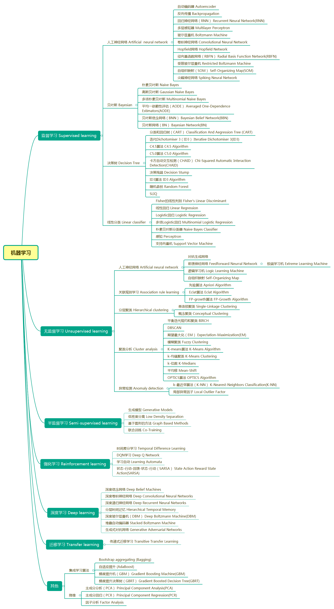
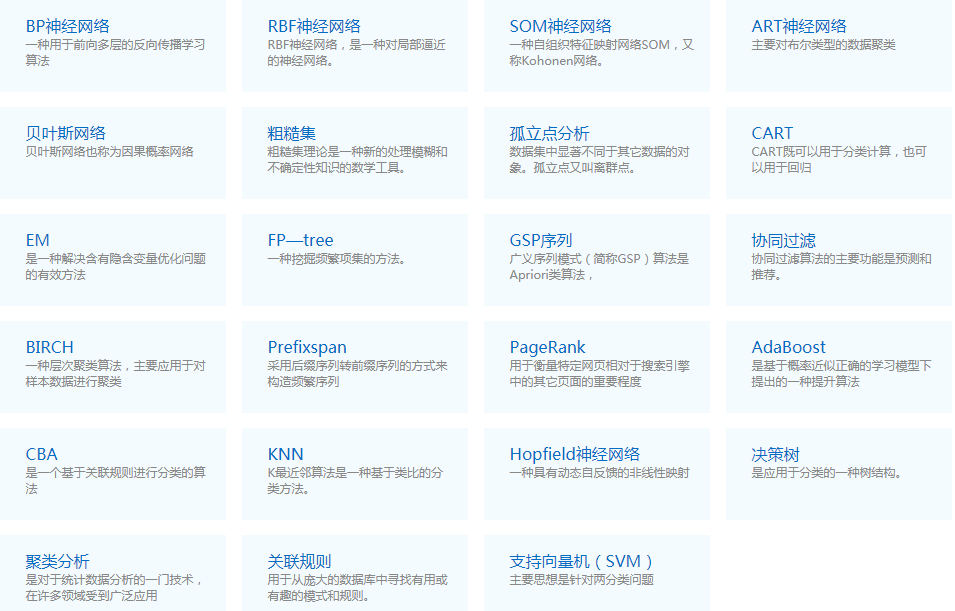

### Deeplearning Algorithms tutorial
最近以来一直在学习机器学习和算法，然后自己就在不断总结和写笔记，记录下自己的学习AI与算法历程。
机器学习(Machine Learning, ML)是一门多领域交叉学科，涉及概率论、统计学、逼近论、凸分析、算法复杂度理论等多门学科。专门研究计算机怎样模拟或实现人类的学习行为，以获取新的知识或技能，重新组织已有的知识结构使之不断改善自身的性能。

* 机器学习是计算机科学的一个子领域，在人工智能领域，机器学习逐渐发展成模式识别和计算科学理论的研究。
* 机器学习：多领域交叉学科，涉及概率论统计学，逼近论，凸分析，算法复杂度理论等多门学科。
* 机器学习的应用：语音识别，自动驾驶，语言翻译，计算机视觉，推荐系统，无人机，识别垃圾邮件，人脸识别，电商推荐系统。
* 机器学习的基本概念：训练集，测试集，特征值，监督学习，非监督学习，分类，回归 

目前国内在AI感知层面应用已经百花齐放，主要是无人驾驶、智能音箱、嵌入式。但在认知层面还是比较缺乏，所以新入行的AI应用团队可以放在认知层。如开头所述，认知层最重要的是算法，因此需要阅读Nature上最领先的算法公司DeepMind的几篇大作，如下：
* 2016.01.Mastering the game of Go with deep neural networks and tree search
* 2016.10.Hybrid computing using a neural network with dynamic external memory
* 2017.10.Mastering the game of Go without human knowledge

#### 机器学习步骤框架
* 把数据拆分为训练集合测试集
* 用训练集合训练集的特征向量来训练算法
* 用学习来的算法运用在测试集上累评估算法(可能要设计到调整参数(parameter tuning) 用来验证集(validation set))

#### 机器学习
* 机器学习：机器学习是计算机科学的一个子领域，在人工智能领域，机器学习逐渐发展成模式识别和计算科学理论的研究。通俗的讲机器学习是一种能够赋予机器学习的能力，可以让它完成直接编程无法完成的功能的方法。但从实践的意义上来说，机器学习是一种通过利用数据，训练出模型，然后使用模型预测的一种方法。
* 机器学习的应用：机器学习已广泛应用于数据挖掘、计算机视觉、自然语言处理、生物特征识别、搜索引擎、医学诊断、检测信用卡欺诈、证券市场分析、DNA序列测序、语音和手写识别、战略游戏和机器人等领域。下面开启我们的机器学习！
  
 * [机器学习环境的搭建](https://github.com/AI-algorithms/Algorithms-Tutorial/blob/master/src/Machine%20Learning/ML.01.md)
 * [机器学习的入门](https://github.com/AI-algorithms/Algorithms-Tutorial/blob/master/src/Machine%20Learning/ML.02.md)
 * [机器学习的框架](https://github.com/AI-algorithms/Algorithms-Tutorial/blob/master/src/Machine%20Learning/ML.03.md)
 * [机器学习的应用案例]()

#### 深度学习
* 深度学习：深度学习是基于机器学习延伸出来的一个新的领域，由以人大脑结构为启发的神经网络算法为起源加之模型结构深度的增加发展，并伴随大数据和计算能力的提高而产生的一系列新的算法。
* 深度学习的方向：被应用在图像处理与计算机视觉，自然语言处理以及语音识别等领域。 

 * [深度神经网络](https://github.com/AI-algorithms/Algorithms-Tutorial/blob/master/src/Neural%20Network/NNK.01.md)
 * [深度学习的入门](https://github.com/AI-algorithms/Algorithms-Tutorial/blob/master/src/Neural%20Network/NNK.02.md)
 * [深度学习环境的搭建](https://github.com/AI-algorithms/Algorithms-Tutorial/blob/master/src/Neural%20Network/NNK.03.md)
 * [深度学习的应用案例]()

#### 机器学习算法概览

从2016年起，机器学习有了新的突破和发展。但是，有效的机器学习是困难的，因为机器学习本身就是一个交叉学科，没有科学的方法及一定的积累很难入门。
从2017年10月19日，Nature上发表了新一代AlphaGo版本AlphaGo Zero的技术论文。指出一种仅基于强化学习的算法，AlphaGo Zero不使用人类的数据、指导或规则以外的领域知识成了自己的老师。DeepMind代表了目前人工智能领域最强的技术，其核心是两个字：算法。
很多人都想成为一个AI开发者，不仅是因为AI开发的薪资高，更主要是因为AI这几年的快速发展,但是因为AI本身的门槛就比较高,很多人可能就会比较徘徊，因而想把自己学习AI的过程写成本书,供大家参考和学习！

 * [BP神经网络](https://github.com/KeKe-Li/tutorial/blob/master/assets/src/BP/BP.md)
 * [RBF算法](https://github.com/KeKe-Li/tutorial/blob/master/assets/src/RBF/RBF.md)
 * [SOM神经网络](https://github.com/KeKe-Li/tutorial/blob/master/assets/src/SOM/SOM.md)
 * [ART神经网络](https://github.com/KeKe-Li/tutorial/blob/master/assets/src/ART/ART.md)
 * [贝叶斯网络](https://github.com/KeKe-Li/tutorial/blob/master/assets/src/BNS/BNS.md)
 * [粗糙集](https://github.com/KeKe-Li/tutorial/blob/master/assets/src/RST/RST.md)
 * [孤立点分析](https://github.com/KeKe-Li/tutorial/blob/master/assets/src/OTR/OTR.md)
 * [CART](https://github.com/KeKe-Li/tutorial/blob/master/assets/src/CART/CART.md)
 * [EM](https://github.com/KeKe-Li/tutorial/blob/master/assets/src/EM/EM.md)
 * [FP—tree](https://github.com/KeKe-Li/tutorial/blob/master/assets/src/FP/FP.md)
 * [GSP序列](https://github.com/KeKe-Li/tutorial/blob/master/assets/src/GSP/GSP.md)
 * [协同过滤](https://github.com/KeKe-Li/tutorial/blob/master/assets/src/CF/CF.md)
 * [BIRCH](https://github.com/KeKe-Li/tutorial/blob/master/assets/src/BIR/BIR.md)
 * [Prefixspan](https://github.com/KeKe-Li/tutorial/blob/master/assets/src/PN/PN.md)
 * [PageRank](https://github.com/KeKe-Li/tutorial/blob/master/assets/src/PRK/PRK.md)
 * [AdaBoost](https://github.com/KeKe-Li/tutorial/blob/master/assets/src/ABT/ABT.md)
 * [CBA](https://github.com/KeKe-Li/tutorial/blob/master/assets/src/CBA/CBA.md)
 * [KNN](https://github.com/KeKe-Li/tutorial/blob/master/assets/src/KNN/KNN.md)
 * [Hopfield神经网络](https://github.com/KeKe-Li/tutorial/blob/master/assets/src/HPD/HPD.md)
 * [决策树](https://github.com/KeKe-Li/tutorial/blob/master/assets/src/DT/DT.md)
 * [聚类分析](https://github.com/KeKe-Li/tutorial/blob/master/assets/src/CAS/CAS.md)
 * [关联规则](https://github.com/KeKe-Li/tutorial/blob/master/assets/src/ARS/ARS.md)
 * [支持向量机（SVM）](https://github.com/KeKe-Li/tutorial/blob/master/assets/src/SVM/SVM.md)

后面的算法和我们的算法模型，我会持续更新整理，后续的算法章节会不断的补上，希望可以对新入门学习AI开发和算法的开发者有所帮助！

#### 算法模型
 * [回归算法](https://github.com/KeKe-Li/tutorial/blob/master/assets/src/RAM/RAM.0.1.md)
     * [线性回归](https://github.com/KeKe-Li/tutorial/blob/master/assets/src/RAM/RAM.0.2.md)  
     * [逻辑回归](https://github.com/KeKe-Li/tutorial/blob/master/assets/src/RAM/RAM.0.3.md)  
     * [多元自适应回归(MARS)](https://github.com/KeKe-Li/tutorial/blob/master/assets/src/RAM/RAM.0.4.md)  
     * [本地散点平滑估计(LOESS)](https://github.com/KeKe-Li/tutorial/blob/master/assets/src/RAM/RAM.0.5.md)  
 * [基于实例的学习算法](https://github.com/KeKe-Li/tutorial/blob/master/assets/src/BA/BA.0.1.md) 
     * [K-近邻算法（KNN）](https://github.com/KeKe-Li/tutorial/blob/master/assets/src/BA/BA.0.2.md)
     * [学习矢量化（LVQ）](https://github.com/KeKe-Li/tutorial/blob/master/assets/src/BA/BA.0.3.md)
     * [自组织映射算法（SOM）](https://github.com/KeKe-Li/tutorial/blob/master/assets/src/BA/BA.0.4.md)
     * [局部加权学习算法（LWR）](https://github.com/KeKe-Li/tutorial/blob/master/assets/src/BA/BA.0.5.md)
 * [正则化算法](https://github.com/KeKe-Li/tutorial/blob/master/assets/src/RGN/RGN.0.1.md)    
     * [岭回归（Ridge Regression）](https://github.com/KeKe-Li/tutorial/blob/master/assets/src/RGN/RGN.0.2.md)
     * [LASSO（Least Absolute Shrinkage and Selection Operator）](https://github.com/KeKe-Li/tutorial/blob/master/assets/src/RGN/RGN.0.3.md)
     * [弹性网络(Elastic Net)](https://github.com/KeKe-Li/tutorial/blob/master/assets/src/RGN/RGN.0.4.md)
     * [最小角回归(LARS)](https://github.com/KeKe-Li/tutorial/blob/master/assets/src/RGN/RGN.0.5.md)
 * [决策树算法](https://github.com/KeKe-Li/tutorial/blob/master/assets/src/DT/DT.0.1.md)
     * [分类和回归树（CART）](https://github.com/KeKe-Li/tutorial/blob/master/assets/src/DT/DT.0.2.md)
     * [ID3算法(Iterative Dichotomiser 3)](https://github.com/KeKe-Li/tutorial/blob/master/assets/src/DT/DT.0.3.md)
     * [CHAID（Chi-squared Automatic Interaction Detection)](https://github.com/KeKe-Li/tutorial/blob/master/assets/src/DT/DT.0.4.md)
     * [随机森林（Random Forest）](https://github.com/KeKe-Li/tutorial/blob/master/assets/src/DT/DT.0.5.md)
     * [多元自适应回归样条（MARS）](https://github.com/KeKe-Li/tutorial/blob/master/assets/src/DT/DT.0.6.md)
     * [梯度推进机（Gradient Boosting Machine,GBM）](https://github.com/KeKe-Li/tutorial/blob/master/assets/src/DT/DT.0.7.md)
 * [贝叶斯算法](https://github.com/KeKe-Li/tutorial/blob/master/assets/src/BNS/BNS.0.1.md)
     * [朴素贝叶斯(Naive Bayes)](https://github.com/KeKe-Li/tutorial/blob/master/assets/src/BNS/BNS.0.2.md)
     * [高斯朴素贝叶斯(Gaussian Naive Bayes)](https://github.com/KeKe-Li/tutorial/blob/master/assets/src/BNS/BNS.0.3.md)
     * [多项式朴素贝叶斯(Multinomial Naive Bayes)](https://github.com/KeKe-Li/tutorial/blob/master/assets/src/BNS/BNS.0.4.md)
     * [平均单依赖估计量（Averaged One-Dependence Estimators）](https://github.com/KeKe-Li/tutorial/blob/master/assets/src/BNS/BNS.0.5.md)
     * [贝叶斯网络（Bayesian Belief Network）](https://github.com/KeKe-Li/tutorial/blob/master/assets/src/BNS/BNS.0.6.md)
 * [基于核的算法](https://github.com/KeKe-Li/tutorial/blob/master/assets/src/KBO/KBO.0.1.md)   
     * [支持向量机（SVM）](https://github.com/KeKe-Li/tutorial/blob/master/assets/src/KBO/KBO.0.2.md)
     * [径向基函数（Radial Basis Function ，RBF)](https://github.com/KeKe-Li/tutorial/blob/master/assets/src/KBO/KBO.0.3.md)
     * [线性判别分析（Linear Discriminate Analysis ，LDA)](https://github.com/KeKe-Li/tutorial/blob/master/assets/src/KBO/KBO.0.4.md)
 * [聚类算法(Cluster analysis)](https://github.com/KeKe-Li/tutorial/blob/master/assets/src/CA/CA.0.1.md)
     * [K-均值(K-Means Algorithm)](https://github.com/KeKe-Li/tutorial/blob/master/assets/src/CA/CA.0.2.md)
     * [模糊c-均值聚类算法(Fuzzy C-means Algorithm)](https://github.com/KeKe-Li/tutorial/blob/master/assets/src/CA/CA.0.3.md)
     * [期望最大化(Expectation-Maximization)](https://github.com/KeKe-Li/tutorial/blob/master/assets/src/CA/CA.0.4.md)
     * [聚类分析(Cluster Analysis)](https://github.com/KeKe-Li/tutorial/blob/master/assets/src/CA/CA.0.5.md)
 * [关联规则学习(Association Rule Learning)](https://github.com/KeKe-Li/tutorial/blob/master/assets/src/ARL/ARL.0.1.md)   
     * [先验算法(Apriori Algorithm)](https://github.com/KeKe-Li/tutorial/blob/master/assets/src/ARL/ARL.0.2.md) 
     * [Eclat算法(Eclat Algorithm)](https://github.com/KeKe-Li/tutorial/blob/master/assets/src/ARL/ARL.0.3.md) 
     * [FP-growth算法(FP-Growth Algorithm)](https://github.com/KeKe-Li/tutorial/blob/master/assets/src/ARL/ARL.0.4.md) 
 * [人工神经网络(Artificial Neural Network)](https://github.com/KeKe-Li/tutorial/blob/master/assets/src/ANN/ANN.0.1.md)      
     * [自动编码器(Autoencoder)](https://github.com/KeKe-Li/tutorial/blob/master/assets/src/ANN/ANN.0.2.md) 
     * [反向传播(Backpropagation)](https://github.com/KeKe-Li/tutorial/blob/master/assets/src/ANN/ANN.0.3.md) 
     * [递归神经网络(Recurrent Neural Network)](https://github.com/KeKe-Li/tutorial/blob/master/assets/src/ANN/ANN.0.4.md)) 
     * [多层感知器(Multilayer Perceptron)](https://github.com/KeKe-Li/tutorial/blob/master/assets/src/ANN/ANN.0.5.md) 
     * [玻尔兹曼机(Boltzmann Machine)](https://github.com/KeKe-Li/tutorial/blob/master/assets/src/ANN/ANN.0.6.md) 
     * [卷积神经网络(Convolutional Neural Network)](https://github.com/KeKe-Li/tutorial/blob/master/assets/src/ANN/ANN.0.7.md) 
     * [Hopfield网络(Hopfield Network)](https://github.com/KeKe-Li/tutorial/blob/master/assets/src/ANN/ANN.0.8.md) 
     * [径向基函数网络(Radial Basis Function Network)](https://github.com/KeKe-Li/tutorial/blob/master/assets/src/ANN/ANN.0.9.md) 
     * [受限玻尔兹曼机(Restricted Boltzmann Machine)](https://github.com/KeKe-Li/tutorial/blob/master/assets/src/ANN/ANN.0.10.md) 
     * [自组织映射(Self-Organizing Map)](https://github.com/KeKe-Li/tutorial/blob/master/assets/src/ANN/ANN.0.11.md) 
     * [脉冲神经网络(Spiking Neural Network)](https://github.com/KeKe-Li/tutorial/blob/master/assets/src/ANN/ANN.0.12.md) 
 * [深度学习(Deep Learning)](https://github.com/KeKe-Li/tutorial/blob/master/assets/src/DL/DL.0.1.md) 
     * [深度信念网络(Deep Belief Machines)](https://github.com/KeKe-Li/tutorial/blob/master/assets/src/DL/DL.0.2.md) 
     * [深度卷积神经网络(Deep Convolutional Neural Networks)]() 
     * [深度递归神经网络(Deep Recurrent Neural Networks)]() 
     * [分层时间记忆(Hierarchical Temporal Memory)]() 
     * [深度玻尔兹曼机(Deep Boltzmann Machine)]() 
     * [堆叠自动编码器(Stacked Boltzmann Machine)]() 
     * [生成式对抗网络(Generative Adversarial Networks)]()
 * [降维算法]()
     * [主成分分析法（PCA）]()
     * [主成分回归（PCR）]()
     * [偏最小二乘回归（PLSR）]()
     * [萨蒙映射]()
     * [多维尺度分析法（MDS]()
     * [投影寻踪法（PP）]()
     * [线性判别分析法（LDA）]()
     * [混合判别分析法（MDA）]()
     * [二次判别分析法（QDA）]()
     * [灵活判别分析法（Flexible Discriminant Analysis，FDA]()
 * [集成算法]()
      * [Boosting]()
      * [Bagging]()
      * [AdaBoost]()
      * [堆叠泛化（混合）]()
      * [GBM 算法]()
      * [GBRT 算法]()
      * [随机森林]()
 * [其他算法]()
      * [特征选择算法]()
      * [性能评估算法]()
      * [自然语言处理]()
      * [计算机视觉]()
      * [推荐系统]()
      * [强化学习]()
      * [迁移学习]()

算法模型的整体基本就是这样目录，后续的算法模型我会不断完善和补充，更新！
#### 机器学习的基础
* 机器学习需要的理论基础：数学，线性代数，数理统计，概率论，高等数学、凸优化理论，形式逻辑等

#### 参考书籍

* [同济线性代数教材](https://github.com/KeKe-Li/book/blob/master/AI/%E5%90%8C%E6%B5%8E%E7%BA%BF%E6%80%A7%E4%BB%A3%E6%95%B0%E6%95%99%E6%9D%90.pdf)
* [同济高等数学第六版上下册](https://github.com/KeKe-Li/book/blob/master/AI/%E5%90%8C%E6%B5%8E%E9%AB%98%E7%AD%89%E6%95%B0%E5%AD%A6%E7%AC%AC%E5%85%AD%E7%89%88%E4%B8%8A%E4%B8%8B%E5%86%8C.pdf)
* [概率论与数理统计同济大学](https://github.com/KeKe-Li/book/blob/master/AI/%E6%A6%82%E7%8E%87%E8%AE%BA%E4%B8%8E%E6%95%B0%E7%90%86%E7%BB%9F%E8%AE%A1%E5%90%8C%E6%B5%8E%E5%A4%A7%E5%AD%A6.pdf)
* [凸优化理论](https://github.com/KeKe-Li/book/blob/master/AI/%E5%87%B8%E4%BC%98%E5%8C%96%E7%90%86%E8%AE%BA.pdf)
* [机器学习-周志华](https://github.com/KeKe-Li/book/blob/master/AI/%E6%9C%BA%E5%99%A8%E5%AD%A6%E4%B9%A0.pdf)
* [面向机器智能的TensorFlow实践](https://github.com/KeKe-Li/book/blob/master/AI/%E9%9D%A2%E5%90%91%E6%9C%BA%E5%99%A8%E6%99%BA%E8%83%BD%E7%9A%84TensorFlow%E5%AE%9E%E8%B7%B5%20(%E6%99%BA%E8%83%BD%E7%B3%BB%E7%BB%9F%E4%B8%8E%E6%8A%80%E6%9C%AF%E4%B8%9B%E4%B9%A6)_.pdf)
* [机器学习](https://github.com/KeKe-Li/book/blob/master/AI/%E6%9C%BA%E5%99%A8%E5%AD%A6%E4%B9%A0.pdf)
* [数学之美](https://github.com/KeKe-Li/book/blob/master/AI/%E6%95%B0%E5%AD%A6%E4%B9%8B%E7%BE%8E.pdf)
* [深度学习](https://github.com/KeKe-Li/book/blob/master/AI/%E6%B7%B1%E5%BA%A6%E5%AD%A6%E4%B9%A0Deep%20Learning.pdf)
* [神经网络和深度学习](https://github.com/KeKe-Li/book/blob/master/AI/%E7%A5%9E%E7%BB%8F%E7%BD%91%E7%BB%9C%E5%92%8C%E6%B7%B1%E5%BA%A6%E5%AD%A6%E4%B9%A0.pdf)
* [梯度下降](https://github.com/KeKe-Li/book/blob/master/AI/%E6%A2%AF%E5%BA%A6%E4%B8%8B%E9%99%8D.pdf)
* [无监督神经元](https://blog.openai.com/unsupervised-sentiment-neuron/)
* [Tensorflow实践](https://tensorflow.feisky.xyz/install/cpu.html)
* [Artificial Intelligence](https://github.com/owainlewis/awesome-artificial-intelligence)
* [Tensorflow新手入门](http://www.tensorfly.cn/tfdoc/tutorials/mnist_beginners.html)

### 机器学习

觉得此文章不错，支持我的话可以给我star ，:star:！如果有问题可以加我的微信,加入我们的交流群一起交流机器学习！

  

### License
This is free software distributed under the terms of the MIT license
