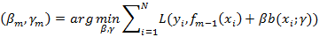
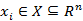
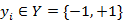
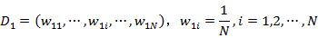

### Deeplearning Algorithms tutorial
谷歌的人工智能位于全球前列，在图像识别、语音识别、无人驾驶等技术上都已经落地。而百度实质意义上扛起了国内的人工智能的大旗，覆盖无人驾驶、智能助手、图像识别等许多层面。苹果业已开始全面拥抱机器学习，新产品进军家庭智能音箱并打造工作站级别Mac。另外，腾讯的深度学习平台Mariana已支持了微信语音识别的语音输入法、语音开放平台、长按语音消息转文本等产品，在微信图像识别中开始应用。全球前十大科技公司全部发力人工智能理论研究和应用的实现，虽然入门艰难，但是一旦入门，高手也就在你的不远处！

机器学习主要有三种方式：监督学习，无监督学习与半监督学习。

（1）监督学习：从给定的训练数据集中学习出一个函数，当新的数据输入时，可以根据函数预测相应的结果。监督学习的训练集要求是包括输入和输出，也就是特征和目标。训练集中的目标是有标注的。如今机器学习已固有的监督学习算法有可以进行分类的，例如贝叶斯分类，SVM，ID3，C4.5以及分类决策树，以及现在最火热的人工神经网络，例如BP神经网络，RBF神经网络，Hopfield神经网络、深度信念网络和卷积神经网络等。人工神经网络是模拟人大脑的思考方式来进行分析，在人工神经网络中有显层，隐层以及输出层，而每一层都会有神经元，神经元的状态或开启或关闭，这取决于大数据。同样监督机器学习算法也可以作回归，最常用便是逻辑回归。

（2）无监督学习：与有监督学习相比，无监督学习的训练集的类标号是未知的，并且要学习的类的个数或集合可能事先不知道。常见的无监督学习算法包括聚类和关联，例如K均值法、Apriori算法。

（3）半监督学习：介于监督学习和无监督学习之间,例如EM算法。

如今的机器学习领域主要的研究工作在三个方面进行：1）面向任务的研究，研究和分析改进一组预定任务的执行性能的学习系统；2）认知模型，研究人类学习过程并进行计算模拟；3）理论的分析，从理论的层面探索可能的算法和独立的应用领域算法。

#### AdaBoost
自适应提升（AdaBoost：Adaptive Boosting）算法是基于概率近似正确的学习模型下提出的一种提升算法。在分类问题中，AdaBoost通过修改训练样本的权值分布，学习多个弱分类器，并将这些分类器进行线性组合，构成一个强分类器，提高分类性能。其中强分类器可理解为分类精确度高的算法，弱分类器可理解为分类精度低的算法，一般AdaBoost算法是弱分类器的线性组合为：

AdaBoost算法的特点是通过迭代每次学习一个基本分类器(即弱分类器)。每次迭代中，提高那些被前一轮分类器错误分类数据样本的权值，而降低那些被正确分类的数据样本的权值。最后算法将基本分类器的线性组合作为强分类器，其中给分类误差率小的基本分类器以大的权值，给分类误差率大的基本分类器以小的权值。其中极小化损失函数表达式为：

#### 算法原理
假设给定一个二分类的训练数据集T={(x1,y1),(x2,y2),…,(xn,yn)}；其中，每个样本点由实例与标记组成。实例,标记,其中X是实例空间，Y是标记集合。AdaBoost算法的原理如下：

输入：训练数据集T={(x1,y1),(x2,y2),…,(xn,yn)}；其中，

输出：最终的分类器G(x)

(1)初始化训练数据集的权值分布

(2)对于m=1,2,…,M
(a)使用具有权值分布Dm的训练数据集学习，得到基本分类器

(b)计算Gm(x)在训练数据集上的分类误差率

