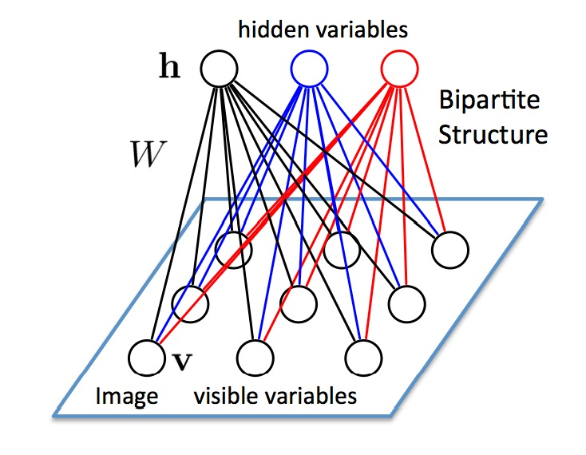

### Deeplearning Algorithms tutorial
谷歌的人工智能位于全球前列，在图像识别、语音识别、无人驾驶等技术上都已经落地。而百度实质意义上扛起了国内的人工智能的大旗，覆盖无人驾驶、智能助手、图像识别等许多层面。苹果业已开始全面拥抱机器学习，新产品进军家庭智能音箱并打造工作站级别Mac。另外，腾讯的深度学习平台Mariana已支持了微信语音识别的语音输入法、语音开放平台、长按语音消息转文本等产品，在微信图像识别中开始应用。全球前十大科技公司全部发力人工智能理论研究和应用的实现，虽然入门艰难，但是一旦入门，高手也就在你的不远处！

机器学习主要有三种方式：监督学习，无监督学习与半监督学习。

（1）监督学习：从给定的训练数据集中学习出一个函数，当新的数据输入时，可以根据函数预测相应的结果。监督学习的训练集要求是包括输入和输出，也就是特征和目标。训练集中的目标是有标注的。如今机器学习已固有的监督学习算法有可以进行分类的，例如贝叶斯分类，SVM，ID3，C4.5以及分类决策树，以及现在最火热的人工神经网络，例如BP神经网络，RBF神经网络，Hopfield神经网络、深度信念网络和卷积神经网络等。人工神经网络是模拟人大脑的思考方式来进行分析，在人工神经网络中有显层，隐层以及输出层，而每一层都会有神经元，神经元的状态或开启或关闭，这取决于大数据。同样监督机器学习算法也可以作回归，最常用便是逻辑回归。

（2）无监督学习：与有监督学习相比，无监督学习的训练集的类标号是未知的，并且要学习的类的个数或集合可能事先不知道。常见的无监督学习算法包括聚类和关联，例如K均值法、Apriori算法。

（3）半监督学习：介于监督学习和无监督学习之间,例如EM算法。

如今的机器学习领域主要的研究工作在三个方面进行：1）面向任务的研究，研究和分析改进一组预定任务的执行性能的学习系统；2）认知模型，研究人类学习过程并进行计算模拟；3）理论的分析，从理论的层面探索可能的算法和独立的应用领域算法。

#### 受限玻尔兹曼机(Restricted Boltzmann Machine)

受限玻尔兹曼机（Restricted Boltzmann Machine，RBM）是一种可用随机神经网络（stochastic neural network）来解释的概率图模型（probabilistic graphical model）。RBM是Smolensky于1986年在波尔兹曼机（Boltzmann Machine，BM）基础上提出的，所谓“随机”是指网络中的神经元是随机神经元，输出状态只有两种（未激活和激活），状态的具体取值根据概率统计法则来决定。RBM理论是Hinton在2006年提出基于RBM的（Deep Belief Network）模型，大量学者开始研究RBM的理论及其应用。

受限玻尔兹曼机(Restricted Boltzmann Machine)是玻尔兹曼机(Boltzmann machine，BM)的一种特殊拓扑结构。BM的原理起源于统计物理学，是一种基于能量函数的建模方法，能够描述变量之间的高阶相互作用，BM的学习算法较复杂，但所建模型和学习算法有比较完备的物理解释和严格的数理统计理论作基础。
BM是一种对称耦合的随机反馈型二值单元神经网络，由可见层和多个隐层组成，网络节点分为可见单元(visible unit)和隐单元(hidden unit)，用可见单元和隐单元来表达随机网络与随机环境的学习模型，通过权值表达单元之间的相关性。

<p align="center">

</p>

Smolensky提出的RBM由一个可见神经元层和一个隐神经元层组成，由于隐层神经元之间没有相互连接并且隐层神经元独立于给定的训练样本，这使直接计算依赖数据的期望值变得容易，可见层神经元之间也没有相互连接，通过从训练样本得到的隐层神经元状态上执行马尔可夫链抽样过程，来估计独立于数据的期望值，并行交替更新所有可见层神经元和隐层神经元的值。

受限玻兹曼机是一种玻兹曼机的变体，但限定模型必须为二分图。模型中包含对应输入参数的输入（可见）单元和对应训练结果的隐单元，图中的每条边必须连接一个可见单元和一个隐单元。（与此相对，“无限制”玻兹曼机包含隐单元间的边，使之成为递归神经网络。）这一限定使得相比一般玻兹曼机更高效的训练算法成为可能，特别是基于梯度的对比分歧（contrastive divergence）算法。

受限玻兹曼机也可被用于深度学习网络。具体地，深度信念网络可使用多个RBM堆叠而成，并可使用梯度下降法和反向传播算法进行调优

RBM是有两个层的浅层神经网络，它是组成深度置信网络的基础部件。RBM的第一个层称为可见层，又称输入层，而第二个层是隐藏层。

<p align="center">

</p>

图中每个圆圈都是一个与神经元相似的单元，称为节点，运算在节点中进行。一个层中的节点与另一层中的所有节点分别连接，但与同一层中的其他节点并不相连。

也就是说，层的内部不存在通信－这就是受限玻尔兹曼机被称为受限的原因。每个节点对输入进行处理和运算，判定是否继续传输输入的数据，而这种判定一开始是随机的。(“随机”（stochastic）一词在此处指与输入相乘的初始系数是随机生成的。)

每个可见节点负责处理网络需要学习的数据集中一个项目的一种低层次特征。举例来说，如果处理的是一个灰度图像的数据集，则每个可见节点将接收一张图像中每个像素的像素值。（MNIST图像有784个像素，所以处理这类图像的神经网络的一个可见层必须有784个输入节点。）

接着来看单个像素值x如何通过这一双层网络。在隐藏层的节点1中x与一个权重相乘，再与所谓的偏差相加。这两步运算的结果输入激活函数，得到节点的输出，即输入为x时通过节点的信号强度。

```markdown
激活函数f((权重w * 输入x) + 偏差b ) = 输出a
```
<p align="center">

</p>

