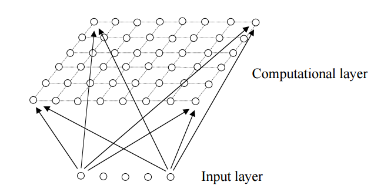
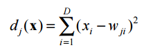

### Deeplearning Algorithms tutorial
谷歌的人工智能位于全球前列，在图像识别、语音识别、无人驾驶等技术上都已经落地。而百度实质意义上扛起了国内的人工智能的大旗，覆盖无人驾驶、智能助手、图像识别等许多层面。苹果业已开始全面拥抱机器学习，新产品进军家庭智能音箱并打造工作站级别Mac。另外，腾讯的深度学习平台Mariana已支持了微信语音识别的语音输入法、语音开放平台、长按语音消息转文本等产品，在微信图像识别中开始应用。全球前十大科技公司全部发力人工智能理论研究和应用的实现，虽然入门艰难，但是一旦入门，高手也就在你的不远处！

机器学习主要有三种方式：监督学习，无监督学习与半监督学习。

（1）监督学习：从给定的训练数据集中学习出一个函数，当新的数据输入时，可以根据函数预测相应的结果。监督学习的训练集要求是包括输入和输出，也就是特征和目标。训练集中的目标是有标注的。如今机器学习已固有的监督学习算法有可以进行分类的，例如贝叶斯分类，SVM，ID3，C4.5以及分类决策树，以及现在最火热的人工神经网络，例如BP神经网络，RBF神经网络，Hopfield神经网络、深度信念网络和卷积神经网络等。人工神经网络是模拟人大脑的思考方式来进行分析，在人工神经网络中有显层，隐层以及输出层，而每一层都会有神经元，神经元的状态或开启或关闭，这取决于大数据。同样监督机器学习算法也可以作回归，最常用便是逻辑回归。

（2）无监督学习：与有监督学习相比，无监督学习的训练集的类标号是未知的，并且要学习的类的个数或集合可能事先不知道。常见的无监督学习算法包括聚类和关联，例如K均值法、Apriori算法。

（3）半监督学习：介于监督学习和无监督学习之间,例如EM算法。

如今的机器学习领域主要的研究工作在三个方面进行：1）面向任务的研究，研究和分析改进一组预定任务的执行性能的学习系统；2）认知模型，研究人类学习过程并进行计算模拟；3）理论的分析，从理论的层面探索可能的算法和独立的应用领域算法。

#### 自组织映射(Self-Organizing Map)

自组织映射(Self-Organizing Maps, SOM)算法作为一种聚类和高维可视化的无监督学习算法, 是通过模拟人脑对信 号处理的特点而发展起来的一种人工神经网络。该模型由芬兰赫尔辛基大学教授 Teuvo Kohonen 于 1981 年提出后,现在 已成为应用最广泛的自组织神经网络方法,其中的 WTA(Winner Takes All)竞争机制反映了自组织学习最根本的特征。

自组织映射它的思想很简单，本质上是一种只有输入层--隐藏层的神经网络。隐藏层中的一个节点代表一个需要聚成的类。训练时采用“竞争学习”的方式，每个输入的样例在隐藏层中找到一个和它最匹配的节点，称为它的激活节点，也叫“winning neuron”。 紧接着用随机梯度下降法更新激活节点的参数。同时，和激活节点临近的点也根据它们距离激活节点的远近而适当地更新参数。

所以，SOM的一个特点是，隐藏层的节点是有拓扑关系的。这个拓扑关系需要我们确定，如果想要一维的模型，那么隐藏节点依次连成一条线；如果想要二维的拓扑关系，那么就行成一个平面，如下图所示（也叫Kohonen Network）：

既然隐藏层是有拓扑关系的，所以我们也可以说，SOM可以把任意维度的输入离散化到一维或者二维(更高维度的不常见)的离散空间上。 Computation layer里面的节点与Input layer的节点是全连接的。

拓扑关系确定后，开始计算过程，大体分成几个部分：

1. 初始化：每个节点随机初始化自己的参数。每个节点的参数个数与Input的维度相同。

2. 对于每一个输入数据，找到与它最相配的节点。假设输入时D维的， 即 X={x_i, i=1,...,D}，那么判别函数可以为欧几里得距离：

3. 找到激活节点I(x)之后，我们也希望更新和它临近的节点。令S_ij表示节点i和j之间的距离，对于I(x)临近的节点，分配给它们一个更新权重：

