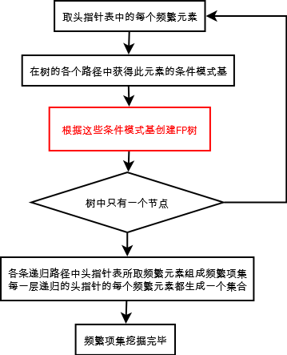

### Deeplearning Algorithms tutorial
谷歌的人工智能位于全球前列，在图像识别、语音识别、无人驾驶等技术上都已经落地。而百度实质意义上扛起了国内的人工智能的大旗，覆盖无人驾驶、智能助手、图像识别等许多层面。苹果业已开始全面拥抱机器学习，新产品进军家庭智能音箱并打造工作站级别Mac。另外，腾讯的深度学习平台Mariana已支持了微信语音识别的语音输入法、语音开放平台、长按语音消息转文本等产品，在微信图像识别中开始应用。全球前十大科技公司全部发力人工智能理论研究和应用的实现，虽然入门艰难，但是一旦入门，高手也就在你的不远处！

机器学习主要有三种方式：监督学习，无监督学习与半监督学习。

（1）监督学习：从给定的训练数据集中学习出一个函数，当新的数据输入时，可以根据函数预测相应的结果。监督学习的训练集要求是包括输入和输出，也就是特征和目标。训练集中的目标是有标注的。如今机器学习已固有的监督学习算法有可以进行分类的，例如贝叶斯分类，SVM，ID3，C4.5以及分类决策树，以及现在最火热的人工神经网络，例如BP神经网络，RBF神经网络，Hopfield神经网络、深度信念网络和卷积神经网络等。人工神经网络是模拟人大脑的思考方式来进行分析，在人工神经网络中有显层，隐层以及输出层，而每一层都会有神经元，神经元的状态或开启或关闭，这取决于大数据。同样监督机器学习算法也可以作回归，最常用便是逻辑回归。

（2）无监督学习：与有监督学习相比，无监督学习的训练集的类标号是未知的，并且要学习的类的个数或集合可能事先不知道。常见的无监督学习算法包括聚类和关联，例如K均值法、Apriori算法。

（3）半监督学习：介于监督学习和无监督学习之间,例如EM算法。

如今的机器学习领域主要的研究工作在三个方面进行：1）面向任务的研究，研究和分析改进一组预定任务的执行性能的学习系统；2）认知模型，研究人类学习过程并进行计算模拟；3）理论的分析，从理论的层面探索可能的算法和独立的应用领域算法。

#### 自动编码器(Autoencoder)
自动编码器(Autoencoder)是一种无监督的学习算法，主要用于数据的降维或者特征的抽取，在深度学习中，自动编码器(Autoencoder)可用于在训练阶段开始前，确定权重矩阵的初始值。

神经网络中的权重矩阵可看作是对输入的数据进行特征转换，即先将数据编码为另一种形式，然后在此基础上进行一系列学习。然而，在对权重初始化时，我们并不知道初始的权重值在训练时会起到怎样的作用，也不知道在训练过程中权重会怎样的变化。因此一种较好的思路是，利用初始化生成的权重矩阵进行编码时，我们希望编码后的数据能够较好的保留原始数据的主要特征。那么，如何衡量码后的数据是否保留了较完整的信息呢？答案是：如果编码后的数据能够较为容易地通过解码恢复成原始数据，我们则认为较好的保留了数据信息。

自动编码器(Autoencoder)中：原始input（设为x）经过加权（W、b)、映射（Sigmoid）之后得到y，再对y反向加权映射回来成为z。

通过反复迭代训练两组（W、b），使得误差函数最小，即尽可能保证z近似于x，即完美重构了x。

那么可以说正向第一组权（W、b）是成功的，很好的学习了input中的关键特征，不然也不会重构得如此完美.

这个过程很有趣，首先，它没有使用数据标签来计算误差update参数，所以是无监督学习。

其次，利用类似神经网络的双隐层的方式，简单粗暴地提取了样本的特征。 

这个双隐层是有争议的，最初的编码器确实使用了两组（W，b），但是Vincent在2010年的论文中做了研究，发现只要单组W就可以了。

即W'=W^T, W和W'称为Tied Weights。实验证明，W'真的只是在打酱油，完全没有必要去做训练。

逆向重构矩阵让人想起了逆矩阵，若W^-1=W^T的话，W就是个正交矩阵了，即W是可以训成近似正交阵的。

由于W'就是个酱油，训练完之后就没它事了。正向传播用W即可，相当于为input预先编个码，再导入到下一layer去。所以叫自动编码器，而不叫自动编码解码器。

自动编码器相当于创建了一个隐层，一个简单想法就是加在深度网络的开头，作为原始信号的初级filter，起到降维、提取特征的效果。
当然，这种做法就有一个问题，AutoEncoder可以看作是PCA的非线性补丁加强版，PCA的取得的效果是建立在降维基础上的。

仔细想想CNN这种结构，随着layer的推进，每层的神经元个数在递增，如果用了AutoEncoder去预训练，岂不是增维了？真的没问题？

相关论文中给出的实验结果认为AutoEncoder的增维效果还不赖，原因可能是非线性网络能力很强，尽管神经元个数增多，但是每个神经元的效果在衰减。

同时，随机梯度算法给了后续监督学习一个良好的开端。整体上，增维是利大于弊的。
