### Deeplearning Algorithms tutorial
谷歌的人工智能位于全球前列，在图像识别、语音识别、无人驾驶等技术上都已经落地。而百度实质意义上扛起了国内的人工智能的大旗，覆盖无人驾驶、智能助手、图像识别等许多层面。苹果业已开始全面拥抱机器学习，新产品进军家庭智能音箱并打造工作站级别Mac。另外，腾讯的深度学习平台Mariana已支持了微信语音识别的语音输入法、语音开放平台、长按语音消息转文本等产品，在微信图像识别中开始应用。全球前十大科技公司全部发力人工智能理论研究和应用的实现，虽然入门艰难，但是一旦入门，高手也就在你的不远处！

机器学习主要有三种方式：监督学习，无监督学习与半监督学习。

（1）监督学习：从给定的训练数据集中学习出一个函数，当新的数据输入时，可以根据函数预测相应的结果。监督学习的训练集要求是包括输入和输出，也就是特征和目标。训练集中的目标是有标注的。如今机器学习已固有的监督学习算法有可以进行分类的，例如贝叶斯分类，SVM，ID3，C4.5以及分类决策树，以及现在最火热的人工神经网络，例如BP神经网络，RBF神经网络，Hopfield神经网络、深度信念网络和卷积神经网络等。人工神经网络是模拟人大脑的思考方式来进行分析，在人工神经网络中有显层，隐层以及输出层，而每一层都会有神经元，神经元的状态或开启或关闭，这取决于大数据。同样监督机器学习算法也可以作回归，最常用便是逻辑回归。

（2）无监督学习：与有监督学习相比，无监督学习的训练集的类标号是未知的，并且要学习的类的个数或集合可能事先不知道。常见的无监督学习算法包括聚类和关联，例如K均值法、Apriori算法。

（3）半监督学习：介于监督学习和无监督学习之间,例如EM算法。

如今的机器学习领域主要的研究工作在三个方面进行：1）面向任务的研究，研究和分析改进一组预定任务的执行性能的学习系统；2）认知模型，研究人类学习过程并进行计算模拟；3）理论的分析，从理论的层面探索可能的算法和独立的应用领域算法。

####  递归神经网络(Recurrent Neural Network)
递归神经网络（Recurrent neural networks，简称RNN）是一种通过隐藏层节点周期性的连接，来捕捉序列化数据中动态信息的神经网络，
可以对序列化的数据进行分类。和其他前向神经网络不同，RNN可以保存一种上下文的状态，甚至能够在任意长的上下文窗口中存储、学习、表达相关信息，
而且不再局限于传统神经网络在空间上的边界，可以在时间序列上有延拓，直观上讲，就是本时间的隐藏层和下一时刻的隐藏层之间的节点间有边。
RNN广泛应用在和序列有关的场景，如如一帧帧图像组成的视频，一个个片段组成的音频，和一个个词汇组成的句子。尽管RNN有一些传统的缺点，
如难以训练，参数较多，但近些年来关于网络结构、优化手段和并行计算的深入研究使得大规模学习算法成为可能，尤其是LSTM与BRNN算法的成熟，使得图像标注、手写识别、机器翻译等应用取得了突破性进展。 

RNN主要解决序列数据的处理，比如文本、语音、视频等等。这类数据的样本间存在顺序关系，每个样本和它之前的样本存在关联。
比如说，在文本中，一个词和它前面的词是有关联的；在气象数据中，一天的气温和前几天的气温是有关联的。一组观察数据定义为一个序列，从分布中可以观察出多个序列。

一个序列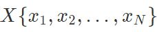的最简单模型为

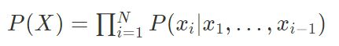

也就是说，序列里的每一个元素都和排在它前面的所有元素直接相关。

当然，这个模型存在致命的问题：它的复杂度会爆炸性增长，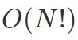隐马尔科夫模型（HMM）定义每个元素只和离它最近的kk个元素相关，解决了复杂度暴增的问题，模型为:

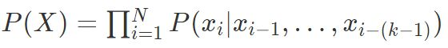

当k=1时，模型变为:

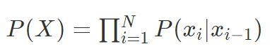

只考虑观察值X的模型有时表现力不足，因此需要加入隐变量，将观察值建模成由隐变量所生成。隐变量的好处在于，它的数量可以比观察值多，取值范围可以比观察值更广，能够更好的表达有限的观察值背后的复杂分布。加入了隐变量hh的马尔科夫模型称为隐马尔科夫模型。

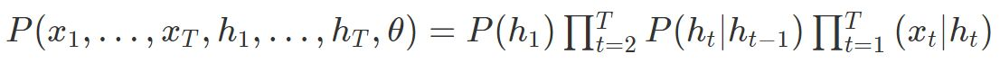

隐马尔科夫模型实际上建模的是观察值X，隐变量h和模型参数θ的联合分布,HMM的模型长度T是事先固定的，模型参数不共享，其复杂度为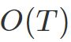。

把序列视作时间序列，隐含层h的自连接边实际上是和上一时刻的h相连.在每一个时刻t，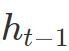的取值是当前时刻的输入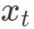,和上一时刻的隐含层值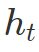的一个函数:

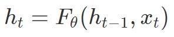

将h层的自连接展开，就成为了上图右边的样子，看上去和HMM很像。两者最大的区别在于，RNN的参数是跨时刻共享的。也就是说，对任意时刻t，到以及到的网络参数都是相同的。

共享参数的思想和和卷积神经网络（CNN）是相通的，CNN在二维数据的空间位置之间共享卷积核参数，而RNN则是在序列数据的时刻之间共享参数。共享参数使得模型的复杂度大大减少，并使RNN可以适应任意长度的序列，带来了更好的可推广性。

* 双向RNN

单向RNN的问题在于t时刻进行分类的时候只能利用tt时刻之前的信息， 但是在t时刻进行分类的时候可能也需要利用未来时刻的信息。双向RNN（bi-directional RNN）模型正是为了解决这个问题， 双向RNN在任意时刻tt都保持两个隐藏层，一个隐藏层用于从左往右的信息传播记作， 另一个隐藏层用于从右往左的信息传播记作。

Deep(Bidirectional)RNNs与Bidirectional RNNs相似，只是对于每一步的输入有多层网络。这样，该网络便有更强大的表达与学习能力，但是复杂性也提高了，同时需要更多的训练数据。

* Gradient Vanishing Exploding (梯度消失和梯度爆炸)

RNN训练困难的主要原因在于隐藏层参数w的传播：由于误差传播在展开后的RNN上，无论在前向传播过程还是在反向传播过程中w都会乘上多次，这就导致：

* 梯度消失：如果梯度很小的话（<1），乘上多次指数级下降，对输出几乎就没有影响了
* 梯度爆炸：反过来，如果梯度很大的话，乘上多次指数级增加，又导致了梯度爆炸

这个问题其实存在于任何深度神经网络中，只是由于RNN的递归结构导致其尤其明显。

对于梯度爆炸问题，可以通过截断的方式来有效避免：

而对梯度消失问题，则有很多不同的方案：

* 有效初始化+ReLU激活函数能够得到较好效果
* 算法上的优化，例如截断的BPTT算法。
* 模型上的改进，例如LSTM、GRU单元都可以有效解决长期依赖问题。
* 在BPTT算法中加入skip connection，此时误差可以间歇的向前传播。
* 加入一些Leaky Units，思路类似于skip connection

LSTM 全称叫 Long Short-Term Memory networks，它和传统 RNN 唯一的不同就在与其中的神经元（感知机）的构造不同。传统的 RNN 每个神经元和一般神经网络的感知机没啥区别，但在 LSTM 中，每个神经元是一个“记忆细胞”（元胞状态，Cell State），将以前的信息连接到当前的任务中来。每个LSTM细胞里面都包含:

* 输入门（input gate）: 一个Sigmoid层，观察和,对于元胞状态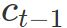中的每一个元素，输出一个0~1之间的数。1表示“完全保留该信息”，0表示“完全丢弃该信息”：
