### Deeplearning Algorithms tutorial
谷歌的人工智能位于全球前列，在图像识别、语音识别、无人驾驶等技术上都已经落地。而百度实质意义上扛起了国内的人工智能的大旗，覆盖无人驾驶、智能助手、图像识别等许多层面。苹果业已开始全面拥抱机器学习，新产品进军家庭智能音箱并打造工作站级别Mac。另外，腾讯的深度学习平台Mariana已支持了微信语音识别的语音输入法、语音开放平台、长按语音消息转文本等产品，在微信图像识别中开始应用。全球前十大科技公司全部发力人工智能理论研究和应用的实现，虽然入门艰难，但是一旦入门，高手也就在你的不远处！

机器学习主要有三种方式：监督学习，无监督学习与半监督学习。

（1）监督学习：从给定的训练数据集中学习出一个函数，当新的数据输入时，可以根据函数预测相应的结果。监督学习的训练集要求是包括输入和输出，也就是特征和目标。训练集中的目标是有标注的。如今机器学习已固有的监督学习算法有可以进行分类的，例如贝叶斯分类，SVM，ID3，C4.5以及分类决策树，以及现在最火热的人工神经网络，例如BP神经网络，RBF神经网络，Hopfield神经网络、深度信念网络和卷积神经网络等。人工神经网络是模拟人大脑的思考方式来进行分析，在人工神经网络中有显层，隐层以及输出层，而每一层都会有神经元，神经元的状态或开启或关闭，这取决于大数据。同样监督机器学习算法也可以作回归，最常用便是逻辑回归。

（2）无监督学习：与有监督学习相比，无监督学习的训练集的类标号是未知的，并且要学习的类的个数或集合可能事先不知道。常见的无监督学习算法包括聚类和关联，例如K均值法、Apriori算法。

（3）半监督学习：介于监督学习和无监督学习之间,例如EM算法。

如今的机器学习领域主要的研究工作在三个方面进行：1）面向任务的研究，研究和分析改进一组预定任务的执行性能的学习系统；2）认知模型，研究人类学习过程并进行计算模拟；3）理论的分析，从理论的层面探索可能的算法和独立的应用领域算法。

#### 多层感知器(Multilayer Perceptron)
多层感知器（Multilayer Perceptron,缩写MLP）是一种前向结构的人工神经网络，映射一组输入向量到一组输出向量。MLP可以被看作是一个有向图，由多个的节点层所组成，每一层都全连接到下一层。除了输入节点，每个节点都是一个带有非线性激活函数的神经元（或称处理单元）。一种被称为反向传播算法的监督学习方法常被用来训练MLP。MLP是感知器的推广，克服了感知器不能对线性不可分数据进行识别的弱点

若每个神经元的激活函数都是线性函数，那么，任意层数的MLP都可被约简成一个等价的单层感知器。

实际上，MLP本身可以使用任何形式的激活函数，譬如阶梯函数或逻辑乙形函数（logistic sigmoid function），但为了使用反向传播算法进行有效学习，激活函数必须限制为可微函数。由于具有良好可微性，很多S函数，尤其是双曲正切函数（Hyperbolic tangent）及逻辑函数，被采用为激活函数。

通常MLP用来进行学习的反向传播算法，在模式识别的领域中算是标准监督学习算法，并在计算神经学及并行分布式处理领域中，持续成为被研究的课题。MLP已被证明是一种通用的函数近似方法，可以被用来拟合复杂的函数，或解决分类问题。

MLP在80年代的时候曾是相当流行的机器学习方法，拥有广泛的应用场景，譬如语音识别、图像识别、机器翻译等等，但自90年代以来，MLP遇到来自更为简单的支持向量机的强劲竞争。近来，由于深度学习的成功，MLP又重新得到了关注。

通常一个单一隐藏层的多层感知机（或人工神经网络—ANN）可以用图表现为：

<p align="center">

</p>


正式的单一隐藏层的MLP可以表现为：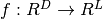，其中D是输入向量x的大小，L是输出向量f(x)的大小，矩阵表现为：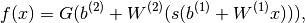, b是偏差向量，W是权重矩阵，G和s是激活函数。

向量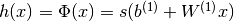构成隐藏层。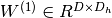是连接输入向量和隐藏层的权重矩阵。Wi代表输入单元到第i个隐藏单元的权重。一般选择tanh作为s的激活函数，使用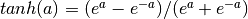或者使用逻辑sigmoid函数，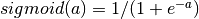。

这里我们使用Tanh因为一般它训练速度更快（有时也有利于解决局部最优）。tanh和sigmoid都是标量到标量函数，但通过点积运算向量和张量自然延伸（将向量分解成元素，生成同样大小的向量）。

输出向量通过以下公式得到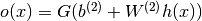。

我们此前在使用逻辑回归区分MNIST数字时提到过这一公式。如前，在多类区分中，通过使用softmax作为G的函数，可以获得类成员的概率。

训练一个MLP，我们学习模型所有的参数，这里我们使用随机梯度下降和批处理。要学习的参数为：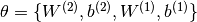。

梯度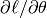可以使用反向传播算法获得（连续微分的特殊形式），Theano可以自动计算这一微分过程。

从逻辑回归到多层感知机我们将聚焦单隐藏层的多层感知机。 我们从构建一个单隐藏层的类开始。之后只要在此基础之上加一个逻辑回归层就构建了MLP。

```python
class HiddenLayer(object):  
    def __init__(self, rng, input, n_in, n_out, W=None, b=None,  
                 activation=T.tanh):  
        """ 
        Typical hidden layer of a MLP: units are fully-connected and have 
        sigmoidal activation function. Weight matrix W is of shape (n_in,n_out) 
        and the bias vector b is of shape (n_out,). 
 
        NOTE : The nonlinearity used here is tanh 
 
        Hidden unit activation is given by: tanh(dot(input,W) + b) 
 
        :type rng: numpy.random.RandomState 
        :param rng: a random number generator used to initialize weights 
 
        :type input: theano.tensor.dmatrix 
        :param input: a symbolic tensor of shape (n_examples, n_in) 
 
        :type n_in: int 
        :param n_in: dimensionality of input 
 
        :type n_out: int 
        :param n_out: number of hidden units 
 
        :type activation: theano.Op or function 
        :param activation: Non linearity to be applied in the hidden 
                           layer 
        """  
        self.input = input  
```
隐藏层i权重的初始值应当根据激活函数以对称间断的方式取得样本。


对于tanh函数，区间在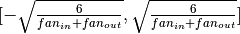

对于sigmoid函数，区间在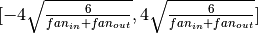

这种初始化方式保证了在训练早期，每一个神经元在它的激活函数内操作，信息可以便利的向上（输入到输出）或反向（输出到输入）传播。
