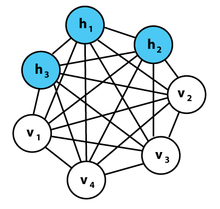

### Deeplearning Algorithms tutorial
谷歌的人工智能位于全球前列，在图像识别、语音识别、无人驾驶等技术上都已经落地。而百度实质意义上扛起了国内的人工智能的大旗，覆盖无人驾驶、智能助手、图像识别等许多层面。苹果业已开始全面拥抱机器学习，新产品进军家庭智能音箱并打造工作站级别Mac。另外，腾讯的深度学习平台Mariana已支持了微信语音识别的语音输入法、语音开放平台、长按语音消息转文本等产品，在微信图像识别中开始应用。全球前十大科技公司全部发力人工智能理论研究和应用的实现，虽然入门艰难，但是一旦入门，高手也就在你的不远处！

机器学习主要有三种方式：监督学习，无监督学习与半监督学习。

（1）监督学习：从给定的训练数据集中学习出一个函数，当新的数据输入时，可以根据函数预测相应的结果。监督学习的训练集要求是包括输入和输出，也就是特征和目标。训练集中的目标是有标注的。如今机器学习已固有的监督学习算法有可以进行分类的，例如贝叶斯分类，SVM，ID3，C4.5以及分类决策树，以及现在最火热的人工神经网络，例如BP神经网络，RBF神经网络，Hopfield神经网络、深度信念网络和卷积神经网络等。人工神经网络是模拟人大脑的思考方式来进行分析，在人工神经网络中有显层，隐层以及输出层，而每一层都会有神经元，神经元的状态或开启或关闭，这取决于大数据。同样监督机器学习算法也可以作回归，最常用便是逻辑回归。

（2）无监督学习：与有监督学习相比，无监督学习的训练集的类标号是未知的，并且要学习的类的个数或集合可能事先不知道。常见的无监督学习算法包括聚类和关联，例如K均值法、Apriori算法。

（3）半监督学习：介于监督学习和无监督学习之间,例如EM算法。

如今的机器学习领域主要的研究工作在三个方面进行：1）面向任务的研究，研究和分析改进一组预定任务的执行性能的学习系统；2）认知模型，研究人类学习过程并进行计算模拟；3）理论的分析，从理论的层面探索可能的算法和独立的应用领域算法。

#### 玻尔兹曼机(Boltzmann Machine)
玻尔兹曼机（Boltzmann machine）是随机神经网络和递归神经网络的一种，由杰弗里·辛顿(Geoffrey Hinton)和特里·谢泽诺斯基(Terry Sejnowski)在1985年发明。

玻尔兹曼机是一种特殊形式的对数线性的马尔科夫随机场（Markov Random Field，MRF），即能量函数是自由变量的线性函数。 通过引入隐含单元，我们可以提升模型的表达能力，表示非常复杂的概率分布。

玻尔兹曼机可被视作随机过程的，可生成的相应的Hopfield神经网络。它是最早能够学习内部表达，并能表达和（给定充足的时间）解决复杂的组合优化问题的神经网络。但是，没有特定限制连接方式的玻尔兹曼机目前为止并未被证明对机器学习的实际问题有什么用。所以它目前只在理论上显得有趣。然而，由于局部性和训练算法的赫布性质(Hebbian nature)，以及它们和简单物理过程相似的并行性，如果连接方式是受约束的（即受限玻尔兹曼机），学习方式在解决实际问题上将会足够高效。

它由玻尔兹曼分布得名。该分布用于玻尔兹曼机的抽样函数。

<p align="center">

</p>

玻尔兹曼机的图像表示. 每条无向边都表示一对依赖关系. 在这个例子中有三个隐藏节点和四个可见节点，它并不是一个约束玻尔兹曼机（restricted Boltzmann machine）


#### 应用示例
```python
from unittest import TestCase
from matplotlib import pyplot

__author__ = 'riri'
import numpy as np
epsilon = 0.000001
def sigmoid(v):
    return 1/(1+np.exp(-v))

def hidden_activation_probability(v,W,c):
    # x is size k*v
    # W is size h*v
    #  W.T is size v*h
    # c is length h
    # result is size k*h
    return sigmoid(c + np.dot(v, W.T))

def hidden_activation_probability_naive(v,W,c):
    activations = np.zeros(W.shape[0])
    if v.size != W.shape[1]:
        #print v.size
        #print v.shape
        #print W.shape
        pass
    assert(v.size == W.shape[1])
    for i in range(W.shape[0]):
        activations[i] = sigmoid(c[i] + sum([W[i,j]*v[j] for j in range(W.shape[1])]))
    return activations

def visible_activation_probability(h,W,b):
    # h is length k*h
    # W is size h*v
    # b is length v
    # result is size k*v
    return sigmoid(b + np.dot(h,W))

def visible_activation_probability_naive(h,W,b):
    activations = np.zeros(W.shape[1])
    assert(h.size == W.shape[0])
    for j in range(W.shape[1]):
        activations[j] = sigmoid(b[j] + sum([W[i,j]*h[i] for i in range(W.shape[0])]))
    return activations

def sample_hidden_units(v,W,c):
    hidden_probabilities = hidden_activation_probability(v,W,c)
    return np.random.uniform(size=hidden_probabilities.shape) < hidden_probabilities

def sample_hidden_units_naive(v,W,c):
    hidden_probabilities = hidden_activation_probability_naive(v,W,c)
    return np.random.uniform(size=hidden_probabilities.shape) < hidden_probabilities

def sample_visible_units(h,W,b):
    visible_probabilities = visible_activation_probability(h,W,b)
    return np.random.uniform(size=visible_probabilities.shape) < visible_activation_probability(h,W,b)

def sample_visible_units_naive(h,W,b):
    visible_probabilities = visible_activation_probability_naive(h,W,b)
    return np.random.uniform(size=visible_probabilities.shape) < visible_activation_probability(h,W,b)

def rbmUpdate_naive(x, W, b, c, lr=0.1):
    h1 = sample_hidden_units_naive(x,W,c)
    v2 = sample_visible_units_naive(h1,W,b)
    q_v2 = visible_activation_probability_naive(h1,W,b)
    q_h2 = hidden_activation_probability_naive(v2,W,c)
    new_b = b + lr*(x-v2)
    new_c = c + lr*(h1-q_h2)
    a = np.outer(h1,x)
    b = np.outer(q_h2,v2.T)
    new_W = W + lr*(a-b)
    error = np.sum((x-q_v2)**2)
    return new_W,new_b,new_c,error

def rbmUpdate(x,W,b,c,lr=0.1):
    h1 = sample_hidden_units(x,W,c)
    v2 = sample_visible_units(h1,W,b)
    q_v2 = visible_activation_probability(h1,W,b)
    q_h2 = hidden_activation_probability(v2,W,c)
    new_b = b + lr*(x-v2)
    new_c = c + lr*(h1-q_h2)
    a = np.outer(h1,x)
    b = np.outer(q_h2,v2.T)
    new_W = W + lr*(a-b)
    error = np.sum(np.sum((x-q_v2)**2))
    return new_W,new_b,new_c,error

class RBM(object):
    def __init__(self, visible_units, hidden_units):
        self.v = visible_units
        self.h = hidden_units
        self.W = np.random.random(size=(hidden_units, visible_units))
        self.b = np.random.random(visible_units)
        self.c = np.random.random(hidden_units)

    def train(self, data, lr=0.05, max_iterations=1000, eps=0.1):
        iteration = 0
        last_error = eps+1
        while iteration < max_iterations and last_error > eps:
            for item in data:
                self.W,self.b,self.c,last_error = rbmUpdate(item, self.W,self.b,self.c,lr)
            iteration += 1
            if iteration % 10 == 0:
                print last_error

    def train_naive(self,data,lr=0.05,max_iterations=1000,eps=0.1):
        iteration = 0
        last_error = eps+1
        while iteration < max_iterations and last_error > eps:
            for item in data:
                self.W,self.b,self.c,last_error = rbmUpdate_naive(item, self.W,self.b,self.c,lr)
            iteration += 1
            if iteration % 10 == 0:
                print last_error
class TestAgainstNaive(object):
    def __init__(self, h_size, v_size):
        self.h_size = h_size
        self.v_size = v_size
    def test_hidden(self):
        h_size = self.h_size
        v_size = self.v_size
        ww = np.random.uniform(size=(h_size,v_size))
        bb = np.random.uniform(size=v_size)
        cc = np.random.uniform(size=h_size)
        vv = np.random.uniform(size=v_size)
        h1 = hidden_activation_probability_naive(vv,ww,cc)
        h2 = hidden_activation_probability(vv,ww,cc)
        assert(h1.shape == h2.shape)
        assert(h1.size == h_size)
        assert(all(np.abs(h1 - h2) < epsilon))
    def test_visible(self):
        h_size = self.h_size
        v_size = self.v_size
        ww = np.random.uniform(size=(h_size,v_size))
        bb = np.random.uniform(size=v_size)
        hh = np.random.uniform(size=h_size)
        v1 = visible_activation_probability_naive(hh,ww,bb)
        v2 = visible_activation_probability(hh,ww,bb)
        assert(v1.shape == v2.shape)
        assert(v1.size == v_size)
        assert(all(np.abs(v1 - v2) < epsilon))
    def test_update(self):
        h_size = self.h_size
        v_size = self.v_size
        ww = np.random.uniform(size=(h_size,v_size))
        bb = np.random.uniform(size=v_size)
        cc = np.random.uniform(size=h_size)
        vv = np.random.uniform(size=v_size)
        (nw1,nb1,nc1,e1) = rbmUpdate(vv,ww,bb,cc)
        (nw2,nb2,nc2,e2) = rbmUpdate_naive(vv,ww,bb,cc)

        # The bounds for this are a bit larger, because
        # more goes one, so there are more chances for
        # divergence.
        assert(np.all(np.abs(nw1-nw2) < epsilon*5))
        assert(np.all(np.abs(nb1-nb2) < epsilon*5))
        assert(np.all(np.abs(nc1-nc2) < epsilon*5))
        assert(np.all(np.abs(e1-e2) < epsilon*5))

def chunkfiles(files):
    splitwords = []
    vocab = set()
    for f in files:
        for line in f.readlines():
            splitwords.append(set(line.split()))
            vocab = vocab.union(line.split())
    entries = []
    vocablist = list(vocab)
    for entry in splitwords:
        entries.append([1 if word in entry else 0 for word in vocablist])
    return entries

def splitfiles(files):
    splitwords = []
    vocab = set()
    for f in files:
        for line in f.readlines():
            splitwords.append(set(line.split()))
            vocab = vocab.union(line.split())
    return splitwords


def go():
    tests = 1
    magnitude_mat = np.zeros((7,4*tests))
    with open('./movies.txt') as movies:
        with open('./matrices.txt') as matrices:
            terms = chunkfiles([movies, matrices])
    for i in range(tests):
        training_data = np.array(terms[1:-1])
        print training_data.shape
        r = RBM(399, 2)
        r.train(training_data ,max_iterations=500,lr=0.1)
        movterm = np.array([terms[1]])
        matterm = np.array([terms[-1]])
        print hidden_activation_probability(movterm,r.W,r.c)
        print hidden_activation_probability(matterm,r.W,r.c)
    pyplot.imshow(magnitude_mat, interpolation='nearest')

if __name__=='__main__':
    h_size = np.floor(np.random.rand()*100)
    v_size = np.floor(np.random.rand()*100)
    test = TestAgainstNaive(h_size,v_size)
    test.test_visible()
    test.test_hidden()
    test.test_update()
    go()
```
