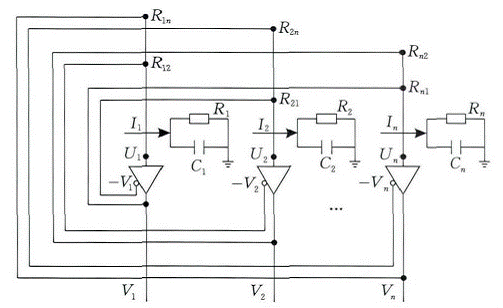
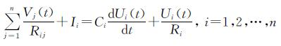
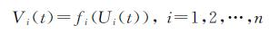
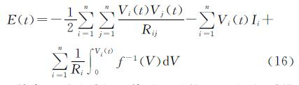

### Deeplearning Algorithms tutorial
谷歌的人工智能位于全球前列，在图像识别、语音识别、无人驾驶等技术上都已经落地。而百度实质意义上扛起了国内的人工智能的大旗，覆盖无人驾驶、智能助手、图像识别等许多层面。苹果业已开始全面拥抱机器学习，新产品进军家庭智能音箱并打造工作站级别Mac。另外，腾讯的深度学习平台Mariana已支持了微信语音识别的语音输入法、语音开放平台、长按语音消息转文本等产品，在微信图像识别中开始应用。全球前十大科技公司全部发力人工智能理论研究和应用的实现，虽然入门艰难，但是一旦入门，高手也就在你的不远处！

机器学习主要有三种方式：监督学习，无监督学习与半监督学习。

（1）监督学习：从给定的训练数据集中学习出一个函数，当新的数据输入时，可以根据函数预测相应的结果。监督学习的训练集要求是包括输入和输出，也就是特征和目标。训练集中的目标是有标注的。如今机器学习已固有的监督学习算法有可以进行分类的，例如贝叶斯分类，SVM，ID3，C4.5以及分类决策树，以及现在最火热的人工神经网络，例如BP神经网络，RBF神经网络，Hopfield神经网络、深度信念网络和卷积神经网络等。人工神经网络是模拟人大脑的思考方式来进行分析，在人工神经网络中有显层，隐层以及输出层，而每一层都会有神经元，神经元的状态或开启或关闭，这取决于大数据。同样监督机器学习算法也可以作回归，最常用便是逻辑回归。

（2）无监督学习：与有监督学习相比，无监督学习的训练集的类标号是未知的，并且要学习的类的个数或集合可能事先不知道。常见的无监督学习算法包括聚类和关联，例如K均值法、Apriori算法。

（3）半监督学习：介于监督学习和无监督学习之间,例如EM算法。

如今的机器学习领域主要的研究工作在三个方面进行：1）面向任务的研究，研究和分析改进一组预定任务的执行性能的学习系统；2）认知模型，研究人类学习过程并进行计算模拟；3）理论的分析，从理论的层面探索可能的算法和独立的应用领域算法。

#### Hopfield网络(Hopfield Network)

Hopfield神经网络是一种递归神经网络，由约翰·霍普菲尔德在1982年发明。Hopfield网络是一种结合存储系统和二元系统的神经网络。它保证了向局部极小的收敛，但收敛到错误的局部极小值（local minimum），而非全局极小（global minimum）的情况也可能发生。Hopfield网络也提供了模拟人类记忆的模型。

Hopfield提出了连续和离散的Hopfield神经网络模型，并采用全互联型神经网络尝试对非多项式复杂度的旅行商问题（Travelling Salesman Problem，TSP）进行了求解，促进神经网络的研究再次进入了蓬勃发展的时期。

Hopfield强调工程实践的重要性，他利用电阻、电容和运算放大器等元件组成的模拟电路实现了对网络神经元的描述，把最优化问题的目标函数转换成Hopfield神经网络的能量函数，通过网络能量函数最小化来寻找对应问题的最优解．Hopfield网络是一种循环神经网络，从输出到输入有反馈连接，典型的Hopfield神经网络模型如图所示．

在图中每组运算放大器及其相关的电阻、电容组成的网络代表一个神经元。每个神经元有两组输入，一组是恒定的外部电流，另一组是来自其他运算放大器输出的正向或反向的反馈连接。假设第i个神经元的内部膜电位为Ui(i=1,2,…,n)，细胞膜的输入电容和传递电阻分别为Ci和Ri，神经元的输出电位为Vi，外部输入电流为Ii，并用电阻Rij(i，j=1,2,…,n)来模拟第i个和第j个神经元之间的突触特性。由基尔霍夫电流定律(Kirchhoff’s Cureent Law ,KCL)可知，放大器输入节点处的流入电流和流出电流保持平衡，亦即有下式成立：

同时，每一个运算放大器模拟了神经元输入和输出之间的非线性特性，即有

其中，fi代表了第i个神经元的传递函数，并定义W=Rij-1 （i,j＝1,2,…,n）为网络的权系数矩阵．为证明连续型网络的稳定性，Hopfield定义了如下的能量函数：

其中，f-1为神经元传递函数的反函数．经过推导后得出以下两点结论：一是对于具有单调递增传递函数且对称权系数矩阵的网络来说，其能量会随着时间的变化而趋于稳定；二是当且仅当网络中所有神经元的输出不再随时间变化时，则可以认为网络的能量保持不变。在将网络用于求解诸如旅行商的组合优化问题时，Hopfield将优化的目标函数转化为网络的能量函数，对应地将待求解问题的变量用网络中神经元的状态来表示。由这样的表示方式可知当网络的能量衰减到稳定值时，问题的最优解也随之求出。

Hopfield网络按网络输入和输出的数字形式不同可分为离散型和连续型两种网络,即：离散型Hopfield神经网络----DHNN(Discrete Hopfield Neural Network)；连续型Hopfield神经网络----CHNN(ContinuesHopfield Neural Network)。
