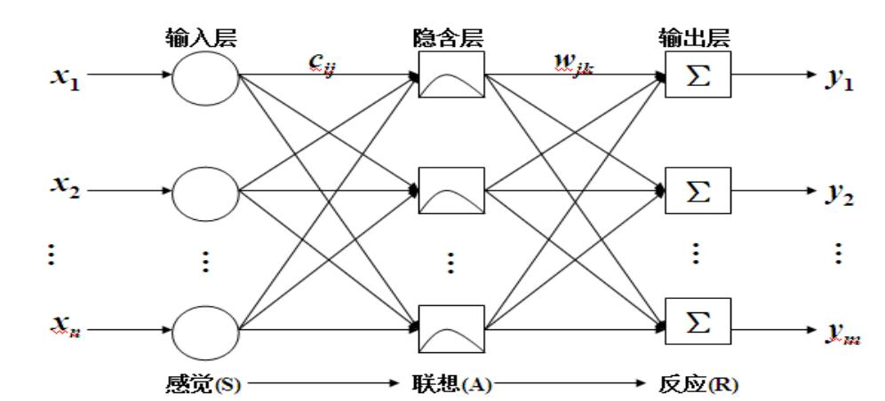
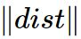
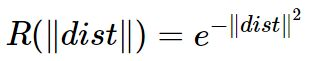
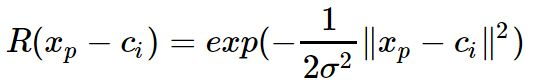
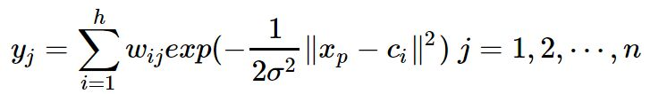
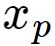
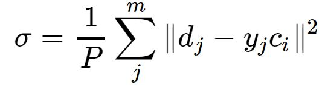
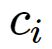
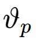

### Deeplearning Algorithms tutorial
谷歌的人工智能位于全球前列，在图像识别、语音识别、无人驾驶等技术上都已经落地。而百度实质意义上扛起了国内的人工智能的大旗，覆盖无人驾驶、智能助手、图像识别等许多层面。苹果业已开始全面拥抱机器学习，新产品进军家庭智能音箱并打造工作站级别Mac。另外，腾讯的深度学习平台Mariana已支持了微信语音识别的语音输入法、语音开放平台、长按语音消息转文本等产品，在微信图像识别中开始应用。全球前十大科技公司全部发力人工智能理论研究和应用的实现，虽然入门艰难，但是一旦入门，高手也就在你的不远处！

机器学习主要有三种方式：监督学习，无监督学习与半监督学习。

（1）监督学习：从给定的训练数据集中学习出一个函数，当新的数据输入时，可以根据函数预测相应的结果。监督学习的训练集要求是包括输入和输出，也就是特征和目标。训练集中的目标是有标注的。如今机器学习已固有的监督学习算法有可以进行分类的，例如贝叶斯分类，SVM，ID3，C4.5以及分类决策树，以及现在最火热的人工神经网络，例如BP神经网络，RBF神经网络，Hopfield神经网络、深度信念网络和卷积神经网络等。人工神经网络是模拟人大脑的思考方式来进行分析，在人工神经网络中有显层，隐层以及输出层，而每一层都会有神经元，神经元的状态或开启或关闭，这取决于大数据。同样监督机器学习算法也可以作回归，最常用便是逻辑回归。

（2）无监督学习：与有监督学习相比，无监督学习的训练集的类标号是未知的，并且要学习的类的个数或集合可能事先不知道。常见的无监督学习算法包括聚类和关联，例如K均值法、Apriori算法。

（3）半监督学习：介于监督学习和无监督学习之间,例如EM算法。

如今的机器学习领域主要的研究工作在三个方面进行：1）面向任务的研究，研究和分析改进一组预定任务的执行性能的学习系统；2）认知模型，研究人类学习过程并进行计算模拟；3）理论的分析，从理论的层面探索可能的算法和独立的应用领域算法。

#### 径向基函数网络(Radial Basis Function Network)

在数学建模领域，径向基函数网络（Radial basis function network，缩写 RBF network）是一种使用径向基函数作为激活函数的人工神经网络。
RBF神经网络是基于人脑的神经元细胞对外界反应的局部性而提出的新颖的、有效的前馈式神经网络，具有良好的局部逼近特性。它的数学理论基础成形于1985年由Powell首先提出的多变量插值的径向基函数，1988年被Broomhead和Lowe应用到神经网络设计领域，最终形成了RBF神经网络。
径向基函数网络的输出是输入的径向基函数和神经元参数的线性组合。径向基函数网络具有多种用途，包括包括函数近似法、时间序列预测、分类和系统控制。他们最早由布鲁姆赫德（Broomhead）和洛维（Lowe）在1988年建立。

RBF神经网络是一种三层前馈神经网络。第一层为输入层，由信号源节点构成，将网络与外界环境连结起来，节点数由输入信号的维数确定；第二层为隐含层（径向基层），其节点由径向基函数构成，实现输入空间到隐层空间的非线性变换；第三层为输出层（线性层），对输入模式做出响应，其节点由隐含层节点给出的基函数的线性组合来计算。

径向基神经网络的激活函数采用径向基函数，通常定义为空间任一点到某一中心之间欧氏距离的单调函数。径向基神经网络的激活函数是以输入向量和权值向量之间的距离 为自变量的。径向神经网络的激活函数一般表达式为

随着权值和输入向量之间距离的减少，网络输出是递增的，当输入向量和权值向量一致时，神经元输出1。b为阈值，用于调整神经元的灵敏度。利用径向基神经元和线性神经元可以建立广义回归神经网络，该种神经网络适用于函数逼近方面的应用；径向基神经元和竞争神经元可以组件概率神经网络，此种神经网络适用于解决分类问题。输出层和隐含层所完成的任务是不同的，因而它们的学习策略也不相同。输出层是对线性权进行调整，采用的是线性优化策略，因而学习速度较快。而隐函数是对激活函数（格林函数或高斯函数，一般为高斯函数）的参数进行调整，采用的是非线性优化策略，因而学习速度较慢。

尽管RBF网络的输出是隐单元输出的线性加权和，学习速度加快，但并不等于径向基神经网络就可以取代其他前馈网络。这是因为径向神经网络很可能需要比BP网络多得多的隐含层神经元来完成工作。

径向基神经网络中需要求解的参数有三个基函数的中心、方差以及隐含层到输出层的权值。根据径向基函数中心选取方法的不同，RBF网络有多种学习方法。下面介绍自组织选取中心的RBF神经网络学习法。此方法由两个阶段组成：

* 自组织学习阶段，此阶段为无监督学习过程，求解隐含层基函数的中心与方差。

* 监督学习阶段，此阶段求解隐含层到输出层之间的权值。

径向基神经网络中常用的径向基函数是高斯函数，因此径向基神经网络的激活函数可表示为：

由此可得，径向基神经网络的结构可得到网络的输出为：

其中为第p个输入样本。h为隐含层的结点数。

如果d是样本的期望输出值，那么基函数的方差可表示为：

基于K-均值聚类方法求取基函数中心c:
* 网络初始化 随机选取h个训练样本作为聚类中心
* 将输入的训练样本集合按最近邻规则分组，按照 与中心为之间的欧式距离将分配到输入样本的各个聚类集合之中。

