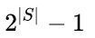

### Deeplearning Algorithms tutorial
谷歌的人工智能位于全球前列，在图像识别、语音识别、无人驾驶等技术上都已经落地。而百度实质意义上扛起了国内的人工智能的大旗，覆盖无人驾驶、智能助手、图像识别等许多层面。苹果业已开始全面拥抱机器学习，新产品进军家庭智能音箱并打造工作站级别Mac。另外，腾讯的深度学习平台Mariana已支持了微信语音识别的语音输入法、语音开放平台、长按语音消息转文本等产品，在微信图像识别中开始应用。全球前十大科技公司全部发力人工智能理论研究和应用的实现，虽然入门艰难，但是一旦入门，高手也就在你的不远处！
AI的开发离不开算法那我们就接下来开始学习算法吧！

#### 先验算法(Apriori Algorithm)
Apriori算法是一种挖掘关联规则的频繁项集算法，其核心思想是通过候选集生成和情节的向下封闭检测两个阶段来挖掘频繁项集。 Apriori（先验的，推测的）算法应用广泛，可用于消费市场价格分析，猜测顾客的消费习惯；网络安全领域中的入侵检测技术；可用在用于高校管理中，根据挖掘规则可以有效地辅助学校管理部门有针对性的开展贫困助学工作；也可用在移动通信领域中，指导运营商的业务运营和辅助业务提供商的决策制定。

在计算机科学以及数据挖掘领域中， 先验算法是关联式规则中的经典算法之一。先验算法的设计目的是为了处理包含交易信息内容的数据库（例如,顾客购买的商品清单，或者网页常访清单。）而其他的算法则是设计用来寻找无交易信息（如Winepi算法和Minepi算法）或无时间标记（如DNA测序）的数据之间的联系规则。

在关联式规则中,一般对于给定的项目集合（例如，零售交易集合，每个集合都列出的单个商品的购买信息），算法通常尝试在项目集合中找出至少有C个相同的子集。先验算法采用自底向上的处理方法，即频繁子集每次只扩展一个对象（该步骤被称为候选集产生），并且候选集由数据进行检验。当不再产生符合条件的扩展对象时，算法终止。

先验算法采用广度优先搜索算法进行搜索并采用树结构来对候选项目集进行高效计数。它通过长度为k-1的候选项目集来产生长度为k的候选项目集，然后从中删除包含不常见子模式的候选项。根据向下封闭性引理,该候选项目集包含所有长度为k的频繁项目集。之后，就可以通过扫描交易数据库来决定候选项目集中的频繁项目集。

虽然先验算法具有显著的历史地位，但是其中的一些低效与权衡弊端也进而引致了许多其他的算法的产生。候选集产生过程生成了大量的子集（先验算法在每次对数据库进行扫描之前总是尝试加载尽可能多的候选集）。并且自底而上的子集浏览过程（本质上为宽度优先的子集格遍历）也直到遍历完所有个可能的子集之后才寻找任意最大子集S。

Apriori算法中的一些低效与权衡弊端也进而引致了许多其他的算法的产生，例如FP-growth算法。候选集产生过程生成了大量的子集（先验算法在每次对数据库进行扫描之前总是尝试加载尽可能多的候选集）。并且自底而上的子集浏览过程（本质上为宽度优先的子集格遍历）也直到遍历完所有 个可能的子集之后才寻找任意最大子集S。


#### 应用示例
```python

class Apriori():
    def __init__(self):
        pass
    '''
    关联分析的目标包括两项：发现频繁项集和发现关联规则
    '''

    '''
    频繁项集：
        对于包含N种物品的数据集共有2^N-1种项集组合。
        支持度(support)
            一个项集的支持度被定义为数据集中包含该项集的记录所占的比例。
        Apriori算法：如果某个项集是频繁的，那么它的所有子集也是频繁的。
        如果一个项集是非频繁集，那么它的所有超集也是非频繁集。
    '''
    def _createC1(self, dataSet):
        C1 = []
        for transaction in dataSet:
            for item in transaction:
                if [item] not in C1:
                    C1.append([item])
        C1.sort()
        return map(frozenset, C1) # use frozen set so we can use it as a key in a dict

    def _scanD(self, D, Ck, minSupport=0.5):
        ssCnt = {}
        for tid in D:
            for can in Ck:
                if can.issubset(tid):
                    if can in ssCnt:
                        ssCnt[can] += 1
                    else:
                        ssCnt[can] = 1
                    # if can not in ssCnt:
                    #     ssCnt[can] = 0
                    # ssCnt[can] += 1
        # print ssCnt
        numItems = len(D)
        retList = []
        supportK = {}
        for key in ssCnt:
            support = ssCnt[key]/float(numItems) # 计算支持度
            if support >= minSupport:
                retList.append(key)
            supportK[key] = support
        return retList, supportK

    def aprioriGen(self, Lk, k): # k>=2
        retList = []
        lenLk = len(Lk)
        for i in range(lenLk):
            for j in range(i+1, lenLk):
                L1 = list(Lk[i])[:k-2]
                L2 = list(Lk[j])[:k-2]
                L1.sort()
                L2.sort()
                if L1 == L2: # if first k-2 elements are equal. when k is 3, {0,1},{0,2},{1,2}→{0,1}U{0,2}→{0,1,2}
                    retList.append(Lk[i] | Lk[j])
        return retList

    def apriori(self, dataSet, minSupport=0.5): # minSupport 最小支持度
        D = map(set, dataSet) # 转换为集合set
        C1 = self._createC1(dataSet) # 创建C1，转换为集合frozenset
        L1, supp1 = self._scanD(D, C1, minSupport) # 基于C1和minSupport创建L1
        L = []
        supportData = {}
        L.append(L1)
        supportData.update(supp1)
        k = 2
        while len(L[k-2]) > 1:
            Ck = self.aprioriGen(L[k-2], k) # 创建Ck
            Lk, suppK = self._scanD(D, Ck, minSupport) # 基于Ck和minSupport创建Lk
            L.append(Lk)
            supportData.update(suppK)
            k += 1
        return L, supportData

    '''
    关联规则：→
        可信度(confidence)：也称置信度
            可信度(尿布→葡萄酒) = 支持度({尿布,葡萄酒})/支持度({尿布})
        如果某条规则并不满足最小可信度要求，那么该规则的所有子集也不会满足最小可信度要求。
    '''

    def _calcConf(self, freqSet, H, supportData, brl, minConf=0.7): # H为出现在右部的规则列表，如{0},{1}
        prunedH = []
        for conseq in H:
            conf = supportData[freqSet]/supportData[freqSet-conseq] # 计算可信度
            if conf >= minConf:
                print freqSet-conseq, '-->', conseq, 'conf:', conf
                brl.append((freqSet-conseq, conseq, conf))
                prunedH.append(conseq)
        return prunedH

    def _rulesFromConseq(self, freqSet, H, supportData, brl, minConf=0.7): # H为出现在右部的规则列表，如{0},{1}
        m = len(H[0])
        if len(freqSet) > (m+1):
            Hmp1 = self.aprioriGen(H, m+1) # 合并规则
            Hmp = self._calcConf(freqSet, Hmp1, supportData, brl, minConf) # Hmp为出现在右部的合并规则列表，如{0,1}
            if len(Hmp) > 1: # 如果规则列表长度大于1，则进一步合并
                self._rulesFromConseq(freqSet, Hmp, supportData, brl, minConf)

    def generateRules(self, L, supportData, minConf=0.7): # minConf 最小可信度
        bigRuleList = []
        for i in range(1, len(L)): # 从包含两个或者更多元素的项集开始规则构建过程
            for freqSet in L[i]:
                H1 = [frozenset([item]) for item in freqSet] # 构建只包含单个元素的列表，即出现在规则右部的规则列表，如{0},{1}
                if i > 1:
                    self._rulesFromConseq(freqSet, H1, supportData, bigRuleList, minConf) # 生成候选规则
                else:
                    self._calcConf(freqSet, H1, supportData, bigRuleList, minConf) # 对规则进行评估
        return bigRuleList

def loadDataSet():
    return [[1, 3, 4], [2, 3, 5], [1, 2, 3, 5], [2, 5]]

if __name__ == '__main__':
    dataSet = loadDataSet()
    ap = Apriori()
    L, suppData = ap.apriori(dataSet, minSupport=0.5)
    print L
    print suppData
    rules = ap.generateRules(L, suppData, minConf=0.6)
    print rules
```
