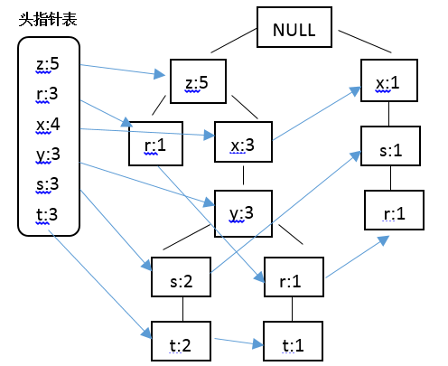
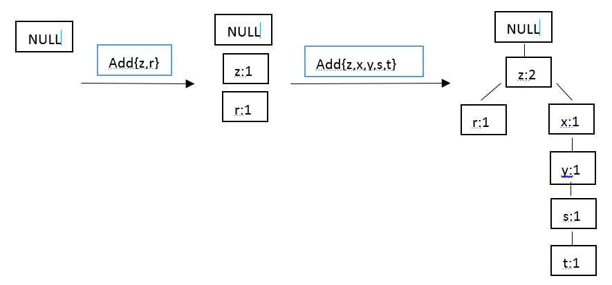

### Deeplearning Algorithms tutorial
谷歌的人工智能位于全球前列，在图像识别、语音识别、无人驾驶等技术上都已经落地。而百度实质意义上扛起了国内的人工智能的大旗，覆盖无人驾驶、智能助手、图像识别等许多层面。苹果业已开始全面拥抱机器学习，新产品进军家庭智能音箱并打造工作站级别Mac。另外，腾讯的深度学习平台Mariana已支持了微信语音识别的语音输入法、语音开放平台、长按语音消息转文本等产品，在微信图像识别中开始应用。全球前十大科技公司全部发力人工智能理论研究和应用的实现，虽然入门艰难，但是一旦入门，高手也就在你的不远处！
AI的开发离不开算法那我们就接下来开始学习算法吧！

#### FP-growth算法(FP-Growth Algorithm)
FP-growth算法是基于Apriori原理的，通过将数据集存储在FP（Frequent Pattern)树上发现频繁项集，但不能发现数据之间的关联规则。FP-growth算法只需要对数据库进行两次扫描，而Apriori算法在求每个潜在的频繁项集时都需要扫描一次数据集，所以说Apriori算法是高效的。其中算法发现频繁项集的过程是：
* 1.构建FP树；
* 2.从FP树中挖掘频繁项集。

#### 构建FP树
FP表示的是频繁模式，其通过链接来连接相似元素，被连起来的元素可以看成是一个链表。将事务数据表中的各个事务对应的数据项按照支持度排序后，把每个事务中的数据项按降序依次插入到一棵以 NULL为根节点的树中，同时在每个结点处记录该结点出现的支持度。

FP-growth算法的流程为：首先构造FP树，然后利用它来挖掘频繁项集。在构造FP树时，需要对数据集扫描两边，第一遍扫描用来统计频率，第二遍扫描至考虑频繁项集。下面举例对FP树加以说明。

假设存在的一个事务数据样例为,构建FP树的步骤如下： 

| 事务ID |  事务中的元素 |
| ------ | --- | 
| 001 | r,z,h,j,p | 
| 002 |z,y,x,w,v,u,t,s|
| 003 | z |
| 004 | r,x,n,o,s |
| 005 | y,r,x,z,q,t,p |
| 006 | y,z,x,e,q,s,t,m|

　结合Apriori算法中最小支持度的阈值，在此将最小支持度定义为3，结合上表中的数据，那些不满足最小支持度要求的将不会出现在最后的FP树中，据此构建FP树，并采用一个头指针表来指向给定类型的第一个实例，快速访问FP树中的所有元素，构建的带头指针的FP树如下:
<p align="center">

</p>

结合绘制的带头指针表的FP树，对表中数据进行过滤，排序如下：
| 事务ID |  事务中的元素 |过滤和重排序后的事务|
| ------ | --- |  --------------------------- | 
| 001 | r,z,h,j,p |    z,r                    |
| 002 |z,y,x,w,v,u,t,s|  z,x,y,s,t            |
| 003 | z |          z                        |
| 004 | r,x,n,o,s |  x,s,r                    |
| 005 | y,r,x,z,q,t,p |    	z,x,y,r,t         |
| 006 | y,z,x,e,q,s,t,m|    z,x,y,s,t         |

在对数据项过滤排序了之后，就可以构建FP树了，从NULL开始，向其中不断添加过滤排序后的频繁项集。过程可表示为：
<p align="center">

</p>

因而我们可以实现FP树的构建，我们知道，在第二次扫描数据集时会构建一棵FP树，并采用一个容器来保存树。首先创建一个类来保存树的每一个节点：
```python
from numpy import *

class treeNode:
    def __init__(self, nameValue, numOccur, parentNode):
        self.name = nameValue
        self.count = numOccur
        self.nodeLink = None
        self.parent = parentNode      #needs to be updated
        self.children = {} 
        
    def inc(self,numOccur):
        self.count += numOccur

    def disp(self,ind = 1):
        print ' '*ind,self.name,' ',self.count
        for child in self.children.values():
            child.disp(ind+1)
'''
#test
rootNode = treeNode('pyramid',9,None)
rootNode.children['eye'] = treeNode('eye',13,None)
a = rootNode.disp()
print a
'''
```

这样，FP树对应的数据结构就建好了，现在就可以构建FP树了，FP树的构建函数如下:

```python
#FP构建函数
def createTree(dataSet,minSup = 1):
    headerTable = {}
    for trans in dataSet:
        for item in trans:
            headerTable[item] = headerTable.get(item,0) + dataSet[trans]#记录每个元素项出现的频度
    for k in headerTable.keys():
        if headerTable[k] < minSup:
            del(headerTable[k])
    freqItemSet = set(headerTable.keys())
    if len(freqItemSet) == 0:#不满足最小值支持度要求的除去
        return None,None
    for k in headerTable:
        headerTable[k] = [headerTable[k],None]
    retTree = treeNode('Null Set',1,None)
    for tranSet,count in dataSet.items():
        localD = {}
        for item in tranSet:
            if item in freqItemSet:
                localD[item] = headerTable[item][0]
        if len(localD) > 0:
            orderedItems = [v[0] for v in sorted(localD.items(),key = lambda p:p[1],reverse = True)]
            updateTree(orderedItems,retTree,headerTable,count)
    return retTree,headerTable

def updateTree(items, inTree, headerTable, count):
    if items[0] in inTree.children:
        inTree.children[items[0]].inc(count) 
    else:
        inTree.children[items[0]] = treeNode(items[0], count, inTree)
        if headerTable[items[0]][1] == None:
            headerTable[items[0]][1] = inTree.children[items[0]]
        else:
            updateHeader(headerTable[items[0]][1], inTree.children[items[0]])
    if len(items) > 1:
        updateTree(items[1::], inTree.children[items[0]], headerTable, count)

def updateHeader(nodeToTest, targetNode):   
    while (nodeToTest.nodeLink != None):
        nodeToTest = nodeToTest.nodeLink
    nodeToTest.nodeLink = targetNode
```

在应用示例之前还需要一个真正的数据集，结合之前的数据自定义数据集：
```python
def loadSimpDat():
    simpDat = [['r', 'z', 'h', 'j', 'p'],
               ['z', 'y', 'x', 'w', 'v', 'u', 't', 's'],
               ['z'],
               ['r', 'x', 'n', 'o', 's'],
               ['y', 'r', 'x', 'z', 'q', 't', 'p'],
               ['y', 'z', 'x', 'e', 'q', 's', 't', 'm']]
    return simpDat

def createInitSet(dataSet):
    retDict = {}
    for trans in dataSet:
        retDict[frozenset(trans)] = 1
    return retDict
```
结果：
```python
simpDat = loadSimpDat()
initSet  = createInitSet(simpDat)
myFPtree,myHeaderTab = createTree(initSet,3)
a = myFPtree.disp()
print a
```
这样就构建了FP树，接下来就是使用它来进行频繁项集的挖掘。

#### 从FP树中挖掘频繁项集
在构建了FP树之后，就可以抽取频繁项集了，这里的思想和Apriori算法大致类似，首先从氮元素项集合开始，然后在此基础上逐步构建更大的集合。大致分为三个步骤：

* 1.从FP树中获得条件模式基；
* 2.利用条件模式基，构建一个条件FP树；
* 3.迭代重复1和2，直到树包含一个元素项为止。
首先，获取条件模式基。条件模式基是以所查找元素项为结尾的路径集合，表示的是所查找的元素项与树根节点之间的所有内容。结合构建FP树绘制的图，r的前缀路径就是{x,s}、{z,x,y}和{z},其中的每条前缀路径都与一个计数值有关，该计数值表示的是每条路径上r的数目。
为了得到这些前缀路径，结合之前所得到的头指针表，头指针表中包含相同类型元素链表的起始指针，根据每一个元素项都可以上溯到这棵树直到根节点为止。该过程对应的代码如下：

```python
def ascendTree(leafNode, prefixPath): #ascends from leaf node to root
    if leafNode.parent != None:
        prefixPath.append(leafNode.name)
        ascendTree(leafNode.parent, prefixPath)
    
def findPrefixPath(basePat, treeNode): #treeNode comes from header table
    condPats = {}
    while treeNode != None:
        prefixPath = []
        ascendTree(treeNode, prefixPath)
        if len(prefixPath) > 1: 
            condPats[frozenset(prefixPath[1:])] = treeNode.count
        treeNode = treeNode.nodeLink
    return condPats

#test
simpDat = loadSimpDat()
initSet  = createInitSet(simpDat)
myFPtree,myHeaderTab = createTree(initSet,3)
a = myFPtree.disp()
b = findPrefixPath('x',myHeaderTab['x'][1])
print b
```
运行示例，与所给数据一致。接下来就可以创建条件FP树了。对于每一个频繁项，都需要创建一棵条件FP树，使用刚才创建的条件模式基作为输入，采用相同的建树代码来构建树，相应的递归发现频繁项、发现条件模式基和另外的条件树。对应的递归查找频繁项集的函数如下：
```python
def mineTree(inTree, headerTable, minSup, preFix, freqItemList):
    bigL = [v[0] for v in sorted(headerTable.items(), key=lambda p: p[1])]#(sort header table)
    for basePat in bigL:
        newFreqSet = preFix.copy()
        newFreqSet.add(basePat)
        freqItemList.append(newFreqSet)
        condPattBases = findPrefixPath(basePat, headerTable[basePat][1])
        myCondTree, myHead = createTree(condPattBases, minSup)
        if myHead != None:            
            mineTree(myCondTree, myHead, minSup, newFreqSet, freqItemList)
```
结合之前的数据验证发现没有错误。

#### 应用示例
在自定义的数据中队算法进行了验证，现在选取实际的数据进行测试。在这个数据集合中，包含了100万条记录，文件中的每一行包含某个用户浏览过的新闻报道，用来寻找那些至少被10万人浏览过的报道。代码如下：
```python
#从新闻网站点击流中挖掘
parsedData = [line.split() for line in open('kosarak.dat').readlines()]
initSet = createInitSet(parsedData)
myFPtree,myHeaderTab = createTree(initSet,100000)
myFreqList = []
a = mineTree(myFPtree,myHeaderTab,100000,set([]),myFreqList)
b = len(myFreqList)
print b
print myFreqList
```