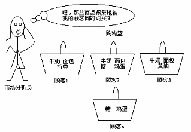

### Deeplearning Algorithms tutorial
谷歌的人工智能位于全球前列，在图像识别、语音识别、无人驾驶等技术上都已经落地。而百度实质意义上扛起了国内的人工智能的大旗，覆盖无人驾驶、智能助手、图像识别等许多层面。苹果业已开始全面拥抱机器学习，新产品进军家庭智能音箱并打造工作站级别Mac。另外，腾讯的深度学习平台Mariana已支持了微信语音识别的语音输入法、语音开放平台、长按语音消息转文本等产品，在微信图像识别中开始应用。全球前十大科技公司全部发力人工智能理论研究和应用的实现，虽然入门艰难，但是一旦入门，高手也就在你的不远处！

机器学习主要有三种方式：监督学习，无监督学习与半监督学习。

（1）监督学习：从给定的训练数据集中学习出一个函数，当新的数据输入时，可以根据函数预测相应的结果。监督学习的训练集要求是包括输入和输出，也就是特征和目标。训练集中的目标是有标注的。如今机器学习已固有的监督学习算法有可以进行分类的，例如贝叶斯分类，SVM，ID3，C4.5以及分类决策树，以及现在最火热的人工神经网络，例如BP神经网络，RBF神经网络，Hopfield神经网络、深度信念网络和卷积神经网络等。人工神经网络是模拟人大脑的思考方式来进行分析，在人工神经网络中有显层，隐层以及输出层，而每一层都会有神经元，神经元的状态或开启或关闭，这取决于大数据。同样监督机器学习算法也可以作回归，最常用便是逻辑回归。

（2）无监督学习：与有监督学习相比，无监督学习的训练集的类标号是未知的，并且要学习的类的个数或集合可能事先不知道。常见的无监督学习算法包括聚类和关联，例如K均值法、Apriori算法。

（3）半监督学习：介于监督学习和无监督学习之间,例如EM算法。

如今的机器学习领域主要的研究工作在三个方面进行：1）面向任务的研究，研究和分析改进一组预定任务的执行性能的学习系统；2）认知模型，研究人类学习过程并进行计算模拟；3）理论的分析，从理论的层面探索可能的算法和独立的应用领域算法。

#### 关联规则
“关联规则”（Association Rules）是数据挖掘的主要技术之一，用于从庞大的数据库中寻找有用或有趣的模式和规则。关联规则最初产生于购物篮分析，它通过发现顾客放入其购物篮中不同商品之间的联系，分析顾客购买行为中隐含的有趣模式，从而指导销售商制订营销策略。单维关联规则特指只涉及单个属性项的关联规则。

设 I = { i1 , i2 ,..., im }是项的集合。设任务相关的数据D 是数据库事务的集合，其中每个事务T是项的集合，使得T ⊆ I。每一个事务有一个标识符，称作TID。设A 是一个项集，事务T 包含A当且仅当A ⊆ T。关联规则是形如A ⇒ B 的蕴涵式，其中A ⊂ I，B ⊂ I，并且A ∩ B =∅。规则A ⇒B 在事务集D 中成立，具有支持度s，其中s 是D 中事务包含A ∪ B（即A 和B 二者）的百分比。它是概率P(A ∪ B)。规则A ⇒ B 在事务集D 中具有置信度c，如果D 中包含A 的事务同时也包含B的百分比是c。这是条件概率P(B |A)。即 support (A ⇒ B ) = P(A ∪ B) confidence (A ⇒ B ) = P(B |A)

同时满足最小支持度阈值(min_sup)和最小置信度阈值(min_conf)的规则称作强规则。为方便计，我们用0%和100%之间的值，而不是用0 到1 之间的值表示支持度和置信度。项的集合称为项集。包含k 个项的项集称为k-项集。集合{computer, financial_management_software}是一个2-项集。项集的出现频率是包含项集的事务数，简称为项集的频率、支持计数或计数。项集满足最小支持度min_sup，如果项集的出现频率大于或等于min_sup 与D 中事务总数的乘积。如果项集满足最小支持度，则称它为频繁项集。频繁k -项集的集合通常记作Lk。关联规则的挖掘是一个两步的过程：

1. 找出所有频繁项集：根据定义，这些项集出现的频繁性至少和预定义的最小支持计数一样。

2. 由频繁项集产生强关联规则：根据定义，这些规则必须满足最小支持度和最小置信度。

如果愿意，也可以使用附加的兴趣度度量。这两步中，第二步最容易。挖掘关联规则的总体性能由第一步决定。

#### 算法背景
关联规则挖掘发现大量数据中项集之间有趣的关联或相关联系。随着大量数据不停地收集和存储，许多业界人士对于从他们的数据库中挖掘关联规则越来越感兴趣。从大量商务事务记录中发现有趣的关联关系，可以帮助许多商务决策的制定，如分类设计、交叉购物和贱卖分析。关联规则挖掘的一个典型例子是购物篮分析。该过程通过发现顾客放入其购物篮中不同商品之间联系，分析顾客的购买习惯。通过了解哪些商品频繁地被顾客同时购买，这种关联的发现可以帮助零售商制定营销策略。例如，在同一次去超级市场，如果顾客购买牛奶，他也购买面包（和什么类型的面包）的可能性有多大？通过帮助零售商有选择地经销和安排货架，这种信息可以引导销售。例如，将牛奶和面包尽可能放近一些，可以进一步刺激一次去商店同时购买这些商品。

