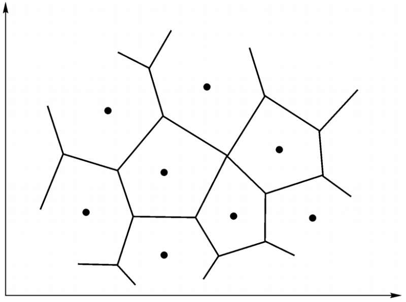
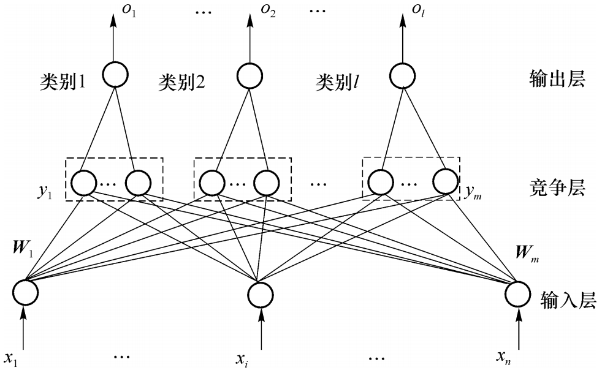
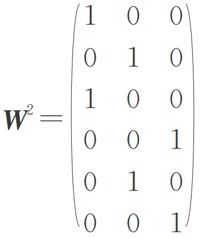
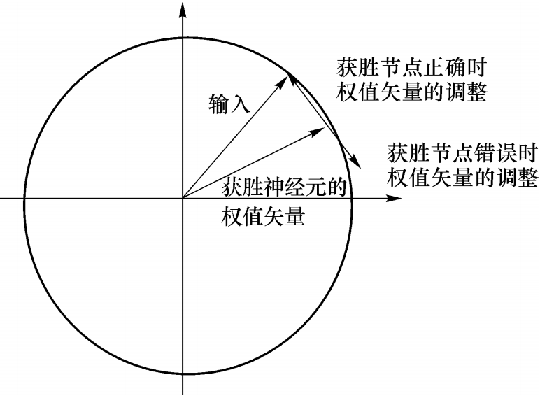
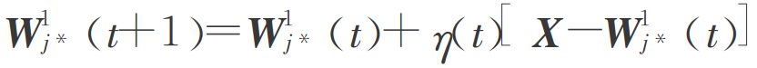
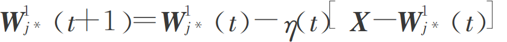
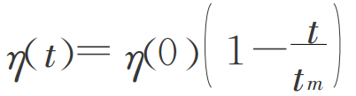
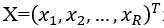
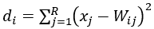

### Deeplearning Algorithms tutorial
谷歌的人工智能位于全球前列，在图像识别、语音识别、无人驾驶等技术上都已经落地。而百度实质意义上扛起了国内的人工智能的大旗，覆盖无人驾驶、智能助手、图像识别等许多层面。苹果业已开始全面拥抱机器学习，新产品进军家庭智能音箱并打造工作站级别Mac。另外，腾讯的深度学习平台Mariana已支持了微信语音识别的语音输入法、语音开放平台、长按语音消息转文本等产品，在微信图像识别中开始应用。全球前十大科技公司全部发力人工智能理论研究和应用的实现，虽然入门艰难，但是一旦入门，高手也就在你的不远处！
AI的开发离不开算法那我们就接下来开始学习算法吧！

#### 学习矢量化

学习矢量量化（Learning Vector Quantization，简称LVQ），与1988年提出的一种用于模式分类的有监督学习算法，是一种结构简单、功能强大的有监督式神经网络分类算法。典型的学习矢量量化算法有：LVQ1、LVQ2、LVQ3，其中，前两种算法应用较为广泛，尤其以LVQ2应用最为广泛和有效。  

学习矢量量化是一种结构简单、功能强大的有监督式神经网络分类方法。作为一种最近邻原型分类器，LVQ在训练过程中通过对神经元权向量（原型向量）的不断更新，对其学习率的不断调整，能够使不同类别权向量之间的边界逐步收敛至贝叶斯分类边界。算法中，对获胜神经元（最近邻权向量）的选取是通过计算输入样本和权向量之间的距离的大小来判断的。与矢量量化（VQ）相比，LVQ最突出的特点就是其具有自适应性 

1.向量量化
向量量化的思路是，将高维输入空间分成若干不同的区域，对每个区域确定一个中心向量作为聚类的中心，与其处于同一区域的输入向量可用该中心向量来代表，从而形成了以各中心向量为聚类中心的点集。在图像处理领域常用各区域中心点（向量）的编码代替区域内的点来存储或传输，从而提出了各种基于向量量化的有损压缩技术，在二维输入平面上表示的中心向量分布称为Voronoi图，如图所示：
<p align="center">

</p>


自组织映射可以起到聚类作用，但无法直接分类或识别，因此它只是自适应解决模式分类问题两步中的第一步。第二步：学习向量量化，采用监督机制，在训练中加入信号作为分类信息对权值进行细调，并对输出神经元预先指定其类别。

2.学习矢量量化网络结构与工作原理
<p align="center">

</p>
竞争层有m个神经元，输入层有n个神经元，两层之间完全连接。输出层每个神经元只与竞争层中的一组神经元连接，连接权重固定为1，训练过程中输入层和竞争层之间的权值逐渐被调整为聚类中心。当一个样本输入LVQ网络时，竞争层的神经元通过胜者为王学习规则产生获胜神经元，容许其输出为1，其它神经元输出为0。与获胜神经元所在组相连的输出神经元输出为1，而其它输出神经元为0，从而给出当前输入样本的模式类。将竞争层学习得到的类成为子类，而将输出层学习得到的类成为目标类。

3.学习矢量量化网络学习算法
学习矢量量化学习规则结合了竞争学习规则和有导师学习规则，所以样本集应当为{(xi，di)}。其中di为l维，对应输出层的l个神经元，它只有一个分量为1，其他分量均为0。通常把竞争层的每个神经元指定给一个输出神经元，相应的权值为1，从而得到输出层的权值。比如某LVQ网络竞争层6个神经元，输出层3个神经元，代表3类。若将竞争层的1，3指定为第一个输出神经元，2，5指定为第二个输出神经元，3，6指定为第三个输出神经元。则竞争层到输出层的权值矩阵为:
<p align="center">

</p>

训练前预先定义好竞争层到输出层权重，从而指定了输出神经元类别，训练中不再改变。网络的学习通过改变输入层到竞争层的权重来进行。根据输入样本类别和获胜神经元所属类别，可判断当前分类是否正确。若分类正确，则将获胜神经元的权向量向输入向量方向调整，分类错误则向相反方向调整。
<p align="center">

</p>

学习矢量量化网络学习算法的步骤如下:
* 初始化。竞争层各神经元权值向量随机赋值小随机数，确定初始学习速率和训练次数。
* 输入样本向量。
* 寻找激活神经元。
* 根据分类是否正确按照不同规则调整获胜神经元的权值，当网络分类结果与教师信号一致时，向输入样本方向调整权值：

<p align="center">

</p>

当网络分类结果与教师信号不一致时，向输入样本反方向调整权值：
<p align="center">

</p>
其他非激活神经元权值保持不变。
* 更新学习速率
<p align="center">

</p>
* 当训练次数未达到设定的次数时，转到步骤输入样本向量输入下一个样本，重复各步骤直到达到设定训练次数为止。上述训练过程中，要保证η（t）为单调下降函数。

#### 结构
学习矢量量化神经网络有三层组成：输入层，竞争层，线性输出层。
学习矢量量化网络是SOFM网络一种有监督形式的扩展，两者有效结合可更好地发挥竞争学习和有监督学习的优点。

连接方式
输入层与竞争层之间采用全连接的方式，竞争层与线性输出层之间采用部分连接的方式。竞争层神经元个数总是大于线性输出层神经元个数，每个竞争层神经元只与一个线性输出层神经元相连接且连接权值恒为1。但是，每个线性输出层神经元可以与多个竞争层神经元相连接。竞争层神经元与线性输出层神经元的值只能是1或0。
当某个输入模式被送至网络时，与输入模式距离最近的竞争层神经元被激活，神经元的状态为“1”，而其他竞争层神经元的状态均为“0”。因此，与被激活神经元相连接的线性输出层神经元状态也为“1”，而其他线性输出层神经元的状态均为“0”

基本步骤为：

初始化输入层与竞争层之间的权值W_ij及学习率η(η>0)。
将输入向量送入到输入层，并计算竞争层神经元与输入向量的距离：
。

#### 案例
```python

function [dw,ls] = learnlv3(w,p,z,n,a,t,e,gW,gA,d,lp,ls)
%LEARNLV2 LVQ2 weight learning function.
%
% Syntax
% 
% [dW,LS] = learnlv3(w,p,n,a,T,lp,ls,Ttrain,C)
% info = learnlv2(code)
%
% Description
%
% LEARNLV3 is the OLVQ weight learning function.
%
% LEARNLV2(W,P,Z,N,A,T,E,gW,gA,D,LP,LS) takes several inputs,
% W - SxR weight matrix (or Sx1 bias vector).
% P - RxQ input vectors (or ones(1,Q)).
% Z - SxQ weighted input vectors.
% N - SxQ net input vectors.
% A - SxQ output vectors.
% T - SxQ layer target vectors.
% E - SxQ layer error vectors.
% gW - SxR weight gradient with respect to performance.
% gA - SxQ output gradient with respect to performance.
% D - SxS neuron distances.
% LP - Learning parameters, none, LP = [].
% LS - Learning state, initially should be = [].
% and returns,
% dW - SxR weight (or bias) change matrix.
% LS - New learning state.
%
% Learning occurs according to LEARNLV1's learning parameter,
% shown here with its default value.
% LP.lr - 0.01 - Learning rate
%
% LEARNLV2(CODE) returns useful information for each CODE string:
% 'pnames' - Returns names of learning parameters.
% 'pdefaults' - Returns default learning parameters.
% 'needg' - Returns 1 if this function uses gW or gA.
%
% Examples
%
% Here we define a sample input P, output A, weight matrix W, and
% output gradient gA for a layer with a 2-element input and 3 neurons.
% We also define the learning rate LR.
%
% p = rand(2,1);
% w = rand(3,2);
% n = negdist(w,p);
% a = compet(n);
% gA = [-1;1; 1];
% lp.lr = 0.5;
%
% Since LEARNLV2 only needs these values to calculate a weight
% change (see Algorithm below), we will use them to do so.
%
% dW = learnlv3(w,p,n,a,lp,Ttrain,C)
%
% Network Use
%
% You can create a standard network that uses LEARNLV2 with NEWLVQ.
%
% To prepare the weights of layer i of a custom network
% to learn with LEARNLV1:
% 1) Set NET.trainFcn to 'trainwb1'.
% (NET.trainParam will automatically become TRAINWB1's default parameters.)
% 2) Set NET.adaptFcn to 'adaptwb'.
% (NET.adaptParam will automatically become TRAINWB1's default parameters.)
% 3) Set each NET.inputWeights{i,j}.learnFcn to 'learnlv2'.
% Set each NET.layerWeights{i,j}.learnFcn to 'learnlv2'.
% (Each weight learning parameter property will automatically
% be set to LEARNLV2's default parameters.)
%
% To train the network (or enable it to adapt):
% 1) Set NET.trainParam (or NET.adaptParam) properties as desired.
% 2) Call TRAIN (or ADAPT).
%
% Algorithm
%
% LEARNLV3 calculates the weight change dW for a given neuron from
% the neuron's input P, output A, train vector target T train, output
% conexion matrix C and learning rate LR
% according to the OLVQ rule, given i the index of the neuron whose
% output a(i) is 1:
%
% dw(i,:) = +lr*(p-w(i,:)) if C(:,i) = Ttrain
% = -lr*(p-w(i,:)) if C(:,i) ~= Ttrain
%
% if C(:,i) ~= Ttrain then the index j is found of the neuron with the
% greatest net input n(k), from the neurons whose C(:,k)=Ttrain. This
% neuron's weights are updated as follows:
%
% dw(j,:) = +lr*(p-w(i,:))
%
% See also LEARNLV1, ADAPTWB, TRAINWB, ADAPT, TRAIN.

% Mark Beale, 11-31-97
% Copyright (c) 1992-1998 by The MathWorks, Inc.
% $Revision: 1.1.1.1 $

% FUNCTION INFO
% =============
if isstr(w)
  switch lower(w)
  case 'name'
      dw = 'Learning Vector Quantization 3';
  case 'pnames'
    dw = {'lr';'window'};
  case 'pdefaults'
    lp.lr = 0.01;
    lp.window = 0.25;
    dw = lp;
  case 'needg'
    dw = 1;
  otherwise
    error('NNET:Arguments','Unrecognized code.')
  end
  return
end


% CALCULATION
% ===========

[S,R] = size(w);
Q = size(p,2);
pt = p';
dw = zeros(S,R);
% For each q...
for q=1:Q

  % Find closest neuron k1 找到获胜神经元
  nq = n(:,q);
  k1 = find(nq == max(nq));
  k1 = k1(1);

  % Find next closest neuron k2 次获胜神经元
  nq(k1) = -inf;
  k2 = find(nq == max(nq));
  k2 = k2(1);


  % and if x falls into the window...
  d1 = abs(n(k1,q)); % Shorter distance
  d2 = abs(n(k2,q)); % Greater distance

  if d2/d1 > ((1-lp.window)/(1+lp.window))

      % then move incorrect neuron away from input,
      % and the correct neuron towards the input
      ptq = pt(q,:);
      if gA(k1,q) ~= gA(k2,q)
          % indicate the incorrect neuron with i, the other with j
          if gA(k1,q) ~= 0
              i = k1;
              j = k2;
          else
              i = k2;
              j = k1;
          end
          dw(i,:) = dw(i,:) - lp.lr*(ptq - w(i,:));
          dw(j,:) = dw(j,:) + lp.lr*(ptq - w(j,:));
      else
          dw(k1,:) = dw(k1,:) + 0.11*lp.window*(ptq-w(k1,:));
       % dw(k2,:) = dw(k2,:) + 0.11*lp.window*(ptq-w(k2,:));
      end
  end
end

```
