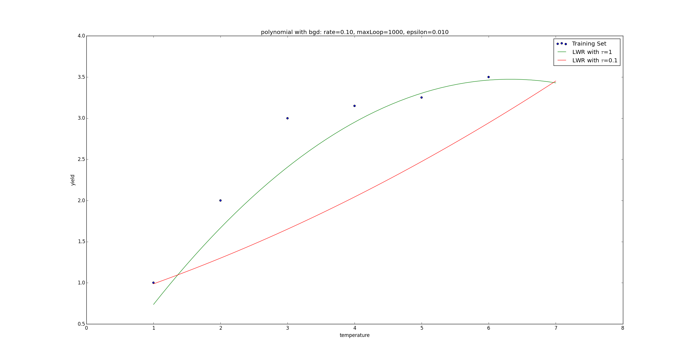

### Deeplearning Algorithms tutorial
谷歌的人工智能位于全球前列，在图像识别、语音识别、无人驾驶等技术上都已经落地。而百度实质意义上扛起了国内的人工智能的大旗，覆盖无人驾驶、智能助手、图像识别等许多层面。苹果业已开始全面拥抱机器学习，新产品进军家庭智能音箱并打造工作站级别Mac。另外，腾讯的深度学习平台Mariana已支持了微信语音识别的语音输入法、语音开放平台、长按语音消息转文本等产品，在微信图像识别中开始应用。全球前十大科技公司全部发力人工智能理论研究和应用的实现，虽然入门艰难，但是一旦入门，高手也就在你的不远处！
AI的开发离不开算法那我们就接下来开始学习算法吧！

#### 局部加权学习算法（LWR）

局部加权回归（LWR）是非参数学习方法。 首先参数学习方法是这样一种方法：在训练完成所有数据后得到一系列训练参数，然后根据训练参数来预测新样本的值，这时不再依赖之前的训练数据了，参数值是确定的。而非参数学习方法是这样一种算法：在预测新样本值时候每次都会重新训练数据得到新的参数值，也就是说每次预测新样本都会依赖训练数据集合，所以每次得到的参数值是不确定的。
局部加权回归（LWR）是我们遇到的第一个non-parametric（非参数）学习算法，而线性回归则是我们遇到的以一个parametric（参数）学习算法。因为参数学习算法它有固定的明确的参数，所以参数一旦确定，就不会改变了，我们不需要在保留训练集中的训练样本。而非参数学习算法，每进行一次预测，就需要重新学习一组，是变化的，所以需要一直保留训练样本。因而，当训练集的容量较大时，非参数学习算法需要占用更多的存储空间，计算速度也较慢。所以有得必有失，效果好了，计算速度却降下来了。

```python
# coding: utf-8
# linear_regression/regression.py

def JLwr(theta, X, y, x, c):
    """局部加权线性回归的代价函数计算式

    Args:
        theta: 相关系数矩阵
        X: 样本集矩阵
        y: 标签集矩阵
        x: 待预测输入
        c: tau
    Returns:
        预测代价
    """
    m,n = X.shape
    summerize = 0
    for i in range(m):
        diff = (X[i]-x)*(X[i]-x).T
        w = np.exp(-diff/(2*c*c))
        predictDiff = np.power(y[i] - X[i]*theta,2)
        summerize = summerize + w*predictDiff
    return summerize

@exeTime
def lwr(rate, maxLoop, epsilon, X, y, x, c=1):
    """局部加权线性回归

    Args:
        rate: 学习率
        maxLoop: 最大迭代次数
        epsilon: 预测精度
        X: 输入样本
        y: 标签向量
        x: 待预测向量
        c: tau
    """
    m,n = X.shape
    # 初始化theta
    theta = np.zeros((n,1))
    count = 0
    converged = False
    error = float('inf')
    errors = []
    thetas = {}
    for j in range(n):
        thetas[j] = [theta[j,0]]
    # 执行批量梯度下降
    while count<=maxLoop:
        if(converged):
            break
        count = count + 1
        for j in range(n):
            deriv = (y-X*theta).T*X[:, j]/m
            theta[j,0] = theta[j,0]+rate*deriv
            thetas[j].append(theta[j,0])
        error = JLwr(theta, X, y, x, c)
        errors.append(error[0,0])
        # 如果已经收敛
        if(error < epsilon):
            converged = True
    return theta,errors,thetas

```

#### 结果

```python
# coding: utf-8
# linear_regression/test_lwr.py
import regression
import matplotlib.pyplot as plt
import matplotlib.ticker as mtick
import numpy as np

if __name__ == "__main__":
    srcX, y = regression.loadDataSet('data/lwr.txt');

    m,n = srcX.shape
    srcX = np.concatenate((srcX[:, 0], np.power(srcX[:, 0],2)), axis=1)
    # 特征缩放
    X = regression.standardize(srcX.copy())
    X = np.concatenate((np.ones((m,1)), X), axis=1)

    rate = 0.1
    maxLoop = 1000
    epsilon = 0.01

    predicateX = regression.standardize(np.matrix([[8, 64]]))

    predicateX = np.concatenate((np.ones((1,1)), predicateX), axis=1)

    result, t = regression.lwr(rate, maxLoop, epsilon, X, y, predicateX, 1)
    theta, errors, thetas = result

    result2, t = regression.lwr(rate, maxLoop, epsilon, X, y, predicateX, 0.1)
    theta2, errors2, thetas2 = result2


    # 打印特征点
    fittingFig = plt.figure()
    title = 'polynomial with bgd: rate=%.2f, maxLoop=%d, epsilon=%.3f'%(rate,maxLoop,epsilon)
    ax = fittingFig.add_subplot(111, title=title)
    trainingSet = ax.scatter(srcX[:, 0].flatten().A[0], y[:,0].flatten().A[0])

    print theta
    print theta2

    # 打印拟合曲线
    xx = np.linspace(1, 7, 50)
    xx2 = np.power(xx,2)
    yHat1 = []
    yHat2 = []
    for i in range(50):
        normalizedSize = (xx[i]-xx.mean())/xx.std(0)
        normalizedSize2 = (xx2[i]-xx2.mean())/xx2.std(0)
        x = np.matrix([[1,normalizedSize, normalizedSize2]])
        yHat1.append(regression.h(theta, x.T))
        yHat2.append(regression.h(theta2, x.T))
    fittingLine1, = ax.plot(xx, yHat1, color='g')
    fittingLine2, = ax.plot(xx, yHat2, color='r')

    ax.set_xlabel('temperature')
    ax.set_ylabel('yield')

    plt.legend([trainingSet, fittingLine1, fittingLine2], ['Training Set', r'LWR with $\tau$=1', r'LWR with $\tau$=0.1'])
    plt.show()

    # 打印误差曲线
    errorsFig = plt.figure()
    ax = errorsFig.add_subplot(111)
    ax.yaxis.set_major_formatter(mtick.FormatStrFormatter('%.2e'))

    ax.plot(range(len(errors)), errors)
    ax.set_xlabel('Number of iterations')
    ax.set_ylabel('Cost J')

    plt.show()
```
最后，我们分别对ττ取值  0.10.1  和  11 ，得到了不同的拟合曲线：
<p align="center">

</p>

