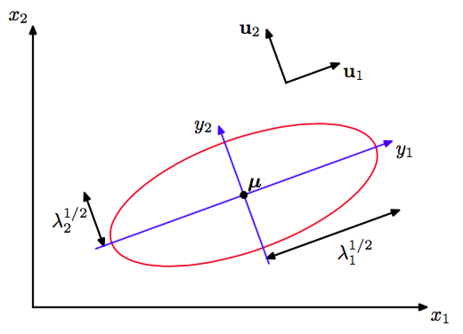
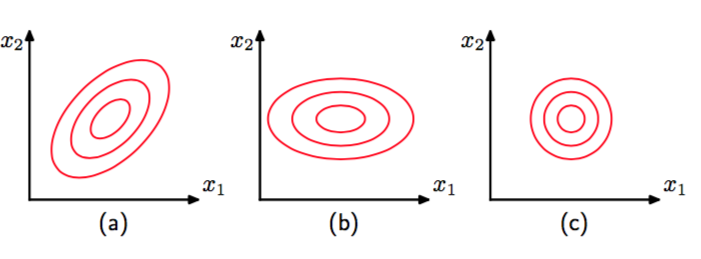

### Deeplearning Algorithms tutorial
谷歌的人工智能位于全球前列，在图像识别、语音识别、无人驾驶等技术上都已经落地。而百度实质意义上扛起了国内的人工智能的大旗，覆盖无人驾驶、智能助手、图像识别等许多层面。苹果业已开始全面拥抱机器学习，新产品进军家庭智能音箱并打造工作站级别Mac。另外，腾讯的深度学习平台Mariana已支持了微信语音识别的语音输入法、语音开放平台、长按语音消息转文本等产品，在微信图像识别中开始应用。全球前十大科技公司全部发力人工智能理论研究和应用的实现，虽然入门艰难，但是一旦入门，高手也就在你的不远处！
AI的开发离不开算法那我们就接下来开始学习算法吧！

#### 高斯朴素贝叶斯(Gaussian Naive Bayes)
高斯朴素贝叶斯算法是一种特殊类型的NB算法，它特别用于当特征具有连续值时。同时假定所有特征都遵循高斯分布，即正态分布。高斯也称为正态分布，是连续变量分布上广泛使用的一种模型。对于单变量，高斯分布可以写成：均值和方差。

对于维向量，多变量的高斯分布形式为：其中为维均值向量，协方差矩阵行列式。高斯分布会出现在许多不同的问题中，可以从多个不同的角度来理解。例如，我们已经证明，对于单个实值变量，使熵最大的是高斯分布。这个性质同样适用于多变量高斯。

高斯分布会出现在许多不同的问题中，可以从多个不同的角度来理解。例如，我们已经证明，对于单个实值变量，使熵最大的是高斯分布。这个性质同样适用于多变量高斯。
另一种情况是，多个随机变量之和也会产生高斯分布。中心极限定理（由拉普拉斯提出）告诉我们，温和的一组随机变量的和的概率分布随着项的增加，趋向于高斯分布。为了阐述这个，考虑个区间[0, 1]上的均匀分布的随机变量，确定它们的均值的分布。如下图所展示的，对于大的，趋向于高斯分布。

在实际应用中，随着N的增加，分布会很快的收敛于高斯分布。因而二元随机变量在次观测中出现次的二项分布将会在时趋向于高斯分布。在考虑高斯分布的几何形式。高斯通过出现在指数位置上的。
这个二次型依赖于。被称为到的马氏距离（ Mahalanobis distance），当是单位矩阵时，退化成欧式距离。当这个二次型在空间中是常数的时候，高斯分布的曲面也是常数。
首先，我们注意到矩阵可以不失一般性的取为对称矩阵，因为任何非对称项都会从指数中消失。现在考虑，协方差矩阵的特征向量方程因为是实对称矩阵，所以它的特征值也是实数，特征向量可以从正交集中选择，得到的单位矩阵的元素，满足协方差矩阵可以表示成特征向量的展开的形式。
二次型和高斯密度在曲面上为常数。如果所有特征值都是正的，那么这些曲面是中心位于，轴方向为，轴方向的缩放比例为的椭球面。

为了很好的定义高斯分布，需要协方差矩阵的特征值严格为正，不然分布就不能标准化。每一个特征值都严格为正的矩阵被称为正定的（positive definite）。

尽管，高斯分布被当作密度模型广泛使用，但是它有着一些巨大的局限性。考虑分布中自由参数的数量。一个通用的对称协方差矩阵有个独立参数，和其中的另外的独立参数。对于大的，参数的总数以平方的方式增长，且大矩阵的计算和求逆会相当困难。为了解决这个问题的其中一种方式是使用限制形式的协方差矩阵。如果考虑对角化的协方差矩阵，即，那么密度模型中总共有个独立参数。对应的常数密度的轮廓线由轴对齐的椭球给出。可以进一步地限制协方差矩阵为单位矩阵的倍数，即（这被称为同性协方差），那么模型总共有个独立参数，且得到恒定密度的球面。下图分别展示了通用的、对角的以及同性的协方差矩阵的概率。

二维高斯分布的固定概率密度等高线。其中，(a)图对应的协方差矩阵为一般形式，(b)图对应的协方差矩阵为对角矩阵，图中椭圆的等高线与坐标轴对齐，(c)图对应的协方差矩阵正比于单位矩阵，图中的等高线是同心圆。尽管这样的方法限制了概率分布的的自由度的数量，使得求协方差矩阵的逆可以很快地完成，但也极大地束缚了概率密度的形式，且限制了它获取数据中有趣的相关性的能力。

高斯分布的另一个局限是它本质上是单峰的（即只有一个最大值），因此不能够很好地近似多峰分布。因此高斯分布一方面相当灵活，因为它有很多参数。另一方面，它又有很大的局限性，因为它不能够描述很多概率分布。
