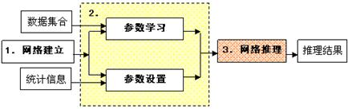
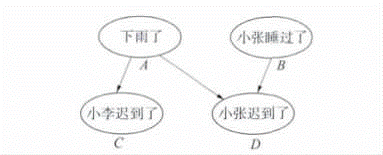
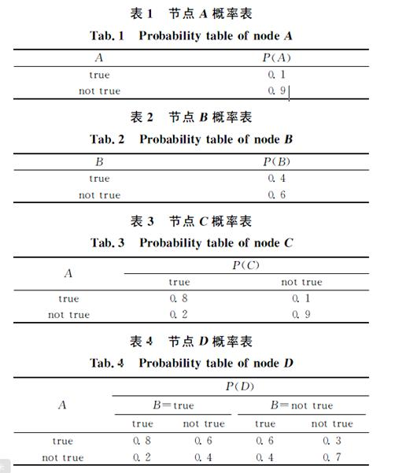
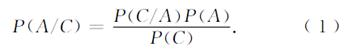
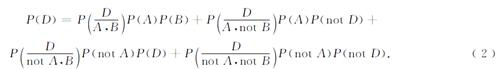

### Deeplearning Algorithms tutorial
谷歌的人工智能位于全球前列，在图像识别、语音识别、无人驾驶等技术上都已经落地。而百度实质意义上扛起了国内的人工智能的大旗，覆盖无人驾驶、智能助手、图像识别等许多层面。苹果业已开始全面拥抱机器学习，新产品进军家庭智能音箱并打造工作站级别Mac。另外，腾讯的深度学习平台Mariana已支持了微信语音识别的语音输入法、语音开放平台、长按语音消息转文本等产品，在微信图像识别中开始应用。全球前十大科技公司全部发力人工智能理论研究和应用的实现，虽然入门艰难，但是一旦入门，高手也就在你的不远处！
AI的开发离不开算法那我们就接下来开始学习算法吧！

#### 贝叶斯网络
贝叶斯网络（Bayesian networks or Bayesnets）也称为因果概率网络（CPNs，Causal Probabilistic Networks）、贝叶斯信念网络（BNS，Bayesian belief Networks）或信念网络，是用来对那些带有不确定性问题的问题域进行建模的系统。

从形式上说，贝叶斯网络是由一组以单向箭头相连的节点以及与每个节点相对应的概率函数所构成的网络。对于离散变量的贝叶斯网络，概率函数便具有了概率表的形式。这个网络必须是一个有向无环图，即其中不存在一条起始和终止于同一节点的通路。用图形的方法描述数据间的相互（因果）关系，语义清晰、可理解性强，有助于利用数据间的因果关系进行诊断、预测、分类等分析。因而贝叶斯方法具有独特的不确定性知识表达形式、丰富的概率表达能力、综合先验知识的增量学习特性等优点。

在贝叶斯网络中，每个节点代表一个有限状态数的离散随机变量，节点之间的单向箭头代表其间的因果关系。如果某个节点不具有父节点（即没有箭头指向它），那么这个节点就具有一个边缘概率表，其中记录了该节点取不同状态值的概率分布；反之，若某节点有父节点（即存在一条或多条有向箭头指向它），则它就拥有一个条件概率表。条件概率表中的每个元素对应该节点在其父节点处于某种状态组合下，其本身状态值的概率分布规律。

贝叶斯网络根据每个节点的概率表，在给定部分（一个或多个）节点状态值的前提下，对其余全部或部分节点的概率分布进行预测的过程即为网络的推理过程。

分析流程:

贝叶斯网络的分析流程通常由三个步骤组成，即(1)网络建立,(2)参数学习或参数设置,(3)网络推理，如图所示.

贝叶斯网络分析流程

其中，具体原理如下：

1)网络建立：为一组具有潜在关系的变量建立确定的因果关系的过程。这个过程需要提供领域专家根据各变量之间客观存在的因果关系以及其自身掌握的专家知识（即经验知识），对节点之间的因果联系给出一个确定的描述。并且保证其对应的图形要满足有向无环图的条件。

2)参数学习或设置：在网络结构建立的基础上，将实际的样本数据提供给网络学习算法，由此统计得到每个变量的状态值及个数，计算每个节点的参数（即概率表，包括边缘概率表和条件概率表）的过程被称为参数的学习过程。而参数设置是指在无法提供具体样本数据的情形下，只提供条件概率信息以设置必要的贝叶斯网络参数的过程。

3)网络推理：经过了网络建立和参数学习（或设置）的贝叶斯网络已经具备了进行推理的能力。针对每一次特定的推理任务，需要指定推理的初始条件，即指定当前已经观察到的变量及其所处的状态，。初始条件可以是多个变量及其状态所构成的集合。然后，贝叶斯网络将根据自身网络参数和推理初始条件进行蒙特卡洛模拟采样，当采样数量达到要求后，由推理算法计算出相应的推理结果。结果中包含每一个目标变量在其各状态值上的概率分布。

#### 算法背景

贝叶斯分类方法是非常成熟的统计分类方法，是基于贝叶斯定理的方法，但是贝叶斯网络十分复杂，当节点、节点的状态以及节点之间的联结增多时概率繁殖的计算变得相当繁重，这限制了贝叶斯网络在实际中的应用。直到20世纪80年代，PEARL提出消息传递算法，随后Lauritzen和Speigelhalter利用消息传递的概念进一步提出了联结树算法，才为贝叶斯网络的概率繁殖提供了一个有效的算法，奠定了进入实用的基础．随后有很多不同的算法被提出，例如Shenoy-Shafer提出二进制融合的概念以确保联结树是二进制，改进提高了运算速度。

#### 算法应用

贝叶斯网络适用于由离散变量构成的数据集合，变量之间满足一定的条件独立关系，且此条件独立关系能够用一个有向无环图来描述。贝叶斯网络可以针对给定的任务实现预测、分类、诊断、聚类、因果分析等数据挖掘的功能。根据初始条件和推理目标的不同，贝叶斯网络的应用类型各不相同。

#### 案例

贝叶斯网络是一种用于描述变量间不确定性因果关系的图形网络模型，由节点、有向连线和节点概率表组成，其中有向连线代表节点间的因果依赖关系．由于网络结构要求节点之间不能形成任何闭环，所以贝叶斯网络模型也被称作有向无环图．下图是一个简单的贝叶斯网络模型，包含４个节点（或称变量），每个节点有2个状态（true or not true）.

表1和表2是2个边界节点Ａ，B的先验概率表，表３和表４是节点C，D的条件概率表．利用这个模型可以推算出给定证据下任何节点的概率，其基本原理是贝叶斯理论．例如，如果知道节点C发生了，即C＝true，要计算节点A的概率，因为节点C 和A相关，相当于计算条件概率:

从表１和表３知道P(A)＝0.1和P(C| A)=0.8,所以上式的分子等于0.08，其分母是边界概率P(C)，由于节点C只和节点A有关系，所以有 P(C)= P(C| A)P(A)+ P(C| notA)×P(notA)＝0.8×0.1＋0.1×0.9＝0.17． 把以上值代入式(1)得到P(A| C)＝0.471．

如果要计算节点D的概率，由于节点D和节点A、B相关，根据边界概率的定义有:

在没有任何证据提供给网络的情况下有初始边界概率为:

P(D)＝0.8×0.1×0.4＋0.6×0.1×0.6＋0.6×0.9×0.4＋0.3×0.9＋0.6＝0.032＋0.036＋0.0216＋0.0162＝0. 446．

同样，考虑节点C发生了的情况，亦即C＝TRUE，知道P(A)从0.1变成0.471，P(notA)也就从0.9变成0.529，将这些值重新代入式(2)，得到修改后的边界概率，即条件概率P(D| C)＝0.542．给网络输入新的证据以更新各个节点的概率，这个过程称为概率繁殖．贝叶斯网络的作用就在于对不确定性系统进行知识表达并利用概率繁殖来对其进行推理．

#### 优点

1.朴素贝叶斯模型发源于古典数学理论，有着坚实的数学基础，以及稳定的分类效率。

2.NBC模型所需估计的参数很少，对缺失数据不太敏感，算法也比较简单。

#### 缺点

1.理论上，NBC模型与其他分类方法相比具有最小的误差率。但是实际上并非总是如此，这是因为NBC模型假设属性之间相互独立，这个假设在实际应用中往往是不成立的（可以考虑用聚类算法先将相关性较大的属性聚类），这给NBC模型的正确分类带来了一定影响。在属性个数比较多或者属性之间相关性较大时，NBC模型的分类效率比不上决策树模型。而在属性相关性较小时，NBC模型的性能最为良好。

2.需要知道先验概率。

3.分类决策存在错误率
