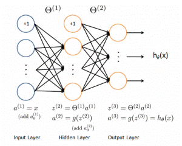
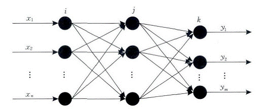

### Leeplearning Algorithms tutorial
谷歌的人工智能位于全球前列，在图像识别、语音识别、无人驾驶等技术上都已经落地。而百度实质意义上扛起了国内的人工智能的大旗，覆盖无人驾驶、智能助手、图像识别等许多层面。苹果业已开始全面拥抱机器学习，新产品进军家庭智能音箱并打造工作站级别Mac。另外，腾讯的深度学习平台Mariana已支持了微信语音识别的语音输入法、语音开放平台、长按语音消息转文本等产品，在微信图像识别中开始应用。全球前十大科技公司全部发力人工智能理论研究和应用的实现，虽然入门艰难，但是一旦入门，高手也就在你的不远处！
AI的开发离不开算法那我们就接下来开始学习算法吧！

#### BP神经网络

人工神经网络 （Artificial Neural Network，ANN）简称神经网络(NN)，是基于生物学中神经网络的基本原理，在理解和抽象了人脑结构和外界刺激响应机制后，以网络拓扑知识为理论基础，模拟人脑的神经系统对复杂信息的处理机制的一种数学模型，根植于神经科学、数学、思维科学、人工智能、统计学、物理学、计算机科学以及工程科学的一门技术，通常用于解决分类和回归问题。具有并行分布的处理能力、高容错性、智能化和自学习等能力的特征，本质上是一个有大量简单元件相互连接而成的复杂网络，具有高度的非线性，能够进行复杂的逻辑操作和非线性关系实现的系统。

神经网络由大量的节点（或称神经元）之间相互联接构成，每个节点代表一种特定的输出函数，称为激活函数（activation function）；每两个节点间的连接都代表一个对于通过该连接信号的加权值，称之为权重（weight），神经网络就是通过这种方式来模拟人类的记忆。网络的输出则取决于网络的结构、网络的连接方式、权重和激活函数。而网络自身通常都是对自然界某种算法或者函数的逼近，也可能是对一种逻辑策略的表达，是对传统逻辑学演算的进一步延伸。

人工神经网络中，神经元处理单元可表示不同的对象，例如特征、字母、概念，或者一些有意义的抽象模式。网络中处理单元的类型分为三类：输入单元、输出单元和隐单元。输入单元接受外部世界的信号与数据；输出单元实现系统处理结果的输出；隐单元是处在输入和输出单元之间，不能由系统外部观察的单元。神经元间的连接权值反映了单元间的连接强度，信息的表示和处理体现在网络处理单元的连接关系中。

#### 算法描述

 反向传播模型也称B-P模型，是一种用于前向多层的反向传播学习算法。之所以称它是一种学习方法，是因为用它可以对组成前向多层网络的各人工神经元之间的连接权值进行不断的修改，从而使该前向多层网络能够将输入它的信息变换成所期望的输出信息。之所以将其称作为反向学习算法，是因为在修改各人工神经元的连接权值时，所依据的是该网络的实际输出与其期望的输出之差，将这一差值反向一层一层的向回传播，来决定连接权值的修改。

B-P算法的网络结构是一个前向多层网络,其基本思想是，学习过程由信号的正向传播与误差的反向传播两个过程组成。正向传播时，输入样本从输入层传入，经隐含层逐层处理后，传向输出层。若输出层的实际输出与期望输出不符，则转向误差的反向传播阶段。误差的反向传播是将输出误差以某种形式通过隐层向输入层逐层反传，并将误差分摊给各层的所有单元，从而获得各层单元的误差信号，此误差信号即作为修正各单元权值的依据。这种信号正向传播与误差反向传播的各层权值调整过程，是周而复始地进行。权值不断调整过程，也就是网络的学习训练过程。此过程一直进行到网络输出的误差减少到可以接受的程度，或进行到预先设定的学习次数为止。

BP网络的拓扑结构包括输入层、隐层和输出层，它能够在事先不知道输入输出具体数学表达式的情况下，通过学习来存储这种复杂的映射关系．其网络中参数的学习通常采用反向传播的策略，借助最速梯度信息来寻找使网络误差最小化的参数组合．常见的3层BP网络模型如图所示

