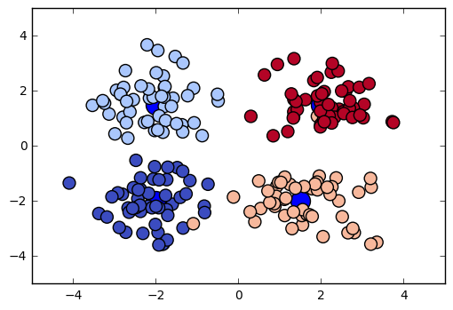
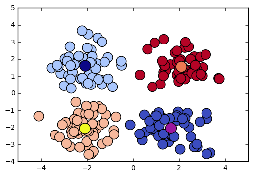

### Deeplearning Algorithms tutorial
谷歌的人工智能位于全球前列，在图像识别、语音识别、无人驾驶等技术上都已经落地。而百度实质意义上扛起了国内的人工智能的大旗，覆盖无人驾驶、智能助手、图像识别等许多层面。苹果业已开始全面拥抱机器学习，新产品进军家庭智能音箱并打造工作站级别Mac。另外，腾讯的深度学习平台Mariana已支持了微信语音识别的语音输入法、语音开放平台、长按语音消息转文本等产品，在微信图像识别中开始应用。全球前十大科技公司全部发力人工智能理论研究和应用的实现，虽然入门艰难，但是一旦入门，高手也就在你的不远处！
AI的开发离不开算法那我们就接下来开始学习算法吧！

#### K-均值(K-Means Algorithm)

k-means算法，也被称为k-平均或k-均值，是一种得到最广泛使用的聚类算法。 它把n个点（可以是样本的一次观察或一个实例）划分到k个聚类中，使得每个点都属于离他最近的均值（此即聚类中心）对应的聚类，以之作为聚类的标准。

k-means算法属于无监督学习方法。此算法以k为参数，把n 个对象分为k个簇，以使簇内具有较高的相似度，而且簇间的相似度较低。相似度的计算根据一个簇中对象的平均值（被看作簇的重心）来进行。此算法首先随机选择k个对象，每个对象代表一个聚类的质心。对于其余的每一个对象，根据该对象与各聚类质心之间的距离，把它分配到与之最相似的聚类中。然后，计算每个聚类的新质心。重复上述过程，直到准则函数收敛。k-means算法是一种较典型的逐点修改迭代的动态聚类算法，其要点是以误差平方和为准则函数。逐点修改类中心：一个象元样本按某一原则，归属于某一组类后，就要重新计算这个组类的均值，并且以新的均值作为凝聚中心点进行下一次象元素聚类；逐批修改类中心：在全部象元样本按某一组的类中心分类之后，再计算修改各类的均值，作为下一次分类的凝聚中心点

聚类相似度是利用各聚类中对象的均值所获得一个“中心对象”（引力中心）来进行计算的。相异度计算方法：欧几里得距离,曼哈顿距离,闵可夫斯基距离,皮尔逊相关系数.

#### 应用示例

输入：簇的数目k和包含n个对象的数据库。 输出：k个簇，使平方误差准则最小。

算法步骤：

* 1.为每个聚类确定一个初始聚类中心，这样就有K 个初始聚类中心。 
* 2.将样本集中的样本按照最小距离原则分配到最邻近聚类
* 3.使用每个聚类中的样本均值作为新的聚类中心。
* 4.重复步骤2.3直到聚类中心不再变化。 
* 5.结束，得到K个聚类

```python
#!/usr/bin/env python
# coding: utf-8
# matplotlib inline
import time
import numpy as np
import tensorflow as tf
import matplotlib.pyplot as plt

from sklearn.datasets.samples_generator import make_blobs
from sklearn.datasets.samples_generator import make_circles

N = 200
K = 4
DATA_TYPE = 'blobs'
MAX_ITERS = 1000
colourindexes = [2, 1, 4, 3]
# k-means不适用于circles数据，2个类足以demo这个问题
if (DATA_TYPE == 'circle'):
    K = 2
    colourindexes = [2, 1]

# 根据聚类中心生成测试数据
centers = [(-2, -2), (-2, 1.5), (1.5, -2), (2, 1.5)]
if (DATA_TYPE == 'circle'):
    data, features = make_circles(
        n_samples=N, shuffle=True, noise=0.01, factor=0.4)
else:
    data, features = make_blobs(n_samples=N, centers=centers,
                                n_features=2, cluster_std=0.8,
                                shuffle=False, random_state=42)
    #fig, ax = plt.subplots()
    #ax.scatter(np.asarray(centers).transpose()[0], np.asarray(
    #    centers).transpose()[1], marker='o', s=250)
    #plt.show()

    fig, ax = plt.subplots()
    ax.scatter(np.asarray(centers).transpose()[0], np.asarray(
        centers).transpose()[1], marker='o', s=250)
    ax.scatter(data.transpose()[0], data.transpose()[
               1], marker='o', s=100, c=features, cmap=plt.cm.coolwarm)
    plt.show()

def bucket_mean(data, bucket_ids, num_buckets):
    total = tf.unsorted_segment_sum(data, bucket_ids, num_buckets)
    count = tf.unsorted_segment_sum(
        tf.ones_like(data), bucket_ids, num_buckets)
    return total / count

start = time.time()
points = tf.Variable(data)
cluster_assignments = tf.Variable(tf.zeros([N], dtype=tf.int64))
centroids = tf.Variable(tf.slice(points.initialized_value(), [0, 0], [K, 2]))

rep_centroids = tf.reshape(tf.tile(centroids, [N, 1]), [N, K, 2])
rep_points = tf.reshape(tf.tile(points, [1, K]), [N, K, 2])
sum_squares = tf.reduce_sum(tf.square(rep_points - rep_centroids),
                            reduction_indices=2)
best_centroids = tf.argmin(sum_squares, 1)
did_assignments_change = tf.reduce_any(
    tf.not_equal(best_centroids, cluster_assignments))
means = bucket_mean(points, best_centroids, K)

with tf.control_dependencies([did_assignments_change]):
    do_updates = tf.group(
        centroids.assign(means),
        cluster_assignments.assign(best_centroids))

changed = True
iters = 0

sess = tf.Session()
sess.run(tf.initialize_all_variables())
while changed and iters < MAX_ITERS:
    iters += 1
    [changed, _] = sess.run([did_assignments_change, do_updates])
    [centers, assignments] = sess.run([centroids, cluster_assignments])
    fig, ax = plt.subplots()
    ax.scatter(sess.run(points).transpose()[0], sess.run(points).transpose()[
               1], marker='o', s=200, c=assignments, cmap=plt.cm.coolwarm)
    ax.scatter(centers[:, 0], centers[:, 1], marker='^',
               s=550, c=colourindexes, cmap=plt.cm.plasma)
    ax.set_title('Iteration ' + str(iters))
    # plt.savefig("kmeans" + str(iters) + ".png")
    plt.show()

fig, ax = plt.subplots()
ax.scatter(sess.run(points).transpose()[0], sess.run(points).transpose()[
           1], marker='o', s=200, c=assignments, cmap=plt.cm.coolwarm)
ax.scatter(np.asarray(centers).transpose()[0], np.asarray(
        centers).transpose()[1], marker='o', s=250, c=colourindexes, cmap=plt.cm.plasma)
plt.show()


end = time.time()
print ("Found in %.2f seconds" % (end - start)), iters, "iterations"
print "Centroids:", centers
print "Cluster assignments:", assignments
```
<p align="center">

</p>

<p align="center">

</p>

```python
Found in 2.15 seconds 8 iterations
Centroids: [[ 1.65289262 -2.04643427]
 [-2.0763623   1.61204964]
 [-2.08862822 -2.07255306]
 [ 2.09831502  1.55936014]]
Cluster assignments: [2 2 2 2 2 2 2 2 2 2 2 2 2 2 2 2 2 2 2 2 2 2 2 2 2 2 2 2 2 2 2 2 2 2 2 2 2
 2 2 2 2 2 2 2 2 2 2 2 2 2 1 1 1 1 1 1 1 1 1 1 1 1 1 1 1 1 1 1 1 1 1 1 1 1
 1 1 1 1 1 1 1 1 1 1 1 1 1 1 1 1 1 1 1 1 1 1 1 1 1 1 0 0 0 0 3 0 0 0 0 0 0
 0 0 0 0 0 0 0 0 0 0 0 0 0 0 0 0 0 0 0 0 2 0 0 0 0 0 0 0 0 0 0 0 0 0 0 0 0
 0 0 3 3 3 3 3 3 3 3 3 3 3 3 3 3 3 3 3 3 3 3 3 3 3 3 3 3 3 3 3 3 3 3 3 3 3
 3 3 3 3 3 3 3 3 3 3 3 3 3 3 3]
```

#### 优点

* 简单、快速，可并行计算
* 已经获得防范的应用

#### 缺点

* 必须事先给出k（要生成的簇的数目），而且对初值敏感，对于不同的初始值，可能会导致不同结果。
* 对于“躁声”和孤立点数据是敏感的，少量的该类数据能够对平均值产生极大的影响。
