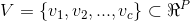
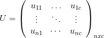

### Deeplearning Algorithms tutorial
谷歌的人工智能位于全球前列，在图像识别、语音识别、无人驾驶等技术上都已经落地。而百度实质意义上扛起了国内的人工智能的大旗，覆盖无人驾驶、智能助手、图像识别等许多层面。苹果业已开始全面拥抱机器学习，新产品进军家庭智能音箱并打造工作站级别Mac。另外，腾讯的深度学习平台Mariana已支持了微信语音识别的语音输入法、语音开放平台、长按语音消息转文本等产品，在微信图像识别中开始应用。全球前十大科技公司全部发力人工智能理论研究和应用的实现，虽然入门艰难，但是一旦入门，高手也就在你的不远处！
AI的开发离不开算法那我们就接下来开始学习算法吧！

#### 模糊c-均值聚类算法(Fuzzy C-means Algorithm)
模糊c-均值聚类算法,是一种基于目标函数的模糊聚类算法，主要用于数据的聚类分析。理论成熟，应用广泛，是一种优秀的聚类算法。
模糊c-均值聚类算法输入就是一个待聚类的数据集，每一个数据都有p个特征。它的输出是一个c行n列的矩阵U，c刚才提到是聚类数目，n是数据集中元素的个数，用这个矩阵就可以表示分类的结果，因为你看某一列，表示的就是这个元素对各个类的隶属程度，哪一个值最大，就说这个元素属于哪一类。

还有一个输出是各个类的聚类中心向量集合V，一共有c个元素。每个元素也是有p维的。
<p align="center">

</p>

<p align="center">

</p>

<p align="center">

</p>


#### 应用示例

```python
typedef struct{
    double x;
    double y;
} Position;


//len:节点数量
//range：节点x、y值的范围
Position *randomPosition(int len, int range){
    srand((unsigned)time(NULL));
    Position *allPos = (Position *)malloc(len * sizeof(Position));

    short a = 1; 
    for (int i = 0; i < len; ++i)
    {
        if (a)
        {
            allPos[i].x = (double)rand() / 2147483647 * range;
            allPos[i].y = (double)rand() / 2147483647 * range;
            a = 0;
        }
        else if (!a)
        {
            allPos[i].x = (double)rand() / 2147483647 * range+50;
            allPos[i].y = (double)rand() / 2147483647 * range+50;
            a = 1;
        }
    }
    return allPos;
}

//posNum：节点数量
//clusterNum：聚类中心数量
double **init(int posNum, int clusterNum){
    double **u = (double **)malloc(sizeof(double *) * clusterNum);
    for (int i = 0; i <clusterNum; ++i)
    {
        u[i] = (double *)malloc(sizeof(double) * posNum);
    }
    srand((unsigned)time(NULL));
    double sum;
    //初始化u：sigmaU[i]=1
    for (int i = 0; i < posNum; ++i)
    {
        sum=1;
        for (int x = 0; x < clusterNum - 1; ++x)
        {
            u[x][i] = ((double)rand() / 2147483647) * sum;
            sum -= u[x][i];
            printf("u[%d][%d]:%f ",x,i,u[x][i]);
        }
        u[clusterNum-1][i]=sum;
        printf("u[%d][%d]:%f\n",clusterNum-1,i,u[clusterNum-1][i]);
    }
    return u;
}

//allPos：节点数组
//len：节点数量
void outputPos(Position *allPos, int len){

    for (int i = 0; i < len; ++i)
        printf("position %d:(%f,%f)\n", i, allPos[i].x, allPos[i].y);
    return;
}


//u：隶属度矩阵
//posNum：节点数量
//i:第i个聚类中心
//m：隶属度因子
double sumUi(double** u,int posNum,int i,int m){
    double res=0;
    for(int x=0;x<posNum;++x)
        res+=pow(u[i][x],m);
    return res;
}

//u：隶属度矩阵
//allPos:节点数组
//posNum：节点数量
//i:第i个聚类中心
//m：隶属度因子
double sumXi(double** u,Position* allPos,int posNum,int i,int m){
    double res=0;
    for(int x=0;x<posNum;++x)
        res+=allPos[x].x*pow(u[i][x],m);
    return res;
}

//u：隶属度矩阵
//posNum：节点数量
//i:第i个聚类中心
//m：隶属度因子
double sumYi(double** u,Position* allPos,int posNum,int i,int m){
    double res=0;
    for(int x=0;x<posNum;++x)
        res+=allPos[x].y*pow(u[i][x],m);
    return res;
}

//pos:第j个节点
//cluster:聚类中心数组
//clusterNum：聚类中心数量
//m：隶属度因子
double sumDis(Position pos,Position* cluster,int clusterNum,int m){
    double res=0;
    for(int i=0;i<clusterNum;++i)
        res+=(double)1/pow(pow(pos.x-cluster[i].x,2)+pow(pos.y-cluster[i].y,2),(double)1/(m-1));
    return res;
}

//allPos:节点数组
//cluster:聚类中心数组
//u：隶属度矩阵
//posNum：节点数量
//clusterNum：聚类中心数量
//m：隶属度因子
void updateCluster(Position* allPos,Position* cluster,double** u,int posNum,int clusterNum,int m){
    for(int i=0;i<clusterNum;++i){
        cluster[i].x=sumXi(u,allPos,posNum,i,m)/sumUi(u,posNum,i,m);
        cluster[i].y=sumYi(u,allPos,posNum,i,m)/sumUi(u,posNum,i,m);
    }
}

//allPos:节点数组
//cluster:聚类中心数组
//u：隶属度矩阵
//posNum：节点数量
//clusterNum：聚类中心数量
//m：隶属度因子
void updateU(Position* allPos,Position* cluster,double** u,int posNum,int clusterNum,int m){
    double disXI;
    for(int i=0;i<clusterNum;++i)
    for(int x=0;x<posNum;++x){
        disXI=pow(pow(allPos[x].x-cluster[i].x,2)+pow(allPos[x].y-cluster[i].y,2),(double)1/(m-1));
        u[i][x]=(double)1/(disXI*sumDis(allPos[x],cluster,clusterNum,m));
    }
}

//allPos:节点数组
//cluster:聚类中心数组
//u：隶属度矩阵
//posNum：节点数量
//clusterNum：聚类中心数量
//m：隶属度因子
void outpuCost_fun(Position* allPos,Position* cluster,double** u,int posNum,int clusterNum,int m){
    double res=0;
    for(int i=0;i<clusterNum;++i)
    for(int x=0;x<posNum;++x)
        res+=(pow(u[i][x],m)*(pow(allPos[x].x-cluster[i].x,2)+pow(allPos[x].y-cluster[i].y,2)));
    printf("costFun:%f\n",res);
}

void outputU(double** u,int posNum,int clusterNum){
    for(int i=0;i<posNum;++i){
        for(int x=0;x<clusterNum;++x)
            printf("u[%d][%d]:%f ",x,i,u[x][i]);
        printf("\n");
    }
}
void fuzzy_Cmeans(int posNum,int clusterNum, int m, int iterTime,int range)
{
    Position* allPos=randomPosition(posNum,range);
    Position* cluster=(Position*)malloc(sizeof(Position)*clusterNum);
    double** u=init(posNum,clusterNum);
    for (int i = 0; i < iterTime; ++i)
    {   
        updateCluster(allPos,cluster,u,posNum,clusterNum,m);
        updateU(allPos,cluster,u,posNum,clusterNum,m);
        outpuCost_fun(allPos,cluster,u,posNum,clusterNum,m);
        //outputU(u,posNum,clusterNum);
    }
}
int main(){
    fuzzy_Cmeans(100,10,3,500,500);
    return 0;
}
```
