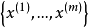
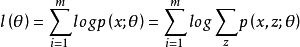
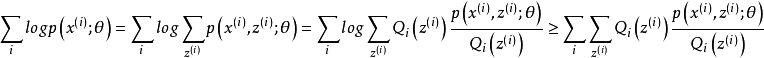
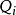
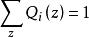
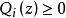
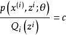
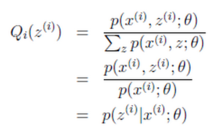
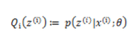
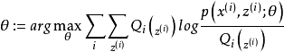

### Deeplearning Algorithms tutorial
谷歌的人工智能位于全球前列，在图像识别、语音识别、无人驾驶等技术上都已经落地。而百度实质意义上扛起了国内的人工智能的大旗，覆盖无人驾驶、智能助手、图像识别等许多层面。苹果业已开始全面拥抱机器学习，新产品进军家庭智能音箱并打造工作站级别Mac。另外，腾讯的深度学习平台Mariana已支持了微信语音识别的语音输入法、语音开放平台、长按语音消息转文本等产品，在微信图像识别中开始应用。全球前十大科技公司全部发力人工智能理论研究和应用的实现，虽然入门艰难，但是一旦入门，高手也就在你的不远处！
AI的开发离不开算法那我们就接下来开始学习算法吧！

#### 期望最大化(Expectation-Maximization)
期望最大化（Expectation-maximization）算法是由Dempster等人1977年提出的统计模型参数估计的一种算法。它采用的迭代交替搜索方式可以简单有效的求解最大似然函数估计问题。已知的概率模型内部存在隐含的变量，导致了不能直接用极大似然法来估计参数，期望最大化（Expectation-maximization）就是通过迭代逼近的方式用实际的值带入求解模型内部参数的算法。它在当代的工业、商业和科学研究领域发挥了重要的作用。

期望最大化算法是一种启发式的迭代算法，是一种从“不完全数据”中求极大似然的方法。在人工智能、机器学习、数理统计、模式识别等许多应用都需要进行模型的参数估计，极大似然估计和极大后验似然估计是必要进行的。然而在理想的可观察变量模型中，即变量分布式均匀的时候，做出以上两个估计是显然可以的。但是实际的情况往往不是这样，某些变量并不是可以观察的，对这类模型进行极大似然估计就比较复杂了。期望最大化算法是解决对于不可观察变量进行似然估计的一种方法。
期望最大化算法的提出主要是用来计算后验分布的众数或极大似然估计。然而，近年来它引起了统计学家的极大兴趣，在统计领域得到了广泛的应用。该方法广泛的应用于缺损数据、截尾数据、成群数据、带有复杂参数的数据等不完整数据。期望最大化算法流行的原因，一是在于它的理论简单化和一般性，二是许多应用都能够纳入到期望最大化算法的范畴，期望最大化算法已经成为统计学上的一个标准工具。
EM算法还是许多非监督聚类算法的基础（如Cheeseman et al. 1988），而且它是用于学习部分可观察马尔可夫模型（Partially Observable Markov Model）的广泛使用的Baum-Welch前向后向算法的基础。

给定的训练样本是，样例间独立，我们想找到每个样例隐含的类别z，能使得p(x,z)最大。p(x,z)的最大似然估计如下：

由jensen不等式可得：

对于每一个样例i，让表示该样例隐含变量z的某种分布，满足的条件是，。由此，可以确定式子的下界，然后不断的提高此下界达到逼近最后真实值的目的值，这个不等式变成等式为止，然后再依据jensen不等式，当不等式变为等式的时候，当且仅当，也就是说X是常量，推出就是下面的公式：

由于Q是随机变量z的概率密度函数，因此，可以得到：分子的和等于c（分子分母都对所有z求和：多个等式分子分母相加不变，这个认为每个样例的两个概率比值都是c）。

由此可得出EM算法的一般过程：循环重复E步骤和M步骤直到收敛。
E步骤：对于每一个i，计算：

M步骤计算:

