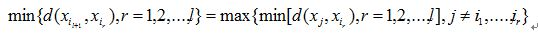
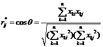
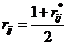
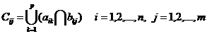
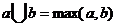
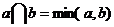

### Deeplearning Algorithms tutorial
谷歌的人工智能位于全球前列，在图像识别、语音识别、无人驾驶等技术上都已经落地。而百度实质意义上扛起了国内的人工智能的大旗，覆盖无人驾驶、智能助手、图像识别等许多层面。苹果业已开始全面拥抱机器学习，新产品进军家庭智能音箱并打造工作站级别Mac。另外，腾讯的深度学习平台Mariana已支持了微信语音识别的语音输入法、语音开放平台、长按语音消息转文本等产品，在微信图像识别中开始应用。全球前十大科技公司全部发力人工智能理论研究和应用的实现，虽然入门艰难，但是一旦入门，高手也就在你的不远处！
AI的开发离不开算法那我们就接下来开始学习算法吧！

机器学习是一门多领域交叉学科，涉及概率论、统计学、逼近论、凸分析、算法复杂度理论等多门学科。主要研究计算机怎样模拟或实现人类的学习行为，以获取新的知识和技能，重新组织已有的知识结构，不断的改善自身的性能。

机器学习理论主要是设计和分析一些让计算机可以自动“学习”的算法。这些算法是一类能从数据中自动分析获得规律，并利用规律对未知数据进行预测的算法。简而言之，机器学习主要以数据为基础，通过大数据本身，运用计算机自我学习来寻找数据本身的规律，而这是机器学习与统计分析的基本区别。

机器学习主要有三种方式：监督学习，无监督学习与半监督学习。

(1)监督学习：从给定的训练数据集中学习出一个函数，当新的数据输入时，可以根据函数预测相应的结果。监督学习的训练集要求是包括输入和输出，也就是特征和目标。训练集中的目标是有标注的。如今机器学习已固有的监督学习算法有可以进行分类的，例如贝叶斯分类，SVM，ID3，C4.5以及分类决策树，以及现在最火热的人工神经网络，例如BP神经网络，RBF神经网络，Hopfield神经网络、深度信念网络和卷积神经网络等。人工神经网络是模拟人大脑的思考方式来进行分析，在人工神经网络中有显层，隐层以及输出层，而每一层都会有神经元，神经元的状态或开启或关闭，这取决于大数据。同样监督机器学习算法也可以作回归，最常用便是逻辑回归。

(2)无监督学习：与有监督学习相比，无监督学习的训练集的类标号是未知的，并且要学习的类的个数或集合可能事先不知道。常见的无监督学习算法包括聚类和关联，例如K均值法、Apriori算法。

(3)半监督学习：介于监督学习和无监督学习之间,例如EM算法。

如今的机器学习领域主要的研究工作在三个方面进行：1）面向任务的研究，研究和分析改进一组预定任务的执行性能的学习系统；2）认知模型，研究人类学习过程并进行计算模拟；3）理论的分析，从理论的层面探索可能的算法和独立的应用领域算法。

#### 聚类分析

聚类分析（Cluster analysis，亦称为群集分析）是对于统计数据分析的一门技术，在许多领域受到广泛应用，包括机器学习，数据挖掘，模式识别，图像分析以及生物信息。聚类是把相似的对象通过静态分类的方法分成不同的组别或者更多的子集（subset），这样让在同一个子集中的成员对象都有相似的一些属性，常见的包括在坐标系中更短的空间距离等。

一般把数据聚类归纳为一种非监督学习。

数据聚类算法可以分为结构性或者分散性。结构性算法利用以前成功使用过的聚类器进行分类，而分散型算法则是一次确定所有分类。结构性算法可以从上至下或者从下至上双向进行计算。从下至上算法从每个对象作为单独分类开始，不断融合其中相近的对象。而从上至下算法则是把所有对象作为一个整体分类，然后逐渐分小。

分割式聚类算法，是一次性确定要产生的类别，这种算法也已应用于从下至上聚类算法。

基于密度的聚类算法，是为了挖掘有任意形状特性的类别而发明的。此算法把一个类别视为数据集中大于某阈值的一个区域。DBSCAN和OPTICS是两个典型的算法。

许多聚类算法在执行之前，需要指定从输入数据集中产生的分类个数。除非事先准备好一个合适的值，否则必须决定一个大概值，关于这个问题已经有一些现成的技术。

在已经得到距离值之后，元素间可以被联系起来。通过分离和融合可以构建一个结构。传统上，表示的方法是树形数据结构， 然后对该结构进行修剪。树的根节点表示一个包含所有项目的类别，树叶表示与个别的项目相关的类别。

层次聚类算法，要么是自下向上聚集型的，即从叶子节点开始，最终汇聚到根节点；要么是自顶向下分裂型的，即从根节点开始，递归的向下分裂。

任意非负值的函数都可以用于衡量一对观测值之间的相似度。决定一个类别是否分裂或者合并的是一个连动的标准，它是两两观测值之间距离的函数。

在一个指定高度上切割此树，可以得到一个相应精度的分类。

主要可分为：划分方法（partitioning method），层次方法(hierarchical method)，基于密度的方法(density-basedmethod)，基于网格的方法(grid-based method)，和基于模型的方法(model-based method)。

* 分层聚类算法原理

开始时将N个观测量（变量）视为N类；规定相似性统计量的测度，并计算相似系数矩阵；

找出最大相似系数的观测量（变量）组：Sij为类Gi与类Gj的相似系数，S为相似系数矩阵或不相似系数矩阵，若S为相似系数矩阵，则依据Spq最小者挑选Gp与Gq (p>q)，若S为不相似系数（距离）矩阵，则依据Spq最大者挑选Gp与Gq进行聚类，即将Gp与Gq合并成一个新类Gt（t=q）；

计算新类Gt与当前各类的相似性系数，更新相似系数矩阵S：将得到的新的系数代换与q相关的行与列，删除与p有关的行与列；

重复过程：寻找最大相似系数观测变量组和计算相似系数矩阵，直至聚为一类；

一共有六种分层聚类的方法，五种距离尺度标准。如：明考斯基距离、马氏距离、匹配距离等。

* 快速聚类算法原理

快速聚类以距离衡量样本间的亲疏程度，但其最终结果不是聚成一类，而是根据各聚类中心，将所有样本点聚成指定的类数。

首先设置K个聚类的初始类中心点，计算所有样本点到K个类中心点的距离，按照距离最短的原则，将所有样本分派到各中心点所在的类中，形成一个新的K类，完成一次迭代过程。在下一次迭代过程中，重新计算K个类的类中心点，重复上述过程，直到达到指定的迭代次数或达到终止迭代的判断要求为止。

其中K个聚类初始中心点的选取有以下方法：

1.可以选取前K个观测变量值为初始中心点；

2.最小最大原则：先选择所有样本数据中距离最远的两个值；并且选择第三个值，使得与前两个聚点的距离最小者等于所有其余数据的较小距离中最大的，依次按这个原则选取，直到最终确定K个中心点；用公式可以表示为：

3.模糊聚类算法原理

糊聚类算法根据研究对象本身的属性来构造模糊矩阵，在此基础上根据一定的隶属度来确定其分类系。系统的模糊聚类分析功能根据专家对研究对象的各指标进行打分得出原始数据。通过对原始数据进行变换、计算模糊相似矩阵、利用传递闭包法建立模糊等价矩阵，并根据给定不同的置信水平，求截阵等一系列过程对研究对象进行聚类得出模糊相似阵、分类关系阵和分类关系表。模糊聚类的具体算法过程如下：

a.对原始数据进行变换。变换方法通常有标准化变换、极差变换、对数变换等。
b.计算模糊相似矩阵。选取在[-1，1]区间中的普通相似系数rij*=cosθ构成相似系数矩阵

在此基础上做如下变换：

使得rij*被压缩到[0,1]区间内，R=rij构成了一个模糊矩阵。

c.建立模糊等价矩阵。对模糊矩阵进行褶积计算: R→R2→R3→…→Rn,经过有限次褶积后使得Rn。R=Rn,由此得到模糊分类关系Rn。模糊褶积的运算法则：设A和B是n×p和p×m的模糊矩阵，则乘积C=A*B为n×m阵，其元素为：

符号和的含义是：

d.进行聚类。给定不同的置信水平λ，求Rλ截阵，找出R的λ显示，得到普通的分类关系Rλ。当λ=1时，每个样品自成一类，随λ值的降低，由细到粗逐渐并类。

4..基于密度的聚类
为了发现任意形状的聚类结果，提出了基于密度的聚类方法。这类方法将簇看作是数据空间中由低密度区域分割开的高密度对象区域。

DBSCAN(Density-Based Spatial Clustering of Applications with Noise)是一个基于密度的聚类算法。该算法将具有足够高密度的区域划分为簇，并可以在带有“噪音”的空间数据库中发现任意形状的聚类。它定义簇为密度相连的点的最大集合。基于密度的聚类的基本想法涉及一些新的定义。

n 一个给定对象周围半径ε内的区域称为该对象的ε-邻域。

n 如果一个对象的ε-邻域至少包含最小数目MinPts 的对象，那么该对象称为核心对象。

n 给定一个对象集合D，如果p是在q 的ε–邻域内，而q是一个核心对象，我们说对象p从对象q出发是直接密度可达的。

n 如果存在一个对象链p1,p2,…,pn，p1=q，pn=p，对pi∈ D，1≤i≤n，pi+1 是从pi关于ε和 MinPts直接密度可达的，则对象p是从对象q关于ε和MinPts 密度可达的(density-reachable)。

n 如果对象集合D中存在一个对象o，使得对象p和q是从o关于ε和MinPts 密度可达的，那么对象p和q是关于ε和MinPts 密度相连的（density-connected）。

DBSCAN 通过检查数据库中每个点的ε-邻域来寻找聚类。如果一个点p的ε-邻域包含多于MinPts个点，则创建一个以p作为核心对象的新簇。DBSCAN 然后反复地寻找从这些核心对象直接密度可达的对象，这个过程可能涉及几个密度可达簇的合并。当没有新的点可以被添加到任何簇时，该过程结束。

#### 应用领域
在商业上，聚类能帮助市场分析人员从客户基本库中发现不同的客户群，并且用购买模式来刻画不同的客户群的特征。在生物学上，聚类能用于推导植物和动物的分类，对基因进行分类，获得对种群中固有结构的认识。聚类在地球观测数据库中相似地区的确定，汽车保险持有者的分组，及根据房子的类型，价值，和地理位置对一个城市中房屋的分组上也可以发挥作用。聚类也能用于对Web 上的文档进行分类，以发现信息。作为一个数据挖掘的功能，聚类分析能作为一个独立的工具来获得数据分布的情况，观察每个簇的特点，集中对特定的某些簇作进一步的分析。此外，聚类分析可以作为其他算法（如分类等）的预处理步骤，这些算法再在生成的簇上进行处理。

#### 优缺点

优点：

聚类分析模型的优点就是直观，结论形式简明

缺点：

1. 收敛太慢

2. 算法复杂度高

3. 不能发现非凸形状的簇，或大小差别很大的簇

4. 需样本存在均值（限定数据种类）

5. 需先确定聚类中心点的个数

6. 对噪声和离群点敏感

7. 最重要是结果不一定是全局最优，只能保证局部最优

不同的聚类方法，也有一定的差异性，但总体表现为：K均值稳定，谱聚类效果好， 层次聚类快。
