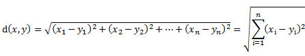
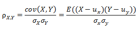

### Deeplearning Algorithms tutorial
谷歌的人工智能位于全球前列，在图像识别、语音识别、无人驾驶等技术上都已经落地。而百度实质意义上扛起了国内的人工智能的大旗，覆盖无人驾驶、智能助手、图像识别等许多层面。苹果业已开始全面拥抱机器学习，新产品进军家庭智能音箱并打造工作站级别Mac。另外，腾讯的深度学习平台Mariana已支持了微信语音识别的语音输入法、语音开放平台、长按语音消息转文本等产品，在微信图像识别中开始应用。全球前十大科技公司全部发力人工智能理论研究和应用的实现，虽然入门艰难，但是一旦入门，高手也就在你的不远处！
机器学习是一门多领域交叉学科，涉及概率论、统计学、逼近论、凸分析、算法复杂度理论等多门学科。主要研究计算机怎样模拟或实现人类的学习行为，以获取新的知识和技能，重新组织已有的知识结构，不断的改善自身的性能。

机器学习理论主要是设计和分析一些让计算机可以自动“学习”的算法。这些算法是一类能从数据中自动分析获得规律，并利用规律对未知数据进行预测的算法。简而言之，机器学习主要以数据为基础，通过大数据本身，运用计算机自我学习来寻找数据本身的规律，而这是机器学习与统计分析的基本区别。
#### 协同过滤
协同过滤算法的主要功能是预测和推荐。协同过滤推荐算法分为两类，分别是基于用户的协同过滤算法(user-based CF)，和基于物品的协同过滤算法(item-based CF)。

协同过滤作为一种经典的推荐算法种类，在工业界应用广泛，它的优点很多，模型通用性强，不需要太多对应数据领域的专业知识，工程实现简单，效果也不错。这些都是它流行的原因。

基于用户的协同过滤算法是通过用户的历史行为数据发现用户对物品喜爱程度，并对这些喜好进行度量打分。通过不同用户对商品态度和偏好程度计算用户之间的关系，对有相同喜好的用户间进行商品推荐。

基于物品的协同过滤算法是通过计算不同用户对不同物品的评分获得物品间的相关关系。基于物品间的相关性对用户进行相似物品的推荐。

相似性度量标准：常用的相似性度量标准采用欧几里德距离和皮尔逊相关系数。

欧几里德距离：

皮尔逊相关系数：

#### 相关应用
协同过滤算法的主要功能是预测和推荐。经常被用来分辨某位特定顾客可能感兴趣的东西，并给他推荐相应的产品，而这些结论主要来自于对其他相似顾客对哪些产品感兴趣的分析。协同过滤以其出色的速度和健壮性，广泛应用于互联网等领域。

#### 优缺点
优点：能够过滤基于内容的机器难以进行分析的信息；能对一些复杂、难以表达的概念进行过滤；推荐的新颖性。

缺点：存在稀疏性问题，如用户对商品的评价特别少，使得基于用户评价的用户间相似性计算可能不够准确；随着用户和商品的增多，系统的性能会越来越低；存在最初评价问题，即没有用户对某一商品加以评价，则这个商品便不能被推荐。
