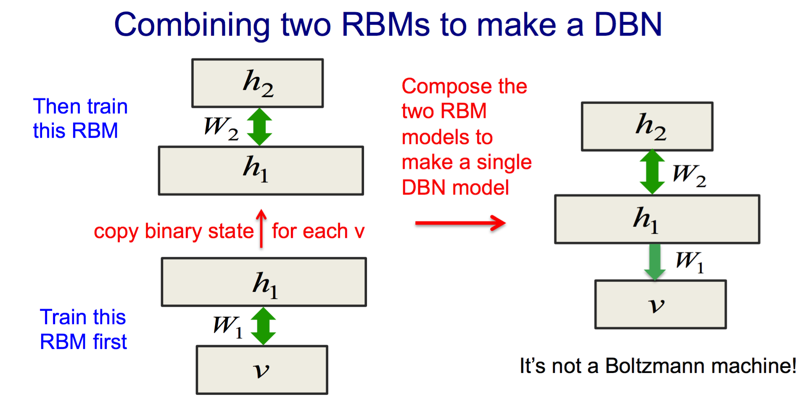

### Deeplearning Algorithms tutorial
谷歌的人工智能位于全球前列，在图像识别、语音识别、无人驾驶等技术上都已经落地。而百度实质意义上扛起了国内的人工智能的大旗，覆盖无人驾驶、智能助手、图像识别等许多层面。苹果业已开始全面拥抱机器学习，新产品进军家庭智能音箱并打造工作站级别Mac。另外，腾讯的深度学习平台Mariana已支持了微信语音识别的语音输入法、语音开放平台、长按语音消息转文本等产品，在微信图像识别中开始应用。全球前十大科技公司全部发力人工智能理论研究和应用的实现，虽然入门艰难，但是一旦入门，高手也就在你的不远处！
AI的开发离不开算法那我们就接下来开始学习算法吧！

#### 深度信念网络(Deep Belief Machines)
深度信念网络 (Deep Belief Network, DBN) 由 Geoffrey Hinton 在 2006 年提出。它是一种生成模型，通过训练其神经元间的权重，我们可以让整个神经网络按照最大概率来生成训练数据。我们不仅可以使用 DBN 识别特征、分类数据，还可以用它来生成数据。
深度信念网络(Deep Belief Network, DBN)由多层神经元构成，这些神经元又分为显性神经元和隐性神经元（以下简称显元和隐元）。显元用于接受输入，隐元用于提取特征。因此隐元也有个别名，叫特征检测器 (feature detectors)。最顶上的两层间的连接是无向的，组成联合内存 (associative memory)。较低的其他层之间有连接上下的有向连接。最底层代表了数据向量 (data vectors)，每一个神经元代表数据向量的一维。 

深度信念网络(Deep Belief Network, DBN)组成元件是受限玻尔兹曼机 (Restricted Boltzmann Machines, RBM)。训练 DBN 的过程是一层一层地进行的。在每一层中，用数据向量来推断隐层，再把这一隐层当作下一层 (高一层) 的数据向量。

如上图所示用两个限制玻尔兹曼机堆叠起来，构成深度信念网络(Deep Belief Nets, 简称DBN)。

* 利用输入，生成第一个限制玻尔兹曼机，得到输入的特征。
* 利用上面得到的输入的特征，生成每二个限制玻尔兹曼机，得到特征的特征。
* 依次循环，可以得到多个限制玻尔兹曼机。
* 把得到次序到多个限制玻尔兹曼机堆叠起来，构成一个DBN。
* 以上是一种贪婪的训练堆叠方式，对网络的预训练非常好。 

这样得到的效果跟autoencoder的堆叠一致。

wake-sleep算法：在分类问题中，DBN的最底层可以是已知的label层，如下图:

上图是MNIST数字识别的一个任务，输入是28*28的图片，输出是0到9的数字。

在经过上面提到的贪婪地堆叠训练后，再加上一层label层进行训练。然后再利用wake-sleep算法进行调优:
* wake: 认知过程，通过外界的特征和向上的权重 (认知权重) 产生每一层的抽象表示 (结点状态) ，并且使用梯度下降修改层间的下行权重 (生成权重) 。自底向上，进行训练
* sleep: 生成过程，通过顶层表示 (醒时学得的概念) 和向下权重，生成底层的状态，同时修改层间向上的权重。自项向下，进行训练

在上面的训练完成后，如果对最上的两层进行随机的Gibbs采样，然后再逐渐从顶到底，生成的图像就是0到9中的一个图像。 
感觉这个跟人回忆、画画、做梦的过程非常像。

