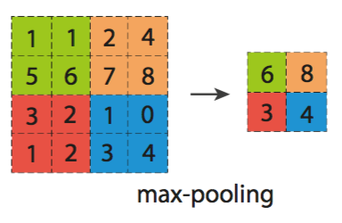

### Deeplearning Algorithms tutorial
谷歌的人工智能位于全球前列，在图像识别、语音识别、无人驾驶等技术上都已经落地。而百度实质意义上扛起了国内的人工智能的大旗，覆盖无人驾驶、智能助手、图像识别等许多层面。苹果业已开始全面拥抱机器学习，新产品进军家庭智能音箱并打造工作站级别Mac。另外，腾讯的深度学习平台Mariana已支持了微信语音识别的语音输入法、语音开放平台、长按语音消息转文本等产品，在微信图像识别中开始应用。全球前十大科技公司全部发力人工智能理论研究和应用的实现，虽然入门艰难，但是一旦入门，高手也就在你的不远处！
AI的开发离不开算法那我们就接下来开始学习算法吧！

#### 深度卷积神经网络(Deep Convolutional Neural Networks)

深度卷积神经网络（DCNN）在特征识别相关任务中取得的效果，远比传统方法好。因此，DCNN常用于图像识别、语音识别等。但是，因为深度卷积神经网络结构庞大，一般都会包含几十个神经层，每一层，又有数百至数千个神经元；同时，DCNN任意两层之间神经元的相互影响错综复杂。这两个主要的因素，导致DCNN难以理解、分析。为此，用户很难从失败或成功的例子中学习到如何设计一个好的卷积神经网络。因此，设计一个效果好的神经网络，往往需要依靠大量的尝试。

而卷积神经网络（Convolutional Neural Network,CNN）是一种前馈神经网络，它的人工神经元可以响应一部分覆盖范围内的周围单元，对于大型图像处理有出色表现。 它包括卷积层(convolutional layer)和池化层(pooling layer)。

卷积神经网络是近年发展起来，并引起广泛重视的一种高效识别方法。20世纪60年代，Hubel和Wiesel在研究猫脑皮层中用于局部敏感和方向选择的神经元时发现其独特的网络结构可以有效地降低反馈神经网络的复杂性，继而提出了卷积神经网络（Convolutional Neural Networks-简称CNN）。现在，CNN已经成为众多科学领域的研究热点之一，特别是在模式分类领域，由于该网络避免了对图像的复杂前期预处理，可以直接输入原始图像，因而得到了更为广泛的应用。 K.Fukushima在1980年提出的新识别机是卷积神经网络的第一个实现网络。随后，更多的科研工作者对该网络进行了改进。其中，具有代表性的研究成果是Alexander和Taylor提出的“改进认知机”，该方法综合了各种改进方法的优点并避免了耗时的误差反向传播。

卷积神经网络的基本结构包括两层，其一为特征提取层，每个神经元的输入与前一层的局部接受域相连，并提取该局部的特征。一旦该局部特征被提取后，它与其它特征间的位置关系也随之确定下来；其二是特征映射层，网络的每个计算层由多个特征映射组成，每个特征映射是一个平面，平面上所有神经元的权值相等。特征映射结构采用影响函数核小的sigmoid函数作为卷积网络的激活函数，使得特征映射具有位移不变性。此外，由于一个映射面上的神经元共享权值，因而减少了网络自由参数的个数。卷积神经网络中的每一个卷积层都紧跟着一个用来求局部平均与二次提取的计算层，这种特有的两次特征提取结构减小了特征分辨率。

卷积神经网络主要用来识别位移、缩放及其他形式扭曲不变性的二维图形。由于CNN的特征检测层通过训练数据进行学习，所以在使用CNN时，避免了显式的特征抽取，而隐式地从训练数据中进行学习；再者由于同一特征映射面上的神经元权值相同，所以网络可以并行学习，这也是卷积网络相对于神经元彼此相连网络的一大优势。卷积神经网络以其局部权值共享的特殊结构在语音识别和图像处理方面有着独特的优越性，其布局更接近于实际的生物神经网络，权值共享降低了网络的复杂性，特别是多维输入向量的图像可以直接输入网络这一特点避免了特征提取和分类过程中数据重建的复杂度。

<p align="center">

</p>

一个典型的卷积神经网络包含两个卷积层（convolution layer），两个池化层（pooling layer）和一个全连接层（fully connected layer）。

<p align="center">

</p>

卷积层，采用各种卷积核对输入图片进行卷积处理，基本卷积过程如图2所示。卷积操作具有平移不变性。因而，能够支持神经元学习到鲁棒性比较高的特征。

<p align="center">

</p>
池化层的操作，是一种降采样操作。该操作是在一个小区域内，采取一个特定的值作为输出值。比如图3，在每个特定的小区域内，我们选取最大值作为输出值。池化层的操作可以达到一定的空间不变性效果。

卷积神经网络中的激励函数，根据一系列的输入值，神经元之间连接的权值以及激励规则，刺激神经元。

卷积神经网络中的损失函数，在训练阶段，用于评估网络输出结果与实际值的差异。然后用损失函数的值更新每个神经元之间的权重值。卷积神经网络的训练目的就是最小化损失函数值。

深度卷积神经网络在许多模式识别任务上较传统的方法而言已经展示了很大的提升，比如语音识别，图像分类和视频分类。


#### 应用示例
```python
import argparse
import os

import matplotlib
matplotlib.use('AGG')
import matplotlib.pyplot as plt
import numpy as np
from keras.datasets import cifar10
from keras.layers import (Activation, Conv3D, Dense, Dropout, Flatten,
                          MaxPooling3D)
from keras.layers.advanced_activations import LeakyReLU
from keras.losses import categorical_crossentropy
from keras.models import Sequential
from keras.optimizers import Adam
from keras.utils import np_utils
from keras.utils.vis_utils import plot_model
from sklearn.model_selection import train_test_split

import videoto3d
from tqdm import tqdm


def plot_history(history, result_dir):
    plt.plot(history.history['acc'], marker='.')
    plt.plot(history.history['val_acc'], marker='.')
    plt.title('model accuracy')
    plt.xlabel('epoch')
    plt.ylabel('accuracy')
    plt.grid()
    plt.legend(['acc', 'val_acc'], loc='lower right')
    plt.savefig(os.path.join(result_dir, 'model_accuracy.png'))
    plt.close()

    plt.plot(history.history['loss'], marker='.')
    plt.plot(history.history['val_loss'], marker='.')
    plt.title('model loss')
    plt.xlabel('epoch')
    plt.ylabel('loss')
    plt.grid()
    plt.legend(['loss', 'val_loss'], loc='upper right')
    plt.savefig(os.path.join(result_dir, 'model_loss.png'))
    plt.close()


def save_history(history, result_dir):
    loss = history.history['loss']
    acc = history.history['acc']
    val_loss = history.history['val_loss']
    val_acc = history.history['val_acc']
    nb_epoch = len(acc)

    with open(os.path.join(result_dir, 'result.txt'), 'w') as fp:
        fp.write('epoch\tloss\tacc\tval_loss\tval_acc\n')
        for i in range(nb_epoch):
            fp.write('{}\t{}\t{}\t{}\t{}\n'.format(
                i, loss[i], acc[i], val_loss[i], val_acc[i]))


def loaddata(video_dir, vid3d, nclass, result_dir, color=False, skip=True):
    files = os.listdir(video_dir)
    X = []
    labels = []
    labellist = []

    pbar = tqdm(total=len(files))

    for filename in files:
        pbar.update(1)
        if filename == '.DS_Store':
            continue
        name = os.path.join(video_dir, filename)
        label = vid3d.get_UCF_classname(filename)
        if label not in labellist:
            if len(labellist) >= nclass:
                continue
            labellist.append(label)
        labels.append(label)
        X.append(vid3d.video3d(name, color=color, skip=skip))

    pbar.close()
    with open(os.path.join(result_dir, 'classes.txt'), 'w') as fp:
        for i in range(len(labellist)):
            fp.write('{}\n'.format(labellist[i]))

    for num, label in enumerate(labellist):
        for i in range(len(labels)):
            if label == labels[i]:
                labels[i] = num
    if color:
        return np.array(X).transpose((0, 2, 3, 4, 1)), labels
    else:
        return np.array(X).transpose((0, 2, 3, 1)), labels


def main():
    parser = argparse.ArgumentParser(
        description='simple 3D convolution for action recognition')
    parser.add_argument('--batch', type=int, default=128)
    parser.add_argument('--epoch', type=int, default=100)
    parser.add_argument('--videos', type=str, default='UCF101',
                        help='directory where videos are stored')
    parser.add_argument('--nclass', type=int, default=101)
    parser.add_argument('--output', type=str, required=True)
    parser.add_argument('--color', type=bool, default=False)
    parser.add_argument('--skip', type=bool, default=True)
    parser.add_argument('--depth', type=int, default=10)
    args = parser.parse_args()

    img_rows, img_cols, frames = 32, 32, args.depth
    channel = 3 if args.color else 1
    fname_npz = 'dataset_{}_{}_{}.npz'.format(
        args.nclass, args.depth, args.skip)

    vid3d = videoto3d.Videoto3D(img_rows, img_cols, frames)
    nb_classes = args.nclass
    if os.path.exists(fname_npz):
        loadeddata = np.load(fname_npz)
        X, Y = loadeddata["X"], loadeddata["Y"]
    else:
        x, y = loaddata(args.videos, vid3d, args.nclass,
                        args.output, args.color, args.skip)
        X = x.reshape((x.shape[0], img_rows, img_cols, frames, channel))
        Y = np_utils.to_categorical(y, nb_classes)

        X = X.astype('float32')
        np.savez(fname_npz, X=X, Y=Y)
        print('Saved dataset to dataset.npz.')
    print('X_shape:{}\nY_shape:{}'.format(X.shape, Y.shape))

    # Define model
    model = Sequential()
    model.add(Conv3D(32, kernel_size=(3, 3, 3), input_shape=(
        X.shape[1:]), border_mode='same'))
    model.add(Activation('relu'))
    model.add(Conv3D(32, kernel_size=(3, 3, 3), border_mode='same'))
    model.add(Activation('softmax'))
    model.add(MaxPooling3D(pool_size=(3, 3, 3), border_mode='same'))
    model.add(Dropout(0.25))

    model.add(Conv3D(64, kernel_size=(3, 3, 3), border_mode='same'))
    model.add(Activation('relu'))
    model.add(Conv3D(64, kernel_size=(3, 3, 3), border_mode='same'))
    model.add(Activation('softmax'))
    model.add(MaxPooling3D(pool_size=(3, 3, 3), border_mode='same'))
    model.add(Dropout(0.25))

    model.add(Flatten())
    model.add(Dense(512, activation='sigmoid'))
    model.add(Dropout(0.5))
    model.add(Dense(nb_classes, activation='softmax'))

    model.compile(loss=categorical_crossentropy,
                  optimizer=Adam(), metrics=['accuracy'])
    model.summary()
    plot_model(model, show_shapes=True,
               to_file=os.path.join(args.output, 'model.png'))

    X_train, X_test, Y_train, Y_test = train_test_split(
        X, Y, test_size=0.2, random_state=43)

    history = model.fit(X_train, Y_train, validation_data=(X_test, Y_test), batch_size=args.batch,
                        epochs=args.epoch, verbose=1, shuffle=True)
    model.evaluate(X_test, Y_test, verbose=0)
    model_json = model.to_json()
    if not os.path.isdir(args.output):
        os.makedirs(args.output)
    with open(os.path.join(args.output, 'ucf101_3dcnnmodel.json'), 'w') as json_file:
        json_file.write(model_json)
    model.save_weights(os.path.join(args.output, 'ucf101_3dcnnmodel.hd5'))

    loss, acc = model.evaluate(X_test, Y_test, verbose=0)
    print('Test loss:', loss)
    print('Test accuracy:', acc)
    plot_history(history, args.output)
    save_history(history, args.output)


if __name__ == '__main__':
    main()
```
