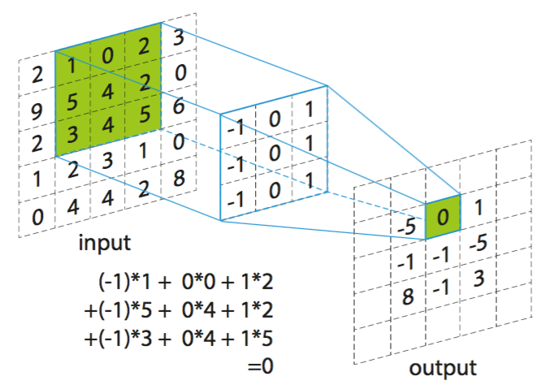

### Deeplearning Algorithms tutorial
谷歌的人工智能位于全球前列，在图像识别、语音识别、无人驾驶等技术上都已经落地。而百度实质意义上扛起了国内的人工智能的大旗，覆盖无人驾驶、智能助手、图像识别等许多层面。苹果业已开始全面拥抱机器学习，新产品进军家庭智能音箱并打造工作站级别Mac。另外，腾讯的深度学习平台Mariana已支持了微信语音识别的语音输入法、语音开放平台、长按语音消息转文本等产品，在微信图像识别中开始应用。全球前十大科技公司全部发力人工智能理论研究和应用的实现，虽然入门艰难，但是一旦入门，高手也就在你的不远处！
AI的开发离不开算法那我们就接下来开始学习算法吧！

#### 深度卷积神经网络(Deep Convolutional Neural Networks)

卷积神经网络（Convolutional Neural Network, CNN）是一种前馈神经网络，它的人工神经元可以响应一部分覆盖范围内的周围单元，对于大型图像处理有出色表现。

卷积神经网络由一个或多个卷积层和顶端的全连通层（对应经典的神经网络）组成，同时也包括关联权重和池化层（pooling layer）。这一结构使得卷积神经网络能够利用输入数据的二维结构。与其他深度学习结构相比，卷积神经网络在图像和语音识别方面能够给出更好的结果。这一模型也可以使用反向传播算法进行训练。相比较其他深度、前馈神经网络，卷积神经网络需要考量的参数更少，使之成为一种颇具吸引力的深度学习结构。

卷积层（Convolutional layer），卷积神经网络中每层卷积层由若干卷积单元组成，每个卷积单元的参数都是通过反向传播算法最佳化得到的。卷积运算的目的是提取输入的不同特征，第一层卷积层可能只能提取一些低级的特征如边缘、线条和角等层级，更多层的网路能从低级特征中迭代提取更复杂的特征。

线性整流层（Rectified Linear Units layer, ReLU layer）使用线性整流（Rectified Linear Units, ReLU） {\displaystyle f(x)=\max(0,x)} {\displaystyle f(x)=\max(0,x)}作为这一层神经的激励函数（Activation function）。它可以增强判定函数和整个神经网络的非线性特性，而本身并不会改变卷积层。

事实上，其他的一些函数也可以用于增强网络的非线性特性，如双曲正切函数 {\displaystyle f(x)=\tanh(x)} {\displaystyle f(x)=\tanh(x)}, {\displaystyle f(x)=|\tanh(x)|} {\displaystyle f(x)=|\tanh(x)|}，或者Sigmoid函数 {\displaystyle f(x)=(1+e^{-x})^{-1}} {\displaystyle f(x)=(1+e^{-x})^{-1}}。相比其它函数来说，ReLU函数更受青睐，这是因为它可以将神经网络的训练速度提升数倍[3]，而并不会对模型的泛化准确度造成显著影响。

池化（Pooling）是卷积神经网络中另一个重要的概念，它实际上是一种形式的降采样。有多种不同形式的非线性池化函数，而其中“最大池化（Max pooling）”是最为常见的。它是将输入的图像划分为若干个矩形区域，对每个子区域输出最大值。直觉上，这种机制能够有效地原因在于，在发现一个特征之后，它的精确位置远不及它和其他特征的相对位置的关系重要。池化层会不断地减小数据的空间大小，因此参数的数量和计算量也会下降，这在一定程度上也控制了过拟合。通常来说，CNN的卷积层之间都会周期性地插入池化层。

池化层通常会分别作用于每个输入的特征并减小其大小。目前最常用形式的池化层是每隔2个元素从图像划分出 {\displaystyle 2\times 2} 2\times 2的区块，然后对每个区块中的4个数取最大值。这将会减少75%的数据量。

除了最大池化之外，池化层也可以使用其他池化函数，例如“平均池化”甚至“L2-范数池化”等。过去，平均池化的使用曾经较为广泛，但是最近由于最大池化在实践中的表现更好，平均池化已经不太常用。

由于池化层过快地减少了数据的大小，目前文献中的趋势是使用较小的池化滤镜，[4]甚至不再使用池化层。

