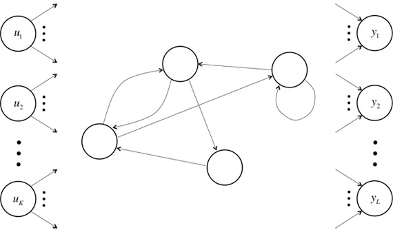
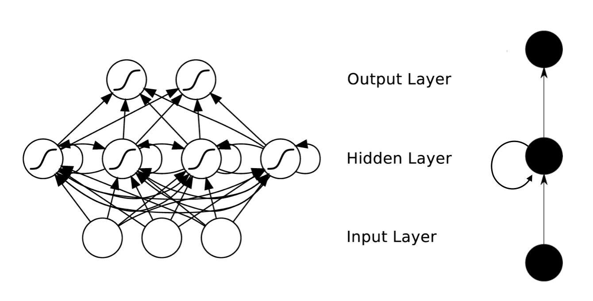

### Deeplearning Algorithms tutorial
谷歌的人工智能位于全球前列，在图像识别、语音识别、无人驾驶等技术上都已经落地。而百度实质意义上扛起了国内的人工智能的大旗，覆盖无人驾驶、智能助手、图像识别等许多层面。苹果业已开始全面拥抱机器学习，新产品进军家庭智能音箱并打造工作站级别Mac。另外，腾讯的深度学习平台Mariana已支持了微信语音识别的语音输入法、语音开放平台、长按语音消息转文本等产品，在微信图像识别中开始应用。全球前十大科技公司全部发力人工智能理论研究和应用的实现，虽然入门艰难，但是一旦入门，高手也就在你的不远处！
AI的开发离不开算法那我们就接下来开始学习算法吧！

#### 深度递归神经网络(Deep Recurrent Neural Networks)

递归神经网络（RNN）是两种人工神经网络的总称。一种是时间递归神经网络（Recurrent Neural Networks,RNN），又名循环神经网络，另一种是结构递归神经网络（recursive neural network）。时间递归神经网络的神经元间连接构成矩阵，而结构递归神经网络利用相似的神经网络结构递归构造更为复杂的深度网络。RNN一般指代时间递归神经网络。单纯递归神经网络因为无法处理随着递归，权重指数级爆炸或消失的问题（Vanishing gradient problem），难以捕捉长期时间关联；而结合不同的LSTM可以很好解决这个问题。

时间递归神经网络可以描述动态时间行为，因为和前馈神经网络（feedforward neural network）接受较特定结构的输入不同，RNN将状态在自身网络中循环传递，因此可以接受更广泛的时间序列结构输入。手写识别是最早成功利用RNN的研究结果

循环神经网络不同于传统的FNNs(Feed-forward Neural Networks，前向反馈神经网络)，循环神经网络引入了定向循环，能够处理那些输入之间前后关联的问题。

循环神经网络的目的是用来处理序列数据的问题。通常在传统的神经网络模型中，是从输入层到隐含层再到输出层，层与层之间是全连接的，每层之间的节点是无连接的。但是这种普通的神经网络对于很多问题却是无法解决的。比如你需要要预测一个句子的下一个单词是什么，一般需要用到前面的单词，因为一个句子中前后单词并不是独立的。RNNs之所以称为循环神经网路，即一个序列当前的输出与前面的输出也有关。对应的表现形式为网络会对前面的信息进行记忆并应用于当前输出的计算中，即隐藏层之间的节点不再无连接而是有连接的，并且隐藏层的输入不仅包括输入层的输出还包括上一时刻隐藏层的输出。理论上，RNNs能够对任何长度的序列数据进行处理。

图中是循环神经网络进行展开成一个全神经网络的过程

时间递归神经网络包含输入单元(Input units)，输入集标记为，而输出单元(Output units)的输出集则被标记为。RNNs还包含隐藏单元(Hidden units)，我们将其输出集标记为，这些隐藏单元完成了最为主要的工作。你会发现，在图中：有一条单向流动的信息流是从输入单元到达隐藏单元的，与此同时另一条单向流动的信息流从隐藏单元到达输出单元。在某些情况下，RNNs会打破后者的限制，引导信息从输出单元返回隐藏单元，这些被称为“Back Projections”，并且隐藏层的输入还包括上一隐藏层的状态，即隐藏层内的节点可以自连也可以互连。 
