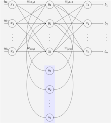
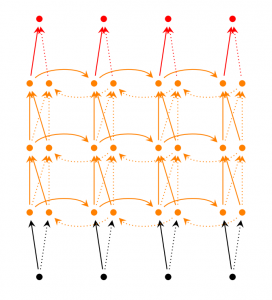
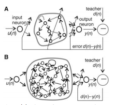
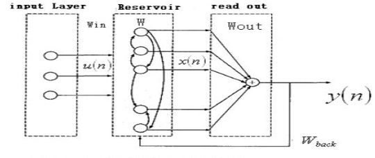
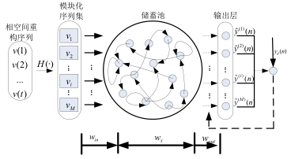

### Deeplearning Algorithms tutorial
谷歌的人工智能位于全球前列，在图像识别、语音识别、无人驾驶等技术上都已经落地。而百度实质意义上扛起了国内的人工智能的大旗，覆盖无人驾驶、智能助手、图像识别等许多层面。苹果业已开始全面拥抱机器学习，新产品进军家庭智能音箱并打造工作站级别Mac。另外，腾讯的深度学习平台Mariana已支持了微信语音识别的语音输入法、语音开放平台、长按语音消息转文本等产品，在微信图像识别中开始应用。全球前十大科技公司全部发力人工智能理论研究和应用的实现，虽然入门艰难，但是一旦入门，高手也就在你的不远处！
AI的开发离不开算法那我们就接下来开始学习算法吧！

#### 深度递归神经网络(Deep Recurrent Neural Networks)

递归神经网络（RNN）是两种人工神经网络的总称。一种是时间递归神经网络（Recurrent Neural Networks,RNN），又名循环神经网络，另一种是结构递归神经网络（recursive neural network）。时间递归神经网络的神经元间连接构成矩阵，而结构递归神经网络利用相似的神经网络结构递归构造更为复杂的深度网络。RNN一般指代时间递归神经网络。单纯递归神经网络因为无法处理随着递归，权重指数级爆炸或消失的问题（Vanishing gradient problem），难以捕捉长期时间关联；而结合不同的LSTM可以很好解决这个问题。

时间递归神经网络可以描述动态时间行为，因为和前馈神经网络（feedforward neural network）接受较特定结构的输入不同，RNN将状态在自身网络中循环传递，因此可以接受更广泛的时间序列结构输入。手写识别是最早成功利用RNN的研究结果

循环神经网络不同于传统的FNNs(Feed-forward Neural Networks，前向反馈神经网络)，循环神经网络引入了定向循环，能够处理那些输入之间前后关联的问题。
<p align="center">

</p>

循环神经网络的目的是用来处理序列数据的问题。通常在传统的神经网络模型中，是从输入层到隐含层再到输出层，层与层之间是全连接的，每层之间的节点是无连接的。但是这种普通的神经网络对于很多问题却是无法解决的。比如你需要要预测一个句子的下一个单词是什么，一般需要用到前面的单词，因为一个句子中前后单词并不是独立的。RNNs之所以称为循环神经网路，即一个序列当前的输出与前面的输出也有关。对应的表现形式为网络会对前面的信息进行记忆并应用于当前输出的计算中，即隐藏层之间的节点不再无连接而是有连接的，并且隐藏层的输入不仅包括输入层的输出还包括上一时刻隐藏层的输出。理论上，RNNs能够对任何长度的序列数据进行处理。
<p align="center">

</p>

<p align="center">

</p>
<p align="center">循环神经网络进行展开成一个全神经网络的过程</p>


时间递归神经网络包含输入单元(Input units)，输入集标记为，而输出单元(Output units)的输出集则被标记为。RNNs还包含隐藏单元(Hidden units)，我们将其输出集标记为，这些隐藏单元完成了最为主要的工作。你会发现，在图中：有一条单向流动的信息流是从输入单元到达隐藏单元的，与此同时另一条单向流动的信息流从隐藏单元到达输出单元。在某些情况下，RNNs会打破后者的限制，引导信息从输出单元返回隐藏单元，这些被称为“Back Projections”，并且隐藏层的输入还包括上一隐藏层的状态，即隐藏层内的节点可以自连也可以互连。 

在深度递归神经网络中，它的主要作用是做什么呢？

 时间递归神经网络已经被在实践中证明对NLP是非常成功的。如词向量表达、语句合法性检查、词性标注、机器翻译、图像描述生成等。在时间递归神经网络中，目前使用最广泛最成功的模型便是LSTMs(Long Short-Term Memory，长短时记忆模型)模型，该模型通常比vanilla RNNs能够更好地对长短时依赖进行表达，该模型相对于一般的RNNs，只是在隐藏层做了改变。
 
 
 那么我们应该怎么训练时间递归神经网络呢？
 
 对于递归神经网络的训练和对传统的人工神经网络训练一样。同样使用BP误差反向传播算法，不过这里有点区别。如果将RNNs进行网络展开，那么参数是共享的，而传统神经网络不是这样的。所以使用梯度下降算法中，每一步的输出不仅依赖当前步的网络，而且还依赖前面操作的网络的状态。该学习算法称为Backpropagation Through Time (BPTT).这里我们需要了解到的是，在vanilla RNNs训练中，BPTT无法解决长时依赖问题(即当前的输出与前面很长的一段序列有关，一般超过十步就无能为力了)，因为BPTT会带来所谓的梯度消失或梯度爆炸问题(the vanishing/exploding gradient problem)。当然，有很多方法去解决这个问题，如LSTMs便是专门应对这种问题的。
 
 
 接下来我们需要对RNNs进行扩展和模型改进.
 
* 第一种:Simple RNNs(SRNs)

SRNs是RNNs的一种特例，它是一个由三层网络组成的，并且在隐藏层增加了上下文单元，下图中的便是隐藏层，便是上下文单元。上下文单元节点与隐藏层中的节点的连接是固定的，并且权值也是固定的(值是多少)，其实是一个上下文节点与隐藏层节点一一对应，并且值是确定的。在每一步中，使用标准的前向反馈进行传播，然后使用学习算法进行学习。上下文每一个节点保存其连接的隐藏层节点的上一步的输出，即保存上文，并作用于当前步对应的隐藏层节点的状态，即隐藏层的输入由输入层的输出与上一步的自己的状态所决定的。因此SRNs能够解决标准的多层感知机(MLP)无法解决的对序列数据进行预测的任务。

<p align="center">

</p>

* 第二种:Bidirectional RNNs

 Bidirectional RNNs双向网络改进之处，假设当前的输出(第步的输出)不仅仅与前面的序列有关，并且还与后面的序列有关。例如：预测一个语句中缺失的词语那么就需要根据上下文来进行预测。Bidirectional RNNs是一个相对较简单的RNNs，是由两个RNNs上下叠加在一起组成的。输出由这两个RNNs的隐藏层的状态决定的。
 
 
<p align="center">

</p>

* 第三种: Deep(Bidirectional)RNNs

Deep(Bidirectional)RNNs与Bidirectional RNNs相似，只是对于每一步的输入有多层网络。该网络便有更强大的表达与学习能力，但是复杂性也提高了，同时需要更多的训练数据。

<p align="center">

</p>

* 第四种:Echo State Networks

 ESNs(回声状态网络)也是一种RNNs，但是它与传统的RNNs相差很大。回声状态网络具有三个特点：

* 它的核心结构时一个随机生成、且保持不变的储备池(Reservoir)，储备池是大规模的、随机生成的、稀疏连接(SD通常保持1%～5%，SD表示储备池中互相连接的神经元占总的神经元个数N的比例)的循环结构；
* 它的储备池到输出层的权值矩阵是唯一需要调整的部分；
* 通过简单的线性回归就可完成网络的训练。

回声状态网络是一种特殊类型的循环神经网络，其基本思想是：使用大规模随机连接的循环网络取代经典神经网络中的中间层，从而简化网络的训练过程。因此ESNs的关键是中间的储备池。网络中的参数包括：为储备池中节点的连接权值矩阵，为输入层到储备池之间的连接权值矩阵，表明储备池中的神经元之间是连接的，为输出层到储备池之间的反馈连接权值矩阵，表明储备池会有输出层来的反馈，为输入层、储备池、输出层到输出层的连接权值矩阵，表明输出层不仅与储备池连接，还与输入层和自己连接。表示输出层的偏置项。

 对于ESNs，关键是储备池的四个参数，如储备池内部连接权谱半径SR(，只有SR <1时，ESNs才能具有回声状态属性)、储备池规模N(即储备池中神经元的个数)、储备池输入单元尺度IS(IS为储备池的输入信号连接到储备池内部神经元之前需要相乘的一个尺度因子)、储备池稀疏程度SD(即为储备池中互相连接的神经元个数占储备池神经元总个数的比例)。对于IS，如果需要处理的任务的非线性越强，那么输入单元尺度越大。该原则的本质就是通过输入单元尺度IS，将输入变换到神经元激活函数相应的范围(神经元激活函数的不同输入范围，其非线性程度不同)。
<p align="center">

</p>

<p align="center">

</p>

<p align="center">

</p>

* 第五种:Gated Recurrent Unit Recurrent Neural Networks

 GRUs也是一般的RNNs的改良版本，主要是体现在两个方面。一是，序列中不同的位置处的单词(已单词举例)对当前的隐藏层的状态的影响不同，越前面的影响越小，即每个前面状态对当前的影响进行了距离加权，距离越远，权值越小。二是，在产生误差error时，误差可能是由某一个或者几个单词而引发的，所以应当仅仅对对应的单词weight进行更新。GRUs的结构如下图所示。GRUs首先根据当前输入单词向量word vector已经前一个隐藏层的状态hidden state计算出update gate和reset gate。再根据reset gate、当前word vector以及前一个hidden state计算新的记忆单元内容(new memory content)。当reset gate为1的时候，new memory content忽略之前的所有memory content，最终的memory是之前的hidden state与new memory content的结合。
 <p align="center">

</p>
 
#### 应用示例
```python

#!/usr/bin/python
# -*- coding: utf-8 -*-

from __future__ import print_function

import os
import sys
import time
from datetime import timedelta

import numpy as np
import tensorflow as tf
from sklearn import metrics

from cnn_model import TCNNConfig, TextCNN
from data.cnews_loader import read_vocab, read_category, batch_iter, process_file, build_vocab

base_dir = 'data/cnews'
train_dir = os.path.join(base_dir, 'cnews.train.txt')
test_dir = os.path.join(base_dir, 'cnews.test.txt')
val_dir = os.path.join(base_dir, 'cnews.val.txt')
vocab_dir = os.path.join(base_dir, 'cnews.vocab.txt')

save_dir = 'checkpoints/textcnn'
save_path = os.path.join(save_dir, 'best_validation')  # 最佳验证结果保存路径


def get_time_dif(start_time):
    """获取已使用时间"""
    end_time = time.time()
    time_dif = end_time - start_time
    return timedelta(seconds=int(round(time_dif)))


def feed_data(x_batch, y_batch, keep_prob):
    feed_dict = {
        model.input_x: x_batch,
        model.input_y: y_batch,
        model.keep_prob: keep_prob
    }
    return feed_dict


def evaluate(sess, x_, y_):
    """评估在某一数据上的准确率和损失"""
    data_len = len(x_)
    batch_eval = batch_iter(x_, y_, 128)
    total_loss = 0.0
    total_acc = 0.0
    for x_batch, y_batch in batch_eval:
        batch_len = len(x_batch)
        feed_dict = feed_data(x_batch, y_batch, 1.0)
        loss, acc = sess.run([model.loss, model.acc], feed_dict=feed_dict)
        total_loss += loss * batch_len
        total_acc += acc * batch_len

    return total_loss / data_len, total_acc / data_len


def train():
    print("Configuring TensorBoard and Saver...")
    # 配置 Tensorboard，重新训练时，请将tensorboard文件夹删除，不然图会覆盖
    tensorboard_dir = 'tensorboard/textcnn'
    if not os.path.exists(tensorboard_dir):
        os.makedirs(tensorboard_dir)

    tf.summary.scalar("loss", model.loss)
    tf.summary.scalar("accuracy", model.acc)
    merged_summary = tf.summary.merge_all()
    writer = tf.summary.FileWriter(tensorboard_dir)

    # 配置 Saver
    saver = tf.train.Saver()
    if not os.path.exists(save_dir):
        os.makedirs(save_dir)

    print("Loading training and validation data...")
    # 载入训练集与验证集
    start_time = time.time()
    x_train, y_train = process_file(train_dir, word_to_id, cat_to_id, config.seq_length)
    x_val, y_val = process_file(val_dir, word_to_id, cat_to_id, config.seq_length)
    time_dif = get_time_dif(start_time)
    print("Time usage:", time_dif)

    # 创建session
    session = tf.Session()
    session.run(tf.global_variables_initializer())
    writer.add_graph(session.graph)

    print('Training and evaluating...')
    start_time = time.time()
    total_batch = 0  # 总批次
    best_acc_val = 0.0  # 最佳验证集准确率
    last_improved = 0  # 记录上一次提升批次
    require_improvement = 1000  # 如果超过1000轮未提升，提前结束训练

    flag = False
    for epoch in range(config.num_epochs):
        print('Epoch:', epoch + 1)
        batch_train = batch_iter(x_train, y_train, config.batch_size)
        for x_batch, y_batch in batch_train:
            feed_dict = feed_data(x_batch, y_batch, config.dropout_keep_prob)

            if total_batch % config.save_per_batch == 0:
                # 每多少轮次将训练结果写入tensorboard scalar
                s = session.run(merged_summary, feed_dict=feed_dict)
                writer.add_summary(s, total_batch)

            if total_batch % config.print_per_batch == 0:
                # 每多少轮次输出在训练集和验证集上的性能
                feed_dict[model.keep_prob] = 1.0
                loss_train, acc_train = session.run([model.loss, model.acc], feed_dict=feed_dict)
                loss_val, acc_val = evaluate(session, x_val, y_val)  # todo

                if acc_val > best_acc_val:
                    # 保存最好结果
                    best_acc_val = acc_val
                    last_improved = total_batch
                    saver.save(sess=session, save_path=save_path)
                    improved_str = '*'
                else:
                    improved_str = ''

                time_dif = get_time_dif(start_time)
                msg = 'Iter: {0:>6}, Train Loss: {1:>6.2}, Train Acc: {2:>7.2%},' \
                      + ' Val Loss: {3:>6.2}, Val Acc: {4:>7.2%}, Time: {5} {6}'
                print(msg.format(total_batch, loss_train, acc_train, loss_val, acc_val, time_dif, improved_str))

            session.run(model.optim, feed_dict=feed_dict)  # 运行优化
            total_batch += 1

            if total_batch - last_improved > require_improvement:
                # 验证集正确率长期不提升，提前结束训练
                print("No optimization for a long time, auto-stopping...")
                flag = True
                break  # 跳出循环
        if flag:  # 同上
            break


def test():
    print("Loading test data...")
    start_time = time.time()
    x_test, y_test = process_file(test_dir, word_to_id, cat_to_id, config.seq_length)

    session = tf.Session()
    session.run(tf.global_variables_initializer())
    saver = tf.train.Saver()
    saver.restore(sess=session, save_path=save_path)  # 读取保存的模型

    print('Testing...')
    loss_test, acc_test = evaluate(session, x_test, y_test)
    msg = 'Test Loss: {0:>6.2}, Test Acc: {1:>7.2%}'
    print(msg.format(loss_test, acc_test))

    batch_size = 128
    data_len = len(x_test)
    num_batch = int((data_len - 1) / batch_size) + 1

    y_test_cls = np.argmax(y_test, 1)
    y_pred_cls = np.zeros(shape=len(x_test), dtype=np.int32)  # 保存预测结果
    for i in range(num_batch):  # 逐批次处理
        start_id = i * batch_size
        end_id = min((i + 1) * batch_size, data_len)
        feed_dict = {
            model.input_x: x_test[start_id:end_id],
            model.keep_prob: 1.0
        }
        y_pred_cls[start_id:end_id] = session.run(model.y_pred_cls, feed_dict=feed_dict)

    # 评估
    print("Precision, Recall and F1-Score...")
    print(metrics.classification_report(y_test_cls, y_pred_cls, target_names=categories))

    # 混淆矩阵
    print("Confusion Matrix...")
    cm = metrics.confusion_matrix(y_test_cls, y_pred_cls)
    print(cm)

    time_dif = get_time_dif(start_time)
    print("Time usage:", time_dif)


if __name__ == '__main__':
    if len(sys.argv) != 2 or sys.argv[1] not in ['train', 'test']:
        raise ValueError("""usage: python run_cnn.py [train / test]""")

    print('Configuring CNN model...')
    config = TCNNConfig()
    if not os.path.exists(vocab_dir):  # 如果不存在词汇表，重建
        build_vocab(train_dir, vocab_dir, config.vocab_size)
    categories, cat_to_id = read_category()
    words, word_to_id = read_vocab(vocab_dir)
    config.vocab_size = len(words)
    model = TextCNN(config)

    if sys.argv[1] == 'train':
        train()
    else:
        test()
```
