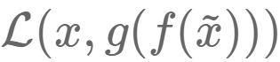

### Deeplearning Algorithms tutorial
谷歌的人工智能位于全球前列，在图像识别、语音识别、无人驾驶等技术上都已经落地。而百度实质意义上扛起了国内的人工智能的大旗，覆盖无人驾驶、智能助手、图像识别等许多层面。苹果业已开始全面拥抱机器学习，新产品进军家庭智能音箱并打造工作站级别Mac。另外，腾讯的深度学习平台Mariana已支持了微信语音识别的语音输入法、语音开放平台、长按语音消息转文本等产品，在微信图像识别中开始应用。全球前十大科技公司全部发力人工智能理论研究和应用的实现，虽然入门艰难，但是一旦入门，高手也就在你的不远处！
AI的开发离不开算法那我们就接下来开始学习算法吧！

#### 堆叠自动编码器(Stacked AutoEncoder)

自从Hinton 2006年的工作之后，越来越多的研究者开始关注各种自编码器模型相应的堆叠模型。实际上，自编码器（Auto-Encoder）是一个较早的概念了，比如Hinton等人在1986, 1989年的工作。

自编码器可以理解为一个试图去还原其原始输入的系统。
<p align="center">

</p>

图中，虚线蓝色框内就是一个自编码器模型，它由编码器（Encoder）和解码器（Decoder）两部分组成，本质上都是对输入信号做某种变换。
编码器将输入信号x变换成编码信号y，而解码器将编码y转换成输出信号，即
<p align="center">

</p>

而自编码器的目的是，让输出尽可能复现输入x.但是，这样问题就来了,如果f和g都是恒等映射，那就是,实际上事实确实如此，但这样的变换就没有什么用了，所以我们需要对中间信号y（也叫作“编码”）做一定的约束，这样，系统往往能学出很有趣的编码变换f和编码y。

在这里需要强调一点，对于自编码器，往往并不关系输出是什么，因常我们只需要关心中间层的编码，或者是从输入到编码的映射。在我们强迫编码y和输入x不同的情况下，系统还能够去复原原始信号x，那么说明编码y已经承载了原始数据的所有信息，但以一种不同的形式！这就是特征提取。这个是通过自动学出来的，事实上，自动学习原始数据的特征表达也是神经网络和深度学习的核心目的之一。

自编码器与神经网络，其中神经网络就是在对原始信号逐层地做非线性变换：

<p align="center">

</p>

该网络把输入层数据转换到中间层（隐层），再转换到输出层。图中的每个节点代表数据的一个维度（偏置项图中未标出）。每两层之间的变换都是“线性变化”+“非线性激活”，用公式表示即为。图中的每个节点代表数据的一个维度（偏置项图中未标出）。每两层之间的变换都是“线性变化”+“非线性激活”，用公式表示为:
<p align="center">

</p>

神经网络通常可以用于分类，这样可以得道从输入层到输出层的变换函数。因此，我们需要定义一个目标函数来衡量当前的输出和真实结果的差异，利用该函数去逐步调整（如梯度下降）系统的参数，以使得整个网络尽可能去拟合训练数据。如果有正则约束的话，还同时要求模型尽量简单（以防止过拟合）。

但是自编码器怎么表示呢？

自编码器试图复现其原始输入，因此，在训练中，网络中的输出应与输入相同，即 y=x，因此，一个自编码器的输入、输出应有相同的结构，即：
<p align="center">

</p>

这里我们可以利用训练数据训练这个网络，等训练结束后，这个网络即学习出了的能力。对我们来说，此时的h是至关重要的，因为它是在尽量不损失信息量的情况下，对原始数据的另一种表达。结合神经网络的惯例，我们再将自编码器的公式表示如下：（假设激活函数是sigmoid，用s表示）

<p align="center">

</p>

其中，表示损失函数，结合数据的不同形式，可以是二次误差（squared error loss）或交叉熵误差（cross entropy loss）。如果，一般称为tied weights。

这里我们会给隐层加入一定的约束。从数据维度来看，常见以下两种情况：

* n>p，即隐层维度小于输入数据维度。从x→h的变换是一种降维的操作，网络试图以更小的维度去描述原始数据而尽量不损失数据信息。实际上，当每两层之间的变换均为线性，且监督训练的误差是二次型误差时，该网络等价于PCA！

* n<p ，即隐层维度大于输入数据维度。虽然我们同时约束h的表达尽量稀疏（有大量维度为0，未被激活），此时的编码器便是非常有名的“稀疏自编码器”。可为什么稀疏的表达就是好的？这是因为，有人尝试从人脑机理对比，人类神经系统在某一刺激下，大部分神经元是被抑制的。

学习过深度学习的都明白，深度学习中深度网络的重要性在于其能够逐层地学习原始数据的多种表达。每一层的都以底一层的表达为基础，但往往更抽象，更加适合复杂的分类等任务。


堆叠自编码器实际上就在做这样的事情，如前所述，单个自编码器通过虚构的三层网络，能够学习出一种特征变化(这里用θ表示变换的参数，包括W,b和激活函数)。实际上，当训练结束后，输出层就没什么意义了，我们一般会将其去掉的，即将自编码器表示为:
<p align="center">

</p>

自编码器模型这里表示为3层的神经网络，这是因为训练的需要，我们将原始数据作为假想的目标输出，以此构建监督误差来训练整个网络。等训练结束后，输出层就可以去掉了，而我们关心的只是从x到h的变换过程。

接下来的思路就很自然了——我们已经得到特征表达h，那么我们就可以将h再当做原始信息，训练一个新的自编码器，得到新的特征表达。

堆叠自编码器（Stacked Auto-Encoder, SAE）,这里Stacked就是逐层垒叠的意思，跟“栈”有点像，当把多个自编码器Stack起来之后就是如下的过程：
<p align="center">

</p>

这里需要注意的是，整个网络的训练不是一蹴而就的，而是需要逐层进行。根据n,m,k结构，实际上我们是先训练网络n→m→n，得到n→m的变换，然后再训练
m→k→m，得到m→k的变换。最终堆叠成SAE，即为n→m→k的结果，整个过程就像一层层往上构建网络，这个就是非常有名的
layer-wise unsuperwised pre-training（逐层非监督预训练）。

稀疏自编码器如前所示，这种模型背后的思想是，高维而稀疏的表达是好的。一般而言h中哪些节点是被抑制的（对于sigmoid单元即输出为0），而是指定一个稀疏性参数ρ，，代表隐藏神经元的平均活跃程度（在训练集上取平均）。比如，当ρ=0.05时，可以认为隐层节点在95%的时间里都是被一直的，只有5%的机会被激活。实际上，为了满足这一条件，隐层神经元的活跃度需要接近于0。

既然要求平均激活度为ρ，那么我们只要引入一个度量，来衡量神经元i的实际激活度与期望激活度ρ之间的差异即可，然后将这个度量添加到目标函数作为正则，训练整个网络即可。那么，什么样的度量适合这个任务呢？了解过概率论、信息论基础的人应该清楚——相对熵，也就是KL散度（KL divergence）。因此，整个网络所添加的惩罚项：
<p align="center">

</p>

我们可以从下图（摘自UFLDL）中直观理解KL散度作为惩罚项的含义。图中假设平均激活度ρ=0.2。

<p align="center">

</p>

可以看出，当一旦偏离期望激活度ρ，这种误差便急剧增大，从而作为惩罚项添加到目标函数，指导整个网络学习出稀疏的特征表达。


降噪自编码器(Stacked Denoising Autoencoders)核心思想是，一个能够从中恢复出原始信号的表达未必是最好的，能够对“被污染/破坏”的原始数据编码、解码，然后还能恢复真正的原始数据，这样的特征才是好的。

假设原始数据x被我们“故意破坏”，比如加入高斯白噪，或者把某些维度数据抹掉，变成了，然后再对编码、解码，得到恢复信号，该恢复信号尽可能逼近未被污染的数据x。此时，监督训练的误差从变成了。

降噪自编码器的系统结构如下图:

<p align="center">

</p>

深度学习兴起正式因为逐层预训练方法的提出，使得深度网络的训练成为可能。对于一个深度网络而言，这种逐层预训练的方法，正是前面介绍的这种堆叠自动编码器(Stacked AutoEncoder)。对于常见的分类任务，一般分为以下两个阶段：

*  逐层预训练(layer-wise pre-training)
*  微调(fune-tuning )

上面讲述的的自动编码器，本质上都是非监督学习，自动编码器各层的输出都是原始数据的不同表达。对于分类任务，往往在自动编码器顶端再添加一分类层（如Softmax层），并结合有标注的训练数据，在误差函数的指导下，对系统的参数进行微调，以使得整个网络能够完成所需的分类任务。

<p align="center">

</p>

对于微调过程，即可以只调整分类层的参数（此时相当于把整个SAE当做一个feature extractor），也可以调整整个网络的参数（适合训练数据量比较大的情况）。

但是为什么训练稀疏自编码器为什么一般都是三层的结构，实际上这里的三层是指训练单个自编码器所假想的3层神经网络，这对任何基于神经网络的编码器都是这样。多层的稀疏自编码器自然是有的，只不过是通过layer-wise pre-training这种方式逐层堆叠起来的，而不是直接去训练多层的网络。

实际上，这正是在训练深层神经网络中遇到的问题。直接去训练一个深层的自编码器，其实本质上就是在做深度网络的训练，由于梯度扩散等问题，这样的网络往往根本无法训练。这倒不是因为会破坏稀疏性等原因，只要网络能够训练，对模型施加的约束总能得到相应的结果。

但是为什么逐层预训练就可以使得深度网络的训练成为可能了呢？其实一个直观的解释是，预训练好的网络在一定程度上拟合了训练数据的结构，这使得整个网络的初始值是在一个合适的状态，便于有监督阶段加快迭代收敛。

#### 应用示例
```python
# This piece of software is bound by The MIT License (MIT)
# Copyright (c) 2014 Siddharth Agrawal
# Code written by : Siddharth Agrawal
# Email ID : siddharth.950@gmail.com

import struct
import array
import numpy
import math
import time
import scipy.io
import scipy.optimize

""" Returns elementwise sigmoid output of input array """

def sigmoid(x):

    return (1 / (1 + numpy.exp(-x)))
    
""" Returns the groundtruth matrix for a set of labels """
    
def getGroundTruth(labels):

    """ Prepare data needed to construct groundtruth matrix """

    labels = numpy.array(labels).flatten()
    data   = numpy.ones(len(labels))
    indptr = numpy.arange(len(labels)+1)
    
    """ Compute the groundtruth matrix and return """
    
    ground_truth = scipy.sparse.csr_matrix((data, labels, indptr))
    ground_truth = numpy.transpose(ground_truth.todense())
    
    return ground_truth

""" The Sparse Autoencoder class """

class SparseAutoencoder(object):

    """ Initialization of Autoencoder object """

    def __init__(self, visible_size, hidden_size, rho, lamda, beta):
    
        """ Initialize parameters of the Autoencoder object """
    
        self.visible_size = visible_size    # number of input units
        self.hidden_size = hidden_size      # number of hidden units
        self.rho = rho                      # desired average activation of hidden units
        self.lamda = lamda                  # weight decay parameter
        self.beta = beta                    # weight of sparsity penalty term
        
        """ Set limits for accessing 'theta' values """
        
        self.limit0 = 0
        self.limit1 = hidden_size * visible_size
        self.limit2 = 2 * hidden_size * visible_size
        self.limit3 = 2 * hidden_size * visible_size + hidden_size
        self.limit4 = 2 * hidden_size * visible_size + hidden_size + visible_size
        
        """ Initialize Neural Network weights randomly
            W1, W2 values are chosen in the range [-r, r] """
        
        r = math.sqrt(6) / math.sqrt(visible_size + hidden_size + 1)
        
        rand = numpy.random.RandomState(int(time.time()))
        
        W1 = numpy.asarray(rand.uniform(low = -r, high = r, size = (hidden_size, visible_size)))
        W2 = numpy.asarray(rand.uniform(low = -r, high = r, size = (visible_size, hidden_size)))
        
        """ Bias values are initialized to zero """
        
        b1 = numpy.zeros((hidden_size, 1))
        b2 = numpy.zeros((visible_size, 1))

        """ Create 'theta' by unrolling W1, W2, b1, b2 """

        self.theta = numpy.concatenate((W1.flatten(), W2.flatten(),
                                        b1.flatten(), b2.flatten()))

    """ Returns gradient of 'theta' using Backpropagation algorithm """
        
    def sparseAutoencoderCost(self, theta, input):
        
        """ Extract weights and biases from 'theta' input """
        
        W1 = theta[self.limit0 : self.limit1].reshape(self.hidden_size, self.visible_size)
        W2 = theta[self.limit1 : self.limit2].reshape(self.visible_size, self.hidden_size)
        b1 = theta[self.limit2 : self.limit3].reshape(self.hidden_size, 1)
        b2 = theta[self.limit3 : self.limit4].reshape(self.visible_size, 1)
        
        """ Compute output layers by performing a feedforward pass
            Computation is done for all the training inputs simultaneously """
        
        hidden_layer = sigmoid(numpy.dot(W1, input) + b1)
        output_layer = sigmoid(numpy.dot(W2, hidden_layer) + b2)
        
        """ Estimate the average activation value of the hidden layers """
        
        rho_cap = numpy.sum(hidden_layer, axis = 1) / input.shape[1]
        
        """ Compute intermediate difference values using Backpropagation algorithm """
        
        diff = output_layer - input
        
        sum_of_squares_error = 0.5 * numpy.sum(numpy.multiply(diff, diff)) / input.shape[1]
        weight_decay         = 0.5 * self.lamda * (numpy.sum(numpy.multiply(W1, W1)) +
                                                   numpy.sum(numpy.multiply(W2, W2)))
        KL_divergence        = self.beta * numpy.sum(self.rho * numpy.log(self.rho / rho_cap) +
                                                    (1 - self.rho) * numpy.log((1 - self.rho) / (1 - rho_cap)))
        cost                 = sum_of_squares_error + weight_decay + KL_divergence
        
        KL_div_grad = self.beta * (-(self.rho / rho_cap) + ((1 - self.rho) / (1 - rho_cap)))
        
        del_out = numpy.multiply(diff, numpy.multiply(output_layer, 1 - output_layer))
        del_hid = numpy.multiply(numpy.dot(numpy.transpose(W2), del_out) + numpy.transpose(numpy.matrix(KL_div_grad)), 
                                 numpy.multiply(hidden_layer, 1 - hidden_layer))
        
        """ Compute the gradient values by averaging partial derivatives
            Partial derivatives are averaged over all training examples """
            
        W1_grad = numpy.dot(del_hid, numpy.transpose(input))
        W2_grad = numpy.dot(del_out, numpy.transpose(hidden_layer))
        b1_grad = numpy.sum(del_hid, axis = 1)
        b2_grad = numpy.sum(del_out, axis = 1)
            
        W1_grad = W1_grad / input.shape[1] + self.lamda * W1
        W2_grad = W2_grad / input.shape[1] + self.lamda * W2
        b1_grad = b1_grad / input.shape[1]
        b2_grad = b2_grad / input.shape[1]
        
        """ Transform numpy matrices into arrays """
        
        W1_grad = numpy.array(W1_grad)
        W2_grad = numpy.array(W2_grad)
        b1_grad = numpy.array(b1_grad)
        b2_grad = numpy.array(b2_grad)
        
        """ Unroll the gradient values and return as 'theta' gradient """
        
        theta_grad = numpy.concatenate((W1_grad.flatten(), W2_grad.flatten(),
                                        b1_grad.flatten(), b2_grad.flatten()))
                                        
        return [cost, theta_grad]


""" The Softmax Regression class """

class SoftmaxRegression(object):

    """ Initialization of Regressor object """

    def __init__(self, input_size, num_classes, lamda):
    
        """ Initialize parameters of the Regressor object """
    
        self.input_size  = input_size  # input vector size
        self.num_classes = num_classes # number of classes
        self.lamda       = lamda       # weight decay parameter
        
        """ Randomly initialize the class weights """
        
        rand = numpy.random.RandomState(int(time.time()))
        
        self.theta = 0.005 * numpy.asarray(rand.normal(size = (num_classes*input_size, 1)))
        
    """ Returns the cost and gradient of 'theta' at a particular 'theta' """
        
    def softmaxCost(self, theta, input, labels):
    
        """ Compute the groundtruth matrix """
    
        ground_truth = getGroundTruth(labels)
        
        """ Reshape 'theta' for ease of computation """
        
        theta = theta.reshape(self.num_classes, self.input_size)
        
        """ Compute the class probabilities for each example """
        
        theta_x       = numpy.dot(theta, input)
        hypothesis    = numpy.exp(theta_x)      
        probabilities = hypothesis / numpy.sum(hypothesis, axis = 0)
        
        """ Compute the traditional cost term """
        
        cost_examples    = numpy.multiply(ground_truth, numpy.log(probabilities))
        traditional_cost = -(numpy.sum(cost_examples) / input.shape[1])
        
        """ Compute the weight decay term """
        
        theta_squared = numpy.multiply(theta, theta)
        weight_decay  = 0.5 * self.lamda * numpy.sum(theta_squared)
        
        """ Add both terms to get the cost """
        
        cost = traditional_cost + weight_decay
        
        """ Compute and unroll 'theta' gradient """
        
        theta_grad = -numpy.dot(ground_truth - probabilities, numpy.transpose(input))
        theta_grad = theta_grad / input.shape[1] + self.lamda * theta
        theta_grad = numpy.array(theta_grad)
        theta_grad = theta_grad.flatten()
        
        return [cost, theta_grad]

""" Loads the images from the provided file name """

def loadMNISTImages(file_name):

    """ Open the file """

    image_file = open(file_name, 'rb')
    
    """ Read header information from the file """
    
    head1 = image_file.read(4)
    head2 = image_file.read(4)
    head3 = image_file.read(4)
    head4 = image_file.read(4)
    
    """ Format the header information for useful data """
    
    num_examples = struct.unpack('>I', head2)[0]
    num_rows     = struct.unpack('>I', head3)[0]
    num_cols     = struct.unpack('>I', head4)[0]
    
    """ Initialize dataset as array of zeros """
    
    dataset = numpy.zeros((num_rows*num_cols, num_examples))
    
    """ Read the actual image data """
    
    images_raw  = array.array('B', image_file.read())
    image_file.close()
    
    """ Arrange the data in columns """
    
    for i in range(num_examples):
    
        limit1 = num_rows * num_cols * i
        limit2 = num_rows * num_cols * (i + 1)
        
        dataset[:, i] = images_raw[limit1 : limit2]
    
    """ Normalize and return the dataset """    
            
    return dataset / 255
""" Loads the image labels from the provided file name """
    
def loadMNISTLabels(file_name):

    """ Open the file """

    label_file = open(file_name, 'rb')
    
    """ Read header information from the file """
    
    head1 = label_file.read(4)
    head2 = label_file.read(4)
    
    """ Format the header information for useful data """
    
    num_examples = struct.unpack('>I', head2)[0]
    
    """ Initialize data labels as array of zeros """
    
    labels = numpy.zeros((num_examples, 1), dtype = numpy.int)
    
    """ Read the label data """
    
    labels_raw = array.array('b', label_file.read())
    label_file.close()
    
    """ Copy and return the label data """
    
    labels[:, 0] = labels_raw[:]
    
    return labels
    
""" Returns the hidden layer activations of the Autoencoder """

def feedForwardAutoencoder(theta, hidden_size, visible_size, input):

    """ Define limits to access useful data """

    limit0 = 0
    limit1 = hidden_size * visible_size
    limit2 = 2 * hidden_size * visible_size
    limit3 = 2 * hidden_size * visible_size + hidden_size
    
    """ Access W1 and b1 from 'theta' """
    
    W1 = theta[limit0 : limit1].reshape(hidden_size, visible_size)
    b1 = theta[limit2 : limit3].reshape(hidden_size, 1)
    
    """ Compute the hidden layer activations """
    
    hidden_layer = 1 / (1 + numpy.exp(-(numpy.dot(W1, input) + b1)))
    
    return hidden_layer

""" Returns a row of Stacked Autoencoder parameters """

def stack2Params(stack):

    """ Initialize an empty list of parameters """

    params = []
    num_layers = len(stack) / 2
	
    """ For each layer in the neural network, append the corresponding parameters """
	
    for i in range(num_layers):
    
        params = numpy.concatenate((params, numpy.array(stack[i, "W"]).flatten()))
        params = numpy.concatenate((params, numpy.array(stack[i, "b"]).flatten()))
        
    return params
""" Returns a stack of Stacked Autoencoder parameters """

def params2Stack(params, net_config):

    """ Initialize an empty stack """

    stack  = {}
    limit0 = 0
    
    for i in range(len(net_config)-2):
    
        """ Calculate limits of layer parameters, using neural network config """
    
        limit1 = limit0 + net_config[i] * net_config[i+1]
        limit2 = limit1 + net_config[i+1]
        
        """ Extract layer parameters, and store in the stack """
        
        stack[i, "W"] = params[limit0 : limit1].reshape(net_config[i+1], net_config[i])
        stack[i, "b"] = params[limit1 : limit2].reshape(net_config[i+1], 1)
        
        limit0 = limit2
        
    return stack
    
""" Function for finetuning the Stacked Autoencoder """

def stackedAutoencoderCost(theta, net_config, lamda, data, labels):

    """ Calculate limits for Softmax parameters """

    input_size   = net_config[-2]
    num_classes  = net_config[-1]
    
    limit0 = 0
    limit1 = num_classes * input_size
    
    """ Extract Softmax and layer parameters """
    
    softmax_theta = theta[limit0 : limit1].reshape(num_classes, input_size)
    stack         = params2Stack(theta[limit1 :], net_config)
    
    num_layers = len(stack) / 2
    
    """ Calculate activations for every layer """
    
    activation    = {}
    activation[0] = data
    
    for i in range(num_layers):
    
        activation[i+1] = sigmoid(numpy.dot(stack[i, "W"], activation[i]) + stack[i, "b"])
        
    """ Compute the groundtruth matrix """
    
    ground_truth = getGroundTruth(labels)
    
    """ Compute the class probabilities for each example """
    
    theta_x       = numpy.dot(softmax_theta, activation[num_layers])
    hypothesis    = numpy.exp(theta_x)      
    probabilities = hypothesis / numpy.sum(hypothesis, axis = 0)
    
    """ Compute the traditional cost term """
    
    cost_examples    = numpy.multiply(ground_truth, numpy.log(probabilities))
    traditional_cost = -(numpy.sum(cost_examples) / data.shape[1])
    
    """ Compute the weight decay term """
    
    theta_squared = numpy.multiply(softmax_theta, softmax_theta)
    weight_decay  = 0.5 * lamda * numpy.sum(theta_squared)
    
    """ Add both terms to get the cost """
    
    cost = traditional_cost + weight_decay
    
    """ Compute Softmax 'theta' gradient """
    
    softmax_theta_grad = -numpy.dot(ground_truth - probabilities, numpy.transpose(activation[num_layers]))
    softmax_theta_grad = softmax_theta_grad / data.shape[1] + lamda * softmax_theta
    
    """ Compute intermediate difference values using Backpropagation algorithm """
    
    delta = {}    
    delta[num_layers] = -numpy.multiply(numpy.dot(numpy.transpose(softmax_theta), ground_truth - probabilities),
                                        numpy.multiply(activation[num_layers], 1 - activation[num_layers]))
    for i in range(num_layers-1):
    
        index        = num_layers - i - 1
        delta[index] = numpy.multiply(numpy.dot(numpy.transpose(stack[index, "W"]), delta[index+1]),
                                       numpy.multiply(activation[index], 1 - activation[index]))
                                       
    """ Compute the partial derivatives, with respect to the layer parameters """
                                       
    stack_grad = {}
    
    for i in range(num_layers):
    
        index = num_layers - i - 1
        stack_grad[index, "W"] = numpy.dot(delta[index+1], numpy.transpose(activation[index])) / data.shape[1]
        stack_grad[index, "b"] = numpy.sum(delta[index+1], axis = 1) / data.shape[1]
    
    """ Concatenate the gradient values and return as 'theta' gradient """
        
    params_grad = stack2Params(stack_grad)
    theta_grad  = numpy.concatenate((numpy.array(softmax_theta_grad).flatten(),
                                     numpy.array(params_grad).flatten()))
    
    return [cost, theta_grad]
    

""" Returns predictions using the trained Stacked Autoencoder model """

def stackedAutoencoderPredict(theta, net_config, data):

    """ Calculate limits for Softmax parameters """

    input_size   = net_config[-2]
    num_classes  = net_config[-1]
    
    limit0 = 0
    limit1 = num_classes * input_size
    
    """ Extract Softmax and layer parameters """
    
    softmax_theta = theta[limit0 : limit1].reshape(num_classes, input_size)
    stack         = params2Stack(theta[limit1 :], net_config)
    
    num_layers = len(stack) / 2
    
    """ Calculate the activations of the final layer """
    
    activation = data
    
    for i in range(num_layers):
    
        activation = sigmoid(numpy.dot(stack[i, "W"], activation) + stack[i, "b"])
        
    """ Compute the class probabilities for each example """
        
    theta_x       = numpy.dot(softmax_theta, activation)
    hypothesis    = numpy.exp(theta_x)      
    probabilities = hypothesis / numpy.sum(hypothesis, axis = 0)
    
    """ Give the predictions based on probability values """
    
    predictions       = numpy.zeros((data.shape[1], 1))
    predictions[:, 0] = numpy.argmax(probabilities, axis = 0)
    
    return predictions


""" Loads data, trains the Stacked Autoencoder model and predicts classes for test data """

def executeStackedAutoencoder():
    
    """ Define the parameters of the first Autoencoder """
    
    visible_size   = 784    # size of input vector
    hidden_size1   = 200    # size of hidden layer vector of first autoencoder
    hidden_size2   = 200    # size of hidden layer vector of second autoencoder
    rho            = 0.1    # desired average activation of hidden units
    lamda          = 0.003  # weight decay parameter
    beta           = 3      # weight of sparsity penalty term
    max_iterations = 200    # number of optimization iterations
    num_classes    = 10     # number of classes
    
    """ Load MNIST images for training and testing """
    
    train_data    = loadMNISTImages('train-images.idx3-ubyte')
    train_labels  = loadMNISTLabels('train-labels.idx1-ubyte')
    
    """ Initialize the first Autoencoder with the above parameters """
    
    encoder1 = SparseAutoencoder(visible_size, hidden_size1, rho, lamda, beta)
    
    """ Run the L-BFGS algorithm to get the optimal parameter values """
    
    opt_solution   = scipy.optimize.minimize(encoder1.sparseAutoencoderCost, encoder1.theta, 
                                             args = (train_data,), method = 'L-BFGS-B', 
                                             jac = True, options = {'maxiter': max_iterations})
    sae1_opt_theta = opt_solution.x
    
    """ Get the features corresponding to first Autoencoder """
    
    sae1_features = feedForwardAutoencoder(sae1_opt_theta, hidden_size1, visible_size, train_data)
    
    """ Initialize the second Autoencoder with the above parameters """
    
    encoder2 = SparseAutoencoder(hidden_size1, hidden_size2, rho, lamda, beta)
    
    """ Run the L-BFGS algorithm to get the optimal parameter values """
    
    opt_solution   = scipy.optimize.minimize(encoder2.sparseAutoencoderCost, encoder2.theta, 
                                             args = (sae1_features,), method = 'L-BFGS-B', 
                                             jac = True, options = {'maxiter': max_iterations})
    sae2_opt_theta = opt_solution.x
    
    """ Get the features corresponding to second Autoencoder """
    
    sae2_features = feedForwardAutoencoder(sae2_opt_theta, hidden_size2, hidden_size1, sae1_features)
    
    """ Initialize Softmax Regressor with the above parameters """
    
    regressor = SoftmaxRegression(hidden_size2, num_classes, lamda)
    
    """ Run the L-BFGS algorithm to get the optimal parameter values """
    
    opt_solution      = scipy.optimize.minimize(regressor.softmaxCost, regressor.theta, 
                                                args = (sae2_features, train_labels,), method = 'L-BFGS-B', 
                                                jac = True, options = {'maxiter': max_iterations})
    softmax_opt_theta = opt_solution.x
    
    """ Create a stack of the Stacked Autoencoder parameters """
    
    stack = {}
    stack[0, "W"] = sae1_opt_theta[encoder1.limit0 : encoder1.limit1].reshape(hidden_size1, visible_size)
    stack[1, "W"] = sae2_opt_theta[encoder2.limit0 : encoder2.limit1].reshape(hidden_size2, hidden_size1)
    stack[0, "b"] = sae1_opt_theta[encoder1.limit2 : encoder1.limit3].reshape(hidden_size1, 1)
    stack[1, "b"] = sae2_opt_theta[encoder2.limit2 : encoder2.limit3].reshape(hidden_size2, 1)
    
    """ Create a vector of the Stacked Autoencoder parameters for optimization """
    
    stack_params     = stack2Params(stack)
    stacked_ae_theta = numpy.concatenate((softmax_opt_theta.flatten(), stack_params.flatten()))
    
    """ Create a neural network configuration, with number of units in each layer """
    
    net_config = [visible_size, hidden_size1, hidden_size2, num_classes]
    
    """ Load MNIST test images and labels """
    
    test_data   = loadMNISTImages('t10k-images.idx3-ubyte') 
    test_labels = loadMNISTLabels('t10k-labels.idx1-ubyte')
    
    """ Get predictions after greedy training """
    
    predictions = stackedAutoencoderPredict(stacked_ae_theta, net_config, test_data)
    
    """ Print accuracy of the trained model """
    
    correct = test_labels[:, 0] == predictions[:, 0]
    print """Accuracy after greedy training :""", numpy.mean(correct)
    
    """ Finetune the greedily trained model """
    
    opt_solution = scipy.optimize.minimize(stackedAutoencoderCost, stacked_ae_theta, 
                                           args = (net_config, lamda, train_data, train_labels,),
                                           method = 'L-BFGS-B', jac = True, options = {'maxiter': max_iterations})
    stacked_ae_opt_theta = opt_solution.x
    
    """ Get predictions after finetuning """
    
    predictions = stackedAutoencoderPredict(stacked_ae_opt_theta, net_config, test_data)
    
    """ Print accuracy of the trained model """
    
    correct = test_labels[:, 0] == predictions[:, 0]
    print """Accuracy after finetuning :""", numpy.mean(correct)
    
executeStackedAutoencoder()
```
