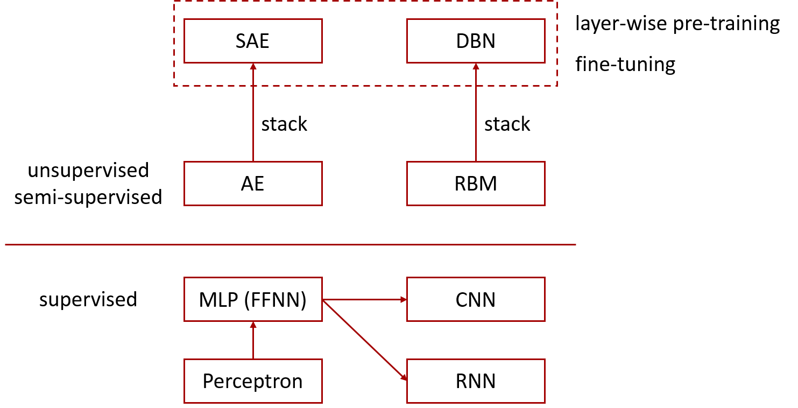

### Deeplearning Algorithms tutorial
谷歌的人工智能位于全球前列，在图像识别、语音识别、无人驾驶等技术上都已经落地。而百度实质意义上扛起了国内的人工智能的大旗，覆盖无人驾驶、智能助手、图像识别等许多层面。苹果业已开始全面拥抱机器学习，新产品进军家庭智能音箱并打造工作站级别Mac。另外，腾讯的深度学习平台Mariana已支持了微信语音识别的语音输入法、语音开放平台、长按语音消息转文本等产品，在微信图像识别中开始应用。全球前十大科技公司全部发力人工智能理论研究和应用的实现，虽然入门艰难，但是一旦入门，高手也就在你的不远处！
AI的开发离不开算法那我们就接下来开始学习算法吧！

#### 生成式对抗网络(Generative Adversarial Networks)
生成对抗网络（Generative Adversarial Network，简称GAN）是非监督式学习的一种方法，通过让两个神经网络相互博弈的方式进行学习。该方法由伊恩·古德费洛等人于2014年提出。

生成对抗网络由一个生成网络与一个判别网络组成。生成网络从潜在空间（latent space）中随机采样作为输入，其输出结果需要尽量模仿训练集中的真实样本。判别网络的输入则为真实样本或生成网络的输出，其目的是将生成网络的输出从真实样本中尽可能分辨出来。而生成网络则要尽可能地欺骗判别网络。两个网络相互对抗、不断调整参数，最终目的是使判别网络无法判断生成网络的输出结果是否真实。

生成对抗网络常用于生成以假乱真的图片。此外，该方法还被用于生成视频、三维物体模型等。

机器学习的模型可大体分为两类，生成模型（Generative Model）和判别模型（Discriminative Model）。判别模型需要输入变量 ，通过某种模型来预测 。生成模型是给定某种隐含信息，来随机产生观测数据。

举个例子:
* 判别模型：给定一张图，判断这张图里的动物是猫还是狗
* 生成模型：给一系列猫的图片，生成一张新的猫咪（不在数据集里）
<p align="center">

</p>


对于判别模型，损失函数是容易定义的，因为输出的目标相对简单。但对于生成模型，损失函数的定义就不是那么容易。我们对于生成结果的期望，往往是一个暧昧不清，难以数学公理化定义的范式。所以不妨把生成模型的回馈部分，交给判别模型处理。这就是Goodfellow他将机器学习中的两大类模型，Generative和Discrimitive给紧密地联合在了一起 。

GAN的基本原理其实非常简单，这里以生成图片为例进行说明。假设我们有两个网络，G（Generator）和D（Discriminator）。正如它的名字所暗示的那样，它们的功能分别是：

G是一个生成图片的网络，它接收一个随机的噪声z，通过这个噪声生成图片，记做G(z)。

D是一个判别网络，判别一张图片是不是“真实的”。它的输入参数是x，x代表一张图片，输出D（x）代表x为真实图片的概率，如果为1，就代表100%是真实的图片，而输出为0，就代表不可能是真实的图片。

在训练过程中，生成网络G的目标就是尽量生成真实的图片去欺骗判别网络D。而D的目标就是尽量把G生成的图片和真实的图片分别开来。这样，G和D构成了一个动态的“博弈过程”。

最后博弈的结果是什么？在最理想的状态下，G可以生成足以“以假乱真”的图片G(z)。对于D来说，它难以判定G生成的图片究竟是不是真实的，因此D(G(z)) = 0.5。
这样我们的目的就达成了：我们得到了一个生成式的模型G，它可以用来生成图片。 
Goodfellow从理论上证明了该算法的收敛性 ，以及在模型收敛时，生成数据具有和真实数据相同的分布（保证了模型效果）。

应用领域:目前生成对抗网络最常使用的地方就是图像生成，如超分辨率任务，语义分割等等

#### 应用实例:
```python
import tensorflow as tf
from tensorflow.examples.tutorials.mnist import input_data
import numpy as np
import matplotlib as mpl
mpl.use('Agg')
import matplotlib.pyplot as plt
import matplotlib.gridspec as gridspec
import os,sys

sys.path.append('utils')
from nets import *
from datas import *

def sample_z(m, n):
	return np.random.uniform(-1., 1., size=[m, n])

class DCGAN():
	def __init__(self, generator, discriminator, data):
		self.generator = generator
		self.discriminator = discriminator
		self.data = data

		# data
		self.z_dim = self.data.z_dim
		self.size = self.data.size
		self.channel = self.data.channel

		self.X = tf.placeholder(tf.float32, shape=[None, self.size, self.size, self.channel])
		self.z = tf.placeholder(tf.float32, shape=[None, self.z_dim])

		# nets
		self.G_sample = self.generator(self.z)

		self.D_real, _ = self.discriminator(self.X)
		self.D_fake, _ = self.discriminator(self.G_sample, reuse = True)
		
		# loss
		self.D_loss = tf.reduce_mean(tf.nn.sigmoid_cross_entropy_with_logits(logits=self.D_real, labels=tf.ones_like(self.D_real))) + tf.reduce_mean(tf.nn.sigmoid_cross_entropy_with_logits(logits=self.D_fake, labels=tf.zeros_like(self.D_fake)))
		self.G_loss = tf.reduce_mean(tf.nn.sigmoid_cross_entropy_with_logits(logits=self.D_fake, labels=tf.ones_like(self.D_fake)))

		# solver
		self.D_solver = tf.train.AdamOptimizer(learning_rate=2e-4).minimize(self.D_loss, var_list=self.discriminator.vars)
		self.G_solver = tf.train.AdamOptimizer(learning_rate=2e-4).minimize(self.G_loss, var_list=self.generator.vars)
		
		self.saver = tf.train.Saver()
		gpu_options = tf.GPUOptions(allow_growth=True)
		self.sess = tf.Session(config=tf.ConfigProto(gpu_options=gpu_options))

	def train(self, sample_dir, ckpt_dir='ckpt', training_epoches = 1000000, batch_size = 32):
		fig_count = 0
		self.sess.run(tf.global_variables_initializer())
		
		for epoch in range(training_epoches):
			# update D
			X_b = self.data(batch_size)
			self.sess.run(
				self.D_solver,
				feed_dict={self.X: X_b, self.z: sample_z(batch_size, self.z_dim)}
				)
			# update G
			k = 1
			for _ in range(k):
				self.sess.run(
					self.G_solver,
					feed_dict={self.z: sample_z(batch_size, self.z_dim)}
				)

			# save img, model. print loss
			if epoch % 100 == 0 or epoch < 100:
				D_loss_curr = self.sess.run(
						self.D_loss,
            			feed_dict={self.X: X_b, self.z: sample_z(batch_size, self.z_dim)})
				G_loss_curr = self.sess.run(
						self.G_loss,
						feed_dict={self.z: sample_z(batch_size, self.z_dim)})
				print('Iter: {}; D loss: {:.4}; G_loss: {:.4}'.format(epoch, D_loss_curr, G_loss_curr))

				if epoch % 1000 == 0:
					samples = self.sess.run(self.G_sample, feed_dict={self.z: sample_z(16, self.z_dim)})

					fig = self.data.data2fig(samples)
					plt.savefig('{}/{}.png'.format(sample_dir, str(fig_count).zfill(3)), bbox_inches='tight')
					fig_count += 1
					plt.close(fig)

				#if epoch % 2000 == 0:
					#self.saver.save(self.sess, os.path.join(ckpt_dir, "dcgan.ckpt"))


if __name__ == '__main__':

	# constraint GPU
	os.environ['CUDA_VISIBLE_DEVICES'] = '3'

	# save generated images
	sample_dir = 'Samples/celebA_dcgan'
	if not os.path.exists(sample_dir):
		os.makedirs(sample_dir)

	# param
	generator = G_conv()
	discriminator = D_conv()

	data = celebA()

	# run
	dcgan = DCGAN(generator, discriminator, data)
	dcgan.train(sample_dir)

```
