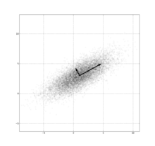

### Deeplearning Algorithms tutorial

谷歌的人工智能位于全球前列，在图像识别、语音识别、无人驾驶等技术上都已经落地。而百度实质意义上扛起了国内的人工智能的大旗，覆盖无人驾驶、智能助手、图像识别等许多层面。苹果业已开始全面拥抱机器学习，新产品进军家庭智能音箱并打造工作站级别Mac。另外，腾讯的深度学习平台Mariana已支持了微信语音识别的语音输入法、语音开放平台、长按语音消息转文本等产品，在微信图像识别中开始应用。全球前十大科技公司全部发力人工智能理论研究和应用的实现，虽然入门艰难，但是一旦入门，高手也就在你的不远处！
AI的开发离不开算法那我们就接下来开始学习算法吧！

#### 主成分分析(Principal Component Analysis)

在多元统计分析中，主成分分析（Principal components analysis，PCA）是一种分析、简化数据集的技术。主成分分析经常用于减少数据集的维数，同时保持数据集中的对方差贡献最大的特征。这是通过保留低阶主成分，忽略高阶主成分做到的。这样低阶成分往往能够保留住数据的最重要方面。但是，这也不是一定的，要视具体应用而定。由于主成分分析依赖所给数据，所以数据的准确性对分析结果影响很大。

主成分分析由卡尔·皮尔逊于1901年发明，用于分析数据及建立数理模型。其方法主要是通过对协方差矩阵进行特征分解，以得出数据的主成分（即特征向量）与它们的权值（即特征值）。PCA是最简单的以特征量分析多元统计分布的方法。其结果可以理解为对原数据中的方差做出解释：哪一个方向上的数据值对方差的影响最大？换而言之，PCA提供了一种降低数据维度的有效办法；如果分析者在原数据中除掉最小的特征值所对应的成分，那么所得的低维度数据必定是最优化的（也即，这样降低维度必定是失去讯息最少的方法）。主成分分析在分析复杂数据时尤为有用，比如人脸识别。

PCA是最简单的以特征量分析多元统计分布的方法。通常情况下，这种运算可以被看作是揭露数据的内部结构，从而更好的解释数据的变量的方法。如果一个多元数据集能够在一个高维数据空间坐标系中被显现出来，那么PCA就能够提供一幅比较低维度的图像，这幅图像即为在讯息最多的点上原对象的一个‘投影’。这样就可以利用少量的主成分使得数据的维度降低了。

PCA跟因子分析密切相关，并且已经有很多混合这两种分析的统计包。而真实要素分析则是假定底层结构，求得微小差异矩阵的特征向量。

<p align="center">

</p>
主成分分析实例：一个平均值为(1, 3)、标准差在(0.878, 0.478)方向上为3、在其正交方向为1的高斯分布。这里以黑色显示的两个向量是这个分布的协方差矩阵的特征向量，其长度按对应的特征值之平方根为比例，并且移动到以原分布的平均值为原点。

#### 应用示例
```python
from __future__ import division
import numpy as np
import pandas as pd

# 根据保留多少维特征进行降维
class PCAcomponent(object):
    def __init__(self, X, N=3):
        self.X = X
        self.N = N
        self.variance_ratio = []
        self.low_dataMat = []

    def _fit(self):
        X_mean = np.mean(self.X, axis=0)
        dataMat = self.X - X_mean
        # 另一种计算协方差矩阵的方法：dataMat.T * dataMat / dataMat.shape[0]
        # 若rowvar非0，一列代表一个样本；为0，一行代表一个样本
        covMat = np.cov(dataMat, rowvar=False)
        # 求特征值和特征向量，特征向量是按列放的，即一列代表一个特征向量
        eigVal, eigVect = np.linalg.eig(np.mat(covMat))
        eigValInd = np.argsort(eigVal)
        eigValInd = eigValInd[-1:-(self.N + 1):-1]  # 取前N个较大的特征值
        small_eigVect = eigVect[:, eigValInd]  # *N维投影矩阵
        self.low_dataMat = dataMat * small_eigVect  # 投影变换后的新矩阵
        # reconMat = (low_dataMat * small_eigVect.I) + X_mean  # 重构数据
        # 输出每个维度所占的方差百分比
        [self.variance_ratio.append(eigVal[i] / sum(eigVal)) for i in eigValInd]
        return self.low_dataMat

    def fit(self):
        self._fit()
        return self


# 根据保留多大方差百分比进行降维
class PCApercent(object):
    def __init__(self, X, percentage=0.95):
        self.X = X
        self.percentage = percentage
        self.variance_ratio = []
        self.low_dataMat = []

    # 通过方差百分比选取前n个主成份
    def percent2n(self, eigVal):
        sortVal = np.sort(eigVal)[-1::-1]
        percentSum, componentNum = 0, 0
        for i in sortVal:
            percentSum += i
            componentNum += 1
            if percentSum >= sum(sortVal) * self.percentage:
                break
        return componentNum

    def _fit(self):
        X_mean = np.mean(self.X, axis=0)
        dataMat = self.X - X_mean
        covMat = np.cov(dataMat, rowvar=False)
        eigVal, eigVect = np.linalg.eig(np.mat(covMat))
        n = self.percent2n(eigVal)
        eigValInd = np.argsort(eigVal)
        eigValInd = eigValInd[-1:-(n + 1):-1]
        n_eigVect = eigVect[:, eigValInd]
        self.low_dataMat = dataMat * n_eigVect
        [self.variance_ratio.append(eigVal[i] / sum(eigVal)) for i in eigValInd]
        return self.low_dataMat

    def fit(self):
        self._fit()
        return self

df = pd.read_csv(r'iris.txt', header=None)
data, label = df[range(len(df.columns) - 1)], df[[len(df.columns) - 1]]
data = np.mat(data)
print("Original dataset = {}*{}".format(data.shape[0], data.shape[1]))
pca = PCAcomponent(data, 3)
# pca = PCApercent(data, 0.98)
pca.fit()
print(pca.low_dataMat)
print(pca.variance_ratio)

```
