### Deeplearning Algorithms tutorial
谷歌的人工智能位于全球前列，在图像识别、语音识别、无人驾驶等技术上都已经落地。而百度实质意义上扛起了国内的人工智能的大旗，覆盖无人驾驶、智能助手、图像识别等许多层面。苹果业已开始全面拥抱机器学习，新产品进军家庭智能音箱并打造工作站级别Mac。另外，腾讯的深度学习平台Mariana已支持了微信语音识别的语音输入法、语音开放平台、长按语音消息转文本等产品，在微信图像识别中开始应用。全球前十大科技公司全部发力人工智能理论研究和应用的实现，虽然入门艰难，但是一旦入门，高手也就在你的不远处！

AI的开发离不开算法那我们就接下来开始学习算法吧！

#### 多维缩放(Mutiple Dimensional Scaling)

降维就是能够用一组个数为d的向量zi来代表个数为D的向量xi所包含的有用信息，其中d<D。假设对一张512*512大小的图片，用svm来做分类，最直接的做法是将图按照行或者列展开变成长度为512*512的输入向量xi，跟svm的参数相乘。假如能够将512*512的向量在保留有用信息的情况下降维到100，那么存储输入和参数的空间会减少很多，计算向量乘法的时间也会减少很多。所以降维能够有效的减少计算时间。而高维空间的数据很有可能出现分布稀疏的情况，即100个样本在100维空间分布肯定是非常稀疏的，每增加一维所需的样本个数呈指数级增长，这种在高维空间中样本稀疏的问题被称为维数灾难。降维可以缓解这种问题。

而为什么可以降维，这是因为数据有冗余，要么是一些没有用的信息，要么是一些重复表达的信息，例如一张512*512的图只有中心100*100的区域内有非0值，剩下的区域就是没有用的信息，又或者一张图是成中心对称的，那么对称的部分信息就重复了。正确降维后的数据一般保留了原始数据的大部分的重要信息，它完全可以替代输入去做一些其他的工作，从而很大程度上可以减少计算量。例如降到二维或者三维来可视化。

一般来从两个角度来考虑做数据降维，一种是直接提取特征子集做特征抽取，例如从512*512图中只取中心部分，一种是通过线性, 另外是一种非线性的方式将原来高维空间变换到一个新的空间，这里主要讨论非线性。非线性一般是有两种方式去实现，一种是基于从高维空间映射到低维空间的 projection 方法，其中代表算法就是PCA，而其他的LDA、Autoencoder也算是这种，主要目的就是学习或者算出一个矩阵变换W，用这个矩阵与高维数据相乘得到低维数据。

另一种是基于流形学习的方法，流形学习的目的是找到高维空间样本的低维描述，它假设在高维空间中数据会呈现一种有规律的低维流形排列，但是这种规律排列不能直接通过高维空间的欧式距离来衡量，如下图所示，某两点实际上的距离应该是下右图展开后的距离。如果能够有方法将高维空间中流形描述出来，那么在降维的过程中就能够保留这种空间关系，为了解决这个问题，流形学习假设高维空间的局部区域仍然具有欧式空间的性质，即它们的距离可以通过欧式距离算出(Isomap)，或者某点坐标能够由临近的节点线性组合算出(LLE)，从而可以获得高维空间的一种关系，而这种关系能够在低维空间中保留下来，从而基于这种关系表示来进行降维，因此流形学习可以用来压缩数据、可视化、获取有效的距离矩阵等。

<p align="center">
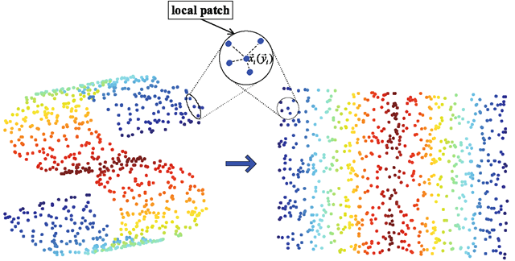
</p>

多维缩放(Mutiple Dimensional Scaling)的目标是在降维的过程中将数据的dissimilarity(差异性)保持下来，也可以理解降维让高维空间中的距离关系与低维空间中距离关系保持不变.

算法原理:

假定m个样本在原始空间的距离矩阵为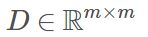，其第i 行和第j 列的元素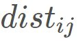为样本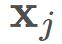和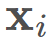 的距离。这样就可以获得样本在d′ 维空间的表示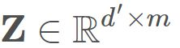,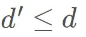，而且任意两个样本在d′ 维空间中的欧式距离等于原始空间中的距离，即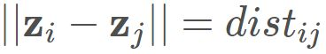.

因此令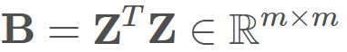，其中B 为降维后样本的内积矩阵，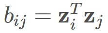，因而会有:

<p align="center">
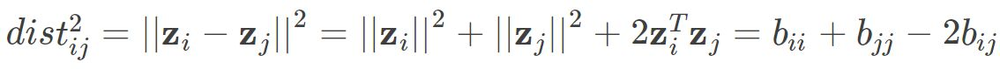
</p>

则有：

<p align="center">
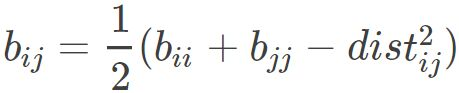
</p>

接下来我们用要用来表示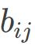. 

通常我们为方便计算，首先需要对数据进行中心化，即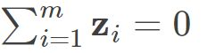，则有:

<p align="center">
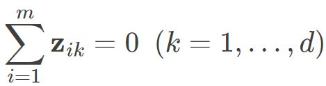
</p>

<p align="center">
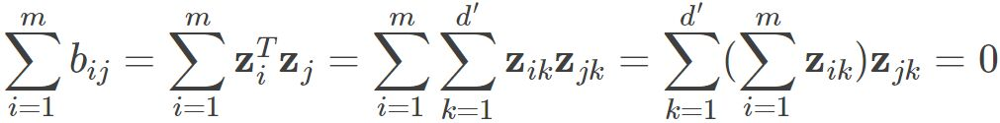
</p>

同理也有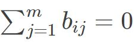.则我们可以得到 
<p align="center">
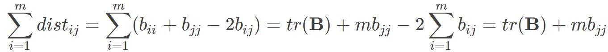
</p>

<p align="center">
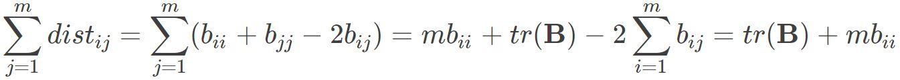
</p>

<p align="center">
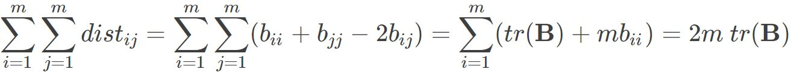
</p>


其中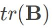为矩阵B的迹，定义为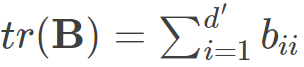则可得到： 

<p align="center">

</p>

因而:

<p align="center">
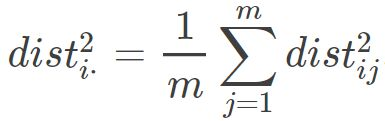
</p>

<p align="center">
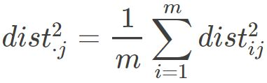
</p>

<p align="center">
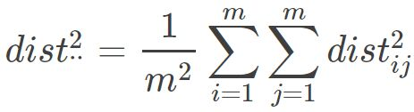
</p>

因此就会有:

<p align="center">
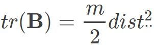
</p>

<p align="center">
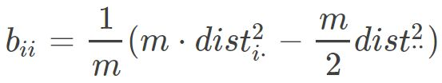
</p>

<p align="center">
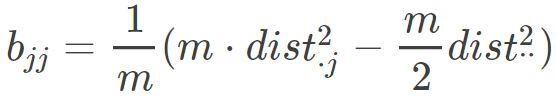
</p>

对于bij ，代入上式后得到:

<p align="center">
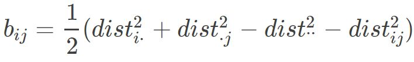
</p>

这样就可以求得降维后矩阵B的各个元素，接着对矩阵B 做特征值分解，即 

<p align="center">

</p>

通常，D 是一个对称实矩阵，此时得到的B刚好会有d个非0的特征值.其中 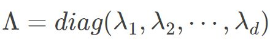为特征值构成的对角矩阵.假定其中有d∗ 个非零特征值，它们构成对角矩阵 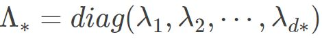，令V∗表示相应的特征向量矩阵，则Z可表达为:

<p align="center">
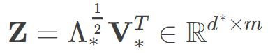
</p>

此外如果想还原原始样本矩阵，就选择d 个特征值和对应的特征向量，如果想要达到降维目的，就取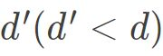个最大特征值和相应的特征向量.

应用示例:
```python
import os, sys, getopt, pdb
from numpy import *
from numpy.linalg import *
from numpy.random import *
import pylab

def mds(d, dimensions = 2):
    """
    Multidimensional Scaling - Given a matrix of interpoint distances,
    find a set of low dimensional points that have similar interpoint
    distances.
    """

    (n,n) = d.shape
    E = (-0.5 * d**2)

    # Use mat to get column and row means to act as column and row means.
    Er = mat(mean(E,1))
    Es = mat(mean(E,0))

    # From Principles of Multivariate Analysis: A User's Perspective (page 107).
    F = array(E - transpose(Er) - Es + mean(E))

    [U, S, V] = svd(F)

    Y = U * sqrt(S)

    return (Y[:,0:dimensions], S)

def norm(vec):
    return sqrt(sum(vec**2))

def square_points(size):
    nsensors = size ** 2
    return array([(i / size, i % size) for i in range(nsensors)])

def test():

    points = square_points(10)

    distance = zeros((100,100))
    for (i, pointi) in enumerate(points):
        for (j, pointj) in enumerate(points):
            distance[i,j] = norm(pointi - pointj)

    Y, eigs = mds(distance)

    pylab.figure(1)
    pylab.plot(Y[:,0],Y[:,1],'.')

    pylab.figure(2)
    pylab.plot(points[:,0], points[:,1], '.')

    pylab.show()

def main():

    def usage():
	print sys.argv[0] + "[-h] [-d]"

    try:
        (options, args) = getopt.getopt(sys.argv[1:], 'dh', ['help','debug'])
    except getopt.GetoptError:
        # print help information and exit:
        usage()
        sys.exit(2)

    for o, a in options:
        if o in ('-h', '--help'):
            usage()
            sys.exit()
	elif o in ('-d', '--debug'):
	    pdb.set_trace()

    test()

if __name__ == "__main__":
    main()

```
