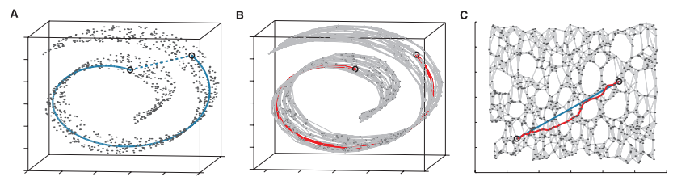
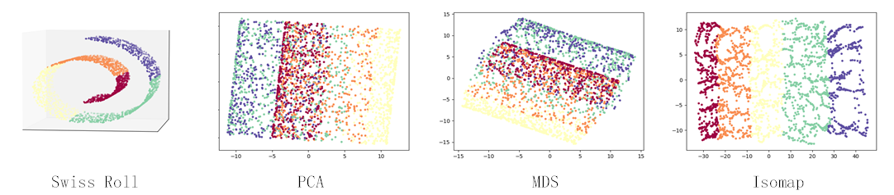

### Deeplearning Algorithms tutorial
谷歌的人工智能位于全球前列，在图像识别、语音识别、无人驾驶等技术上都已经落地。而百度实质意义上扛起了国内的人工智能的大旗，覆盖无人驾驶、智能助手、图像识别等许多层面。苹果业已开始全面拥抱机器学习，新产品进军家庭智能音箱并打造工作站级别Mac。另外，腾讯的深度学习平台Mariana已支持了微信语音识别的语音输入法、语音开放平台、长按语音消息转文本等产品，在微信图像识别中开始应用。全球前十大科技公司全部发力人工智能理论研究和应用的实现，虽然入门艰难，但是一旦入门，高手也就在你的不远处！
AI的开发离不开算法那我们就接下来开始学习算法吧！

#### 等度量映射(IsometricMapping,Isomap)
等度量映射(Isomap)是最经典的非线性映射降维方法之一，它在MDS的基础上引入了“测地距离”的概念，直接解决了MDS使用欧氏距离无法应对非线性流形的问题。

测地距离(Geometric Distance)是高维流形中两点之间的最短距离，高维流形中，空间是不规则的，所以最短距离不一定是直线距离(欧氏距离)。就像蚂蚁从立方体的一面爬到另一面，不能直接横穿立方体一样。

图中左边的两个点的最近距离是蓝色实线的距离，而不应该是虚线的距离。

通常情况下真实的测地距离是非常难以求出的，但是等度量映射基于流形局部近似于欧式空间的定义提出了一种近似的求解方式。

我们通常的做法是:

1. 求得原样本的KNN图，并依据定义保留其欧式距离。
2. 所有非KNN的点间的距离规定为无穷大。
3. 用dijkstra或floyd求出任意两点的最短路便可近似表示两点间的测地距离。
4. 然后等度量映射(Isomap)将得到的测地距离矩阵输入MDS完成降维。

最后等度量映射(Isomap)将得到的测地距离矩阵输入MDS完成降维。

最后的结果是这样的。

