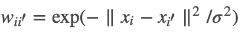
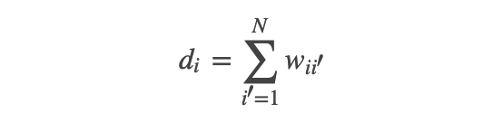
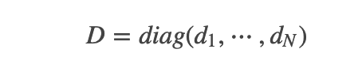
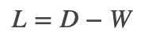
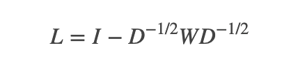
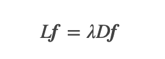
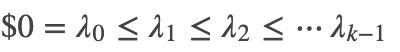

### Deeplearning Algorithms tutorial
谷歌的人工智能位于全球前列，在图像识别、语音识别、无人驾驶等技术上都已经落地。而百度实质意义上扛起了国内的人工智能的大旗，覆盖无人驾驶、智能助手、图像识别等许多层面。苹果业已开始全面拥抱机器学习，新产品进军家庭智能音箱并打造工作站级别Mac。另外，腾讯的深度学习平台Mariana已支持了微信语音识别的语音输入法、语音开放平台、长按语音消息转文本等产品，在微信图像识别中开始应用。全球前十大科技公司全部发力人工智能理论研究和应用的实现，虽然入门艰难，但是一旦入门，高手也就在你的不远处！
AI的开发离不开算法那我们就接下来开始学习算法吧！

#### 拉普拉斯特征映射(Laplacian Eigenmaps)

拉普拉斯特征映射（Laplacian Eigenmaps，LE），就是将核函数方法应用在局部保持投影的非监督降维方法，也是无监督降维的一种方法，LE方法的直观思想是希望相互间有关系的点（在图中相连的点）在降维后的空间中尽可能的靠近。LE可以反映出数据内在的流形结构。

拉普拉斯特征映射是一种基于图的降维算法，它希望相互间有关系的点（在图中相连的点）在降维后的空间中尽可能的靠近，从而在降维后仍能保持原有的数据结构。 借鉴了图论里面的Laplacian矩阵，把每个样本点看成图中的一个节点，通过样本距离或者邻接矩阵得到W（可以表征样本间的相似关系，用来重构数据流形的局部结构特征），再通过D = diag(sum(W,2))，得到对角的度矩阵（每个元素都是行和或者列和），然后通过L = D - W 得到Laplacian矩阵。

Laplacian Eigenmaps算法的主要思想是，如果两个数据实例i和j很相似，那么i和j在降维后目标子空间中应该尽量接近。设数据实例的数目为n，目标子空间即最终的降维目标的维度为m。定义n×m大小的矩阵Y，其中每一个行向量yTi是数据实例i在目标m维子空间中的向量表示（即降维后的数据实例i）。


Laplacian Eigenmap算法主要步骤:

1. 建立邻接图：这里采用ϵ−最近邻图和K−最近邻图都能够解决问题。两种方法各有利弊，前者几何解释清楚，并且邻接矩阵天然是对称的，然而参数选择有困难，并且图的连通性未必有好的保证；后者参数选择容易，且图的连接性较好，但是几何解释不清晰。


2. 赋权：我们常用热核来赋给权重，即对于连通的两个点i,i′,令；而对其它点对权值赋0. 最终我们可以用邻接矩阵W来表示这个图.

3. 计算Laplace算子矩阵：完成建图后，我们定义顶点vi的度是:
<p align="center">

</p>

并构造一个度矩阵:

<p align="center">

</p>

由此即可得到未归一化的图Laplace矩阵:

<p align="center">

</p>

容易说明, L是对称半正定矩阵，特征值是非负实数，且0是L的特征值，而特征向量是常1向量。值得说明的是我们经常采用的是经过归一化的L矩阵，规范化的方法是:

<p align="center">

</p>

4. 计算特征向量：即解以下问题：

<p align="center">

</p>

得到特征值

5. 特征映射：（先验地）假定低维流形维数d的值，并将数据映射到特征空间上，即

<p align="center">

</p>

这就是拉普拉斯特征映射(Laplacian Eigenmaps)算法进行数据降维处理的全过程。

应用示例:
```python
  from numpy import exp, median
from scipy.sparse.csgraph import laplacian
from sklearn.manifold.locally_linear import (
    null_space, LocallyLinearEmbedding)
from sklearn.metrics.pairwise import pairwise_distances, rbf_kernel
from sklearn.neighbors import kneighbors_graph, NearestNeighbors


def ler(X, Y, n_components=2, affinity='nearest_neighbors',
        n_neighbors=None, gamma=None, mu=1.0, y_gamma=None,
        eigen_solver='auto', tol=1e-6, max_iter=100, 
        random_state=None):
    """
    Laplacian Eigenmaps for Regression (LER)

    Parameters
    ----------
    X : ndarray, 2-dimensional
        The data matrix, shape (num_points, num_dims)

    Y : ndarray, 1 or 2-dimensional
        The response matrix, shape (num_points, num_responses).

    n_components : int
        Number of dimensions for embedding. Default is 2.

    affinity : string or callable, default : "nearest_neighbors"
        How to construct the affinity matrix.
         - 'nearest_neighbors' : construct affinity matrix by knn graph
         - 'rbf' : construct affinity matrix by rbf kernel

    n_neighbors : int, optional, default=None
        Number of neighbors for kNN graph construction on X.

    gamma : float, optional, default=None
        Scaling factor for RBF kernel on X.

    mu : float, optional, default=1.0
        Influence of the Y-similarity penalty.

    y_gamma : float, optional
        Scaling factor for RBF kernel on Y.
        Defaults to the inverse of the median distance between rows of Y.

    Returns
    -------
    embedding : ndarray, 2-dimensional
        The embedding of X, shape (num_points, n_components)
    """

    if eigen_solver not in ('auto', 'arpack', 'dense'):
        raise ValueError("unrecognized eigen_solver '%s'" % eigen_solver)

    nbrs = NearestNeighbors(n_neighbors=n_neighbors + 1)
    nbrs.fit(X)
    X = nbrs._fit_X

    Nx, d_in = X.shape
    Ny = Y.shape[0]

    if n_components > d_in:
        raise ValueError("output dimension must be less than or equal "
                         "to input dimension")
    if Nx != Ny:
        raise ValueError("X and Y must have same number of points")
    if affinity == 'nearest_neighbors':
        if n_neighbors >= Nx:
            raise ValueError("n_neighbors must be less than number of points")
        if n_neighbors == None or n_neighbors <= 0:
            raise ValueError("n_neighbors must be positive")
    elif affinity == 'rbf':
        if gamma != None and gamma <= 0:
            raise ValueError("n_neighbors must be positive")
    else:
        raise ValueError("affinity must be 'nearest_neighbors' or 'rbf' must be positive")

    if Y.ndim == 1:
        Y = Y[:, None]

    if y_gamma is None:
        dists = pairwise_distances(Y)
        y_gamma = 1.0 / median(dists)

    if affinity == 'nearest_neighbors':
        affinity = kneighbors_graph(X, n_neighbors, include_self=True)
    else:
        if gamma == None:
            dists = pairwise_distances(X)
            gamma = 1.0 / median(dists)
        affinity = kneighbors_graph(X, n_neighbors, mode='distance', include_self=True)
        affinity.data = exp(-gamma * affinity.data ** 2)

    K = rbf_kernel(Y, gamma=y_gamma)
    lap = laplacian(affinity, normed=True)
    lapK = laplacian(K, normed=True)
    embedding, _ = null_space(lap + mu * lapK, n_components,
                              k_skip=1, eigen_solver=eigen_solver,
                              tol=tol, max_iter=max_iter,
                              random_state=random_state)

    return embedding


class LER(LocallyLinearEmbedding):
    """Scikit-learn compatible class for LER."""

    def __init__(self, n_components=2, affinity='nearest_neighbors',
                 n_neighbors=2, gamma=None, mu=1.0, y_gamma=None, 
                 eigen_solver='auto', tol=1E-6, max_iter=100, 
                 random_state=None, neighbors_algorithm='auto'):

        self.n_components = n_components
        self.affinity = affinity
        self.n_neighbors = n_neighbors
        self.gamma = gamma
        self.mu = mu
        self.y_gamma = y_gamma
        self.eigen_solver = eigen_solver
        self.tol = tol
        self.max_iter = max_iter
        self.random_state = random_state
        self.neighbors_algorithm = neighbors_algorithm

    def fit_transform(self, X, Y):
        self.fit(X, Y)
        return self.embedding_

    def fit(self, X, Y):
        # NN necessary for out-of-sample extensions
        self.nbrs_ = NearestNeighbors(self.n_neighbors,
                                      algorithm=self.neighbors_algorithm)
        self.nbrs_.fit(X)

        self.embedding_ = ler(
            X, Y, n_components=self.n_components, 
            affinity=self.affinity, n_neighbors=self.n_neighbors,
            gamma=self.gamma, mu=self.mu, y_gamma=self.y_gamma,
            eigen_solver=self.eigen_solver, tol=self.tol, 
            max_iter=self.max_iter, random_state=self.random_state)

        return self
```
