### Deeplearning Algorithms tutorial
谷歌的人工智能位于全球前列，在图像识别、语音识别、无人驾驶等技术上都已经落地。而百度实质意义上扛起了国内的人工智能的大旗，覆盖无人驾驶、智能助手、图像识别等许多层面。苹果业已开始全面拥抱机器学习，新产品进军家庭智能音箱并打造工作站级别Mac。另外，腾讯的深度学习平台Mariana已支持了微信语音识别的语音输入法、语音开放平台、长按语音消息转文本等产品，在微信图像识别中开始应用。全球前十大科技公司全部发力人工智能理论研究和应用的实现，虽然入门艰难，但是一旦入门，高手也就在你的不远处！
AI的开发离不开算法那我们就接下来开始学习算法吧！

#### t－分布随机近邻嵌入(t-SNE)

t－分布随机近邻嵌入(t-Distributed Stochastic Neighbor Embedding,t-SNE) 是用于降维的一种机器学习算法，是由 Laurens van der Maaten 和 Geoffrey Hinton在08年提出来。此外，t-SNE 是一种非线性降维算法，非常适用于高维数据降维到2维或者3维，进行可视化。

流形(Manifold)是局部具有欧式空间性质的空间，包括各种纬度的曲线曲面，例如球体、弯曲的平面等。流形的局部和欧式空间是同构的。但是在全局尺度下不能简单的用欧式几何计算。一个好理解的例子就是地球，我们在几米的尺度下计算三角形的内角和是180度，但是在几百公里的尺度下会大于180度。因为地球上有意义的数据点是分布在球面上的，此时需要引入黎曼几何来描述问题。可见流形空间在真实世界中其实是大量存在的，所以我们对数据进行了一个假设，假设数据都是在高维欧式空间中的低维流形，如果我们能将其降维到低维，就能直观的发现其本质和一些内在规律。t-SNE就是基于这样的一个假设。

降维（dimension reduction）的基本作用：

* 缓解维数灾难。即提高样本密度，以及使基于欧氏距离的算法重新生效。

* 数据预处理。对数据去冗余、降低信噪比。

* 方便可视化。

降维的概念中有两对直觉性的概念会反复出现：高维/低维空间、高维/低维数据。在文献中他们有若干别称：

* 高维空间（high-dimensional space），又叫原空间（original space）

* 高维数据（low-dimensional data），也直接叫数据点（data points），用于和下述的映射点对应。

* 低维空间（low-dimensional space），又叫嵌入空间（embedded space）、低维映射（low-dimensional map，map在此做名词用）等。

* 低维数据（low-dimensional data），又叫低维嵌入（low-dimensional embeddings）、低维表示（low-dimensional representations）、映射点（map points）等。

嵌入（embedding）：数学上，嵌入是指一个数学结构经映射包含在另一个结构中。

* NLP目前所使用的词嵌入（word embedding）一词的本意可能就是这个意思。最初所使用的词向量是one-hot向量，维度等于词表大小（约几十万）。后来采用分布式表示的词向量，维度一般取几百维。因此我们认为分布式表示的词向量是更高维度语义空间的低维嵌入（embedding）。

* "Embed Everything！" 嵌入的思想不仅可以用在词（word）上，还能用于许多其他技术上。如知识图谱中可以把原先的网络结构也做嵌入，有实体嵌入、关系嵌入等。

降维技术可以分为线性和非线性两大类：

线性降维技术。侧重让不相似的点在低维表示中分开。

* PCA（Principle Components Analysis，主成分分析）.

* MDS（Multiple Dimensional Scaling，多维缩放）等.

非线性降维技术（广义上“非线性降维技术”≈“流形学习”，狭义上后者是前者子集）。这类技术假设高维数据实际上处于一个比所处空间维度低的非线性流形上，因此侧重让相似的近邻点在低维表示中靠近。

* Sammon mapping.

* SNE（Stochastic Neighbor Embedding，随机近邻嵌入），t-SNE是基于SNE的。

* Isomap（Isometric Mapping，等度量映射）.

* MVU（Maximum Variance Unfolding）.

* LLE（Locally Linear Embedding，局部线性嵌入）等.

流形（manifold）：

* 机器学习中指的流形指本征维度较低但嵌入在高维空间中的空间（a manifold haslow intrinsic dimensions, and is embedded within a space of much higher dimensionality）。比如上图中的S-curve数据集，本征维度=2（摊开来是一个二维空间），但被嵌在三维空间中。

* 数学中提到流形，强调其具有局部欧式空间的性质，可以在局部应用欧几里得距离。但是在机器学习（流形学习）中，这个假设基本不成立。原因是高维空间由于维数灾难的存在，没有足够稠密的数据能在足够小的局部去近似该流形。

* 但是流形概念中局部的思想仍可以借鉴。它为降维提供了另一个视角：从微观角度去探索高维数据结构。

学习：流形学习之所以叫学习，因为它不像PCA一类的纯线性代数降维方法，而是更像一个类似神经网络的学习算法。

* 神经网络大部分是有监督学习；流形学习大部分是无监督学习。

* 神经网络拟合一个分类函数；流形学习（以t-SNE为例）拟合高维数据的分布。

* 神经网络学习参数；流形学习（以t-SNE为例）直接学习低维数据的表达。

* 两者均有损失函数、梯度下降、迭代轮数等学习算法的特点。

#### t-分布

学生t-分布（t-distribution）用于根据小样本来估计呈正态分布且方差未知的总体的均值。其曲线形态与自由度有关，自由度越小，t分布越平坦；自由度为无穷时，t分布等同于标准正态分布。本文主要目的是理解t-SNE，所以只需要知道t-分布的解析式和曲线形状（见下图）即可，更多的内容请自行Wiki。

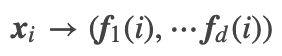

#### SNE

t-SNE可以看做是SNE的改进，所以我们从SNE开始说起。SNE的核心思路可以概括如下：

在高维空间相似的数据点，映射到低维空间距离也是相似的。常规的做法是用欧式距离表示这种相似性，而SNE把这种距离关系转换为一种条件概率来表示相似性。并使高维和低维下每个数据点对于其他数据点的相似性分布尽量接近。

对于高维空间中每一个数据点 xi来说，xj是剩下的每个数据点，我们可以算出 xi 和每一个 xj 的欧式距离 dj 。但是不同维度下的欧式距离没有可比性，所以SNE的想法是构造一个概率来表征出这种距离的相似度来，一个合适易求导的分布就是高斯分布。构造一个 μ=xi 的高斯分布，并假设 σ=σi 是已知的（方差如何选择会在后面讨论）。那么每个 xj 和 xj 的距离对应的概率就可以作为相似度的度量。如下图，显然距离远的点相似度很底，距离近的点相似度很高。

那么这个“高斯相似度”可以定义如下:

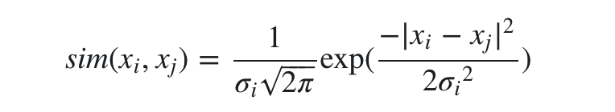

另外因为我们只考虑不同数据点之间的相似度，所以定义 sim(xi,xi)=0.

对 xi 和所有的 xj 计算相似度，我们就可以得到 xi 的相似度分布了，这个分布每一点的概率可以写成条件概率的形式，为了保证概率和为1，需要做归一化。即：

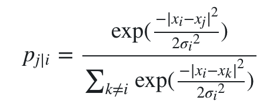

相应的，在低维度我们做同样的处理，设 xi 在低维的映射是 yi ，则可以得到低维下拟合每对数据点相似度的条件概率 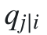。另外由于我们可以任意假设低维下数据点的分布，为了方便和好看就设置每个数据点的相似度分布（同样是高斯分布）的 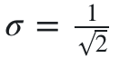 。于是有

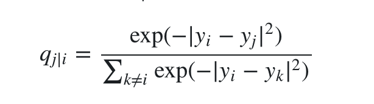

此时就很明朗了，如果 yi 和 yj 能真实反映 xi 和 xj 的关系，那么 pj|i 和 qj|i 就应该是完全相等的。我们对所有j计算条件概率，就能得到这个条件概率的完整分布 Pi 。同理可以得到低维下的分布 Qi 。我们的目标就是使两个分布尽量接近，自然而然想到了KL散度。于是SNE的代价函数就可以写出来了，用梯度下降求解即可。

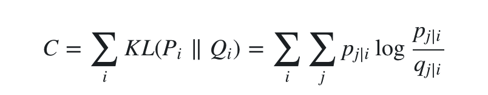

求梯度的过程参考softmax函数的梯度，这里不重要，省略过程。对 yi 求梯度得到:

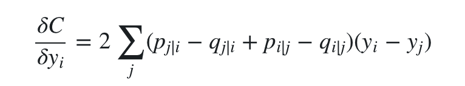

其实这个梯度是有一定物理意义的，可以把 yi 看做一个分子，它最终的受力方向是由所有其他分子对它的合力决定的。对其中一个分子j来说， (pj∣i−qj∣i+pi∣j−qi∣j) 决定了力的大小，(yi−yj) 决定了力的方向。在初始化中，可以用较小的 σ 下的高斯分布来进行初始化。为了加速优化过程和避免陷入局部最优解，梯度中需要使用一个相对较大的动量(momentum)。即参数更新中除了当前的梯度，还要引入之前的梯度累加的指数衰减项，如下:

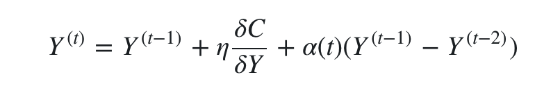

这里的 Y(t) 表示迭代t次的解，η 表示学习速率, α(t) 表示迭代t次的动量。另外SNE在超参数的选择上需要做多次优化才可以。

#### 困惑度（Perplexity）

刚才在构建 qj|i 时，我们假设已知了每个 xi 的高斯相似度分布的 σ 。那 σ 究竟应该怎么设置呢？SNE的唯一参数困惑度就是用来为每个数据点 xi 寻找合适的 σi 的。困惑度可以定义为:

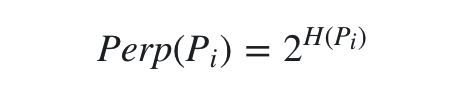

其中 H(Pi) 是 Pi 的香农熵。从直观上是可以理解这个式子的，数据越混乱，熵越大，为了使每个数据点的困惑度都满足给定的困惑度，就需要一个很大的 σi使高斯分布尽量平坦，这样得到的每个 pj|i 就更接近一些。实际上我们经常将Perp设置为近邻数，因为增大 σ 就相当于增加近邻数据点。困惑度通常会被设置为 5 - 50 之间，并且在这个范围内具有良好的鲁棒性。

因为 σi 和 Perp(Pi)是线性相关的，所以当设置好Perp后，我们可以简单的用 Binary Search 去为每个高斯分布找一个对应的 σi 。

#### Symmetric SNE

SNE设计出来之后，效果其实并没有想象的那么好。在人们尝试着去寻找优化方案时发现了这样一个问题， pj|i 和 pi|j 是不对称的。这违背了相似度这个概念的初衷，Symmetric SNE 就是来解决这个问题的。

Symmetric SNE 把条件概率转换为了联合概率去度量相似度，这样就确保了对称性。在实践中联合概率采用了一种简单直观的定义方式:

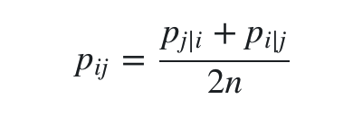

其中n为数据点总数。这样定义既保证了对称性，又保证了每个点对总代价的贡献都不会太小（因为 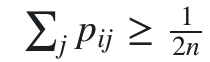 ）。此外，由联合分布计算出的梯度拥有更简单的形式，计算效率更高了。

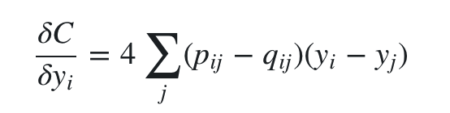

#### 拥挤问题（The Crowding Problem）

虽然 Symmetric SNE 解决了不对称问题，但是其得到的结果类边界也还是有一些模糊。这里涉及到了一个从高维降到低维所面临的拥挤问题。举个例子，我们假设在10维空间中有11个点两两距离相等，但是其降到可以可视化的二维后，我们是没有办法保存它们距离两两相等的信息的，因为在二维空间中最多只有三个点的距离可以两两相等。

再假设在三维空间里有一个球体，数据点在球体内均匀分布。如果想把它降到二维，根据各个点到球心的距离，会得到一个圆形范围，且越靠近球面的数据点越密集。同理，越是高维的“球体”，降到低维后边缘越拥挤，因为高维球体的体积是呈 rd 增长的。这就是所谓的拥挤问题，降维后的簇会拥挤在一起无法区分，SNE 和 Symmetric SNE 都不能很好地解决这个问题。

#### t-SNE

然后t-SNE出现了，t-SNE在SNE的基础上做出了如下两个改进：

* 使用联合概率代替条件概率（同 Symmetric SNE）
* 在低维空间使用t分布代替高斯分布（高维空间不变）

其中第一个改进保证了对称性和代价函数的下限，第二个改进一定程度上解决了拥挤问题。那么t分布是怎么解决拥挤问题的呢？

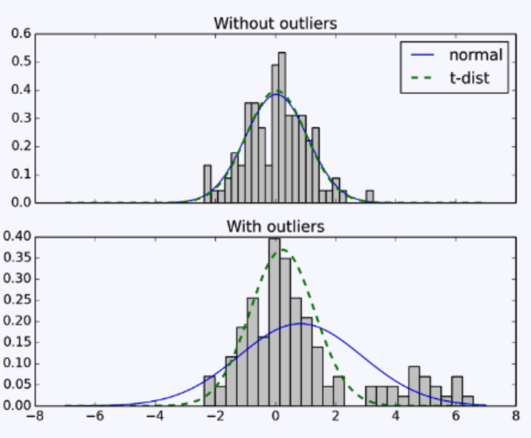

t分布有一个重要的特点：属于长尾分布。我们看上图，高斯分布在3sigma后的概率密度就变得特别小，因此为了迎合长尾部分的数据，它会主动变得平坦，从而导致拟合不准确。或者可以说，高斯分布对异常值较为敏感。而t分布的长尾特性使其既能兼顾均值周围的数据点，又能兼顾边缘的数据点，更好的捕获了数据的特征。

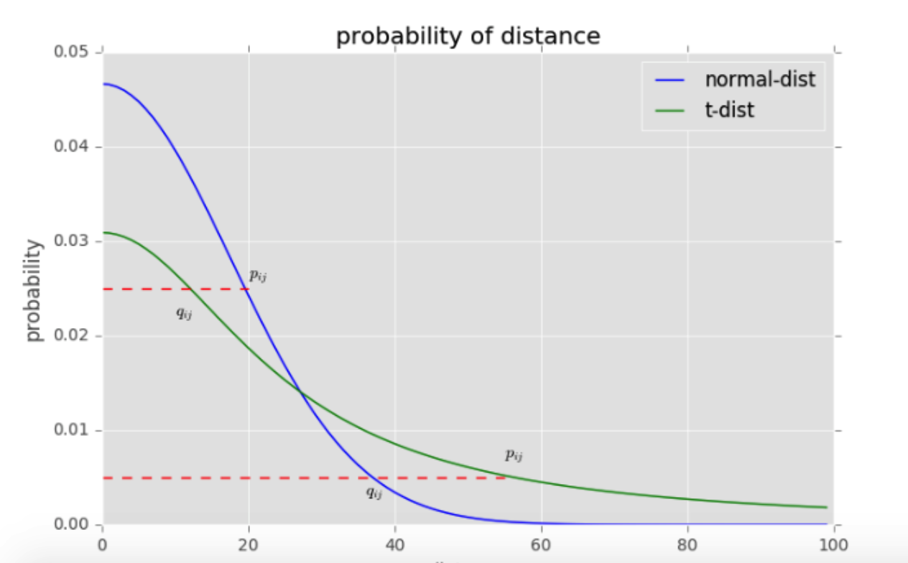

除此之外，高斯分布和t分布的差异也有助于缓解拥挤问题。我们看上图，横轴表示距离，纵轴表示相似度, 可以看到，对于较大相似度的点，t分布在低维空间中的距离需要稍小一点；而对于低相似度的点，t分布在低维空间中的距离需要更远。这恰好满足了我们的需求，即同一簇内的点(距离较近)聚合的更紧密，不同簇之间的点(距离较远)更加疏远。

使用了自由度为1的t分布后， qij 变成了：

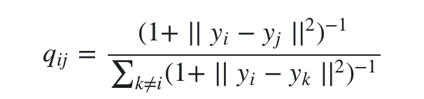

可以看出公式里少了指数函数，计算上会方便很多。最终得到t-SNE的更新梯度（推导见原论文Appendix）是:

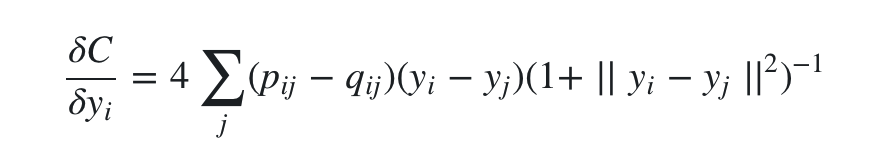

然后再利用梯度下降求解 yi 即可。

####  t-SNE效果

t-SNE降维后的效果，总体是完爆其他可视化降维方法的。

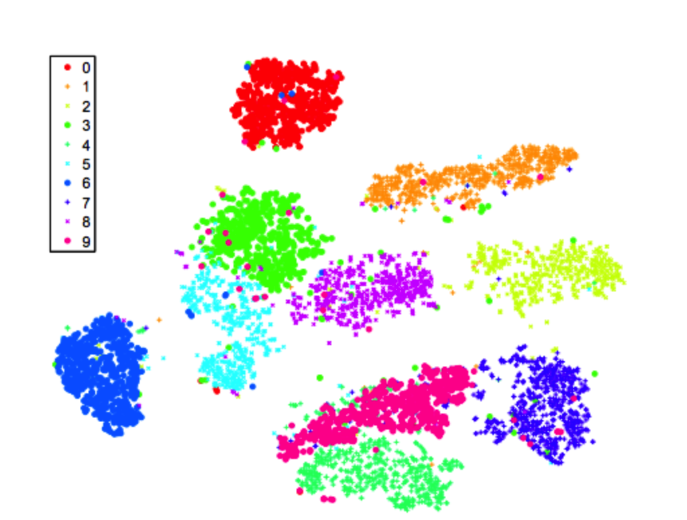

t-SNE得到的是局部最优解。因为KL散度是一个不对称的度量，从代价函数的公式中可以看出，当 pj|i 较大， qj|i 较小时，代价较高；而当 qj|i 较大， pj|i 较小时，代价较低。什么意思呢？就是当高维空间距离远，低维空间距离近的时候，代价函数会很高，模型会尽量避免这种事情发生，所以会加大低维的距离，这没问题。

但是当高维近低维远的时候，代价会变低，模型也就不会在乎这个问题，导致低维空间距离较远的点始终拉不近。换句话说，t-SNE的代价函数更关注局部结构，而忽视了全局结构。所以假设数据集是在高维空间中的低维流形这一点是比较重要的，如果数据集的本征维度本身就很高，那么是不可能完整的映射到2-3维空间的。

#### t-SNE优点

流形学习中其他方法如Isomap、LLE等，主要用于展开单个连续的低维流形（比如“瑞士卷”数据集），而t-SNE主要用于数据的局部结构，并且会倾向于提取出局部的簇，这种能力对于可视化同时包含多个流形的高维数据（比如MNIST数据集）很有效。

#### t-SNE缺点

* 时间、空间复杂度为O(n^2)，计算代价昂贵。百万量级的数据需要几小时，对于PCA可能只需要几分钟。

* 升级版Barnes-Hut t-SNE可以让复杂度降为O(nlogn)，但只限于获得二维和三维的嵌入。（sklearn中可以直接使用参数method='barnes_hut'）

* 由于代价函数非凸，多次执行算法的结果是随机的（名字中“Stochatsic”的由来？），需要多次运行选取最好的结果。

* 全局结构不能很清楚的保留。这个问题可以通过先用PCA降维到一个合理的维度（如50）后再用t-SNE来缓解，前置的PCA步骤也可以起到去除噪声等功能。（sklearn中可以直接使用参数init='pca'）.
