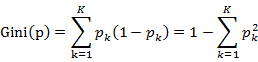
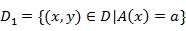
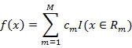

### Deeplearning Algorithms tutorial
谷歌的人工智能位于全球前列，在图像识别、语音识别、无人驾驶等技术上都已经落地。而百度实质意义上扛起了国内的人工智能的大旗，覆盖无人驾驶、智能助手、图像识别等许多层面。苹果业已开始全面拥抱机器学习，新产品进军家庭智能音箱并打造工作站级别Mac。另外，腾讯的深度学习平台Mariana已支持了微信语音识别的语音输入法、语音开放平台、长按语音消息转文本等产品，在微信图像识别中开始应用。全球前十大科技公司全部发力人工智能理论研究和应用的实现，虽然入门艰难，但是一旦入门，高手也就在你的不远处！
AI的开发离不开算法那我们就接下来开始学习算法吧！

#### 分类和回归树（CART）

分类回归树(Classification And Regression Tree, CART)模型是决策树学习方法的一种，CART既可以用于分类计算，也可以用于回归。

不同于C4.5，CART本质是对特征空间进行二元划分（即CART生成的决策树是一棵二叉树），并能够对标量属性（nominal attribute）与连续属性（continuous attribute）进行分裂。
CART决策树是结构简洁的二叉树，采用一种二分递归分割的技术，将当前的样本集分为两个子样本集，使得生成的每个非叶子的节点都有两个分支。

CART算法包括两个过程： 
1. 决策树的生成：基于训练数据集生成决策树，生成的决策树要尽量的大；
2. 决策树的剪枝：用验证数据集对以生成的树进行剪枝并选择最优子树，此时用损失函数最小作为剪枝的标准。

1.决策树的生成
决策树的生成就是递归的构建二叉决策树的过程。对回归树用平方误差最小化准则，对分类树用基尼指数最小化原则，进行特征选择，生成二叉树。

主要的原理如下：(1)分类树原理：分类树采用基尼指数（Gini index, Gini）选择最优特征，同时决定该特征的最优二值切分点。基尼指数定义为：

对于给定样本集合D，其基尼指数的计算为：

如果样本集合D根据特征A是否取某一可能值a被分割成D1和D2两部分，即：,D2=D-D1
则在特征A的条件下，集合D的基尼指数计算公式为：

基尼指数Gini(D)表示集合D的不确定性，基尼指数Gini(D,A)表示经A=a分割后集合D的不确定性。基尼指数值越大，样本集合的不确定性也就越大。
（2）回归树原理：回归树用平方误差最小化准则，进行特征选择，生成二叉树。将输入空间划分为M个区域R1，R2，…，Rm，则生成的回归树模型表示为：

其中cm表示单元Rm上的最小误差平方的最优解.

2、决策树的剪枝

CART算法对于决策树剪枝方法，采用代价复杂度模型，通过交叉验证来估计对预测样本集的误分类损失，产生最小交叉验证误分类估计树。

CART剪枝算法主要由两步组成：首先从生成算法产生的决策树T0底端开始不断剪枝，直到T0的根节点，形成一个子树序列{T0，T1，… ，Tn}；然后通过交叉验证法在独立的验证数据集上对子树序列进行测试，从中选择最优子树。

#### 相关应用
