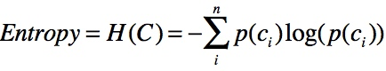
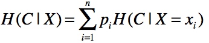
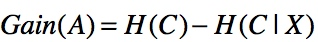

### Deeplearning Algorithms tutorial
谷歌的人工智能位于全球前列，在图像识别、语音识别、无人驾驶等技术上都已经落地。而百度实质意义上扛起了国内的人工智能的大旗，覆盖无人驾驶、智能助手、图像识别等许多层面。苹果业已开始全面拥抱机器学习，新产品进军家庭智能音箱并打造工作站级别Mac。另外，腾讯的深度学习平台Mariana已支持了微信语音识别的语音输入法、语音开放平台、长按语音消息转文本等产品，在微信图像识别中开始应用。全球前十大科技公司全部发力人工智能理论研究和应用的实现，虽然入门艰难，但是一旦入门，高手也就在你的不远处！
AI的开发离不开算法那我们就接下来开始学习算法吧！

#### ID3算法(Iterative Dichotomiser 3)

ID3算法是决策树的一种，它是基于奥卡姆剃刀原理的，即用尽量用较少的东西做更多的事。ID3算法,即Iterative Dichotomiser3，迭代二叉树三代，是Ross Quinlan发明的一种决策树算法，这个算法的基础就是上面提到的奥卡姆剃刀原理，越是小型的决策树越优于大的决策树，尽管如此，也不总是生成最小的树型结构，而是一个启发式算法。

ID3算法的核心思想就是以信息增益来度量属性的选择，选择分裂后信息增益最大的属性进行分裂。
信息增益是属性选择中的一个重要指标，它定义为一个属性能够为分类系统带来多少信息，带来的信息越多，该属性就越重要。而信息量，就是熵。
熵定义为信息量的期望值。

熵越大，一个变量的不确定性越大，它带来的信息量就越大。 计算信息熵的公式为：
<p align="center">

</p>

其中p为出现c分类时的概率。

那么如何计算一个属性的信息增益？ 首先我们需要先根据信息熵公式计算出系统的平均熵值H(C)，然后根据某个属性计算条件熵：
<p align="center">

</p>

这是指属性X被固定时的条件熵。因为X可能的取值有n种,因此在计算条件熵时需要计算n个值，然后取均值（通过概率计算）。通过将某分类的系统熵减去某个属性的条件熵，从而得到该属性的信息增益：
<p align="center">

</p>

在信息论中一个属性的信息增益越大，表明该属性对样本的熵减少能力越强，也就是说确定这个属性会使系统越稳定有序（熵越小系统越稳定），那么该分区的纯度也就越高。

机器学习中，决策树是一个预测模型；他代表的是对象属性与对象值之间的一种映射关系。树中每个节点表示某个对象，而每个分叉路径则代表的某个可能的属性值，而每个叶结点则对应从根节点到该叶节点所经历的路径所表示的对象的值。

决策树仅有单一输出，若欲有复数输出，可以建立独立的决策树以处理不同输出。 数据挖掘中决策树是一种经常要用到的技术，可以用于分析数据，同样也可以用来作预测。 从数据产生决策树的机器学习技术叫做决策树学习,就是决策树。 

通常一个决策树会包含三种类型的节点：

* 决策节点：通常用矩形框来表示
* 机会节点：通常用圆圈来表示
* 终结点：通常用三角形来表示


  
#### 应用案例

```python
import pandas as pd 
from math import log 
from anytree import Node, RenderTree
from anytree.dotexport import RenderTreeGraph

def create_decision_tree_id3(df, y_col):
    # 计算H(C)
    def h_value():
        h = 0
        for v in df.groupby(y_col).size().div(len(df)):
            h += -v * log(v, 2)

        return h

    # 计算某一个属性的信息增益
    def get_info_gain_byc(column, df, y_col):
        # 计算p(column)
        probs = df.groupby(column).size().div(len(df))
        v = 0
        for index1, v1 in probs.iteritems():
            tmp_df = df[df[column] == index1]
            tmp_probs = tmp_df.groupby(y_col).size().div(len(tmp_df))
            tmp_v = 0
            for v2 in tmp_probs:
                # 计算H(C|X=xi)
                tmp_v += -v2 * log(v2, 2)
            # 计算H(y_col|column)
            v += v1 * tmp_v
        return v

    # 获取拥有最大信息增益的属性
    def get_max_info_gain(df, y_col):
        d = {}
        h = h_value()
        for c in filter(lambda c: c != y_col, df.columns):
            # 计算H(y_col) - H(y_col|column)
            d[c] = h - get_info_gain_byc(c, df, y_col)

        return max(d, key=d.get)

    # 生成决策树
    def train_decision_tree(node, df, y_col):
        c = get_max_info_gain(df, y_col)
        for v in pd.unique(df[c]):
            gb = df[df[c] == v].groupby(y_col)
            curr_node = Node('%s-%s' % (c, v), parent=node)
            # 如果属性没有用完
            if len(df.columns) > 2:
                # 如果分区纯度是100%，则生成类别叶子节点
                if len(gb) == 1:
                    Node(df[df[c] == v].groupby(c)[y_col].first().iloc[0], parent=curr_node)
                else:
                    # 如果分区不纯则继续递归
                    train_decision_tree(curr_node, df[df[c] == v].drop(c, axis=1), y_col)
            # 如果属性用完，则选择数量最多的类别实例作为类别叶子结点
            else:
                Node(df[df[c] == v].groupby(y_col).size().idxmax(), parent=curr_node)

    root_node = Node('root')
    train_decision_tree(root_node, df, y_col)
    return root_node

df = pd.read_csv('~/allele.csv')
root_node = create_decision_tree_id3(df, 'buys_computer')
for pre, fill, node in RenderTree(root_node):
    print("%s%s" % (pre, node.name))
    
RenderTreeGraph(root_node).to_picture("decision_tree_id3.png")

```
