### Deeplearning Algorithms tutorial
谷歌的人工智能位于全球前列，在图像识别、语音识别、无人驾驶等技术上都已经落地。而百度实质意义上扛起了国内的人工智能的大旗，覆盖无人驾驶、智能助手、图像识别等许多层面。苹果业已开始全面拥抱机器学习，新产品进军家庭智能音箱并打造工作站级别Mac。另外，腾讯的深度学习平台Mariana已支持了微信语音识别的语音输入法、语音开放平台、长按语音消息转文本等产品，在微信图像识别中开始应用。全球前十大科技公司全部发力人工智能理论研究和应用的实现，虽然入门艰难，但是一旦入门，高手也就在你的不远处！
AI的开发离不开算法那我们就接下来开始学习算法吧！

#### 梯度推进机（Gradient Boosting Machine,GBM）

梯度推进理论核心是梯度推移理论。它认为，不同国家或不同地区间存在着产业梯度和经济梯度，存在梯度地区技术经济势差，就存在着技术经济推移的动力，就会形成生产力的空间推移。梯度推进是一种用于回归和分类问题的机器学习技术，该技术以弱预测模型（通常为决策树）的集合的形式产生预测模型。它像其他增强方法那样以阶段式方式构建模型，并且通过允许优化任意可微损失函数来推广它们。

梯度提升通常用于作为基础学习者的固定大小的决策树（特别是CART树）。对于这种特殊情况，弗里德曼提出了对梯度提升方法的修改，该方法可以提高每个基础学习者的适应质量。

梯度推进理论梯度提升将弱“学习者”以迭代的方式组合成一个强大的学习者。在最小二乘回归设置中解释最容易，其目标是“教”一个模型F预测表单的值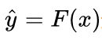通过最小化均方误差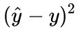，在输出变量的一些实际值的训练集上进行平均y。

在每个阶段 m，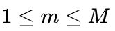，梯度提升，可以假定存在一些不完善的模型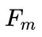（首先，可以使用一个非常弱的模型，它可以预测训练集中的平均值y).梯度提升算法进一步改进通过构建一个新的模型来增加一个估计器h来提供一个更好的模型：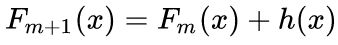.寻找h梯度增强解决方案从观察到完美的h意味着开始

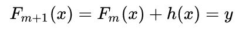

或者等同地，

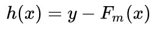

因此，梯度升压将适合h到残余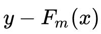。就像其他增强型变体一样，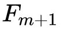学会纠正其前任 .把这个想法推广到除了平方误差之外的损失函数 - 以及分类和排序问题 - 从观察残差开始对于给定的模型是平方误差损失函数的负梯度(相对于F(x))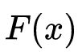.所以，梯度增强是一种梯度下降算法; 并推广它需要“插入”不同的损失及其梯度。

#### 梯度提升

梯度提升通常用于作为基础学习者的固定大小的决策树（特别是CART树）。对于这种特殊情况，弗里德曼提出了对梯度提升方法的修改，该方法可以提高每个基础学习者的适应质量。

第m步中的通用梯度提升将适合决策树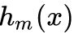伪残差。让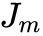是它的叶子的数量。树将输入空间分成不相交的地区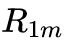，...，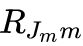并预测每个地区的恒定值。使用指标符号，输出对于输入x可以写成总和：

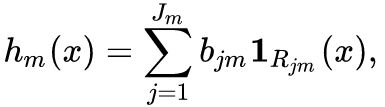

哪里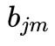是该地区预测的价值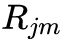。

然后是系数乘以某个值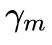，使用线搜索选择以便最小化损失函数，并且模型更新如下：

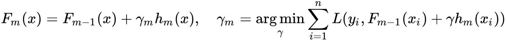

弗里德曼提出修改这个算法，以便它选择一个单独的最优值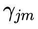对于每个树的区域，而不是一个
为整棵树。他称修改后的算法为“TreeBoost”。系数从树形拟合过程可以简单地被丢弃并且模型更新规则变为：

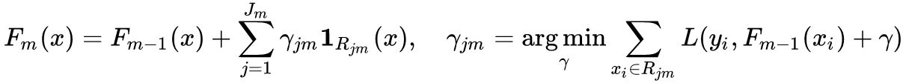

