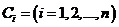
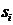
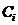
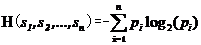
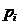
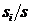
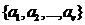
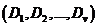

### Deeplearning Algorithms tutorial
谷歌的人工智能位于全球前列，在图像识别、语音识别、无人驾驶等技术上都已经落地。而百度实质意义上扛起了国内的人工智能的大旗，覆盖无人驾驶、智能助手、图像识别等许多层面。苹果业已开始全面拥抱机器学习，新产品进军家庭智能音箱并打造工作站级别Mac。另外，腾讯的深度学习平台Mariana已支持了微信语音识别的语音输入法、语音开放平台、长按语音消息转文本等产品，在微信图像识别中开始应用。全球前十大科技公司全部发力人工智能理论研究和应用的实现，虽然入门艰难，但是一旦入门，高手也就在你的不远处！
AI的开发离不开算法那我们就接下来开始学习算法吧！

机器学习是一门多领域交叉学科，涉及概率论、统计学、逼近论、凸分析、算法复杂度理论等多门学科。主要研究计算机怎样模拟或实现人类的学习行为，以获取新的知识和技能，重新组织已有的知识结构，不断的改善自身的性能。

机器学习理论主要是设计和分析一些让计算机可以自动“学习”的算法。这些算法是一类能从数据中自动分析获得规律，并利用规律对未知数据进行预测的算法。简而言之，机器学习主要以数据为基础，通过大数据本身，运用计算机自我学习来寻找数据本身的规律，而这是机器学习与统计分析的基本区别。

机器学习主要有三种方式：监督学习，无监督学习与半监督学习。

(1)监督学习：从给定的训练数据集中学习出一个函数，当新的数据输入时，可以根据函数预测相应的结果。监督学习的训练集要求是包括输入和输出，也就是特征和目标。训练集中的目标是有标注的。如今机器学习已固有的监督学习算法有可以进行分类的，例如贝叶斯分类，SVM，ID3，C4.5以及分类决策树，以及现在最火热的人工神经网络，例如BP神经网络，RBF神经网络，Hopfield神经网络、深度信念网络和卷积神经网络等。人工神经网络是模拟人大脑的思考方式来进行分析，在人工神经网络中有显层，隐层以及输出层，而每一层都会有神经元，神经元的状态或开启或关闭，这取决于大数据。同样监督机器学习算法也可以作回归，最常用便是逻辑回归。
(2)监督学习：与有监督学习相比，无监督学习的训练集的类标号是未知的，并且要学习的类的个数或集合可能事先不知道。常见的无监督学习算法包括聚类和关联，例如K均值法、Apriori算法。
(3)半监督学习：介于监督学习和无监督学习之间,例如EM算法.

如今的机器学习领域主要的研究工作在三个方面进行：1.面向任务的研究,研究和分析改进一组预定任务的执行性能的学习系统；2.认知模型，研究人类学习过程并进行计算模拟；3.理论的分析，从理论的层面探索可能的算法和独立的应用领域算法.

#### 决策树

决策树（Decision Tree）是应用于分类的一种树结构。其中的每个内部节点（internal node）代表对某个属性的一次测试判别，一个分枝代表一个测试结果，叶子（leaf）代表某个类（class）或者类的分布（class distribution）。最顶层的节点是根结点。可以将决策树理解为一个if-then规则的集合，由决策树的根节点到叶节点的每一条路径构建一条规则。

决策树学习算法包含特征选择、决策树的生成和决策树的修剪过程，构造决策树的方法是采用自上而下的递归构造。

构造的思路是，如果训练样本集合中的所有样本是同类的，则将之作为叶子节点，节点内容即是该类别标记。否则，根据某种策略（如信息熵或GINI系数）选择一个属性，按照属性的各个取值，把样本集合划分为若干子集合，使得每个子集上的所有样本在该属性上具有同样的属性值，然后再依次递归处理各个子集。这种思路实际上就是“分而治之”的道理。

信息增益算法：
设D是s个样本的集合，具有n个不同的类别，设是类的样本数，那么对给定的样本分类所需要的经验熵为：

其中为任意样本属于类的概率，并用估计。

设属性A具有v个不同的值,可以用A属性将集合D划分为v个子集
