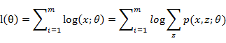
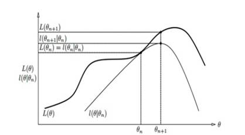
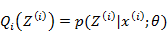

### Deeplearning Algorithms tutorial
谷歌的人工智能位于全球前列，在图像识别、语音识别、无人驾驶等技术上都已经落地。而百度实质意义上扛起了国内的人工智能的大旗，覆盖无人驾驶、智能助手、图像识别等许多层面。苹果业已开始全面拥抱机器学习，新产品进军家庭智能音箱并打造工作站级别Mac。另外，腾讯的深度学习平台Mariana已支持了微信语音识别的语音输入法、语音开放平台、长按语音消息转文本等产品，在微信图像识别中开始应用。全球前十大科技公司全部发力人工智能理论研究和应用的实现，虽然入门艰难，但是一旦入门，高手也就在你的不远处！
AI的开发离不开算法那我们就接下来开始学习算法吧！

机器学习是一门多领域交叉学科，涉及概率论、统计学、逼近论、凸分析、算法复杂度理论等多门学科。主要研究计算机怎样模拟或实现人类的学习行为，以获取新的知识和技能，重新组织已有的知识结构，不断的改善自身的性能。

机器学习理论主要是设计和分析一些让计算机可以自动“学习”的算法。这些算法是一类能从数据中自动分析获得规律，并利用规律对未知数据进行预测的算法。简而言之，机器学习主要以数据为基础，通过大数据本身，运用计算机自我学习来寻找数据本身的规律，而这是机器学习与统计分析的基本区别。

机器学习主要有三种方式：监督学习，无监督学习与半监督学习。

(1)监督学习：从给定的训练数据集中学习出一个函数，当新的数据输入时，可以根据函数预测相应的结果。监督学习的训练集要求是包括输入和输出，也就是特征和目标。训练集中的目标是有标注的。如今机器学习已固有的监督学习算法有可以进行分类的，例如贝叶斯分类，SVM，ID3，C4.5以及分类决策树，以及现在最火热的人工神经网络，例如BP神经网络，RBF神经网络，Hopfield神经网络、深度信念网络和卷积神经网络等。人工神经网络是模拟人大脑的思考方式来进行分析，在人工神经网络中有显层，隐层以及输出层，而每一层都会有神经元，神经元的状态或开启或关闭，这取决于大数据。同样监督机器学习算法也可以作回归，最常用便是逻辑回归。
(2)监督学习：与有监督学习相比，无监督学习的训练集的类标号是未知的，并且要学习的类的个数或集合可能事先不知道。常见的无监督学习算法包括聚类和关联，例如K均值法、Apriori算法。
(3)半监督学习：介于监督学习和无监督学习之间,例如EM算法.

如今的机器学习领域主要的研究工作在三个方面进行：1.面向任务的研究,研究和分析改进一组预定任务的执行性能的学习系统；2.认知模型，研究人类学习过程并进行计算模拟；3.理论的分析，从理论的层面探索可能的算法和独立的应用领域算法.

#### 算法描述

1.算法摘要

EM又称为期望最大化算法（Expectation Maximization, EM），该算法是一种解决含有隐含变量优化问题的有效方法，常用在机器学习和计算机视觉的数据聚类，高斯混合模型的参数估计中。

2.算法原理

EM算法是一种迭代算法，用于含有隐含变量的概率模型参数的极大似然估计，或极大后验概率估计。当给定样本观测变量数据为X，隐变量数据为Z，联合分布表示为p(X,Zθ)，条件分布可以表示为p(ZX,θ))。那么，估计模型的形式可以表示为：

由于模型中存在隐含变量，并不能直接采用极大似然估计法，或贝叶斯估计法，估计上述模型的参数。EM算法能够通过不断求解下界的极大化逼近，来求解对数似然函数，如图所示EM算法迭代过程:

EM算法的每次迭代包含两步：
(1)EM算法-E步,利用对隐藏变量的现有估计值，计算其最大似然估计值，以此实现期望化的过程，即：

(2)EM算法-M步：最大化在E步上的最大似然估计值来计算参数的值，每次迭代使得似然函数增大或达到局部极值，即：

EM算法的最大优点是简单性和普适性。EM算法对于初值的选择非常重要，常用的方法是选取几个不同的初值进行迭代，然后比较得到的估计值，选取最优的。EM算法采用下界迭代的方法，这样并不能保证找到全局最优解。
