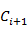
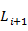

### Deeplearning Algorithms tutorial
谷歌的人工智能位于全球前列，在图像识别、语音识别、无人驾驶等技术上都已经落地。而百度实质意义上扛起了国内的人工智能的大旗，覆盖无人驾驶、智能助手、图像识别等许多层面。苹果业已开始全面拥抱机器学习，新产品进军家庭智能音箱并打造工作站级别Mac。另外，腾讯的深度学习平台Mariana已支持了微信语音识别的语音输入法、语音开放平台、长按语音消息转文本等产品，在微信图像识别中开始应用。全球前十大科技公司全部发力人工智能理论研究和应用的实现，虽然入门艰难，但是一旦入门，高手也就在你的不远处！
AI的开发离不开算法那我们就接下来开始学习算法吧！

#### GSP序列

广义序列模式（简称GSP）算法是Apriori类算法，采用冗余候选模式的剪除策略和特殊的数据结构-哈希树来实现候选模式的快速访存。

GSP算法描述主要包含以下三个步骤：

 (1)扫描序列数据库，得到长度为1的序列模式，作为初始的种子集。
 (2)根据长度为i的种子集，通过连接操作和修剪操作生成长度为i+1的候选序列模式，然后扫描序列数据库，计算每个候选序列模式的支持度，产生长度为i+1的序列模式，并将作为新的种子集。
 (3)重复以上步骤，直到没有新的序列模式或新的候选序列模式产生为止。

GSP产生候选序列模式两个步骤：

 (1)连接阶段：当去掉序列模式S1的第一个项目与去掉序列模式S2的最后一个项目所得到的序列相同，则可以将S1和S2进行连接，即将S2的最后一个项目添加到S1中去。

 (2)剪枝阶段：若某候选序列模式的某个子集不是序列模式，则此候选序列模式不可能是序列模式，将它从候选序列模式中删除。

GSP算法需要重复的扫描序列数据库，会产生大量的候选集，当序列模式的长度较长的情况下，用GSP处理比较困难。

#### 算法背景

GSP序列模式是由Srikant R和Agrawal R于1996年基于Apriori算法上提出的挖掘序列频繁模式的算法。主要引入3个新概念来定义频繁模式子序列，(1)加入时间约束，使得只要满足最小和最大约束，都算是连续的;(2)加入时间计算复杂度，控制在一定范围内的都认为在项集中；(3)加入分类标准。

