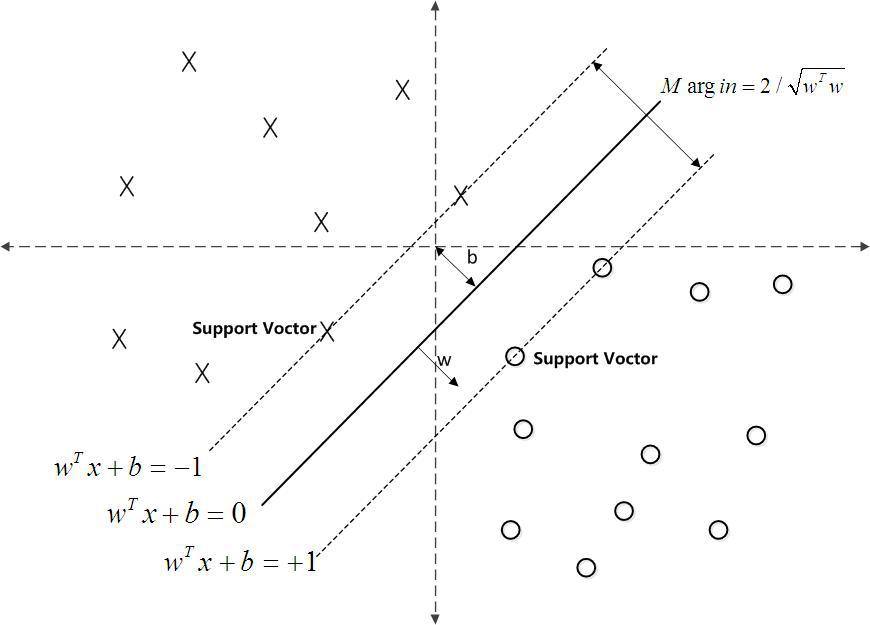

### Deeplearning Algorithms tutorial
谷歌的人工智能位于全球前列，在图像识别、语音识别、无人驾驶等技术上都已经落地。而百度实质意义上扛起了国内的人工智能的大旗，覆盖无人驾驶、智能助手、图像识别等许多层面。苹果业已开始全面拥抱机器学习，新产品进军家庭智能音箱并打造工作站级别Mac。另外，腾讯的深度学习平台Mariana已支持了微信语音识别的语音输入法、语音开放平台、长按语音消息转文本等产品，在微信图像识别中开始应用。全球前十大科技公司全部发力人工智能理论研究和应用的实现，虽然入门艰难，但是一旦入门，高手也就在你的不远处！
AI的开发离不开算法那我们就接下来开始学习算法吧！

#### 支持向量机（SVM）

支持向量机(Support Vector Machine，SVM)是Corinna Cortes和Vapnik在1995年首先提出的，是一种监督式学习的方法，可广泛地应用于统计分类以及回归分析。支持向量机属于一般化线性分类器，这族分类器的特点是他们能够同时最小化经验误差与最大化几何边缘区，因此支持向量机也被称为最大边缘区分类器。

在机器学习中，支持向量机（SVM，还支持矢量网络）是与相关的学习算法有关的监督学习模型，可以分析数据，识别模式，用于分类和回归分析。
支持向量机方法是建立在统计学习理论的VC维理论和结构风险最小原理基础上的，根据有限的样本信息在模型的复杂性（即对特定训练样本的学习精度）和学习能力（即无错误地识别任意样本的能力）之间寻求最佳折中，以求获得最好的推广能力 。


在机器学习中，支持向量机（SVM，还支持矢量网络）是与相关的学习算法有关的监督学习模型，可以分析数据，识别模式，用于分类和回归分析。给定一组训练样本，每个标记为属于两类，一个SVM训练算法建立了一个模型，分配新的实例为一类或其他类，使其成为非概率二元线性分类。一个SVM模型的例子，如在空间中的点，映射，使得所述不同的类别的例子是由一个明显的差距是尽可能宽划分的表示。新的实施例则映射到相同的空间中，并预测基于它们落在所述间隙侧上属于一个类别。
除了进行线性分类，支持向量机可以使用所谓的核技巧，它们的输入隐含映射成高维特征空间中有效地进行非线性分类。


支持向量机将向量映射到一个更高维的空间里，在这个空间里建立有一个最大间隔超平面。在分开数据的超平面的两边建有两个互相平行的超平面。建立方向合适的分隔超平面使两个与之平行的超平面间的距离最大化。其假定为，平行超平面间的距离或差距越大，分类器的总误差越小。
<p align="center">

</p>


#### 应用示例
```python
# coding: utf8
# svm/smo.py

import numpy as np

from sklearn.metrics.pairwise import rbf_kernel

"""
svm模型
"""

def linearKernel():
    """线性核函数
    """
    def calc(X, A):
        return X * A.T
    return calc

def rbfKernel(delta):
    """rbf核函数
    """
    gamma = 1.0 / (2 * delta**2)

    def calc(X, A):
        return np.mat(rbf_kernel(X, A, gamma=gamma))
    return calc

def getSmo(X, y, C, tol, maxIter, kernel=linearKernel()):
    """SMO

    Args:
        X 训练样本
        y 标签集
        C 正规化参数
        tol 容忍值
        maxIter 最大迭代次数
        K 所用核函数

    Returns:
        trainSimple 简化版训练算法
        train 完整版训练算法
        predict 预测函数
    """
    # 存放核函数的转化结果
    K = kernel(X, X)
    # Cache存放预测误差，用以加快计算速度
    ECache = np.zeros((m,2))

    def predict(X, alphas, b, supportVectorsIndex, supportVectors):
        """计算权值向量

        Args:
            X 预测矩阵
            alphas alphas
            b b
            supportVectorsIndex 支持向量坐标集
            supportVectors 支持向量
        Returns:
            predicts 预测结果
        """
        Ks = kernel(supportVectors, X)
        predicts = (np.multiply(alphas[supportVectorsIndex], y[
            supportVectorsIndex]).T * Ks + b).T
        predicts = np.sign(predicts)
        return predicts

    def w(alphas, b, supportVectorsIndex, supportVectors):
        """计算权值

        Args:
            alphas alphas
            b b
            supportVectorsIndex 支持向量坐标
            supportVectors 支持向量
        Returns:
            w 权值向量
        """
        return (np.multiply(alphas[supportVectorsIndex], y[
            supportVectorsIndex]).T * supportVectors).T

    def E(i, alphas, b):
        """计算预测误差

        Args:
            i i
            alphas alphas
            b b
        Returns:
            E_i 第i个样本的预测误差
        """
        FXi = float(np.multiply(alphas, y).T * K[:, i]) + b
        E = FXi - float(y[i])
        return E

    def updateE(i, alphas, b):
        ECache[i] = [1, E(i, alphas, b)]

    def selectJRand(i):
        """
        """
        j = i
        while j == i:
            j = int(np.random.uniform(0, m))
        return j

    def selectJ(i, Ei, alphas, b):
        """选择权值 \alpha^{(i)}
        """
        maxJ = 0; maxDist=0; Ej = 0
        ECache[i] = [1, Ei]
        validCaches = np.nonzero(ECache[:, 0])[0]
        if len(validCaches) > 1:
            for k in validCaches:
                if k==i: continue
                Ek = E(k, alphas, b)
                dist = np.abs(abs(Ei-Ek))
                if maxDist < dist:
                    Ej = Ek
                    maxJ = k
                    maxDist = dist
            return maxJ, Ej
        else:
            ### 随机选择
            j = selectJRand(i)
            Ej = E(j, alphas, b)
            return j, Ej

    def select(i, alphas, b):
        """alpha对选择
        """
        Ei = E(i, alphas, b)
        # 选择违背KKT条件的，作为alpha2
        Ri = y[i] * Ei
        if (Ri < -tol and alphas[i] < C) or \
                (Ri > tol and alphas[i] > 0):
            # 选择第二个参数
            j = selectJRand(i)
            Ej = E(j, alphas, b)
            # j, Ej = selectJ(i, Ei, alphas, b)
            # get bounds
            if y[i] != y[j]:
                L = max(0, alphas[j] - alphas[i])
                H = min(C, C + alphas[j] - alphas[i])
            else:
                L = max(0, alphas[j] + alphas[i] - C)
                H = min(C, alphas[j] + alphas[i])
            if L == H:
                return 0, alphas, b
            Kii = K[i, i]
            Kjj = K[j, j]
            Kij = K[i, j]
            eta = 2.0 * Kij - Kii - Kjj
            if eta >= 0:
                return 0, alphas, b
            iOld = alphas[i].copy()
            jOld = alphas[j].copy()
            alphas[j] = jOld - y[j] * (Ei - Ej) / eta
            if alphas[j] > H:
                alphas[j] = H
            elif alphas[j] < L:
                alphas[j] = L
            if abs(alphas[j] - jOld) < tol:
                alphas[j] = jOld
                return 0, alphas, b
            alphas[i] = iOld + y[i] * y[j] * (jOld - alphas[j])
            # update ECache
            updateE(i, alphas, b)
            updateE(j, alphas, b)
            # update b
            bINew = b - Ei - y[i] * (alphas[i] - iOld) * Kii - y[j] * \
                (alphas[j] - jOld) * Kij
            bJNew = b - Ej - y[i] * (alphas[i] - iOld) * Kij - y[j] * \
                (alphas[j] - jOld) * Kjj
            if alphas[i] > 0 and alphas[i] < C:
                bNew = bINew
            elif alphas[j] > 0 and alphas[j] < C:
                bNew = bJNew
            else:
                bNew = (bINew + bJNew) / 2
            return 1, alphas, b
        else:
            return 0, alphas, b

    def train():
        """完整版训练算法

        Returns:
            alphas alphas
            w w
            b b
            supportVectorsIndex 支持向量的坐标集
            supportVectors 支持向量
            iterCount 迭代次数
        """
        numChanged = 0
        examineAll = True
        iterCount = 0
        alphas = np.mat(np.zeros((m, 1)))
        b = 0
        # 如果所有alpha都遵从 KKT 条件，则在整个训练集上迭代
        # 否则在处于边界内 (0, C) 的 alpha 中迭代
        while (numChanged > 0 or examineAll) and (iterCount < maxIter):
            numChanged = 0
            if examineAll:
                for i in range(m):
                    changed, alphas, b = select(i, alphas, b)
                    numChanged += changed
            else:
                nonBoundIds = np.nonzero((alphas.A > 0) * (alphas.A < C))[0]
                for i in nonBoundIds:
                    changed, alphas, b = select(i, alphas, b)
                    numChanged += changed
            iterCount += 1

            if examineAll:
                examineAll = False
            elif numChanged == 0:
                examineAll = True
        supportVectorsIndex = np.nonzero(alphas.A > 0)[0]
        supportVectors = np.mat(X[supportVectorsIndex])
        return alphas, w(alphas, b, supportVectorsIndex, supportVectors), b, \
            supportVectorsIndex, supportVectors, iterCount

    def trainSimple():
        """简化版训练算法

        Returns:
            alphas alphas
            w w
            b b
            supportVectorsIndex 支持向量的坐标集
            supportVectors 支持向量
            iterCount 迭代次数
        """
        numChanged = 0
        iterCount = 0
        alphas = np.mat(np.zeros((m, 1)))
        b = 0
        L = 0
        H = 0
        while iterCount < maxIter:
            numChanged = 0
            for i in range(m):
                Ei = E(i, alphas, b)
                Ri = y[i] * Ei
                # 选择违背KKT条件的，作为alpha2
                if (Ri < -tol and alphas[i] < C) or \
                        (Ri > tol and alphas[i] > 0):
                    # 选择第二个参数
                    j = selectJRand(i)
                    Ej = E(j, alphas, b)
                    # get bounds
                    if y[i] != y[j]:
                        L = max(0, alphas[j] - alphas[i])
                        H = min(C, C + alphas[j] - alphas[i])
                    else:
                        L = max(0, alphas[j] + alphas[i] - C)
                        H = min(C, alphas[j] + alphas[i])
                    if L == H:
                        continue
                    Kii = K[i, i]
                    Kjj = K[j, j]
                    Kij = K[i, j]
                    eta = 2.0 * Kij - Kii - Kjj
                    if eta >= 0:
                        continue
                    iOld = alphas[i].copy();
                    jOld = alphas[j].copy()
                    alphas[j] = jOld - y[j] * (Ei - Ej) / eta
                    if alphas[j] > H:
                        alphas[j] = H
                    elif alphas[j] < L:
                        alphas[j] = L
                    if abs(alphas[j] - jOld) < tol:
                        alphas[j] = jOld
                        continue
                    alphas[i] = iOld + y[i] * y[j] * (jOld - alphas[j])
                    # update b
                    bINew = b - Ei - y[i] * (alphas[i] - iOld) * Kii - y[j] * \
                        (alphas[j] - jOld) * Kij
                    bJNew = b - Ej - y[i] * (alphas[i] - iOld) * Kij - y[j] * \
                        (alphas[j] - jOld) * Kjj
                    if alphas[i] > 0 and alphas[i] < C:
                        b = bINew
                    elif alphas[j] > 0 and alphas[j] < C:
                        b = bJNew
                    else:
                        b = (bINew + bJNew) / 2.0
                    numChanged += 1
            if numChanged == 0:
                iterCount += 1
            else:
                iterCount = 0
        supportVectorsIndex = np.nonzero(alphas.A > 0)[0]
        supportVectors = np.mat(X[supportVectorsIndex])
        return alphas, w(alphas, b, supportVectorsIndex, supportVectors), b, \
            supportVectorsIndex, supportVectors, iterCount
    return trainSimple, train, predict
```
相比于神经网络这样更先进的算法，支持向量机有两大主要优势：更高的速度、用更少的样本（千以内）取得更好的表现。这使得该算法非常适合文本分类问题。
