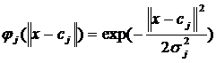
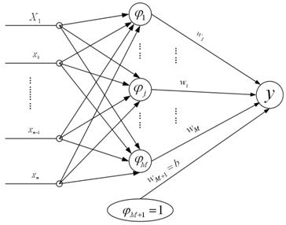
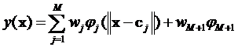

### Deeplearning Algorithms tutorial
谷歌的人工智能位于全球前列，在图像识别、语音识别、无人驾驶等技术上都已经落地。而百度实质意义上扛起了国内的人工智能的大旗，覆盖无人驾驶、智能助手、图像识别等许多层面。苹果业已开始全面拥抱机器学习，新产品进军家庭智能音箱并打造工作站级别Mac。另外，腾讯的深度学习平台Mariana已支持了微信语音识别的语音输入法、语音开放平台、长按语音消息转文本等产品，在微信图像识别中开始应用。全球前十大科技公司全部发力人工智能理论研究和应用的实现，虽然入门艰难，但是一旦入门，高手也就在你的不远处！
AI的开发离不开算法那我们就接下来开始学习算法吧！

#### 径向基函数（Radial Basis Function ，RBF)

径向基函数（RBF，Radial Basis Function）神经网络，是一种对局部逼近的神经网络。是由J.Moody 和C.Darken于20世纪80年代末提出的一种神经网络，径向基函数方法在某种程度上利用了多维空间中传统的严格插值法的研究成果。在神经网络的背景下，隐藏单元提供一个“函数”集，该函数集在输入模式向量扩展至隐层空间时为其构建了一个任意的“基”；这个函数集中的函数就被称为径向基函数。径向基函数首先是在实多变量插值问题的解中引入的。径向基函数是目前数值分析研究中的一个主要领域之一。

最基本的径向基函数（RBF）神经网络的构成包括三层，其中每一层都有着完全不同的作用。输入层由一些感知单元组成，它们将网络与外界环境连接起来；第二层是网络中仅有的一个隐层，它的作用是从输入空间到隐层空间之间进行非线性变换，在大多数情况下，隐层空间有较高的维数；输出层是线性的，它为作用于输入层的激活模式提供响应。

基本的径向基函数RBF网络是具有单稳层的三层前馈网络。由于它模拟了人脑中局部调整、相互覆盖接受域（或称感受域，Receptive Field）的神经网络结构，因此，RBF网络是一种局部逼近网络，现已证明它能以任意精度逼近任一连续函数。

RBF 神经网络是一种三层前向网络，通过输入层空间到隐含层空间的非线性变换以及隐含层空间到输出层空间的线性变换，实现输入层空间到输出层空间的映射。这两个层间变换参数的学习可以分别进行，使得 RBF 神经网络的学习速度较快且可避免局部极小问题。


RBF(Radial Basis Function，径向基函数)是某种沿径向对称的标量函数，通常定义为空间中一点到某一中心之间欧氏距离的单调函数，最常用的径向基函数是高斯函数，形式为：

<p align="center">

</p>

中为函数中心向量，为宽度向量。高斯函数的作用域表现出局部性，即当远离时函数取值较小。

如下图所示，RBF 神经网络的结构从左至右分为三层，依次是输入层、隐含层和输出层：

<p align="center">

</p>

RBF神经网络结构图

网络的输出如下式所示：

<p align="center">

</p>

与BP神经网络类似，理论上RBF神经网络对任何非线性连续映射能够用任意精度近似。但RBF神经网络有其自身的特点：

RBF 神经网络结构的物理意义比较明确。RBF 网络可以看成是输入层数据空间（通常是低维空间）到隐含层空间（通常是高维空间）的一种非线性映射，以及隐含层空间到输出层的线性映射。通过选择适当的非线性映射变换 RBF 函数，从而将原低维空间非线性不可分的问题转换成高维空间的近似线性可分的问题。

RBF 神经网络的学习分成两阶段，自组织学习阶段和监督学习阶段。在自组织学习阶段获取隐含层中心，在监督学习阶段获取隐含层到输出层之间的权值，各部分参数都可以快速学习，因此速度较快。

分阶段学习的 RBF 神经网络无局部极小值问题。由于 RBF 神经网络的学习与输入样本聚类中心密切相关，因此 RBF 神经网络比较适合应用于有类别特征的数据。

模型隐含层中心个数设定原则：

由于RBF神经网络的思想是将低维空间非线性不可分问题转换成高维空间线性可分问题，因此隐含层中心个数应该大于输入变量个数，一般设为输入变量个数的 2 倍以上。

由于隐含层中心点坐标代表了输入数据的聚类中心，因此隐含层中心个数应该大于输入数据集的按记录划分的类别个数，这样才能有效提取各种类别输入数据的特征。这需要对输入数据集的业务特征有一定了解，然后给出输入数据类别个数的大致范围。一般设隐含层中心个数为输入数据类别个数的 2 倍以上。

综合以上两个原则设定隐含层中心个数，然后可以根据训练和测试的效果，对中心个数进行适当调整。一般情况下，中心个数设得越多，训练的效果越好，但所需要的时间越长；而当中心个数多到一定程度的时候，增多中心个数对训练效果的改善已不大。另外，隐含层中心数应该不大于训练数据记录数。


#### 应用示例
```python
def kernelTrans(X, A, kTup):  # calc the kernel or transform data to a higher dimensional space
    """
    核转换函数
    Args:
        X     dataMatIn数据集
        A     dataMatIn数据集的第i行的数据
        kTup  核函数的信息

    Returns:

    """
    m, n = shape(X)
    K = mat(zeros((m, 1)))
    if kTup[0] == 'lin':
        # linear kernel:   m*n * n*1 = m*1
        K = X * A.T
    elif kTup[0] == 'rbf':
        for j in range(m):
            deltaRow = X[j, :] - A
            K[j] = deltaRow * deltaRow.T
        # 径向基函数的高斯版本
        K = exp(K / (-1 * kTup[1] ** 2))  # divide in NumPy is element-wise not matrix like Matlab
    else:
        raise NameError('Houston We Have a Problem -- That Kernel is not recognized')
    return K

def smoP(dataMatIn, classLabels, C, toler, maxIter, kTup=('lin', 0)):
    """
    Args:
        dataMatIn    数据集
        classLabels  类别标签
        C   松弛变量(常量值)，允许有些数据点可以处于分隔面的错误一侧。
            控制最大化间隔和保证大部分的函数间隔小于1.0这两个目标的权重。
            可以通过调节该参数达到不同的结果。
        toler   容错率
        maxIter 退出前最大的循环次数
        kTup    包含核函数信息的元组
    Returns:
        b       模型的常量值
        alphas  拉格朗日乘子
    """

    # 创建一个 optStruct 对象
    oS = optStruct(mat(dataMatIn), mat(classLabels).transpose(), C, toler, kTup)
    iter = 0
    entireSet = True
    alphaPairsChanged = 0

    # 循环遍历：循环maxIter次 并且 （alphaPairsChanged存在可以改变 or 所有行遍历一遍）
    while (iter < maxIter) and ((alphaPairsChanged > 0) or (entireSet)):
        alphaPairsChanged = 0

        #  当entireSet=true or 非边界alpha对没有了；就开始寻找 alpha对，然后决定是否要进行else。
        if entireSet:
            # 在数据集上遍历所有可能的alpha
            for i in range(oS.m):
                # 是否存在alpha对，存在就+1
                alphaPairsChanged += innerL(i, oS)
                # print("fullSet, iter: %d i:%d, pairs changed %d" % (iter, i, alphaPairsChanged))
            iter += 1

        # 对已存在 alpha对，选出非边界的alpha值，进行优化。
        else:
            # 遍历所有的非边界alpha值，也就是不在边界0或C上的值。
            nonBoundIs = nonzero((oS.alphas.A > 0) * (oS.alphas.A < C))[0]
            for i in nonBoundIs:
                alphaPairsChanged += innerL(i, oS)
                # print("non-bound, iter: %d i:%d, pairs changed %d" % (iter, i, alphaPairsChanged))
            iter += 1

        # 如果找到alpha对，就优化非边界alpha值，否则，就重新进行寻找，如果寻找一遍 遍历所有的行还是没找到，就退出循环。
        if entireSet:
            entireSet = False  # toggle entire set loop
        elif (alphaPairsChanged == 0):
            entireSet = True
        print("iteration number: %d" % iter)
    return oS.b, oS.alphas
```

#### RBF优点
优点：
1. 它具有唯一最佳的特性，且无局部极小问题存在；
2. RBF神经网络具有较强的输入和输出映射功能，并且理论证明在前向网络中RBF神经网络是完成映射功能的最有效网络；
3. 分类能力好；
4. 学习过程收敛速度快。


#### RBF缺点
缺点：
1. 没有能力来解释自己的推理过程和推理依据；
2. 当样本数据不足时，预测结果不太准确。

