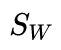
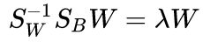
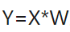

### Deeplearning Algorithms tutorial
谷歌的人工智能位于全球前列，在图像识别、语音识别、无人驾驶等技术上都已经落地。而百度实质意义上扛起了国内的人工智能的大旗，覆盖无人驾驶、智能助手、图像识别等许多层面。苹果业已开始全面拥抱机器学习，新产品进军家庭智能音箱并打造工作站级别Mac。另外，腾讯的深度学习平台Mariana已支持了微信语音识别的语音输入法、语音开放平台、长按语音消息转文本等产品，在微信图像识别中开始应用。全球前十大科技公司全部发力人工智能理论研究和应用的实现，虽然入门艰难，但是一旦入门，高手也就在你的不远处！
AI的开发离不开算法那我们就接下来开始学习算法吧！

#### 线性判别分析（Linear Discriminate Analysis ，LDA)

线性判别式分析(Linear Discriminant Analysis, LDA)，也叫做Fisher线性判别(Fisher Linear Discriminant ,FLD)，是模式识别的经典算法，它是在1996年由Belhumeur引入模式识别和人工智能领域的。线性判别分析是一种经典的线性分类方法。它设法将数据集投影到一条直线上，使得同类样例的投影点尽可能接近，异类样例的投影点尽可能远。这样，在分类时，新样本同样投影到这条直线上，根据投影点的位置来确定类别。

由于LDA把原来N维的样本投影到了N-1维空间，因而也常被视为一种经典的降维技术。

预使得同类样例的投影点尽可能接近，可以让同类样例投影点的协方差尽可能小，即尽可能小。预使得异类样例的投影点尽可能远，可以让不同类样例的投影点尽可能远，即让类中心距离尽可能大，即 尽可能大。这样，目标函数为.

其中类内散度矩阵,类间散度矩阵.

使用拉格朗日乘子法可以求解得到.

对多分类情况，，W的解是的N−1 个最大广义特征值所对应的特征向量组成的矩阵。

线性判别分析降维一般分为5个步骤：
* 计算数据集中每个类别样本的均值向量。
* 通过均值向量，计算类间散度矩阵和类内散度矩阵。
* 对进行特征值求解， 求出的特征向量和特征值。
* 对特征向量按照特征值的大小降序排列，并选择前K个特征向量组成投影矩阵W。
* 通过D*K维的特征值矩阵将样本点投影到新的子空间中，.


#### 应用示例
```python
# coding: utf-8
import pandas as pd

# u may download data from (https://archive.ics.uci.edu/ml/datasets/Iris).
df = pd.read_csv('iris.data', header=None)

feature_dict = {i:label for i,label in zip(
                range(4),
                  ('sepal length in cm',
                  'sepal width in cm',
                  'petal length in cm',
                  'petal width in cm', ))}
df.columns = [l for i,l in sorted(feature_dict.items())] + ['class label']
df.dropna(how="all", inplace=True) # to drop the empty line at file-end

df.tail()


from sklearn.preprocessing import LabelEncoder

X = df[[0,1,2,3]].values
y = df['class label'].values

enc = LabelEncoder()
label_encoder = enc.fit(y)
y = label_encoder.transform(y) + 1

label_dict = {1: 'Setosa', 2: 'Versicolor', 3:'Virginica'}


from matplotlib import pyplot as plt
import numpy as np
import math

fig, axes = plt.subplots(nrows=2, ncols=2, figsize=(12,6))

for ax,cnt in zip(axes.ravel(), range(4)):  

    # set bin sizes
    min_b = math.floor(np.min(X[:,cnt]))
    max_b = math.ceil(np.max(X[:,cnt]))
    bins = np.linspace(min_b, max_b, 25)

    # plottling the histograms
    for lab,col in zip(range(1,4), ('blue', 'red', 'green')):
        ax.hist(X[y==lab, cnt],
                   color=col,
                   label='class %s' %label_dict[lab],
                   bins=bins,
                   alpha=0.5,)
    ylims = ax.get_ylim()

    # plot annotation
    leg = ax.legend(loc='upper right', fancybox=True, fontsize=8)
    leg.get_frame().set_alpha(0.5)
    ax.set_ylim([0, max(ylims)+2])
    ax.set_xlabel(feature_dict[cnt])
    ax.set_title('Iris histogram #%s' %str(cnt+1))

    # hide axis ticks
    ax.tick_params(axis="both", which="both", bottom="off", top="off",  
            labelbottom="on", left="off", right="off", labelleft="on")

    # remove axis spines
    ax.spines["top"].set_visible(False)  
    ax.spines["right"].set_visible(False)
    ax.spines["bottom"].set_visible(False)
    ax.spines["left"].set_visible(False)    

axes[0][0].set_ylabel('count')
axes[1][0].set_ylabel('count')

fig.tight_layout()       

plt.show()

# 从上图的结果中可以看出，花瓣的长度和宽度看起来在不同的类别有较强的区分性，因为这2个特征的直方图中，不同的类别的样本较为分散。
# 因此在实际应用中，我们对特征进行降维，除了使用类似于LDA的特征投影方法（或者叫extraction），特征选择（selection）也是一种较好的方式。
# 像上图这种低纬度的数据集，看一眼直方图我们就可以做出一定的判断。


# step1：计算D维特征样本的均值向量
np.set_printoptions(precision=4)

mean_vectors = []
for cl in range(1,4):
    mean_vectors.append(np.mean(X[y==cl], axis=0))
    print('Mean Vector class %s: %s\n' %(cl, mean_vectors[cl-1]))
    

# step2: 计算散度矩阵

# 计算类内散度矩阵：Sw
S_W = np.zeros((4,4))
for cl,mv in zip(range(1,4), mean_vectors):
    class_sc_mat = np.zeros((4,4))                  # scatter matrix for every class
    for row in X[y == cl]:
        row, mv = row.reshape(4,1), mv.reshape(4,1) # make column vectors
        class_sc_mat += (row-mv).dot((row-mv).T)
    S_W += class_sc_mat                             # sum class scatter matrices
    
    
# 计算类间三度矩阵:Sb
overall_mean = np.mean(X, axis=0)

S_B = np.zeros((4,4))
for i,mean_vec in enumerate(mean_vectors):  
    n = X[y==i+1,:].shape[0]
    mean_vec = mean_vec.reshape(4,1) # make column vector
    overall_mean = overall_mean.reshape(4,1) # make column vector
    S_B += n * (mean_vec - overall_mean).dot((mean_vec - overall_mean).T)

print('between-class Scatter Matrix:\n', S_B)


# step3：求解S?1WSB的特征值问题：
eig_vals, eig_vecs = np.linalg.eig(np.linalg.inv(S_W).dot(S_B))

for i in range(len(eig_vals)):
    eigvec_sc = eig_vecs[:,i].reshape(4,1)   
    print('\nEigenvector {}: \n{}'.format(i+1, eigvec_sc.real))
    print('Eigenvalue {:}: {:.2e}'.format(i+1, eig_vals[i].real))
print('within-class Scatter Matrix:\n', S_W)


# step4：选择新的特征空间
# 先将特征向量按照特征值的大小降序排列，线代中告诉我我们，矩阵乘法可以看做一种线性变换，而特征向量和特征值代表了变换后的方向以及该方向上的
# 缩放比例，因此特征值越大，说明这个方向在变换中越显著，也就是信息量最大。因此我们需要抛弃的是特征值较小的方向，因此我们只需要选取前topk个特征值
# 对应的特征向量，就得到了映射矩阵W

# Make a list of (eigenvalue, eigenvector) tuples
eig_pairs = [(np.abs(eig_vals[i]), eig_vecs[:,i]) for i in range(len(eig_vals))]

# Sort the (eigenvalue, eigenvector) tuples from high to low
eig_pairs = sorted(eig_pairs, key=lambda k: k[0], reverse=True)

# Visually confirm that the list is correctly sorted by decreasing eigenvalues

print('Eigenvalues in decreasing order:\n')
for i in eig_pairs:
    print (i[0], i[1])
    
    
# 从上面的特征值可以看到有2个特征值非常接近0，这2个值之所以接近0，一是代表了他们不包含信息量，第二是因为浮点运算的精确度问题。
# 实际上这2分特征值应该就是0， 因为在LDA中，如果有C类，线性判别式最多只有C-1个，因此对于之前3类的数据集，最多只有2个特征值。
# 由于类间散度矩阵S_B是不同类别C矩阵的和，而C矩阵的秩是1，对于最特殊的完美共线性情况（即所有样本点都在一条直线上），协方差矩阵的秩就会是1，
# 这就导致了只会有一个非0的特征值。
# 我们通过特征值的比例来体现方差的分布：
print('Variance explained:\n')
eigv_sum = sum(eig_vals)
for i,j in enumerate(eig_pairs):
    print('eigenvalue {0:}: {1:.2%}'.format(i+1, (j[0]/eigv_sum).real))
    
W = np.hstack((eig_pairs[0][1].reshape(4,1), eig_pairs[1][1].reshape(4,1)))


# step5：将样本投影到新的空间
X_lda = X.dot(W)
assert X_lda.shape == (150,2), "The matrix is not 150x2 dimensional."


from matplotlib import pyplot as plt

def plot_step_lda():

    ax = plt.subplot(111)
    for label,marker,color in zip(
        range(1,4),('^', 's', 'o'),('blue', 'red', 'green')):

        plt.scatter(x=X_lda[:,0].real[y == label],
                y=X_lda[:,1].real[y == label],
                marker=marker,
                color=color,
                alpha=0.5,
                label=label_dict[label]
                )

    plt.xlabel('LD1')
    plt.ylabel('LD2')

    leg = plt.legend(loc='upper right', fancybox=True)
    leg.get_frame().set_alpha(0.5)
    plt.title('LDA: Iris projection onto the first 2 linear discriminants')

    # hide axis ticks
    plt.tick_params(axis="both", which="both", bottom="off", top="off",  
            labelbottom="on", left="off", right="off", labelleft="on")

    # remove axis spines
    ax.spines["top"].set_visible(False)  
    ax.spines["right"].set_visible(False)
    ax.spines["bottom"].set_visible(False)
    ax.spines["left"].set_visible(False)    

    plt.grid()
    plt.tight_layout
    plt.show()

plot_step_lda()
```
