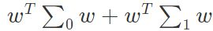
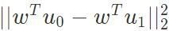
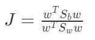
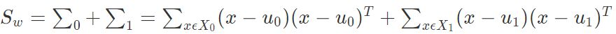
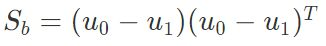
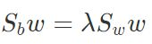
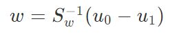
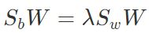
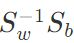

### Deeplearning Algorithms tutorial
谷歌的人工智能位于全球前列，在图像识别、语音识别、无人驾驶等技术上都已经落地。而百度实质意义上扛起了国内的人工智能的大旗，覆盖无人驾驶、智能助手、图像识别等许多层面。苹果业已开始全面拥抱机器学习，新产品进军家庭智能音箱并打造工作站级别Mac。另外，腾讯的深度学习平台Mariana已支持了微信语音识别的语音输入法、语音开放平台、长按语音消息转文本等产品，在微信图像识别中开始应用。全球前十大科技公司全部发力人工智能理论研究和应用的实现，虽然入门艰难，但是一旦入门，高手也就在你的不远处！
AI的开发离不开算法那我们就接下来开始学习算法吧！

#### 线性判别分析（Linear Discriminate Analysis ，LDA)

线性判别式分析(Linear Discriminant Analysis, LDA)，也叫做Fisher线性判别(Fisher Linear Discriminant ,FLD)，是模式识别的经典算法，它是在1996年由Belhumeur引入模式识别和人工智能领域的。线性判别分析是一种经典的线性分类方法。它设法将数据集投影到一条直线上，使得同类样例的投影点尽可能接近，异类样例的投影点尽可能远。这样，在分类时，新样本同样投影到这条直线上，根据投影点的位置来确定类别。

由于LDA把原来N维的样本投影到了N-1维空间，因而也常被视为一种经典的降维技术。

预使得同类样例的投影点尽可能接近，可以让同类样例投影点的协方差尽可能小，即尽可能小。预使得异类样例的投影点尽可能远，可以让不同类样例的投影点尽可能远，即让类中心距离尽可能大，即 尽可能大。这样，目标函数为.

其中类内散度矩阵,类间散度矩阵.

使用拉格朗日乘子法可以求解得到.

对多分类情况，，W的解是的N−1 个最大广义特征值所对应的特征向量组成的矩阵。
