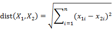

### Deeplearning Algorithms tutorial
谷歌的人工智能位于全球前列，在图像识别、语音识别、无人驾驶等技术上都已经落地。而百度实质意义上扛起了国内的人工智能的大旗，覆盖无人驾驶、智能助手、图像识别等许多层面。苹果业已开始全面拥抱机器学习，新产品进军家庭智能音箱并打造工作站级别Mac。另外，腾讯的深度学习平台Mariana已支持了微信语音识别的语音输入法、语音开放平台、长按语音消息转文本等产品，在微信图像识别中开始应用。全球前十大科技公司全部发力人工智能理论研究和应用的实现，虽然入门艰难，但是一旦入门，高手也就在你的不远处！
AI的开发离不开算法那我们就接下来开始学习算法吧！

机器学习是一门多领域交叉学科，涉及概率论、统计学、逼近论、凸分析、算法复杂度理论等多门学科。主要研究计算机怎样模拟或实现人类的学习行为，以获取新的知识和技能，重新组织已有的知识结构，不断的改善自身的性能。

机器学习理论主要是设计和分析一些让计算机可以自动“学习”的算法。这些算法是一类能从数据中自动分析获得规律，并利用规律对未知数据进行预测的算法。简而言之，机器学习主要以数据为基础，通过大数据本身，运用计算机自我学习来寻找数据本身的规律，而这是机器学习与统计分析的基本区别。

机器学习主要有三种方式：监督学习，无监督学习与半监督学习。

#### KNN
K最近邻算法是一种基于类比的分类方法，主要通过给定的检验组与和它相似的训练组进行比较来学习。训练组用n个属性来描述，每个元组代表n维空间上的点。当给定一个未知元组时，K最近邻分类法搜索该模式空间，找出最接近未知元组的k个训练组，并将未知元组指派到模式空间中它的k个最近邻中的多数类中。

其中“最近邻”主要是以距离来度量的，一般使用欧几里得距离度量两个点或元组的距离，也可以使用曼哈顿距离或其他距离；欧几里得距离的主要计算公式如下：

