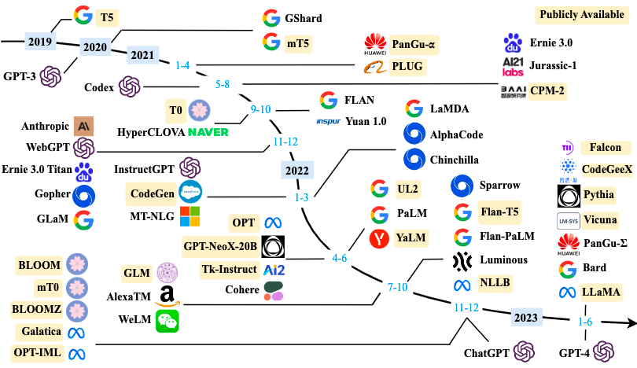

#### 什么是大型语言模型？

大型语言模型（LLM）是基于大量数据进行预训练的超大型深度学习模型。底层转换器是一组神经网络，这些神经网络由具有自注意力功能的编码器和解码器组成。编码器和解码器从一系列文本中提取含义，并理解其中的单词和短语之间的关系。

转换器 LLM 能够进行无监督的训练，但更精确的解释是转换器可以执行自主学习。通过此过程，转换器可学会理解基本的语法、语言和知识。

与早期按顺序处理输入的循环神经网络（RNN）不同，转换器并行处理整个序列。这可让数据科学家使用 GPU 训练基于转换器的 LLM，从而大幅度缩短训练时间。

借助转换器神经网络架构，您可使用非常大规模的模型，其中通常具有数千亿个参数。这种大规模模型可以摄取通常来自互联网的大量数据，但也可以从包含 500 多亿个网页的 Common Crawl 和拥有约 5700 万个页面的 Wikipedia 等来源摄取数据。

#### 为什么大型语言模型如此重要？

大型语言模型非常灵活。一个模型可以执行完全不同的任务，例如回答问题、总结文档、翻译语言和完成语句。LLM 有可能破坏内容创作以及人们使用搜索引擎和虚拟助手的方式。

尽管并不完美，但 LLM 表现出根据相对较少量的提示或输入做出预测的非凡能力。LLM 可用于生成式人工智能，以根据采用人类语言的输入提示生成内容。

LLM 非常庞大。它们可以考虑数十亿个参数，并且有许多可能的用途。下面是一些示例：

Open AI 的 GPT-3 模型有 1750 亿个参数。类似的产品 ChatGPT 可以从数据中识别模式并生成自然且可读的输出。

虽然我们不知道 Claude 2 的规模，但该模型可以在每个提示中输入多达 10 万个令牌，这意味着它可以处理数百页的技术文档，甚至可以处理整本书。

AI21 Labs 的 Jurassic-1 模型具有 1780 亿个参数和由 25 万单词部分组成的令牌词汇表以及类似的对话功能。

Cohere 的 Command 模型具有类似的功能，并且可以使用 100 多种不同的语言开展工作。

LightOn 的 Paradigm 提供根基模型，并且宣称该模型的功能超过 GPT-3。所有这些 LLM 都带有 API，可让开发人员打造独特的生成式人工智能应用程序。

Timeline of LLMs:

#### 大型语言模型如何运作？

LLM 运作原理的一个关键因素是它们表示单词的方式。

早期的机器学习使用数字表来表示每个单词。但是，这种表示形式无法识别单词之间的关系，例如具有相似含义的单词。

人们采用如下方式克服此限制：使用多维向量（通常称为单词嵌入）来表示单词，从而使具有相似上下文含义或其他关系的单词在向量空间中彼此接近。

使用单词嵌入，转换器可以通过编码器将文本预处理为数字表示，并理解含义相似的单词和短语的上下文以及单词之间的其他关系，例如语音部分。然后，LLM 就可以通过解码器应用这些语言知识来生成独特的输出。

#### 大型语言模型有哪些应用？

LLM 有很多实际应用。

* 文案写作

除了 GPT-3 和 ChatGPT 之外，Claude、Llama 2、Cohere Command 和 Jurassic 也可编写原件。

AI21 Wordspice 建议修改原始语句以改善风格和语音。

* 知识库回答

该技术通常称为知识密集型自然语言处理（KI-NLP），是指可以根据数字存档中的信息帮助回答特定问题的 LLM。AI21 Studio playground 能够回答常识性问题就是此类示例。

* 文本分类

使用集群，LLM 可以对含义或情绪相似的文本进行分类。用途包括衡量客户情绪、确定文本之间的关系和文档搜索。

* 代码生成

LLM 擅长根据自然语言提示生成代码。示例包括 Amazon CodeWhisperer 和 GitHub Copilot 中使用的 Open AI Codex，它们可以用 Python、JavaScript、Ruby 和其他几种编程语言编码。其他编码应用包括创建 SQL 查询、编写 Shell 命令和进行网站设计。

* 文本生成

与代码生成类似，文本生成可以完成不完整的语句，编写产品文档，或者像 Alexa Create 一样创作简短的儿童故事。

#### 如何训练大型语言模型？

基于转换器的神经网络非常庞大。这些网络包含多个节点和层。层中的每个节点都有指向后续层中所有节点的连接，并且每个节点都有权重和偏差。权重和偏差以及嵌入称为模型参数。基于转换器的大型神经网络可以有数十亿个参数。模型的大小通常由模型大小、参数数量和训练数据规模之间的经验关系决定。

使用大量高质量数据执行训练。在训练过程中，模型会迭代调整参数值，直到模型可根据前一个输入令牌序列正确预测下一个令牌。为此，模型使用自学技术，这些技术教导模型调整参数，以最大限度地提高训练示例中正确预测下一个令牌的可能性。

经过训练，LLM 可以很容易地适应使用相对较小的有监督数据集执行多项任务，这一过程称为微调。

存在三种常见的学习模型：

* 零样本学习；Base LLM 无需明确训练即可响应各种请求，通常是通过提示，但是答案的准确性各不相同。
* 少量样本学习：通过提供一些相关的训练示例，基础模型在该特定领域的表现显著提升。
* 微调：这是少量样本学习的扩展，其中数据科学家训练基础模型，使模型使用与特定应用相关的其他数据来调整其参数。

#### LLM 的未来前景是什么？

随着 ChatGPT、Claude 2 和 Llama 2 等可以回答问题和生成文本的大型语言模型的引入，我们可以预见令人兴奋的未来前景。可以肯定的是，LLM 会越来越接近人性化的表现，尽管这一过程会较为漫长。这些 LLM 即时取得的成功表明人们对机器人类型 LLM 的浓厚兴趣，这些 LLM 可模仿人类大脑的思维，在某些情况下表现甚至优于人类大脑。以下是一些关于 LLM 未来前景的想法：

* 增强的功能

尽管 LLM 给人们留下了深刻的印象，但当前的技术水平并不完善，LLM 也并非绝对可靠。然而，随着开发人员学习如何在减少偏见和消除错误答案的同时提高性能，较新的 LLM 版本将提高准确性和增强功能。

* 视听训练

开发人员使用文本训练大多数 LLM，但有些人已经开始使用视频和音频输入来训练模型。这种形式的训练应该可以加快模型开发速度，并为将 LLM 用于自动驾驶汽车开辟新的可能性。

* 工作场所转型

LLM 是颠覆性的因素，它将转变工作场所。LLM 可能会采用机器人处理重复性制造任务的相同方式来减少单调和重复的任务。可能减少的任务包括重复的文书任务、客户服务聊天机器人和简单的自动文案写作。

* 对话式人工智能

LLM 无疑将提高 Alexa、Google Assistant 和 Siri 等自动虚拟助手的性能。这些虚拟助手将能够更妥善地解释用户意图并响应复杂的命令。

#### 学习大语言模型指南

1. 入门篇：

* 了解大语言模型的基础知识和常见术语。
* 学会使用编程语言访问 OpenAI API 等常见大语言模型接口。

2. 提高篇：

* 了解机器学习、神经网络、NLP 的基础知识。
* 了解 Transformer 以及典型 Decoder-only 语言模型的基础结构和简单原理。
* 了解大语言模型发展历史，以及业界主流模型（含开源模型）进展。

3. 应用篇：

*  可以在本地环境搭建开源模型的推理环境。
* Prompt 工程。
* 使用已有框架（如Langchain）或自行开发，结合大语言模型结果，开发生产应用。

4. 深入篇：

* 掌握 Continue Pre-train、Fine-tuning 已有开源模型的能力。
* 掌握 Lora、QLora 等低资源高效模型训练的能力。
* 掌握大语言模型微调以及预训练数据准备的能力。
* 深入了解大模型背后的技术原理。
* 了解生产环境部署大模型的相关技术点。

#### 学习资料

1. 入门篇

* [大语言模型](https://github.com/RUCAIBox/LLMSurvey)
* [ChatGPT Prompt Engineering for Developers](https://learn.deeplearning.ai/courses/chatgpt-prompt-eng/lesson/1/introduction)
* [Prompt中英双语字幕](https://github.com/GitHubDaily/ChatGPT-Prompt-Engineering-for-Developers-in-Chinese)
* [OpenAI 官方 Quickstart 文档](https://platform.openai.com/docs/api-reference)
* [GPT的训练和应用](https://www.youtube.com/watch?v=bZQun8Y4L2A)
* [GPT的训练和应用稳定](https://karpathy.ai/stateofgpt.pdf)
