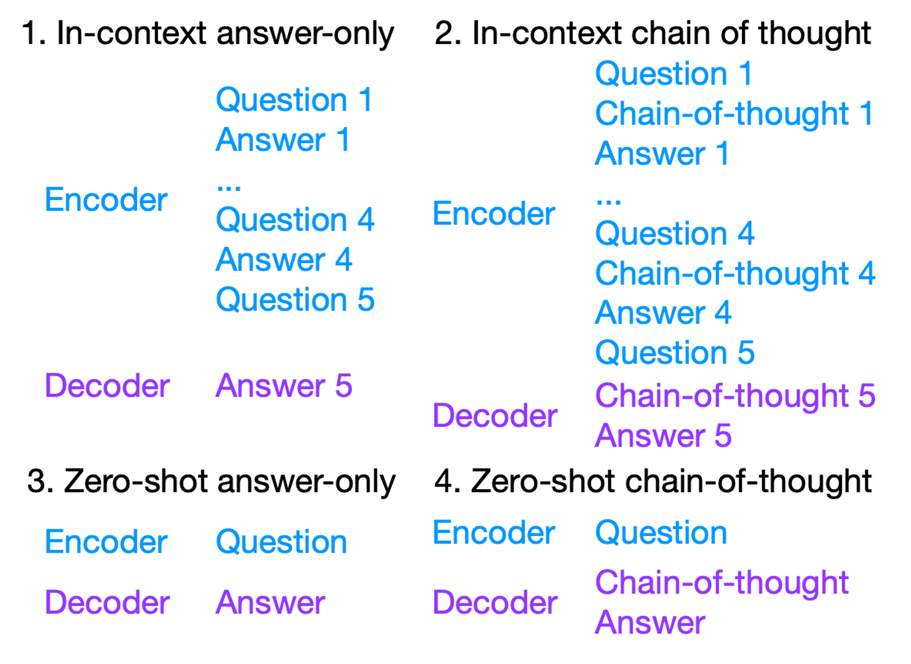
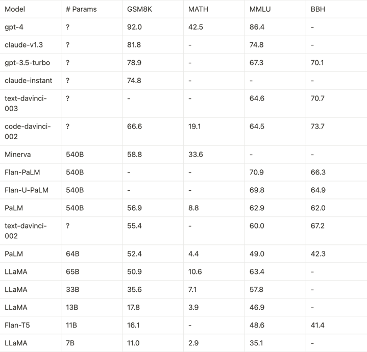

#### 什么是大型语言模型？

大型语言模型（LLM）是基于大量数据进行预训练的超大型深度学习模型。底层转换器是一组神经网络，这些神经网络由具有自注意力功能的编码器和解码器组成。编码器和解码器从一系列文本中提取含义，并理解其中的单词和短语之间的关系。

转换器 LLM 能够进行无监督的训练，但更精确的解释是转换器可以执行自主学习。通过此过程，转换器可学会理解基本的语法、语言和知识。

与早期按顺序处理输入的循环神经网络（RNN）不同，转换器并行处理整个序列。这可让数据科学家使用 GPU 训练基于转换器的 LLM，从而大幅度缩短训练时间。

借助转换器神经网络架构，您可使用非常大规模的模型，其中通常具有数千亿个参数。这种大规模模型可以摄取通常来自互联网的大量数据，但也可以从包含 500 多亿个网页的 Common Crawl 和拥有约 5700 万个页面的 Wikipedia 等来源摄取数据。

#### 大型语言模型工作原理

LLM 通过利用深度学习技术和大量文本数据来运行。这些模型通常基于转换器架构，如生成式预训练转换器，它擅长处理文本输入等顺序数据。LLM 由多层神经网络组成，每层神经网络的参数都可以在训练过程中进行微调，而被称为注意力机制的众多神经网络层则进一步增强了这些神经网络的功能，这些神经网络层可以对数据集的特定部分进行调整。

在训练过程中，这些模型学习根据前面单词提供的上下文来预测句子中的下一个单词。该模型通过将概率分数归因于重复的已标记单词（分解为较小的字符序列）来实现这一点。然后，这些标记被转换为嵌入，嵌入是该上下文的数字表示。

为了确保准确性，这个过程涉及在大量文本语料库（数十亿页）上训练 LLM，使 LLM 能够通过零样本和自我监督学习来学习语法、语义和概念关系。经过这些训练数据的训练后，LLM 就可以根据它们收到的输入自动预测下一个单词，并利用它们获得的模式和知识来生成文本。其结果是生成连贯且与上下文相关的语言，可用于广泛的 NLU 和内容生成任务。

还可以通过即时工程、即时调优、微调和其他策略来提高模型性能，例如基于人类反馈的强化学习 (RLHF)，以消除偏见、仇恨言论和被称为“幻觉”的事实错误答案，这些通常是对如此多的非结构化数据进行训练的有害副产品。这是确保企业级 LLM 随时可用，不会使组织承担不必要的责任或对组织声誉造成损害的最重要的方面之一。

#### LLM 用例

LLM 正在重新定义越来越多的业务流程，并已在各个行业的无数用例和任务中证明了它们的多功能性。LLM 可以增强聊天机器人和虚拟助理（例如 IBM watsonx Assistant 和 Google 的 BARD）中的会话式 AI，以增强支持卓越客户服务的交互，提供模仿与人工客服交互的情境感知响应。

LLM 还擅长内容生成，可以自动创建内容，包括博客文章、营销或销售资料以及其他写作任务。在研究和学术界，它们帮助从大量数据集中总结和提取信息，加速知识发现。LLM 在语言翻译中也发挥着至关重要的作用，通过提供准确且与上下文相关的翻译来打破语言障碍。它们甚至可以用来编写代码，或者在编程语言之间进行“翻译”。

此外，它们还通过提供文字转语音应用以及以无障碍格式生成内容等功能，帮助残障人员，为无障碍访问功能做出了贡献。从医疗保健到金融，LLM 正在通过简化流程、改善客户体验以及实现更高效和数据驱动的决策来推动行业发展和变革。

最令人兴奋的是，所有这些功能都很容易访问，在某些情况下，实际上只需 API 集成即可。

以下是 LLM 为组织带来益处的一些最重要的领域：

* 文本生成：语言生成能力，如根据提示撰写电子邮件、博客文章或其他中长篇内容，并加以提炼和润色。检索增强生成 (RAG) 就是一个很好的例子。

* 内容摘要：将长文章、新闻报道、研究报告、公司文档甚至客户历史记录汇总成根据输出格式定制长度的完整文本。

* AI 助手：聊天机器人，可以回答客户询问、执行后端任务并以自然语言提供详细信息，作为集成式自助客户服务解决方案的一部分。

* 代码生成：帮助开发人员构建应用程序，查找代码中的错误并发现多种编程语言中的安全问题，甚至在它们之间进行“翻译”。

* 情感分析：分析文本，确定客户的语气，以便大规模了解客户反馈并帮助进行品牌声誉管理。

* 语言翻译：通过流畅的翻译和多语言功能，为各语言和地域的组织提供更广泛的覆盖范围。

LLM 将通过实现客户自助服务自动化、加快对越来越多任务的响应以及提高准确性、增强路由和智能上下文收集，影响从金融到保险、人力资源到医疗保健等各个行业。

#### 增加大语言模型推理能力的方案

目前，推理的方案与构建通用大型语言模型和聊天机器人的方案密切相关。总共有三个阶段：

- 预训练或持续训练：在这个阶段，我们通常在大型数据集（如科学文献或代码数据）上训练大型模型。
- 有监督微调：在这个阶段，我们对模型进行微调，以便完成复杂任务的指令。
- 强化学习：在这个阶段，我们使用诸如任务是否已全部/部分完成的信号作为奖励。

因此，在我们的文献分析中，我们同时考虑推理和编码。我们将看到，就学习方法而言，这两者之间存在惊人的相关性。

* 预训练与持续训练

分析以下几项研究：

1. Lewkowycz et. al. 2022. Minerva: [Solving Quantitative Reasoning Problems with Language Models](https://arxiv.org/abs/2206.14858)

* 在来自 Arxiv 论文的 38.5B 的 token 上继续训练 PaLM 540B。 
* 在 MATH （一个需要使用 LaTeX 格式回答问题的困难数据集），上的得分为 33.6（[GPT-4 的得分是 42.5](https://github.com/FranxYao/chain-of-thought-hub)）

2. Taylor et. al. 2022. [Galactica: A Large Language Model for Science](https://arxiv.org/abs/2211.09085)

* 在包含论文、代码、参考资料、知识库和其他内容的 106B token 上预训练一个120B语言模型。
* 在MATH上的表现为 20.4（Minerva 33.6，GPT-4 42.5） 
 
3. Chen et. al. 2021. [Codex: Evaluating Large Language Models Trained on Code](https://arxiv.org/abs/2107.03374)

* 在159GB代码数据上继续训练 12B GPT-3 模型，提高了 HumanEval 数据集上的代码性能。

这些研究发现，在大量科学文献代码上进行训练可以显著提高基础模型的推理编码能力。

####  监督微调

1.  Chung et. al. 2022. [Scaling Instruction-Finetuned Language Models](https://arxiv.org/abs/2210.11416)

- 使用多样化的指令显著提高了模型零样本泛化的能力
- 在指令集合中混合思维链数据（[the flan collection](https://arxiv.org/abs/2301.13688) 文章中进一步讨论了这个问题）明显提高了模型的思维链能力
- 注意：尽管 the flan collection 数据集从多个维度激发了基础模型的能力，但这些指令并非来自真实的聊天机器人用户互动，因此可能[无法直接转化为更好的聊天性能](https://www.yitay.net/blog/flan-ul2-20b)。

2. Fu et. al. 2023. [Specializing Smaller Language Models towards Multi-Step Reasoning](https://arxiv.org/abs/2301.12726)

- 将思维链推理能力提炼到较小规模（小于或等于 10B）的模型。通常，10B 规模的模型非常适合部署（更大的模型太贵了，更小的模型太弱了）。
- 本文讨论了很多工程细节，如数据工程、能力平衡以及小型和大型模型之间的差异

3.  [Li et. al. 2022. Competition-Level Code Generation with AlphaCode](https://arxiv.org/abs/2203.07814)

- 在 715GB 的 GitHub 代码上预训练一个 41B 模型，然后在包含 13k 问题的 CodeContest 数据集上进行微调
- 在测试期间，使用采样并根据是否通过示例测试来过滤解决方案。从某种意义上说，这种做法类似于推理问题中的 [self-consistency](https://arxiv.org/abs/2203.11171) 方法。

目前关于指令微调的理解是：

- 通过使用对话格式的数据，将基本模型调优为聊天机器人相对容易（参见像 Alpaca 和 MOSS 这样的优秀示例）。然而，闲聊的能力并不能转化为执行复杂任务的能力。从这个角度来看，模型就像人类一样：说得多不如干得好，代码见真章。
- 实际上，指令调优问题是一个数据混合问题：如何最好地混合来自不同来源的指令数据，以便从所有角度均匀地提高模型性能（而不是像在 [CoT specialization](https://arxiv.org/abs/2301.12726) 和 [the flan collection](https://arxiv.org/abs/2301.13688) 中讨论的那样，增加一个维度但降低另一个维度）。
- 数据混合的简单起点是：使用 10-20 个非思维链的数据点（以平衡不同维度的能力），但尽可能多地使用链式思维数据（以最大化推理能力）。

#### 强化学习 

我们分析：

- Uesato. et. al. 2022. [Solving math word problems with process- and outcome-based feedback](https://arxiv.org/abs/2211.14275)
    - 基于中间推理和最终推理结果构建奖励模型。
- Le et. al. 2022. [CodeRL: Mastering Code Generation through Pretrained Models and Deep Reinforcement Learning](https://arxiv.org/abs/2207.01780)
    - 根据诸如编译错误、运行时错误或是否通过测试等信号训练奖励模型。

这两项工作都使用中间信号（对于推理，看中间步骤是否正确；对于编码，看代码是否编译）和最终信号作为奖励。 需要注意的是，这种类型的强化学习与基于人类反馈的强化学习（RLHF）有所不同，因为它不需要人类反馈。

#### 推理能力和代码能力的耦合

我们提出了一个假设，即在代码上进行训练可能会提高推理能力，原因如下:

｜-----------------｜-----------｜-----------|
｜                 ｜   推理     ｜ 代码      ｜
｜数据格式           ｜  思维链    ｜逐行注释    ｜
｜简单和中等难度的任务 ｜ 一步一步推理｜面向过程编程 ｜
｜困难任务           ｜ 问题分解   ｜面向对象编程  ｜

- 代码注释是自然存在的链式思维数据。
- 面向过程编程类似于逐步解决任务。这适用于简单和中等复杂度的任务。
- 面向对象编程类似于将任务分解为较小的任务，然后分别解决它们。这适用于较高复杂度的任务。

从这个显著的一致性中，我们看到提高推理能力与提高编程能力非常相似。在此，我们通过强调训练大型语言模型进行推理或编码的配方相似性，深化了这个假设：

｜------------------｜-----------------------------------------------------------------------------------｜----------------------------------------------------------------|
｜       持续训练   ｜  在科学文献上持续训练,数据格式 = 文本 + latex ,例子: Minerva / Galactica                  ｜ 在代码上持续训练,数据格式 = 文本 + 编程语言 ,例子: Codex             ｜
｜       监督微调   ｜  使用思维链指令做监督微调,数据格式 = 思维链,例子: CoT specialization                       ｜ 使用代码指令做监督微调, 数据格式 = 代码 例子: AlphaCode              ｜
｜       强化学习   ｜  使用思维链指令做监督微调,数据格式 = 思维链,例子: CoT specialization                       ｜ 使用代码指令做监督微调, 数据格式 = 代码 例子: AlphaCode              ｜
｜       监督微调   ｜  使用中间过程和推理结果作为反馈,格式：是否推理正确,例子: process and outcome based reward    ｜ 使用编译率和通过率作为反馈,格式 = 代码是否正确执行 例子: CodeRL        ｜
｜       采样和解码 ｜  Self-consistency：采样多个解决方案，然后进行多数投票                                      ｜ Sampling and filtering: ,采样多个解决方案，然后过滤并聚类这些解决方案 ｜

看到推理和代码都经历了：

- 在连续训练阶段，可以在基础模型上增加代码和科学文献数据。
- 在有监督的微调阶段，可以根据要求完成复杂任务的指令或编写代码对模型进行微调。
- 在强化学习阶段，将中间推理步骤 / 编译率和最终推理结果 / 代码通过率作为奖励。
- 在解码过程中，推理和编码都会采样多个解决方案，然后从解码空间中选择最佳方案。

#### 复杂推理的提示工程

* 基础思维链提示工程

推荐给初学者：

- Wei et. al. 2022. [Chain-of-Thought Prompting Elicits Reasoning in Large Language Models](https://arxiv.org/abs/2201.11903).
  - 本文是第一篇发现当使用链式思维进行提示时，存在一个相变现象，表明大型模型在很大程度上优于较小的模型，这进一步导致了[涌现能力](https://arxiv.org/abs/2206.07682)的发现。
- Wang et. al. 2022. [Self-Consistency Improves Chain of Thought Reasoning in Language Models](https://arxiv.org/abs/2203.11171)
  - 对采样的 CoT 推理路径进行多数投票，显著提高了推理性能。
- Suzgun et. al. 2022. [Challenging BIG-Bench Tasks and Whether Chain-of-Thought Can Solve Them](https://arxiv.org/abs/2210.09261)
  - 使用 CoT 处理 big-bench 中困难的任务。这篇论文的一个有意义的副产品是 BigBench Hard 数据集，它在测试模型推理能力方面非常有效。

* 进阶技巧及分析

高级 CoT 提示实践：

- Fu et. al. 2023. [Complexity-Based Prompting for Multi-Step Reasoning](https://arxiv.org/abs/2210.00720)
  - 使用复杂链代替简单链作为上下文示例。
- Khot et. al. 2023. [Decomposed Prompting: A Modular Approach for Solving Complex Tasks](https://arxiv.org/abs/2210.02406)
  - 将复杂任务分解为更简单的任务，然后逐个解决。

通常，对于复杂任务，首先将其分解为更简单的任务，然后逐步解决更简单的任务。

以下论文讨论了上下文学习为什么起作用：

- Xie et. al. 2021. [An Explanation of In-context Learning as Implicit Bayesian Inference](https://arxiv.org/abs/2111.02080)
  - 语言模型在提示中的示例之间推断出一个潜在概念，并进入相应的任务模式
- Wei et. al. 2023. [Larger language models do in-context learning differently](https://arxiv.org/abs/2303.03846)
  - 当出现与先验知识相矛盾的上下文示例时，尽管大型模型可能具有更强的语义先验，大型模型可以根据提示词来覆盖语义先验。

简而言之，上下文学习的要点是提示中的示例使模型进入相应的任务模式，然后执行任务。

以下论文讨论了**模型在进行思维链推理时的行为**：

- Min et. al. 2022. [Rethinking the Role of Demonstrations: What Makes In-Context Learning Work](https://arxiv.org/abs/2202.12837)
  - 当某些标签错误时，模型仍然可以做出正确的预测。这表明模型更受提示的 [格式] 影响，而不是提示的 [意义] 。
- Wang et. al. 2022. [Towards Understanding Chain-of-Thought Prompting: An Empirical Study of What Matters](https://arxiv.org/abs/2212.10001)
  - 即使提示中的推理错误，模型仍然可以正确推理，但提示的相关性和推理步骤的顺序更为重要 —— 这再次表明，模型更受提示的 [格式] 影响，而不是提示的[意义]。
- Madaan and Yazdanbakhsh. 2022. [Text and Patterns: For Effective Chain of Thought, It Takes Two to Tango](https://arxiv.org/abs/2209.07686).
  - 详细分析显示，提示的格式可以改善 CoT 推理（虽然内容的正确性可能不起到强烈作用）

因此呢，模型只关注提示的格式，但可能不会受到提示正确性的显著影响。然而，模型在多大程度上会受到提示正确性的影响，或者提示可以在[多大程度上覆盖模型的先验信念](https://arxiv.org/abs/2303.03846)，还是一个尚待研究的问题。

以下论文讨论了如何**通过改进和反馈来提高模型性能**：

- Madaan. et. al. 2023. [Self-refine: Iterative refinement with self-feedback](https://arxiv.org/abs/2303.17651)
  - 模型可以在多个场景中（包括代码优化、数学推理、对话响应生成等）对自身的推理进行优化和改进。
- Madaan et. al. 2023. [Learning Performance-Improving Code Edits](https://arxiv.org/abs/2302.07867)
  - 在程序轨迹上进行训练可以改善编码。

因此，以自然语言形式（而非强化学习中的奖励形式）对模型进行改进和反馈非常有效，可以进一步提高语言模型的性能（无论是通过上下文学习还是微调）。

#### 评价大语言模型的推理能力

## 评价方法的基础知识

在谈论评估时，有三个重要因素需要考虑：数据格式、能力类型和模型类型。

首先，提示时有四种数据格式：

其中：

- In-context 指的是在测试问题之前附加一系列上下文示例。
- Zero-shot 是指在没有上下文示例的情况下直接将测试问题输入给模型。
- Chain-of-thought 是指在回答之前生成推理。
- Answer-only 是指没有链式思维，直接给答案。

对于模型能力，有两种大致正交的能力类型：

- 知识 knowledge：模型是否了解世界
- 推理 reasoning：模型是否可以根据其知识进行推理。

这两个方面并不是严格正交的，因为一些推理规则也可以被视为某种形式的知识。然而，在评估时，这两种能力有明显的差异：

- 一些数据集更注重对知识的评估，如 [MMLU](https://arxiv.org/abs/2009.03300)，它测试模型是否具有高达大学水平的知识。
- 一些数据集更注重对推理的评估，如 [BBH](https://arxiv.org/abs/2210.09261)，它测试模型是否具有逐步解决问题的能力。
- 对于知识，链式思维与仅回答的表现相似（参见 FlanPaLM 论文）。
- 对于推理，链式思维比仅回答表现得更好（参见原始 [CoT 论文](https://arxiv.org/abs/2201.11903)，然后参见 [FlanPaLM论文](https://arxiv.org/abs/2210.11416)

在实践中，因为 CoT 在达到或优于 Answer-only 的表现，而且 CoT 更加用户友好（因为它告诉用户思考过程），现代聊天机器人总是部署 CoT（无论你问 ChatGPT 什么，它都会告诉你一堆它的想法）。

最后，在评估方面，我们区分了两种类型的模型：预训练之后的 checkpoint 和指令微调之后的 checkpoint。

1. 预训练 checkpoint 具有 in-context learning 的能力。大多数预训练模型可以进行 in-context answer-only，一些更好的模型可以进行 in-context chain-of-thought（但目前尚不清楚为什么某些预训练模型可以进行 CoT 而其他模型却不能）。然而，预训练 checkpoint 可能无法进行 zero-shot，因为它们没有经过这方面的训练（但某些预训练检查点仍然可以进行 zero-shot CoT，请参阅 “[让我们逐步思考(https://arxiv.org/abs/2205.11916)” 的论文）。 
2. 指令微调过后的 checkpoint 既具有 zero-shot 又有 in-context 的能力。这里需要注意的是，如果没调好，指令微调之后 in-context 性能可能会[稍有下降](https://arxiv.org/abs/2203.02155)。

最后，在评估方面，这里区分了两种类型的模型：预训练之后的 checkpoint 和指令微调之后的 checkpoint。

- 预训练 checkpoint 具有 in-context learning 的能力。大多数预训练模型可以进行 in-context answer-only，一些更好的模型可以进行 in-context chain-of-thought（但目前尚不清楚为什么某些预训练模型可以进行 CoT 而其他模型却不能）。然而，预训练 checkpoint 可能无法进行 zero-shot，因为它们没有经过这方面的训练（但某些预训练检查点仍然可以进行 zero-shot CoT，请参阅 “让我们逐步思考” 的论文）。
- 指令微调过后的 checkpoint 既具有 zero-shot 又有 in-context 的能力。这里需要注意的是，如果没调好，指令微调之后 in-context 性能可能会稍有下降。

综上所述，我们建议使用 in-context chain-of-thought 进行评估：

- In-context 是评估 pretrained checkpoint 的更好方法，因为它更好地揭示了模型潜力。Zero-shot 可能低估模型性能，尤其是对于不支持 Zero-shot chain-of-thought 的（“让我们逐步思考”）的模型。
- Chain-of-thought prompting 是评估推理能力的更好方法，因为它比 answer-only prompting 更充分地发挥了模型的推理性能。

#### Chain-of-thought Hub 简介

在讨论了所有评估基础知识之后，这里在介绍 Chain-of-thought Hub，这是一个正在进行的工作，希望成为评估语言模型推理能力的统一平台。他们汇编了一个包括数学（GSM8K）、科学（MATH）、符号（BBH）、知识（MMLU）等复杂推理任务的列表，以衡量哪些模型确实更好。

下面是当前的排行榜。尽管许多数字还没跑出来，但当前的内容仍然能给一个大概的模型排名：

总的来说：

- 根据 GSM8K 对模型性能进行排名，这是一个经典的基准测试，用于衡量链式思维数学推理性能。这不是唯一的度量标准，但一个很好的解释是 “在保持其他通用能力的同时，模型在数学方面的表现如何” —— 这也非常困难。
- GPT-4 在 GSM8K 和 MMLU 上明显优于所有其他模型。
- 65B LLaMA 与 text/code-davinci-002 非常接近，这意味着基于它，如果 SFT 和 RLHF 操作正确，我们很有可能基于 65B LLaMA 复现 ChatGPT。
- Claude 是唯一可以与 GPT 系列相媲美的模型家族。
- 较小的模型，如 FlanT5 11B 和 LLaMA 7B，明显落后于排行榜，这意味着复杂推理可能只是大型模型的能力。

在 github 中，进一步地分析和了解：

- 详细的实验设置和结果分析。
- 用于重现 GPT 和 Claude 所有结果的脚本。

因此，在上面我们讨论了大型语言模型的推理能力。复杂推理不仅仅是因为它是更强模型与更弱模型之间的核心区分点，而且它还是模型成为下一代计算平台或者操作系统的基础能力，从而有可能在大模型上建立一个新的生态系统。

我们讨论了构建具有强大推理能力的模型的方法：预训练、有监督的微调和强化学习。我们发现提高推理能力的方法与提高代码能力的方法密切相关，这加深了我们先前关于推理与代码之间密切关系的假设。我们进一步讨论了高级提示工程技巧和在执行复杂推理时模型行为的分析。

最后，我们讨论了如何评估模型的推理能力，并介绍了 chain-of-thought hub，这是一个正在进行的项目，旨在统一评估语言模型的推理性能。

希望这篇文章能成为构建具有强大推理能力的开源模型的路线图。

#### 更多大语言模型推理的相关资源

* [Prompt Engineering](https://lilianweng.github.io/posts/2023-03-15-prompt-engineering/)
* [Microsoft Semantic Kernel ](https://github.com/microsoft/semantic-kernel)
* [Prompt Engineering Guide](https://github.com/dair-ai/Prompt-Engineering-Guide)
* [Towards Reasoning in Large Language Models: A Survey](https://arxiv.org/abs/2212.10403)