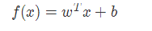
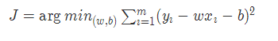
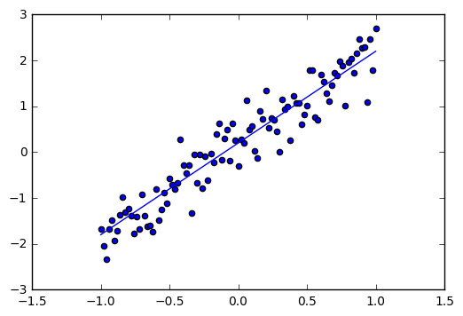
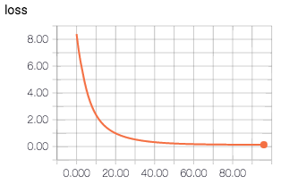
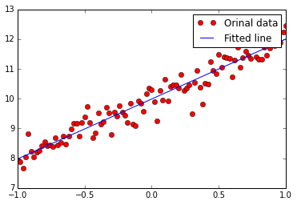

### Deeplearning Algorithms tutorial
谷歌的人工智能位于全球前列，在图像识别、语音识别、无人驾驶等技术上都已经落地。而百度实质意义上扛起了国内的人工智能的大旗，覆盖无人驾驶、智能助手、图像识别等许多层面。苹果业已开始全面拥抱机器学习，新产品进军家庭智能音箱并打造工作站级别Mac。另外，腾讯的深度学习平台Mariana已支持了微信语音识别的语音输入法、语音开放平台、长按语音消息转文本等产品，在微信图像识别中开始应用。全球前十大科技公司全部发力人工智能理论研究和应用的实现，虽然入门艰难，但是一旦入门，高手也就在你的不远处！
AI的开发离不开算法那我们就接下来开始学习算法吧！
回归方法是对数值型连续随机变量进行预测和建模的监督学习算法。其特点是标注的数据集具有数值型的目标变量。回归的目的是预测数值型的目标值。


常用的回归方法包括:
* 线性回归：使用超平面拟合数据集 
* 最近邻算法：通过搜寻最相似的训练样本来预测新样本的值
* 决策树和回归树：将数据集分割为不同分支而实现分层学习
* 集成方法：组合多个弱学习算法构造一种强学习算法，如随机森林（RF）和梯度提升树（GBM）等
* 深度学习：使用多层神经网络学习复杂模型

#### 线性回归

线性回归是最简单的回归方法，它的目标是使用超平面拟合数据集，即学习一个线性模型以尽可能准确的预测实值输出标记。
线性回归是利用数理统计中回归分析，来确定两种或两种以上变量间相互依赖的定量关系的一种统计分析方法，运用十分广泛。其表达形式为y = w'x+e，e为误差服从均值为0的正态分布。
回归分析中，只包括一个自变量和一个因变量，且二者的关系可用一条直线近似表示，这种回归分析称为一元线性回归分析。如果回归分析中包括两个或两个以上的自变量，且因变量和自变量之间是线性关系，则称为多元线性回归分析。

#### 单变量模型
模型
<p align="center">

</p>
线性模型(linear model)
简单, 易于建模, 但却蕴含着机器学习的重要思想.由于w直观地表达了各属性在预测中的重要性, 所以线性模型有着很好的可解释性(comprehensibility).

目标函数（最小二乘参数估计）
<p align="center">

</p>

#### 多变量模型


#### 代码例子

```markdown
    #Indicate the matplotlib to show the graphics inline
    %matplotlib inline 
    import matplotlib.pyplot as plt # import matplotlib
    import numpy as np # import numpy
    import tensorflow as tf
    import numpy as np
    
    trX = np.linspace(-1, 1, 101) #Create a linear space of 101 points between 1 and 1
    trY = 2 * trX + np.random.randn(*trX.shape) * 0.4 + 0.2 #Create The y function based on the x axis
    plt.figure() # Create a new figure
    plt.scatter(trX,trY) #Plot a scatter draw of the random datapoints
    plt.plot (trX, .2 + 2 * trX) # Draw one line with the line function
```

<p align="center">

</p>

#### 单变量示例
<p align="center">

</p>

```markdown
#!/usr/bin/env python
# h(X)= b + wX
%matplotlib inline
import tensorflow as tf
import numpy as np
import matplotlib.pyplot as plt

def model(X, w, b):
    return tf.mul(X, w) + b

trX = np.linspace(-1, 1, 101).astype(np.float32)
# create a y value which is approximately linear but with some random noise
trY = 2 * trX + np.random.randn(*trX.shape) * 0.33 + 10

# create a shared variable (like theano.shared) for the weight matrix
w = tf.Variable(tf.random_uniform([1], -1.0, 1.0))
b = tf.Variable(tf.zeros([1]))
cost = tf.reduce_mean(tf.square(trY-model(trX, w, b)))

# construct an optimizer to minimize cost and fit line to my data
train_op = tf.train.GradientDescentOptimizer(0.01).minimize(cost)

# Launch the graph in a session
with tf.Session() as sess:
    # you need to initialize variables (in this case just variable W)
    tf.initialize_all_variables().run()

    for i in range(1000):
        sess.run(train_op)

    print "w should be something around [2]: ", sess.run(w)
    print "b should be something around [10]:", sess.run(b)

    plt.plot(trX, trY, "ro", label="Orinal data")
    plt.plot(trX, w.eval()*trX + b.eval(), label="Fitted line")
    plt.legend()
    plt.show()

    # Plot with pandas
    #import pandas as pd
    #fig, axes = plt.subplots(nrows=1, ncols=1)
    #pd.DataFrame({'x':trX,'y':trY}).plot.scatter(x='x', y='y', ax=axes, color='red')
    #pd.DataFrame({'x':trX,'y':w.eval()*trX + b.eval()}).plot.scatter(x='x', y='y', ax=axes, color='blue')
```

```markdown
   w should be something around [2]:  [ 2.00981951]
   b should be something around [10]: [ 9.98865509]
```

<p align="center">

</p>

#### 多变量示例
多变量其实就是输入变成了矩阵：

```markdown
#!/usr/bin/env python
# h(X)= B + WX
%matplotlib inline
import tensorflow as tf
import numpy as np
import matplotlib.pyplot as plt

def model(X, w, b):
    return tf.mul(w, X) + b

trX = np.mgrid[-1:1:0.01, -10:10:0.1].reshape(2, -1).T
trW = np.array([3, 5])
trY = trW*trX + np.random.randn(*trX.shape) + [20, 100]

w = tf.Variable(np.array([1., 1.]).astype(np.float32))
b = tf.Variable(np.array([[1., 1.]]).astype(np.float32))
cost = tf.reduce_mean(tf.square(trY-model(trX, w, b))) 

# construct an optimizer to minimize cost and fit line to my data
train_op = tf.train.GradientDescentOptimizer(0.05).minimize(cost)

# Launch the graph in a session
with tf.Session() as sess:
    # you need to initialize variables (in this case just variable W)
    tf.initialize_all_variables().run()

    for i in range(1000):
        if i % 99 == 0:
            print "Cost at step", i, "is:", cost.eval()
        sess.run(train_op)

print "w should be something around [3, 5]: ", sess.run(w)
print "b should be something around [20,100]:", sess.run(b)
Cost at step 0 is: 5329.87
Cost at step 99 is: 1.22204
Cost at step 198 is: 0.998043
Cost at step 297 is: 0.997083
Cost at step 396 is: 0.997049
Cost at step 495 is: 0.997049
Cost at step 594 is: 0.997049
Cost at step 693 is: 0.997049
Cost at step 792 is: 0.997049
Cost at step 891 is: 0.997049
Cost at step 990 is: 0.997049
w should be something around [3, 5]:  [ 3.00108743  5.00054932]
b should be something around [20,100]: [[  20.00317383  100.00382233]]
tensorflow示例
import tensorflow as tf

# initialize variables/model parameters
W = tf.Variable(tf.zeros([2, 1]), name="weights")
b = tf.Variable(0., name="bias")

def inference(X):
    # compute inference model over data X and return the result
    return tf.matmul(X, W) + b

def loss(X, Y):
    # compute loss over training data X and expected outputs Y
    Y_predicted = inference(X)
    return tf.reduce_sum(tf.squared_difference(Y, Y_predicted))

def inputs():
    # read/generate input training data X and expected outputs Y
    weight_age = [[84, 46], [73, 20], [65, 52], [70, 30], [76, 57], [69, 25], [63, 28], [72, 36], [79, 57], [75, 44], [27, 24], [89, 31], [65, 52], [57, 23], [59, 60], [69, 48], [60, 34], [79, 51], [75, 50], [82, 34], [59, 46], [67, 23], [85, 37], [55, 40], [63, 30]]
    blood_fat_content = [354, 190, 405, 263, 451, 302, 288, 385, 402, 365, 209, 290, 346, 254, 395, 434, 220, 374, 308, 220, 311, 181, 274, 303, 244]

    return tf.to_float(weight_age), tf.to_float(blood_fat_content)

def train(total_loss):
    # train / adjust model parameters according to computed total loss
    learning_rate = 0.000001
    return tf.train.GradientDescentOptimizer(learning_rate).minimize(total_loss)


def evaluate(sess, X, Y):
    # evaluate the resulting trained model
    print sess.run(inference([[80., 25.]])) # ~ 303
    print sess.run(inference([[65., 25.]])) # ~ 256

# Create a saver.
# saver = tf.train.Saver()

# Launch the graph in a session, setup boilerplate
with tf.Session() as sess:
    tf.initialize_all_variables().run()

    X, Y = inputs()

    total_loss = loss(X, Y)
    train_op = train(total_loss)

    coord = tf.train.Coordinator()
    threads = tf.train.start_queue_runners(sess=sess, coord=coord)

    # actual training loop
    training_steps = 1000
    for step in range(training_steps):
        sess.run([train_op])
        # for debugging and learning purposes, see how the loss gets decremented
        # through training steps
        if step % 10 == 0:
            print "loss at step ", step, ":", sess.run([total_loss])
        # save training checkpoints in case loosing them
        # if step % 1000 == 0:
        #     saver.save(sess, 'my-model', global_step=step)

    evaluate(sess, X, Y)
    coord.request_stop()
    coord.join(threads)
    # saver.save(sess, 'my-model', global_step=training_steps)
```
#### 输出：


```markdown
loss at step  0 : [54929292.0]
loss at step  10 :  [14629748.0]
loss at step  20 :  [7090800.0]
loss at step  30 :  [5680201.0]
loss at step  40 :  [5416011.0]
loss at step  50 :  [5366280.5]
loss at step  60 :  [5356678.0]
loss at step  70 :  [5354588.0]
loss at step  80 :  [5353913.0]
loss at step  90 :  [5353510.0]
loss at step  100 : [5353166.0]
loss at step  110 : [5352839.5]
loss at step  120 : [5352525.0]
loss at step  130 : [5352218.5]
loss at step  140 : [5351921.0]
loss at step  150 : [5351631.5]
loss at step  160 : [5351349.0]
loss at step  170 : [5351075.0]
loss at step  180 : [5350808.0]
loss at step  190 : [5350549.5]
loss at step  200 : [5350297.0]
loss at step  210 : [5350050.5]
loss at step  220 : [5349814.0]
loss at step  230 : [5349580.5]
loss at step  240 : [5349356.0]
loss at step  250 : [5349134.0]
loss at step  260 : [5348922.0]
loss at step  270 : [5348712.5]
loss at step  280 : [5348511.5]
loss at step  290 : [5348313.5]
loss at step  300 : [5348123.5]
loss at step  310 : [5347935.0]
loss at step  320 : [5347753.5]
loss at step  330 : [5347577.5]
loss at step  340 : [5347405.0]
loss at step  350 : [5347237.0]
loss at step  360 : [5347073.0]
loss at step  370 : [5346915.0]
loss at step  380 : [5346761.0]
loss at step  390 : [5346611.0]
loss at step  400 : [5346464.5]
loss at step  410 : [5346320.5]
loss at step  420 : [5346182.5]
loss at step  430 : [5346047.5]
loss at step  440 : [5345914.0]
loss at step  450 : [5345786.0]
loss at step  460 : [5345662.0]
loss at step  470 : [5345539.5]
loss at step  480 : [5345420.5]
loss at step  490 : [5345305.5]
loss at step  500 : [5345193.0]
loss at step  510 : [5345082.5]
loss at step  520 : [5344976.5]
loss at step  530 : [5344871.0]
loss at step  540 : [5344771.0]
loss at step  550 : [5344670.5]
loss at step  560 : [5344574.5]
loss at step  570 : [5344480.5]
loss at step  580 : [5344388.0]
loss at step  590 : [5344298.0]
loss at step  600 : [5344212.0]
loss at step  610 : [5344127.0]
loss at step  620 : [5344042.5]
loss at step  630 : [5343962.0]
loss at step  640 : [5343882.0]
loss at step  650 : [5343805.5]
loss at step  660 : [5343729.5]
loss at step  670 : [5343657.0]
loss at step  680 : [5343584.0]
loss at step  690 : [5343514.5]
loss at step  700 : [5343446.5]
loss at step  710 : [5343380.0]
loss at step  720 : [5343314.5]
loss at step  730 : [5343250.0]
loss at step  740 : [5343187.5]
loss at step  750 : [5343128.0]
loss at step  760 : [5343067.5]
loss at step  770 : [5343010.5]
loss at step  780 : [5342952.5]
loss at step  790 : [5342897.5]
loss at step  800 : [5342843.0]
loss at step  810 : [5342791.5]
loss at step  820 : [5342738.5]
loss at step  830 : [5342688.5]
loss at step  840 : [5342638.5]
loss at step  850 : [5342589.5]
loss at step  860 : [5342543.0]
loss at step  870 : [5342496.5]
loss at step  880 : [5342449.5]
loss at step  890 : [5342406.0]
loss at step  900 : [5342363.0]
loss at step  910 : [5342319.5]
loss at step  920 : [5342277.5]
loss at step  930 : [5342236.0]
loss at step  940 : [5342197.5]
loss at step  950 : [5342157.0]
loss at step  960 : [5342118.5]
loss at step  970 : [5342080.5]
loss at step  980 : [5342043.0]
loss at step  990 : [5342007.5]
[[ 318.77984619]]
[[ 266.52853394]]
```


#### sklearn示例

```markdown
import tensorflow.contrib.learn.python.learn as learn
from sklearn import datasets, metrics, preprocessing

boston = datasets.load_boston()
x = preprocessing.StandardScaler().fit_transform(boston.data)
feature_columns = learn.infer_real_valued_columns_from_input(x)
regressor = learn.LinearRegressor(feature_columns=feature_columns)
regressor.fit(x, boston.target, steps=200, batch_size=32)
boston_predictions = list(regressor.predict(x, as_iterable=True))
score = metrics.mean_squared_error(boston_predictions, boston.target)
print ("MSE: %f" % score)
```


