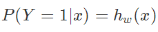
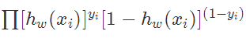
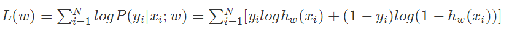
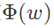
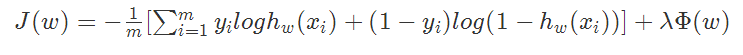
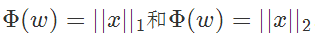
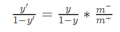

### Deeplearning Algorithms tutorial
谷歌的人工智能位于全球前列，在图像识别、语音识别、无人驾驶等技术上都已经落地。而百度实质意义上扛起了国内的人工智能的大旗，覆盖无人驾驶、智能助手、图像识别等许多层面。苹果业已开始全面拥抱机器学习，新产品进军家庭智能音箱并打造工作站级别Mac。另外，腾讯的深度学习平台Mariana已支持了微信语音识别的语音输入法、语音开放平台、长按语音消息转文本等产品，在微信图像识别中开始应用。全球前十大科技公司全部发力人工智能理论研究和应用的实现，虽然入门艰难，但是一旦入门，高手也就在你的不远处！
AI的开发离不开算法那我们就接下来开始学习算法吧！
回归方法是对数值型连续随机变量进行预测和建模的监督学习算法。其特点是标注的数据集具有数值型的目标变量。回归的目的是预测数值型的目标值。


常用的回归方法包括:
* 线性回归：使用超平面拟合数据集 
* 最近邻算法：通过搜寻最相似的训练样本来预测新样本的值
* 决策树和回归树：将数据集分割为不同分支而实现分层学习
* 集成方法：组合多个弱学习算法构造一种强学习算法，如随机森林（RF）和梯度提升树（GBM）等
* 深度学习：使用多层神经网络学习复杂模型

#### 逻辑回归

逻辑回归对应线性回归，但旨在解决分类问题，即将模型的输出转换为0/1值。逻辑回归直接对分类的可能性进行建模，无需事先假设数据的分布。

最理想的转换函数为单位阶跃函数（也称Heaviside函数），但单位阶跃函数是不连续的，没法在实际计算中使用。故而，在分类过程中更常使用对数几率函数（即sigmoid函数）：

<p align="center">

</p>

这样，模型就变成了
<p align="center">

</p>

如果将$y$看作是样本$x$作为正例的可能性，那么可以得到反应$x$作为正例的相对可能性对数几率（logit）
<p align="center">

</p>

#### 逻辑回归算法

可以使用极大似然估计法来估计参数$w$和$b$

假设，似然函数为，那么对数似然函数为，

然后就可以使用梯度下降算法、牛顿法或者BFGS等拟牛顿法来求解了。


#### 正则化

在模型过于复杂的情况下，模型会学习到很多特征，从而导致可能把所有训练样本都拟合到，这样就导致了过拟合。解决过拟合可以从两个方面入手，一是减少模型复杂度，一是增加训练集个数。而正则化就是减少模型复杂度的一个方法。

一般是在目标函数(经验风险)中加上一个正则化项，即


而这个正则化项一般会采用L1范数或者L2范数。其形式分别为：


#### 类别不均衡问题

类别不均衡是指分类任务中不同类别的训练样例数目差别很大的情况。解决这类问题的基本思路是“再缩放（rescaling）”，即令

 其中，$m^-$为反例数目，$m^+$为正例数目）

然而，这个方法的实际操作却很难。实际使用上通常使用的方法：

* 欠采样：去除一些样例使得不同类别的训练样例数目平衡。注意随机丢弃样例可能会导致丢失一些重要信息。
* 过采样：增加一些样例使得不同类别的训练样例数目平衡。注意不能简单对原样本重复采样，否则会导致严重的过拟合
* 直接基于原始训练集进行学习，但在使用最终模型预测时使用再缩放（也称为阈值移动）


#### 示例代码

```markdown

import os
import tensorflow as tf

# initialize variables/model parameters
W = tf.Variable(tf.zeros([5, 1]), name="weights")
b = tf.Variable(0., name="bias")

def read_csv(batch_size, file_name, record_defaults):
    filename_queue = tf.train.string_input_producer(
        [os.path.dirname(__file__) + "/" + file_name])

    reader = tf.TextLineReader(skip_header_lines=1)
    key, value = reader.read(filename_queue)

    # decode_csv will convert a Tensor from type string (the text line) in
    # a tuple of tensor columns with the specified defaults, which also
    # sets the data type for each column
    decoded = tf.decode_csv(value, record_defaults=record_defaults)

    # batch actually reads the file and loads "batch_size" rows in a single
    # tensor
    return tf.train.shuffle_batch(decoded,
                                  batch_size=batch_size,
                                  capacity=batch_size * 50,
                                  min_after_dequeue=batch_size)

def inference(X):
    # compute inference model over data X and return the result
    return tf.sigmoid(tf.matmul(X, W) + b)

def loss(X, Y):
    # compute loss over training data X and expected outputs Y
    return tf.reduce_mean(tf.nn.sigmoid_cross_entropy_with_logits(
        tf.matmul(X, W) + b, Y))

def inputs():
    # data is downloaded from https://www.kaggle.com/c/titanic/data.
    passenger_id, survived, pclass, name, sex, age, sibsp, parch, ticket, fare,\
        cabin, embarked = read_csv(100,
                                   "train.csv",
                                   [[0.0], [0.0], [0], [""],
                                    [""], [0.0], [0.0], [0.0],
                                    [""], [0.0], [""], [""]])

    # convert categorical data
    is_first_class = tf.to_float(tf.equal(pclass, [1]))
    is_second_class = tf.to_float(tf.equal(pclass, [2]))
    is_third_class = tf.to_float(tf.equal(pclass, [3]))
    gender = tf.to_float(tf.equal(sex, ["female"]))

    # Finally we pack all the features in a single matrix;
    # We then transpose to have a matrix with one example per row and one
    # feature per column.
    features = tf.transpose(
        tf.pack([is_first_class,
                 is_second_class,
                 is_third_class,
                 gender,
                 age]))
    survived = tf.reshape(survived, [100, 1])

    return features, survived


def train(total_loss):
    # train / adjust model parameters according to computed total loss
    learning_rate = 0.01
    return tf.train.GradientDescentOptimizer(learning_rate).minimize(
        total_loss)


def evaluate(sess, X, Y):
    # evaluate the resulting trained model
    predicted = tf.cast(inference(X) > 0.5, tf.float32)

    print sess.run(tf.reduce_mean(tf.cast(tf.equal(predicted, Y), tf.float32)))

# Create a saver.
# saver = tf.train.Saver()

# Launch the graph in a session, setup boilerplate
with tf.Session() as sess:
    tf.initialize_all_variables().run()

    X, Y = inputs()

    total_loss = loss(X, Y)
    train_op = train(total_loss)

    coord = tf.train.Coordinator()
    threads = tf.train.start_queue_runners(sess=sess, coord=coord)

    # actual training loop
    training_steps = 1000
    for step in range(training_steps):
        sess.run([train_op])
        # for debugging and learning purposes, see how the loss gets decremented
        # through training steps
        if step % 100 == 0:
            print "loss at step ", step, ":", sess.run([total_loss])
        # save training checkpoints in case loosing them
        # if step % 1000 == 0:
        #     saver.save(sess, 'my-model', global_step=step)

    evaluate(sess, X, Y)
    coord.request_stop()
    coord.join(threads)
    # saver.save(sess, 'my-model', global_step=training_steps)

```


```markdown

loss at step  0 : [1.0275139]
loss at step  100 : [1.389969]
loss at step  200 : [1.4667224]
loss at step  300 : [0.67178178]
loss at step  400 : [0.568793]
loss at step  500 : [0.48835525]
loss at step  600 : [1.0899736]
loss at step  700 : [0.84278578]
loss at step  800 : [1.0500686]
loss at step  900 : [0.89417559]
0.72
```

#### minst回归示例


```markdown
import tensorflow as tf
import numpy as np
import input_data

# Import MINST data
mnist = input_data.read_data_sets("../MNIST_data/", one_hot=True)
Extracting ../MNIST_data/train-images-idx3-ubyte.gz
Extracting ../MNIST_data/train-labels-idx1-ubyte.gz
Extracting ../MNIST_data/t10k-images-idx3-ubyte.gz
Extracting ../MNIST_data/t10k-labels-idx1-ubyte.gz


# Parameters
learning_rate = 0.01
training_epochs = 25
batch_size = 100
display_step = 1

# tf Graph Input
x = tf.placeholder("float", [None, 784]) # mnist data image of shape 28*28=784
y = tf.placeholder("float", [None, 10]) # 0-9 digits recognition => 10 classes

# Create model
def init_weights(shape):
    return tf.Variable(tf.random_normal(shape, stddev=0.01))

def model(X, w):
    return tf.matmul(X, w)

# like in linear regression, we need a shared variable weight matrix
# for logistic regression
w = init_weights([784, 10]) 

# Construct model
# compute mean cross entropy (softmax is applied internally)
cost = tf.reduce_mean(tf.nn.softmax_cross_entropy_with_logits(model(x, w), y)) 
train_op = tf.train.GradientDescentOptimizer(learning_rate).minimize(cost) # construct optimizer
predict_op = tf.argmax(model(x, w), 1) # at predict time, evaluate the argmax of the logistic regression

# Launch the graph
with tf.Session() as sess:
    tf.initialize_all_variables().run()

    # Training cycle
    for epoch in range(training_epochs):
        avg_cost = 0.
        total_batch = int(mnist.train.num_examples/batch_size)
        # Loop over all batches
        for i in range(total_batch):
            batch_xs, batch_ys = mnist.train.next_batch(batch_size)
            # Fit training using batch data
            sess.run(train_op, feed_dict={x: batch_xs, y: batch_ys})
            # Compute average loss
            avg_cost += sess.run(cost, feed_dict={x: batch_xs, y: batch_ys})/total_batch
        # Display logs per epoch step
        if epoch % display_step == 0:
            print "Epoch:", '%04d' % (epoch+1), "cost=", "{:.9f}".format(avg_cost)

    print "Optimization Finished!"

    # Test model
    correct_prediction = tf.equal(predict_op, tf.argmax(y, 1))
    # Calculate accuracy
    accuracy = tf.reduce_mean(tf.cast(correct_prediction, "float"))
    print "Accuracy:", accuracy.eval({x: mnist.test.images, y: mnist.test.labels})

```

```markdown
Epoch: 0001 cost= 1.181141054
Epoch: 0002 cost= 0.664358092
Epoch: 0003 cost= 0.553026987
Epoch: 0004 cost= 0.499294951
Epoch: 0005 cost= 0.466518660
Epoch: 0006 cost= 0.443856266
Epoch: 0007 cost= 0.427351894
Epoch: 0008 cost= 0.414347254
Epoch: 0009 cost= 0.403219846
Epoch: 0010 cost= 0.394844531
Epoch: 0011 cost= 0.387121435
Epoch: 0012 cost= 0.380693078
Epoch: 0013 cost= 0.375634897
Epoch: 0014 cost= 0.369904718
Epoch: 0015 cost= 0.365776612
Epoch: 0016 cost= 0.361626607
Epoch: 0017 cost= 0.358361928
Epoch: 0018 cost= 0.354674878
Epoch: 0019 cost= 0.351685582
Epoch: 0020 cost= 0.349124772
Epoch: 0021 cost= 0.346287186
Epoch: 0022 cost= 0.344134942
Epoch: 0023 cost= 0.341778976
Epoch: 0024 cost= 0.340130984
Epoch: 0025 cost= 0.337454195
Optimization Finished!
Accuracy: 0.9122

```

#### sklearn示例

```python
from sklearn import datasets
from sklearn import metrics
import tensorflow as tf
import tensorflow.contrib.layers.python.layers as layers
import tensorflow.contrib.learn.python.learn as learn

iris = datasets.load_iris()

def my_model(features, labels):
  """DNN with three hidden layers."""
  # Convert the labels to a one-hot tensor of shape (length of features, 3) and
  # with a on-value of 1 for each one-hot vector of length 3.
  labels = tf.one_hot(labels, 3, 1, 0)

  # Create three fully connected layers respectively of size 10, 20, and 10.
  features = layers.stack(features, layers.fully_connected, [10, 20, 10])

  # Create two tensors respectively for prediction and loss.
  prediction, loss = (
      tf.contrib.learn.models.logistic_regression(features, labels)
  )

  # Create a tensor for training op.
  train_op = tf.contrib.layers.optimize_loss(
      loss, tf.contrib.framework.get_global_step(), optimizer='Adagrad',
      learning_rate=0.1)

  return {'class': tf.argmax(prediction, 1), 'prob': prediction}, loss, train_op

classifier = learn.Estimator(model_fn=my_model)
classifier.fit(iris.data, iris.target, steps=1000)

y_predicted = [
  p['class'] for p in classifier.predict(iris.data, as_iterable=True)]
score = metrics.accuracy_score(iris.target, y_predicted)
print('Accuracy: {0:f}'.format(score))
```


